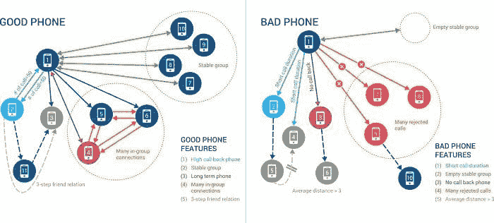

# 机器学习与深度链接图分析：强大的组合

> 原文：[`www.kdnuggets.com/2019/04/machine-learning-graph-analytics.html`](https://www.kdnuggets.com/2019/04/machine-learning-graph-analytics.html)

 评论

**作者：[Yu Xu](https://www.linkedin.com/in/yuxusandiego/)（TigerGraph 创始人兼 CEO）和 [Gaurav Deshpande](https://www.linkedin.com/in/gauravdeshpande/)（TigerGraph 市场副总裁）**

机器学习（ML）——人工智能（AI）的一个方面，使软件能够准确识别模式和预测结果——已经成为一个热门的行业话题。近年来，随着数据分析、存储和计算能力的不断进步，机器学习在企业应用中，如防欺诈、个性化推荐、预测分析等，扮演着越来越重要的角色。

将图形数据库功能应用于机器学习和人工智能应用相对较新。然而，这一点令人惊讶，因为 Google 的知识图谱首次普及了在数据中寻找关系以获得更相关、更精确的信息的概念，早在 2012 年就已出现。此外，这种应用自然契合：图形非常适合存储、连接和从复杂数据中进行推理。

图形在机器学习中未能发挥重要作用的主要原因是，传统的图形数据库无法提供机器学习真正需要的深度链接图分析，用于大数据集。

让我们深入探讨图形如何帮助机器学习以及它们如何与大数据的深度链接图分析相关。

无监督的原生图形基础机器学习算法

首先，图形分析直接提供了一组独特的无监督机器学习方法。许多图算法——社区检测、PageRank、标签传播、介数中心性、接近中心性和邻域相似度——识别出具有广泛应用的有意义的图形导向模式。这些应用包括识别欺诈模式、寻找用户群体、计算影响力用户或社区，并报告操作或供应链中的薄弱环节或瓶颈。

这些原生图算法共有的一个特点是它们都需要进行深度链接图分析——在图中遍历多个连接层级以收集数据并进行分析。这种遍历，尤其是像社区检测这样的全图分析，要求强大的图计算能力。只有原生并行图数据库才能提供这种能力。

用于训练监督式机器学习算法的图形特征

深度链接图分析帮助机器学习的第二种方式是通过丰富用于监督机器学习的数据特征集。考虑中国移动的例子，它是全球最大的移动服务提供商，拥有超过 9 亿用户。中国移动的网络每周有超过 20 亿次语音通话，他们的主要挑战是找到使用预付费 SIM 卡的电话诈骗者，这些 SIM 卡几乎没有用户详细信息。因此，很难将属于正常用户的好电话与属于诈骗者的差电话区分开来。像通话时长或拒接电话百分比这样的简单特征会导致很多误报。

中国移动利用基于图的机器学习特征，如稳定的群体和内部连接，提高了欺诈检测的机器学习准确性。一个好电话还会定期拨打一组其他电话——例如，每周或每月——而且这组电话在一段时间内相当稳定（“稳定群体”）。

另一个表明好电话行为的特征是当一个电话拨打了一个已经在网络中存在了多个月或多年的电话，并且收到回电时。我们还看到在好电话、长期电话联系人和网络中的其他电话之间有大量的通话，这些电话频繁地拨打这两个号码。这表明好电话有很多“内部连接”。中国移动通过为每个电话生成 118 个基于图的特征，将数十亿的新训练数据记录输入到其机器学习解决方案中，从而改进了其欺诈检测过程。

*可解释的机器学习/人工智能模型*

可解释的模型在机器学习应用日益增长的背景下成为了一个广泛讨论的话题。像神经网络及其衍生物深度学习网络等方法常被批评，因为它们生成的预测模型通常无法提供任何因果因素的洞见。它们无法给出为什么会预测结果的简单答案。另一方面，可解释模型往往会突出导致决策的关键变量。一个传统的例子是决策树。考虑一个用于评估你癌症风险的决策树：你是否定期吸烟？如果是，你的风险高于平均水平。如果不是，就问下一个问题……请注意，决策树是一种专门的图。

类似地，当图算法或图特征作为 AI 模型的一部分使用时，图关系的自然语义，例如“客户 --(购买)--> 产品”，容易被解读。

可解释的人工智能模型有很多好处。例如，消费者已经习惯了个性化推荐。如果推荐附带一些解释或证据，用户更有可能采取行动。图形分析非常适合计算并展示这些个性化推荐背后的证据，并根据需要通过图形可视化进行解释。例如，图形分析可能会显示你两到三度关系中的一部分朋友喜欢这个产品或服务，或者与你兴趣相似的其他用户喜欢它，或者该产品类似于你之前的购买。

基于图的机器学习和分析不仅对消费者有帮助，也对企业用户有用。以欺诈检测为例。许多企业雇佣大量训练有素的调查员来判断交易是否可能是欺诈性的。图形擅长将多个数据源结合起来，连接点，允许调查员直观且互动地看到该交易如何与之前标记为欺诈的交易相关联。这比仅仅收到一些机器学习模型给出的模糊 0.7 欺诈评分要有帮助。

另一个例子：实时电话诈骗防护。每天，数以亿计的电话被拨打，但其中只有极小的一部分是恶意诈骗。图形技术可以快速探索拨打者、电话号码和接收者之间的关系，并结合机器学习开发训练模型，以检测哪些是虚假的。

此外，当涉及到监管机构或其他审计方时，可解释的机器学习成为一种必要条件。银行被要求拥有高质量的方法来检测可能的洗钱行为。越来越多的银行使用机器学习来提高检测准确性，但同时，他们必须能够向审计员展示他们的系统如何以及为何有效。使用基于图的特征的机器学习模型提供了所需的透明度。

*本地并行图数据库*

机器学习一直计算需求很高，基于图的机器学习也不例外。每一次跳跃或连接数据的级别，搜索的数据量呈指数级扩展，要求进行大规模的并行计算来遍历数据。这对需要过多单独查找的键值数据库或在处理过多慢速连接时困难的关系数据库管理系统来说计算开销太大。即使是标准的图数据库也可能无法处理大型图上的深度链接分析。需要一个具有大规模并行和分布式处理能力的本地图数据库。

为了计算和解释个性化推荐和欺诈检测背后的原因，图形数据库需要一个强大的查询语言，它不仅能够遍历图中的连接，还能支持诸如过滤和聚合的计算以及复杂的数据结构来记住证据。

深层图形分析推动了机器学习的下一次进步，通过无监督学习图形模式、为监督学习提供特征增强，并提供可解释的模型和结果。结合 AI 和 ML，这是一种强大的组合，将在未来几年内为企业提供良好的服务。

**Bio**[Yu Xu](https://www.linkedin.com/in/yuxusandiego/) 是 Tigergraph 的创始人兼首席执行官，专长包括并行计算、数据库管理、Hadoop、MapReduce、大规模数据分析、数据仓库、半结构化数据的信息检索、XML 文档中的关键词搜索、空间数据库、可扩展的网络系统开发、搜索引擎优化、XML 语言和查询引擎、PigLatin、Cassadra、HBase 和 HIVE。

[Gaurav Deshpande](https://www.linkedin.com/in/gauravdeshpande/) 是一位经验丰富的技术高管，专注于组建获胜团队，创造新产品和行业解决方案，建立新市场并主导市场。

**资源：**

+   [在线和基于网络的：分析、数据挖掘、数据科学、机器学习教育](https://www.kdnuggets.com/education/online.html)

+   [分析、数据科学、数据挖掘和机器学习的软件](https://www.kdnuggets.com/software/index.html)

**相关：**

+   [图表是数据科学的下一个前沿](https://www.kdnuggets.com/2018/10/graphs-next-frontier-data-science.html)

+   [在 Excel 中使用 NodeXL 获取网络洞察](https://www.kdnuggets.com/2017/12/nodexl-network-insights-excel.html)

+   [使用大数据进行图形分析](https://www.kdnuggets.com/2017/12/graph-analytics-using-big-data.html)

* * *

## 我们的前三大课程推荐

 1\. [谷歌网络安全证书](https://www.kdnuggets.com/google-cybersecurity) - 快速开启网络安全职业生涯。

 2\. [谷歌数据分析专业证书](https://www.kdnuggets.com/google-data-analytics) - 提升你的数据分析能力

 3\. [谷歌 IT 支持专业证书](https://www.kdnuggets.com/google-itsupport) - 支持你所在组织的 IT 工作

* * *

### 更多相关话题

+   [LLaMA 3：Meta 迄今为止最强大的开源模型](https://www.kdnuggets.com/llama-3-metas-most-powerful-open-source-model-yet)

+   [关于可信图神经网络的全面调查：…](https://www.kdnuggets.com/2022/05/comprehensive-survey-trustworthy-graph-neural-networks-privacy-robustness-fairness-explainability.html)

+   [使用 Python 图形库制作惊人的可视化](https://www.kdnuggets.com/2022/12/make-amazing-visualizations-python-graph-gallery.html)

+   [如何使用图论来侦察足球](https://www.kdnuggets.com/2022/11/graph-theory-scout-soccer.html)

+   [如何使用图形数据库构建实时推荐引擎](https://www.kdnuggets.com/2023/08/build-realtime-recommendation-engine-graph-databases.html)

+   [思想图谱：大型语言模型中精细问题解决的新范式](https://www.kdnuggets.com/graph-of-thoughts-a-new-paradigm-for-elaborate-problem-solving-in-large-language-models)
