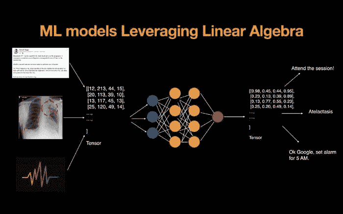
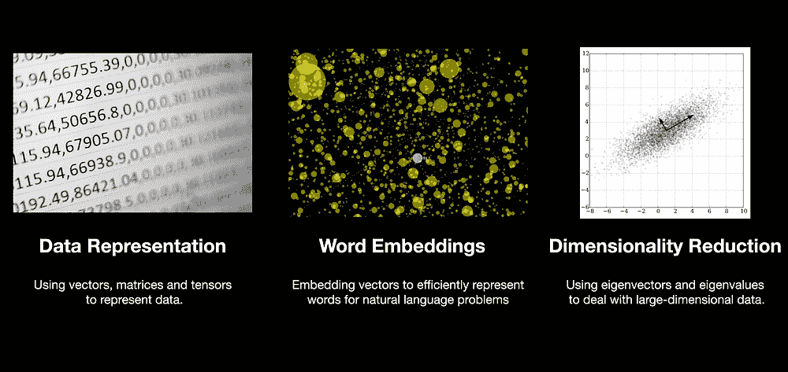
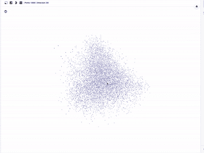
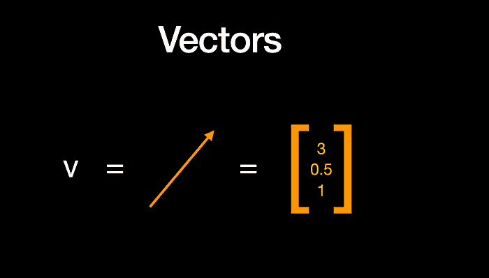
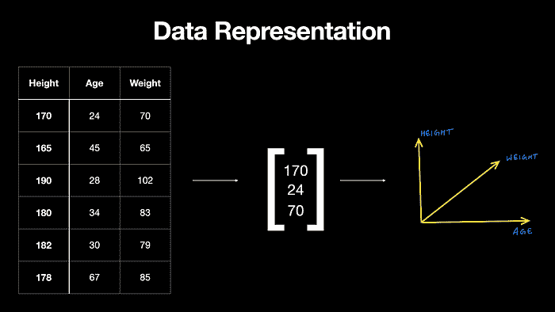
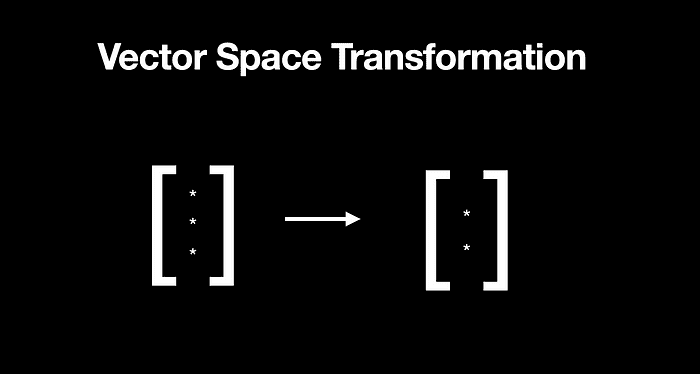
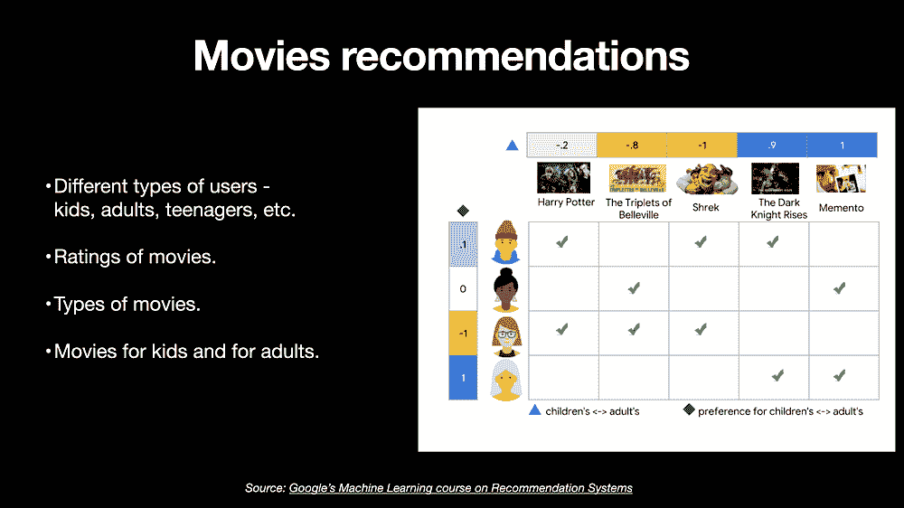
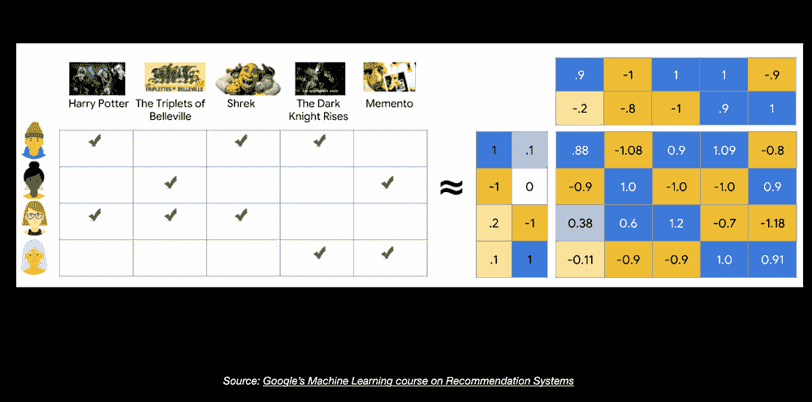
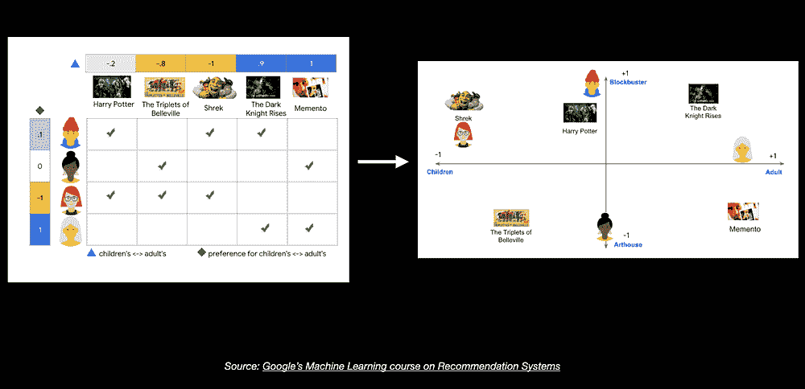

# 机器学习如何利用线性代数来解决数据问题

> 原文：[`www.kdnuggets.com/2021/09/machine-learning-leverages-linear-algebra-solve-data-problems.html`](https://www.kdnuggets.com/2021/09/machine-learning-leverages-linear-algebra-solve-data-problems.html)

评论

来源: [`www.wiplane.com/p/foundations-for-data-science-ml`](https://www.wiplane.com/p/foundations-for-data-science-ml)

机器或计算机只能理解数字，这些数字需要以一种方式表示和处理，使这些机器能够通过从数据中学习而不是像编程那样依赖预定义指令来解决问题。

* * *

## 我们的前三大课程推荐

 1\. [谷歌网络安全证书](https://www.kdnuggets.com/google-cybersecurity) - 快速进入网络安全职业的快车道。

 2\. [谷歌数据分析专业证书](https://www.kdnuggets.com/google-data-analytics) - 提升你的数据分析能力

 3\. [谷歌 IT 支持专业证书](https://www.kdnuggets.com/google-itsupport) - 支持你的组织的 IT 工作

* * *

所有类型的编程在某种程度上都使用数学，机器学习是对数据进行编程，以学习最能描述数据的函数。

使用数据找到函数最佳参数的问题（或过程）在机器学习中称为**模型训练**。

因此，总而言之，机器学习就是编程以优化最佳解决方案，我们需要数学来理解问题是如何解决的。

学习机器学习数学的第一步是线性代数。

**线性代数是解决表示数据和计算在机器学习模型中问题的数学基础。**

**这是数组的数学** — 技术上称为向量、矩阵和张量。

## 应用的常见领域 — 线性代数的实际应用

来源: [`www.wiplane.com/p/foundations-for-data-science-ml`](https://www.wiplane.com/p/foundations-for-data-science-ml)

在机器学习的背景下，开发模型的所有主要阶段背后都运行着线性代数。

由线性代数使能的重要应用领域包括：

+   数据与学习模型的表示

+   词嵌入

+   降维

**数据表示 —** 机器学习模型的燃料，也就是**数据**，需要在输入模型之前转换成数组，这些数组上执行的计算包括矩阵乘法（点积）等操作，这些操作进一步返回的结果也被表示为转化后的矩阵/张量。

[`projector.tensorflow.org/`](https://projector.tensorflow.org/)

**词嵌入 —** 不用担心术语，这只是关于用较小维度的向量表示大维数据（想象一下你数据中的大量变量）。

自然语言处理（NLP）处理文本数据。处理文本意味着理解大量单词的含义，每个单词代表不同的意义，这些意义可能与另一个单词相似，线性代数中的向量嵌入使我们能够更有效地表示这些单词。

**特征向量（SVD）** — 最后，像特征向量这样的概念使我们能够在保持所有数据本质的同时，减少数据的特征或维度，使用一种叫做**主成分分析**的技术。

## 从数据到向量

来源：[`www.wiplane.com/p/foundations-for-data-science-ml`](https://www.wiplane.com/p/foundations-for-data-science-ml)

线性代数基本上处理向量和矩阵（不同形状的数组）及这些数组上的操作。在 NumPy 中，向量基本上是一个一维的数字数组，但在几何上，它具有大小和方向。

来源：[`www.wiplane.com/p/foundations-for-data-science-ml`](https://www.wiplane.com/p/foundations-for-data-science-ml)

我们的数据可以用向量表示。在上图中，这些数据中的一行由一个特征向量表示，该特征向量有 3 个元素或成分，表示 3 个不同的维度。向量中的 N 个条目使其成为 n 维向量空间，在这种情况下，我们可以看到 3 个维度。

## 深度学习 — 张量在神经网络中流动

线性代数在今天所有主要应用中都可以看到，无论是在 LinkedIn 或 Twitter 帖子上的情感分析（嵌入），还是从 X 射线图像中检测肺部感染类型（计算机视觉），或者任何语音到文本的机器人（NLP）。

所有这些数据类型都通过张量中的数字表示，我们运行向量化操作以使用神经网络从中学习模式，然后输出处理过的张量，这些张量反过来被解码以生成模型的最终推断结果。

## 降维 — 向量空间变换

来源：[`www.wiplane.com/p/foundations-for-data-science-ml`](https://www.wiplane.com/p/foundations-for-data-science-ml)

说到嵌入，您可以基本上将一个 n 维向量想象成被替换成另一个属于较低维空间的向量，这个较低维空间更具意义，并且克服了计算复杂性。

例如，这里是一个被替换为二维空间的三维向量，但你可以将其推断到一个现实世界的场景中，在那里你有大量的维度。

降维并不是从数据中丢弃特征，而是找到新的特征，这些特征是原始特征的线性函数，并且保留了原始特征的方差。

找到这些新变量（特征）意味着找到主成分（PCs），这些主成分收敛于解决特征值和特征向量问题。

## 推荐引擎 — 利用嵌入

你可以将嵌入（Embedding）视为一个 2D 平面嵌入在 3D 空间中，这就是这个术语的来源。你可以把你站立的地面想象成一个嵌入在我们生活的空间中的 2D 平面。

只是为了给你一个现实世界的用例，让你与向量嵌入的讨论相关联，所有给你个性化推荐的应用程序都以某种形式使用了向量嵌入。

例如，这里是 Google 推荐系统课程中的一张图，我们获得了关于不同用户及其偏好电影的数据。一些用户是孩子，另一些是成年人，一些电影是永恒的经典，而另一些则更具艺术性。一些电影是针对年轻观众的，而像《记忆碎片》这样的电影则更受成年人欢迎。

现在，我们不仅需要将这些信息表示为数字，还需要找到新的、更小维度的向量表示，以便很好地捕捉所有这些特征。

来源：Google 的推荐系统机器学习课程

了解我们如何执行这项任务的一种非常快速的方法是理解矩阵分解（Matrix Factorization），它允许我们将一个大矩阵分解为较小的矩阵。

现在忽略这些数字和颜色，只需尝试理解我们如何将一个大矩阵分解成两个较小的矩阵。

例如，这里一个 4X5 的矩阵，4 行 5 特征，被分解成两个矩阵，一个形状为 4X2，另一个形状为 2X5。我们基本上得到了用户和电影的新较小维度的向量。

这使我们可以在 2D 向量空间中绘制图形，在这里你会看到用户 #1 和电影《哈利·波特》更接近，而用户 #3 和电影《怪物史瑞克》更接近。

**点积（矩阵乘法）**的概念告诉我们两个向量的相似性更多的信息。它在相关性/协方差计算、线性回归、逻辑回归、PCA、卷积、PageRank 和许多其他算法中都有应用。

## 线性代数被广泛使用的行业

到现在为止，我希望你已经相信线性代数在当今多个领域的机器学习（ML）倡议中发挥了重要作用。如果没有，以下是一些例子：

+   统计学

+   化学物理学

+   基因组学

+   单词嵌入 — 神经网络/深度学习

+   机器人技术

+   图像处理

+   量子物理学

## 你应该了解多少才能开始学习 ML / DL

现在，重要的问题是如何学习编程这些线性代数概念。因此，答案是你不需要重新发明轮子，你只需计算机上理解向量代数的基础，然后学习使用 NumPy 编程这些概念。

NumPy 是一个科学计算包，提供了线性代数所有基础概念的访问。它运行编译的 C 代码，速度快，并且有大量的数学和科学函数可供使用。

## 推荐资源

+   [**3Blue1Brown 的线性代数播放列表**](https://www.youtube.com/watch?v=kjBOesZCoqc&list=PL0-GT3co4r2y2YErbmuJw2L5tW4Ew2O5B) — 非常吸引人的可视化，解释了线性代数的本质及其应用。对初学者来说可能有点困难。

+   [**Ian Goodfellow 和 Yoshua Bengio 的深度学习书籍**](https://www.deeplearningbook.org/)** —** 一本学习 ML 和应用数学的绝佳资源。值得一读，刚开始时可能会觉得过于技术性和符号繁重。

+   [**数据科学与 ML 基础 —**](https://www.wiplane.com/p/foundations-for-data-science-ml) 我创建了一个课程，让你对编程、数学（基础代数、线性代数和微积分）和统计学有足够的理解。一个完整的学习 DS/ML 的起步包。了解更多[**这里**](https://www.wiplane.com/p/foundations-for-data-science-ml)。

???? 你可以使用代码`TDS10`获得 10%的折扣。

查看课程大纲：

**简历：[Harshit Tyagi](https://www.linkedin.com/in/tyagiharshit/)** 是一位在网络技术和数据科学（即全栈数据科学）方面具有丰富经验的工程师。他指导了超过 1000 名 AI/Web/数据科学的 aspirants，并设计了数据科学和 ML 工程学习路径。之前，Harshit 与耶鲁、麻省理工学院和 UCLA 的研究科学家一起开发数据处理算法。

[原文](https://dswharshit.medium.com/how-machine-learning-leverages-linear-algebra-to-solve-data-problems-4e210a644508)。经许可转载。

**相关：**

+   2021 年数据科学学习路线图

+   自然语言处理的线性代数

+   抗脆弱性与机器学习

### 更多相关内容

+   [想利用你的数据技能解决全球问题？看看这个……](https://www.kdnuggets.com/2022/04/jhu-want-data-skills-solve-global-problems.html)

+   [数据科学项目可以帮助你解决实际问题](https://www.kdnuggets.com/2022/11/data-science-projects-help-solve-real-world-problems.html)

+   [学习机器学习的线性代数的三个免费资源](https://www.kdnuggets.com/2022/03/top-3-free-resources-learn-linear-algebra-machine-learning.html)

+   [KDnuggets 新闻，7 月 13 日：数据科学的线性代数；10 个现代……](https://www.kdnuggets.com/2022/n28.html)

+   [数据科学的线性代数](https://www.kdnuggets.com/2022/07/linear-algebra-data-science.html)

+   [掌握线性代数的 5 个免费课程](https://www.kdnuggets.com/2022/10/5-free-courses-master-linear-algebra.html)
