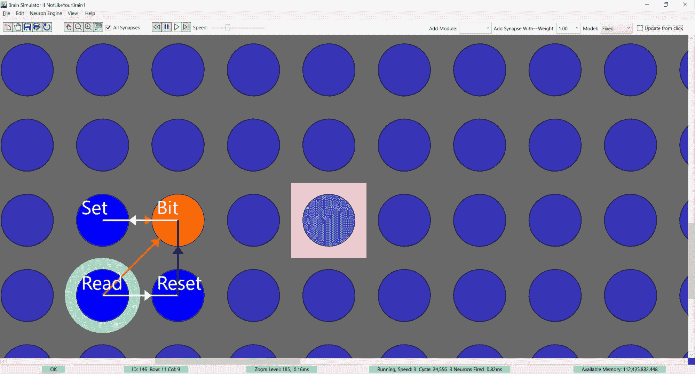

# 机器学习不像你的大脑 第七部分：神经元擅长的东西

> 原文：[`www.kdnuggets.com/2022/08/machine-learning-like-brain-part-seven-neurons-good.html`](https://www.kdnuggets.com/2022/08/machine-learning-like-brain-part-seven-neurons-good.html)

在我的本科时期，电话交换从电机继电器过渡到晶体管，因此有很多被淘汰的电话继电器可用。我和一些电气工程专业的同学一起，用电话继电器制作了一台计算机。我们使用的继电器具有 12 毫秒的切换延迟——也就是说，当你给继电器通电时，触点会在 12 毫秒后闭合。有趣的是，这个时间范围与神经元的最大 4 毫秒发放速率相同。

我们还获得了一台使用串行连接的电传打字机，运行速率为 110 波特或大约每 9 毫秒 1 位。这引发了一个问题：如何让 12 毫秒的继电器每 9 毫秒输出一个串行位？答案揭示了你大脑的工作原理，它与机器学习的不同之处，以及为什么 65%的大脑用于肌肉协调而不到 20%用于思考。

答案是，你可以让几乎任何设备（电子设备或神经设备）运行得比其最大速度更慢。通过选择性地减慢继电器速度，我们可以以任何我们选择的速率生成信号，仅受系统噪声水平的限制。例如，你可以让一个继电器（神经元）开始一个数据位，而一个稍慢的继电器结束它。但这需要大量的继电器或神经元。

很容易看出，一个能够让你的身体尽可能快速执行的心理控制系统具有的进化优势。我们的脑部包含一个庞大的小脑，正是为了完成这个任务。因此，许多神经元专门用于肌肉协调，因为它们实际上不够快，需要大量神经元来补偿。

**以下是神经元擅长的一些其他功能：**

1.  作为频率分频器；

1.  精确检测两个脉冲哪个先到达；

1.  检测两个脉冲神经元中哪个发放得更快；

1.  作为频率检测器；以及

1.  作为短期记忆装置。

# 频率分频器

通过将源神经元通过 0.5 的突触权重连接到目标，目标神经元的发放速度将是源神经元的一半。实际上，它会在 0.5 到 1 之间进行二分，因此精确的突触权重并不是关键。对于 0.2 的权重，它是一个五分之一的系统。尽管神经元在频率分频方面表现出色，但在频率倍增方面则不那么擅长。一个每次发放时发射 2 次脉冲的神经元类似于一个两倍的倍增器，但没有简单的方法将每 20 毫秒一次的信号转换为每 10 毫秒一次的信号。

# 初到检测器

这对于方向听觉非常重要。如果声源直接在你面前（或背后），声音会同时到达你的两个耳朵。如果它直接在你旁边，声音会比另一只耳朵早到达大约 0.5 毫秒。研究表明，你可以通过到达时间差识别声音方向，时间差低至 10 微秒。怎么做？假设一个目标神经元连接到两个源，一个权重为 1，另一个权重为-1。如果 1 先到达，目标就会发火。如果-1 先到达，即使只是稍微早一点，它也不会发火。现在，耳朵与探测器之间的轴突长度小差异可以造成微小的延迟，这可以用来非常准确地检测声音方向。

# 哪个更快

一般来说，光感神经元在光线更亮时发火更快。为了检测光亮区域和暗区之间的边界，你的神经元需要检测冲动频率的微小差异。通过类似于前述的电路，可以设置一对神经元进行发火，如果边界的一侧更亮则发火，反之亦然。事实证明，你可以比感知绝对亮度或颜色强度更精确地检测边界，这也是许多视觉错觉和计算机视觉困难的来源。

# 频率传感器

我还没有详细讨论过，但如果我们加入电荷泄漏，神经元模型会更生物学上准确。当突触向目标神经元施加电荷时，它不会永远停留在那里，而是会泄漏。这种效应可以以多种方式使用。如果你有一个源连接到一个权重为 0.9 的目标，目标需要两个传入的冲动才能发火，但前提是第二个冲动在电荷泄漏到 0.1 或更少之前到达。通过这种方式，任何神经元都可以作为频率传感器，只要源的冲动频率达到*或超过*由泄漏率和突触权重决定的特定频率。由单一信号驱动的一群神经元可以以相当高的精度检测入射信号的频率，但每个要检测的频率级别需要一个单独的神经元。

# 短期记忆

上述效果可以用于短期记忆，在神经元中存储单个信息位，但必须在信息泄漏之前读取。我们将神经元的记忆内容定义为当电荷为 0.1 或更大时为 1。我们以 0.9 的权重写入记忆位，并可以在电荷降到 0.1 以下之前随时读取它。图中所示的电路将在每次读取记忆位时刷新记忆内容，因此它可以潜在地无限期存储。这使用了与动态 RAM 非常相似的机制，动态 RAM 也必须定期刷新以防止记忆内容泄漏。

*本文涵盖了一些神经元能够完成的任务，这些任务在很大程度上超出了机器学习的范围。在下一篇文章中，将探讨神经元在机器学习中的最大优势——其惊人的效率。*

*演示本文中示例的视频在这里:* [*https://youtu.be/gq9H6APDgRM*](https://youtu.be/gq9H6APDgRM)

这个神经回路在短期记忆中存储一个信息位，该信息可能会逐渐消失。它使用一个标记为“Bit”的神经元在其电荷水平中存储数据位。激活“Set”神经元会在 Bit 神经元中设置电荷，该电荷可以通过“Reset”神经元清除。当“Read”激活时，Bit 神经元会根据其电荷水平决定是否发放。如果它发放，它也会激活 Set 以重新存储 Bit 中的值。每个位都需要一个 Set 和 Bit 神经元，而 Read 和 Reset 神经元可以共享于任意数量的位。

**[查尔斯·西蒙](https://futureai.guru/Founder.aspx)** 是一位全国知名的企业家和软件开发者，同时也是 FutureAI 的首席执行官。西蒙是《计算机会反叛吗？：为人工智能的未来做准备》的作者，也是 Brain Simulator II 的开发者，这是一款 AGI 研究软件平台。欲了解更多信息，[请访问这里](https://futureai.guru/Founder.aspx)。

### 更多相关话题

+   [机器学习不像你的大脑 第一部分：神经元的速度慢…](https://www.kdnuggets.com/2022/04/machine-learning-like-brain-part-one-neurons-slow-slow-slow.html)

+   [机器学习不像你的大脑 第二部分：感知机与神经元](https://www.kdnuggets.com/2022/05/machine-learning-like-brain-part-two-perceptrons-neurons.html)

+   [机器学习不像你的大脑 第五部分：生物神经元…](https://www.kdnuggets.com/2022/07/machine-learning-like-brain-part-5-biological-neurons-cant-summation-inputs.html)

+   [机器学习不像你的大脑 第三部分：基本架构](https://www.kdnuggets.com/2022/06/machine-learning-like-brain-part-3-fundamental-architecture.html)

+   [机器学习不像你的大脑 第四部分：神经元的…](https://www.kdnuggets.com/2022/06/machine-learning-like-brain-part-4-neuron-limited-ability-represent-precise-values.html)

+   [机器学习不像你的大脑 第六部分：精确突触权重的重要性](https://www.kdnuggets.com/2022/08/machine-learning-like-brain-part-6-importance-precise-synapse-weights-ability-set-quickly.html)
