# 将机器学习应用于三月的疯狂

> 原文：[`www.kdnuggets.com/2017/03/machine-learning-march-madness.html`](https://www.kdnuggets.com/2017/03/machine_learning_march_madness.html)

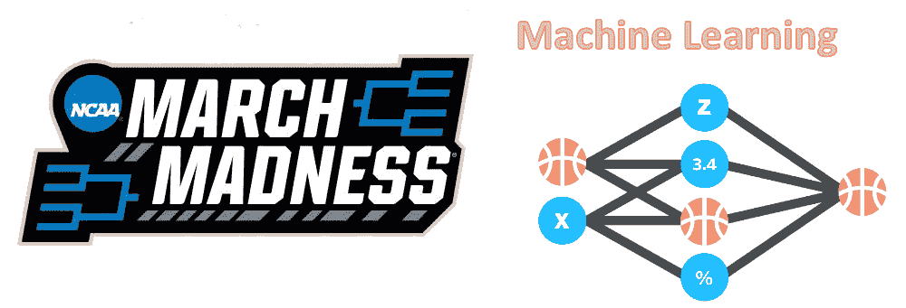

### **介绍**

三月的疯狂。

这两个词能让全国的每一个大学篮球迷都感到鸡皮疙瘩。这是每位球迷都会填写表格的月份，每个人都认为自己选对了 12 号对 5 号种子的冷门，或是他们是唯一选中了进入精英 8 强的灰姑娘球队的人。这个月里，人们会花几个小时观看常规赛，仔细研究数据和专家分析，试图准确预测最有可能获胜的球队，却发现自己的选择在第一轮就输了（谢谢密歇根州立大学*）。这个月里，你的妹妹因为选择了“更酷”的吉祥物的球队，最终拥有了比你更好的表格（悲伤，但确实是这样）。三月的疯狂是一种引发焦虑、遗憾、兴奋和其他各种情感的体育现象。它将在**4 天**后开始。*

**编辑：在阅读完这个概述后，不要忘记查看 KDnuggets 的漫画：当人工智能掌握三月的疯狂时**

**从未听说过？**

三月的疯狂指的是年度大学男子篮球锦标赛。比赛由 64 支大学球队组成，采用单场淘汰制。为了赢得冠军，一支球队必须赢得 6 场连续的比赛。

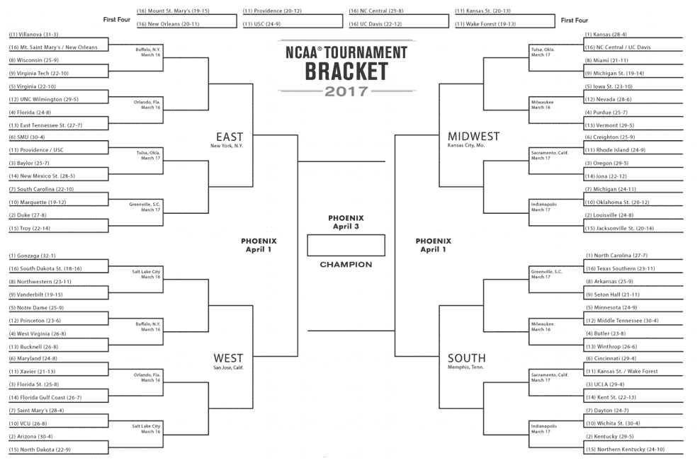

比赛被划分为 4 个区域。每个区域有 16 支球队，按 1 到 16 进行排名。这个排名由 NCAA 委员会确定，基于每支球队的常规赛表现。NCAA 安排比赛的方式是，区域中排名最高的球队对阵排名最低的球队，第 2 高的对第 2 低的，以此类推。

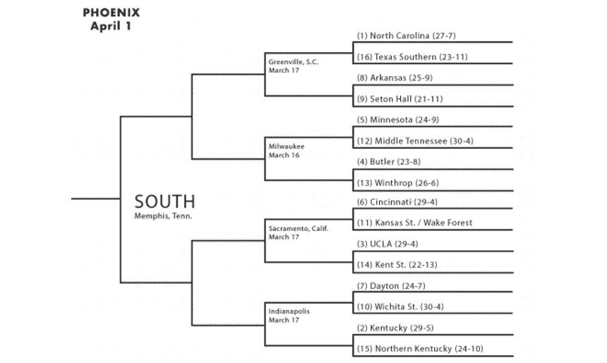

**那么，问题在哪里？**

1/9.2 quintillion。

这些是你在整个锦标赛中正确预测所有 63 场比赛获胜者的几率。从数学角度讲，你可以填充这个表格的方式有 2⁶³（约 9.2 quintillion）。2014 年，[沃伦·巴菲特著名地提出了 10 亿美元的奖励](http://www.forbes.com/sites/kellyphillipserb/2014/01/21/warren-buffett-offers-1-billion-for-perfect-march-madness-bracket/#29795ef26f82)给任何能填出完美表格的人（不用说，实际上没有人接近过）。

作为体育迷，预测比赛结果是我们的天性。我们想相信我们的母校能进入甜蜜的 16 强。我们想要有权 bragging 说我们知道第 11 种子 VCU 会进入四强（[2011 年非常疯狂](http://www.ncaa.com/news/basketball-men/article/2016-02-10/march-madness-most-surprising-final-four-2011-sure)）。三月疯狂的魅力在于如此大型单场淘汰赛的不可预测性。虽然选择所有 1 号种子晋级（这被称为“挑选标记”）可能很容易，但比赛历史表明，肯定会有一些惊喜。

在接下来的 2 周中，球迷们将会在课堂上（个人经验）或工作时观看比赛，欣赏令人惊叹的绝杀、令人瞠目的冷门，最重要的是，希望他们的预测不会在第一天就被打破。

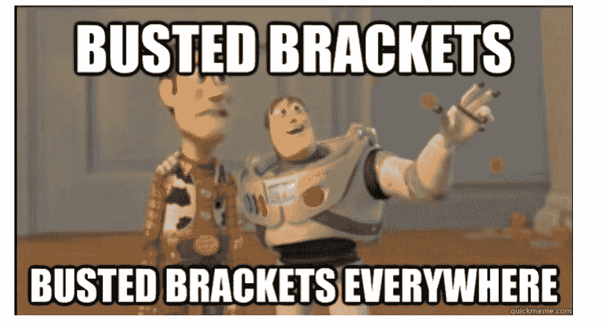

### **预测问题**

在深入机器学习之前，让我们退一步思考体育比赛预测的概念。这不是一个很复杂的主题，对吧？想象一下这个情境。

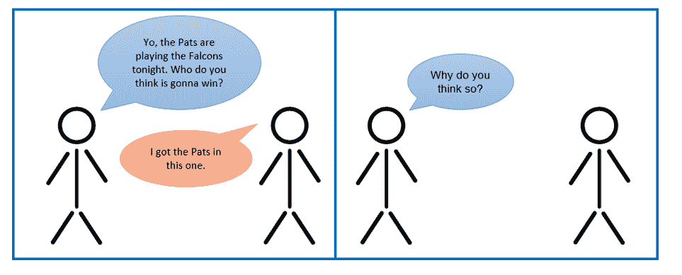

让我们在这里停下来。体育预测中的根本问题是：**作为预测者，你使用哪些因素来确定未来体育赛事的结果？** 想象一下你可能会得到的回答。

A 个人：“爱国者队在 NFL 中防守最好，根据每场比赛失分来看，他们在允许的冲球码数上排名第 4，且在联赛中在失误差异上排名第 3。他们将轻松获胜。”

B 个人：“100 名 NFL ESPN 分析师中有 72 人选择了爱国者队，所以我也选择他们。”

C 个人：“爱国者队有汤姆·布雷迪，我喜欢汤姆·布雷迪。”

D 个人：“我的前女友喜欢猎鹰队，所以支持爱国者队！”

当你查看这些回应时，你会发现每个回应对某个特定的统计数据/感觉/情绪（在机器学习术语中称为“特征”）赋予了不同的重要性（在机器学习术语中称为“权重”）。A 个人在做出预测时非常依赖常规赛统计数据。B 个人选择考虑 ESPN 的 NFL 分析师的意见。C 个人对汤姆·布雷迪有个人偏好，这使他/她选择了爱国者队。最后，D 个人可能从未看过一场橄榄球比赛，但由于对某个人的负面情绪，选择了爱国者队。

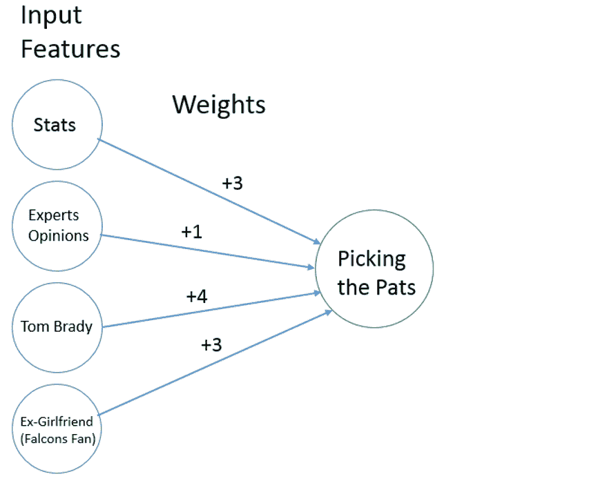

关键是我们都有不同的预测方式。我们考虑的输入特征不同，我们对这些特征赋予的权重不同，因此我们对未来的体育赛事有不同的解读方式。

对预测有这么多不同的观点是很好的。这使我们能够在比赛前进行激烈的争论，也让我们能够在赢得夸耀权时尽情享受，或促使我们重新考虑我们的预测思维过程。

我们所有观点的一个共同点是**我们都有偏见**。没有两种方式。我们每个人在处理体育预测时都有偏见。我们有偏见，因为“什么构成一个好的预测”这个问题没有明确的答案。我们应该关注统计数据吗？我们应该关注无形因素吗？我们应该忘掉这些，简单地根据个人感觉做预测吗？没有简单的解决方案。

这就是机器学习的用武之地。

### **机器学习能否帮助预测？**

好了，通过上一段，我们已经确定了问题空间。我们想看看是否可以构建一个能够查看训练数据（过去的 NCAA 篮球比赛）、找到球队成功与他们的属性（统计数据）之间关系的机器学习模型，并对未来的比赛做出预测。

那么，为什么机器学习可以成为这个预测问题的一个可能用例呢？首先，数据在这里。我们有大量的数据。在过去 25 年中，进行了超过 100,000 场 NCAA 常规赛比赛，我们通常有每个赛季球队的大量统计数据。由于我们拥有所有这些数据，我们可以尝试使用机器学习找出哪些特定统计数据与球队赢得特定比赛最相关。如果一个球队每场比赛允许的得分少于 60 分，他们赢得比赛的可能性更大吗？如果一个球队失误超过 15 次，这是否是他们输给一个重视控球的球队的致命迹象？这些都是我们希望数据分析和机器学习能够提供见解的问题。

**所有这些数据分析的代码可以在** [**这个 iPython Notebook**](https://github.com/adeshpande3/March-Madness-2017/blob/master/March%20Madness%202017.ipynb)**中找到。一定要跟着做！**

### **基本模型结构**

我们的机器学习模型将接收有关两个球队（球队 1 和球队 2）的信息作为输入，然后输出球队 1 赢得比赛的概率。

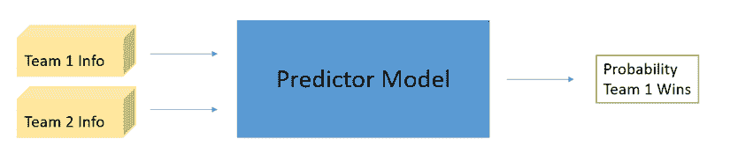

现在，立即想到的问题是，机器学习算法通常以单一矩阵或向量的形式接受输入。我们需要想到一种方法，将关于两个球队的信息封装在一个单一的向量中。让我们首先看看是否可以将每个球队表示为一个向量。

以 2016 年的堪萨斯大学 Jayhawks 为例。

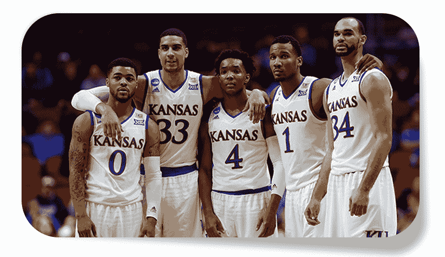

Jayhawks 度过了一个伟大的赛季，赢得了他们第 12 次连续获得的 Big 12 冠军，并在锦标赛中获得了#1 种子。让我们思考一下如何用一个单一的向量来表示他们的赛季。在机器学习术语中，我们希望表示哪些特征？让我们从常见的统计指标开始。

+   常规赛胜场数：29

+   每场比赛平均得分：80.30

+   每场比赛平均失分：67.61

+   每场比赛平均三分球命中数：9.21

+   每场比赛平均失误数：14.39

+   每场比赛平均助攻数：18.30

+   每场比赛平均篮板数：43.73

+   每场比赛平均抢断数：7.66

然后，我们可以考虑与他们所参加的会议相关的其他因素。

+   “Power 6”会议（Big 12、Big 10、SEC、ACC、Pac-12、Big East）：1 - 二进制标签

+   常规赛会议冠军：1 - 二进制标签

+   会议锦标赛冠军：1 - 二进制标签

我们可以考虑其他更高级的指标。

+   简单评级系统（对手强度和平均得分差的函数）：23.87

+   对手强度：11.22

最后，我们还会查看一些历史因素。

+   自 1985 年以来的锦标赛参赛次数：31

+   自 1985 年以来的全国冠军数量：2

最后，我们有一个描述位置的三元标签。

+   位置（如果团队 1 在客场为-1，中立场地为 0，主场为 1）：1

为 2016 年的堪萨斯 Jayhawks 创建我们的表示形式，我们可以将所有特征连接成一个 16 维向量。

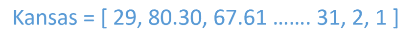

现在，让我们对 2016 赛季的另一支球队，俄克拉荷马州 Sooners，做同样的分析。

由 NBA 首轮选秀球员 Buddy Hield 领导的 Sooners 度过了一个令人难以置信的赛季，常规赛赢得了 25 场比赛，并在锦标赛中获得了#2 种子。我们可以在下面看到俄克拉荷马州的向量。

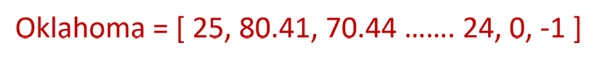

我们可以把创建团队向量的过程想象成类似于在 NLP 深度学习方法中使用词向量的想法。在将输入喂入 RNN 或 LSTM 之前，我们首先必须将句子或短语转换成可用的表示形式。

看一下体育比赛预测的任务，让我们思考一下我们希望模型做什么。由于 ML 模型通常接收单一输入，我们可以将每场比赛表示为两队向量之间的差异（团队 1 向量 - 团队 2 向量）。这是一种表示比赛的方法。虽然有些人可能选择将两个向量连接起来，但取差异有助于强调两支球队之间的不同，这可能有助于确定对比赛结果有影响的统计数据类型。

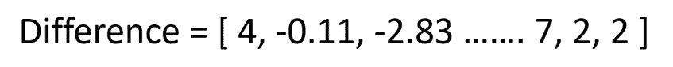

我们的模型将接收这个差异向量，并输出团队 1 赢得比赛的概率。

我们训练这个模型的方法是通过查看过去常规赛比赛的结果，并查看两支竞争球队的向量。让我们看一个实际的训练示例来使其更清晰。

俄克拉荷马州和堪萨斯在 2016 年常规赛中交手两次。第一次在堪萨斯著名的 Allen Fieldhouse 举行，成为了历史上最伟大的大学篮球常规赛比赛之一。

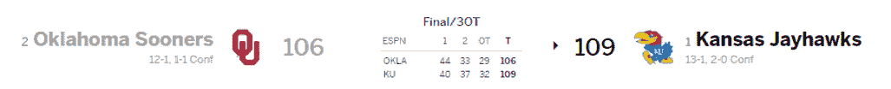

#1 对 #2\. 三次加时。是的，那场比赛真是激烈。这将是我们训练数据中的众多比赛之一。这场比赛的情况会是怎样的？

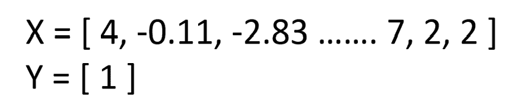

明白了吗？每个训练样本的 X 组件将是该赛季两个球队向量之间的差异。训练样本的 Y 组件将是 [1] 或 [0]，分别表示球队 1 获胜或球队 2 获胜。

[Kaggle 数据集](https://www.kaggle.com/c/march-machine-learning-mania-2017/data)和来自 [Sports-Reference](http://www.sports-reference.com/cbb/) 的统计数据包含了从 1993 赛季开始的常规赛和锦标赛数据。从 1993 年到 2016 年，共进行了超过 115,000 场比赛。我们的 xTrain 维度将是 115113 x 16，yTrain 为 115113 x 1。

### **应用机器学习算法**

现在我们有了训练集，我们需要选择一个 ML 算法。从简单的逻辑回归到随机森林再到复杂的集成方法，有很多模型可以适应我们的任务。

每当你刚开始处理一个数据集和预测任务时，**始终尝试使用一个非常简单的模型**（例如线性/逻辑回归、决策树或 KNN），然后再尝试更复杂的神经网络和集成方法。在将训练数据分成训练集和测试集后，我们训练模型（使用 [Scikit-Learn](http://scikit-learn.org/stable/) 函数），并在测试集上进行评估。

下面，你可以看到我们的一些模型表现如何的表格。为了确保模型不是仅仅因为分类容易的游戏而运气好，我们对模型进行了 100 次不同训练/测试拆分的评估，并取了平均值。

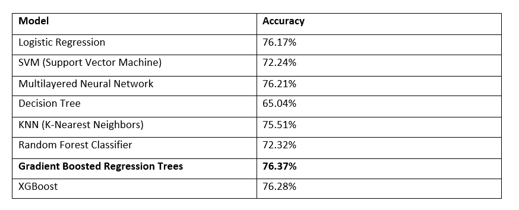

### **梯度提升树**

这个模型在测试集上取得了最佳性能。这个模型基本上是一种集成网络，其中包含多个浅层回归或分类树，这些树根据前面树的错误重新加权训练样本（如果你想了解更多信息，请查看 Peter Prettenhofer 的 [精彩演讲](https://www.youtube.com/watch?v=IXZKgIsZRm0&t=892s)）。梯度提升树在异质数据（不同尺度的数据）上表现非常好，并且能够检测非线性特征交互，这在我们的任务中极为有用。这个模型的一个有趣属性是我们可以分析每个特征对整体分类的重要性。通过查看每个特征在回归树上的位置，我们可以检查哪些特征对游戏的正确分类贡献最大。

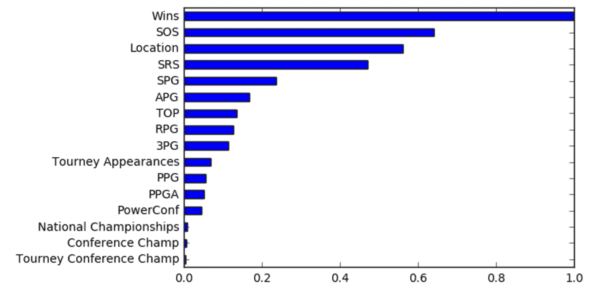

正如你所见，常规赛胜场数对一个球队是否赢得比赛有很大影响。直观上，这是有道理的。并不需要高级的机器学习模型或专家分析师来预测胜场数更多的球队更有可能获胜。

然而，有趣的是查看列表中的后续特征。接下来的两个特征是 SOS（赛程强度）和位置。如果你考虑一下，SOS 也很直观。即使一个球队的胜场数不高，它们仍然有可能是一个强队，只是整个赛季中遇到的对手更强。位置也是一个影响比赛的知名因素，这就是“主场优势”一词的来源。

### **下一步行动**

76.37%的准确率很棒，但我们可以做些什么来真正将其提升到 80%或 85%呢？这就是成为机器学习从业者的艰难之处。实际上并没有明确的指导方针来改进模型。对于决策树，你可以尝试增加树的深度。对于神经网络，你也可以尝试新的架构或经典的“再加一层”思路。有无数的超参数可以尝试调整。

然而，我将更关注数据的表现形式以及模型本身。以下是一些可能会为明年的锦标赛带来更好结果的调整。

+   除了依赖常见的统计特征（PPG、APG 等），还可以尝试量化专家意见、粉丝投票或博彩赔率。

+   使用 SVD 或 PCA 来降低维度，让模型从具有更简单特征的数据集中学习预测。

+   纳入关于锦标赛结果的历史信息（例如，第 12 种子在首轮比赛中战胜第 5 种子的次数）

+   尝试不同的方式将两个团队向量合并为一个（例如，连接、平均等）

+   考虑使用 RNN 类型的模型来分析时间序列数据。与其将一个赛季表示为单一向量，不如尝试将球队的进展建模为时间序列。这样，我们就能找出哪些球队在进入锦标赛时表现特别好。

### **机器学习模型中的偏差讨论**

我现在想花一点时间来讨论一个我认为对所有机器学习从业者来说都非常重要的问题。这就是训练集偏差的概念。正如我在文章开头提到的，我们作为人类在预测时都存在偏见。在体育预测中，我们对某些球队有个人情感，对可用统计数据的视角不完整，有时也有不一致的评判标准。使用机器学习可以让我们利用与预测任务相关的大量数据。然而，它仍然会受到类似的偏见问题的影响。

偏差影响机器学习模型的方式是通过我们使用的训练集和我们的表示（在这种情况下，是我们的球队向量）。作为机器学习从业者，我们需要对使用哪些训练数据做出有意识的决定。对于这个特定的模型，我决定使用自 1993 年以来的所有常规赛和锦标赛比赛数据。我*本可以*决定只包含最近几年的数据，或者*可以*寻找包含 1993 年以前比赛信息的数据集。

与我选择的特征相同。我本可以添加像罚球命中率或主场胜利次数等特征，但我没有。我创建了这些特征，因为我认为这些特征最有可能与球队的成功相关联。

对数据集和特征选择的这种控制意味着我们对模型输出的责任比我们想象的要大。

关键点在于，机器学习模型不仅仅是从无处提取预测。它们在某种程度上是黑箱，但我们仍然需要决定我们输入的数据以及如何表示这些数据。虽然体育预测只是一个有趣和无害的任务，但许多领域（如医疗保健、法律、保险等）中，机器学习模型的结果至关重要。**我们需要花时间确保我们使用的训练数据能够代表整体人群、不对某一群体存在歧视，并且模型能够很好地适应训练集和测试集中的大多数示例**。

### **机器学习模型 2017 年锦标预测**

对于今年比赛的预测，我对每场首轮比赛运行了一个训练好的梯度提升分类器模型，并让概率更高的队伍晋级到下一轮。我然后对所有后续轮次重复了这一过程。

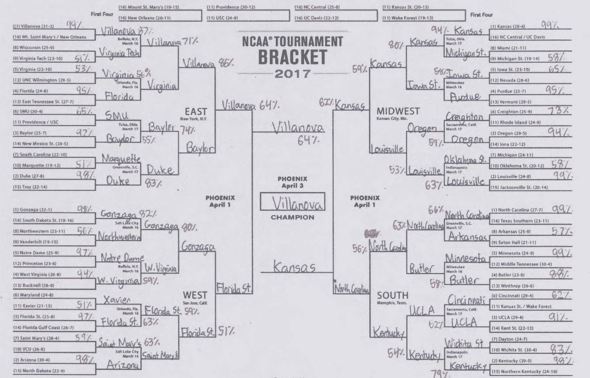

所以，你准备好你的赛程表了吗？

向我的好朋友[Arvind Sankar](https://www.linkedin.com/in/sankararvind)致敬，感谢他在特征创建方面的有益讨论以及一些数据抓取脚本。

[来源](https://adeshpande3.github.io/assets/Sources8.txt)

**简介：[Adit Deshpande](https://twitter.com/aditdeshpande3)** 目前是 UCLA 计算机科学专业的二年级本科生，并辅修生物信息学。他热衷于将他的机器学习和计算机视觉知识应用于医疗保健领域，以为医生和患者工程出更好的解决方案。

[原文](https://adeshpande3.github.io/adeshpande3.github.io/Applying-Machine-Learning-to-March-Madness)。经许可转载。

**相关内容：**

+   漫画：当人工智能掌握三月疯狂时会发生什么

+   数据科学游戏，面向学生的机器学习比赛

+   掌握 Python 机器学习的 7 个额外步骤

* * *

## 我们的前三个课程推荐

 1\. [谷歌网络安全证书](https://www.kdnuggets.com/google-cybersecurity) - 快速进入网络安全职业生涯。

 2\. [谷歌数据分析专业证书](https://www.kdnuggets.com/google-data-analytics) - 提升你的数据分析技能

 3\. [谷歌 IT 支持专业证书](https://www.kdnuggets.com/google-itsupport) - 支持你的组织 IT

* * *

### 更多相关话题

+   [在 Python 中应用描述性和推断统计](https://www.kdnuggets.com/applying-descriptive-and-inferential-statistics-in-python)

+   [KDnuggets 新闻 2022 年 3 月 9 日：在 5 分钟内构建机器学习 Web 应用](https://www.kdnuggets.com/2022/n10.html)

+   [KDnuggets 新闻 2022 年 3 月 23 日：最佳数据科学书籍…](https://www.kdnuggets.com/2022/n12.html)

+   [KDnuggets 新闻 2022 年 3 月 16 日：学习数据科学基础与 5 种…](https://www.kdnuggets.com/2022/n11.html)

+   [KDnuggets 新闻 3 月 30 日：最受欢迎的编程入门课程…](https://www.kdnuggets.com/2022/n13.html)

+   [每位机器学习工程师应掌握的 5 项机器学习技能](https://www.kdnuggets.com/2023/03/5-machine-learning-skills-every-machine-learning-engineer-know-2023.html)*
