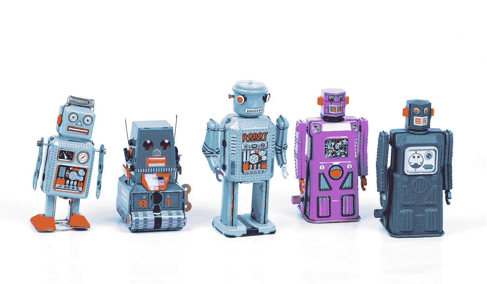
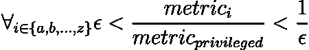
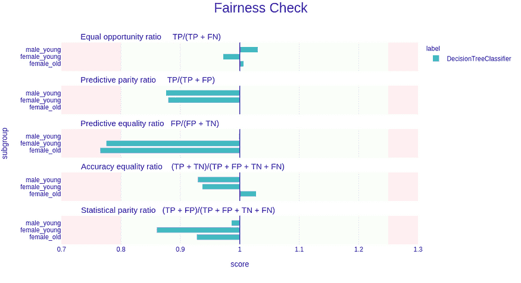
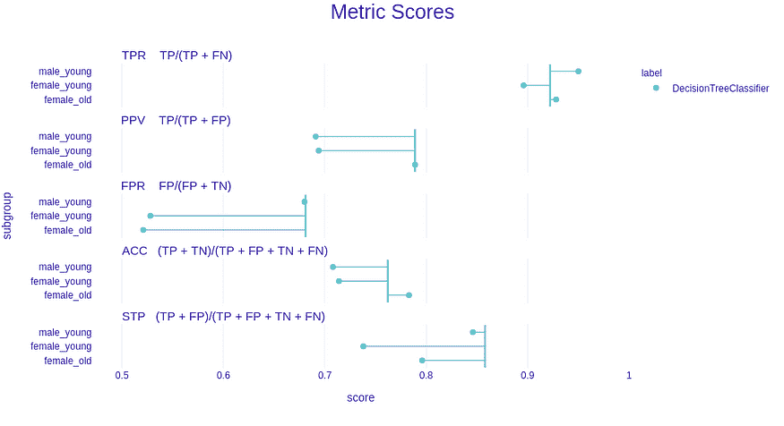
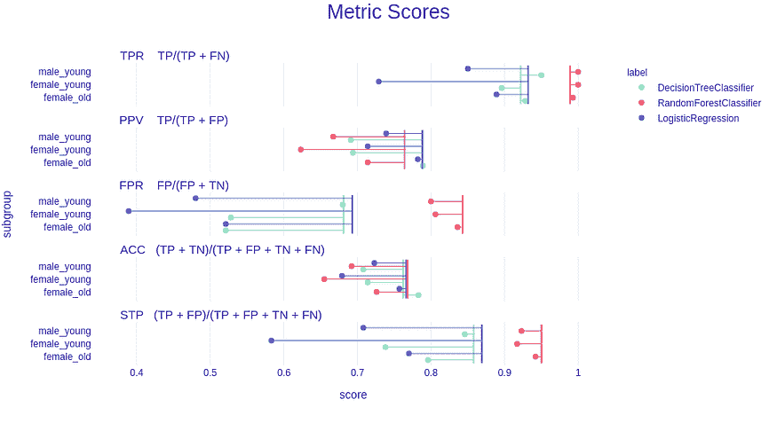
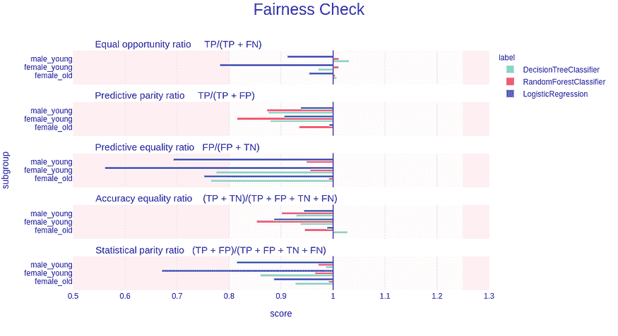

# 如何轻松检查您的机器学习模型是否公平？

> 原文：[`www.kdnuggets.com/2020/12/machine-learning-model-fair.html`](https://www.kdnuggets.com/2020/12/machine-learning-model-fair.html)

评论

**由[Jakub Wiśniewski](https://medium.com/@jakwisn/about)撰写，数据科学学生及 MI2 DataLab 的研究软件工程师**。



* * *

## 我们的三大课程推荐

 1\. [Google 网络安全证书](https://www.kdnuggets.com/google-cybersecurity) - 快速进入网络安全职业的快车道。

 2\. [Google 数据分析专业证书](https://www.kdnuggets.com/google-data-analytics) - 提升您的数据分析技能

 3\. [Google IT 支持专业证书](https://www.kdnuggets.com/google-itsupport) - 支持您组织的 IT

* * *

*照片由[Eric Krull](https://unsplash.com/@ekrull?utm_source=unsplash&utm_medium=referral&utm_content=creditCopyText)拍摄，刊登于[Unsplash](https://unsplash.com/s/photos/robot?utm_source=unsplash&utm_medium=referral&utm_content=creditCopyText)。*

我们生活在一个日益分裂的世界中。在世界的某些地方，种族、民族以及有时性别之间的差异和不平等正在加剧。我们用于建模的数据在很大程度上反映了其来源的世界。而这个世界可能存在偏见，因此数据和模型也可能反映这种偏见。**我们提出了一种方法，ML 工程师可以轻松检查他们的模型是否存在偏见。**我们的公平性工具目前仅适用于分类模型。

### 案例研究

为了展示[dalex 公平性模块](https://dalex.drwhy.ai/)的功能，我们将使用著名的[德国信用数据集](https://archive.ics.uci.edu/ml/datasets/statlog+(german+credit+data)为每个信用申请者分配风险。这一简单任务可能需要使用可解释的*决策树分类器*。

一旦我们有了*dx.Explainer*，我们需要执行方法*model_fairness()*，以便它可以计算*protected*向量中子组的所有必要指标，该向量是一个包含性别、种族、国籍等敏感属性的数组或列表，适用于每个观察（个体）。除此之外，我们还需要指出哪个子组（即*protected*中的唯一元素）是最有特权的，这可以通过*privileged*参数来完成，在我们的案例中，将是年长男性。

这个对象有很多属性，我们不会逐一介绍它们。更详细的概述可以在这个[tutorial](http://dalex.drwhy.ai/python-dalex-fairness.html)中找到。相反，我们将重点关注一种方法和两个图表。

### 那么，我们的模型是否存在偏见？

这个问题很简单，但由于偏差的性质，回答是：这要看情况。但这种方法从不同的角度来衡量偏差，以确保没有偏差模型可以通过。要检查公平性，必须使用*fairness_check()*方法。

```py
fobject.fairness_check(epsilon = 0.8) # default epsilon

```

以下部分是上述代码的控制台输出。

```py
Bias detected in 1 metric: FPR

Conclusion: your model cannot be called fair because 1 metric score exceeded acceptable limits set by epsilon.
It does not mean that your model is unfair but it cannot be automatically approved based on these metrics.

Ratios of metrics, based on 'male_old'. Parameter 'epsilon' was set to 0.8 and therefore metrics should be within (0.8, 1.25)
                   TPR       ACC       PPV       FPR       STP
female_old    1.006508  1.027559  1.000000  0.765051  0.927739
female_young  0.971800  0.937008  0.879594  0.775330  0.860140
male_young    1.030369  0.929134  0.875792  0.998532  0.986014

```

在指标 FPR（假正率）中发现了偏差。上面的输出表明，该模型不能被**自动**批准（如上所述）。所以决定权在用户手中。在我看来，这不是一个公平的模型。较低的 FPR 表明特权子群体比不利子群体更频繁地出现假正例。

**更多关于*fairness_check()*的内容**

我们获得了有关偏差、结论和指标比率的原始 DataFrame 数据。这里有指标 TPR（真正率）、ACC（准确率）、PPV（正预测值）、FPR（假正率）、STP（统计公平性）。这些指标来源于每个不利子群体的[混淆矩阵](https://en.wikipedia.org/wiki/Confusion_matrix)，然后将其除以基于特权子群体的指标值。可能的结论有 3 种类型：

```py
# not fair
Conclusion: your model is not fair because 2 or more metric scores exceeded acceptable limits set by epsilon.

# neither fair or not
Conclusion: your model cannot be called fair because 1 metric score exceeded acceptable limits set by epsilon.It does not mean that your model is unfair but it cannot be automatically approved based on these metrics.

# fair
Conclusion: your model is fair in terms of checked fairness metrics.

```

一个真正公平的模型不会超过任何指标，但当真实值（目标）依赖于敏感属性时，情况就变得复杂，并超出了本博客的范围。简而言之，一些指标可能不会相等，但它们不一定会超过用户的阈值。如果你想了解更多，我强烈建议查阅[公平性与机器学习](https://fairmlbook.org/)这本书，特别是第二章。

**但有人可能会问，为什么我们的模型不公平，我们依据什么做出判断？**

这个问题的答案很棘手，但判断公平性的方法似乎是目前最好的。通常，每个子群体的分数应该接近特权子群体的分数。用更数学的角度来看，特权指标和不利指标分数之间的比率应该接近 1。越接近 1，模型越公平。但为了稍微放宽这一标准，可以更有思考地表述：



其中，*epsilon* 是一个介于 0 和 1 之间的值，应该是比率的最小可接受值。默认情况下，它是 0.8，这符合在招聘中常用的[four-fifths](https://www.hirevue.com/blog/hiring/what-is-adverse-impact-and-why-measuring-it-matters)规则（80% 规则）。很难找到一个非任意的公平与歧视差异之间的界限，并且检查指标的比率是否恰好为 1 是没有意义的，因为如果比率是 0.99 呢？这就是为什么我们决定选择 0.8 作为默认值*epsilon*，因为它是唯一已知的可作为可接受歧视量的具体阈值。当然，用户可以根据需要更改此值。

### 偏差也可以被绘制出来。

提供了两种偏见检测图（不过，包中还有更多可视化偏见的方法）

+   *fairness_check*— *fairness_check()* 方法的可视化

+   *metric_scores*— *metric_scores* 属性的可视化，它是度量的原始分数。

类型只需传递给*plot*方法的*type*参数。



*fobject.plot()*

上图显示了与公平检查输出类似的内容。度量名称已更改为更标准的公平等价物，但公式指明了我们所指的度量。查看上图，直观上很简单——如果条形图进入了红色区域，则意味着度量超过了基于 epsilon 的范围。条形图的长度等同于|1-M|，其中 M 是特权度量分数除以非特权度量分数（就像在之前的公平检查中一样）。



*fobject.plot(type=’metric_scores’)*

*度量分数*图与*公平检查*图相结合，可以很好地理解度量和它们的比率。这里的点是原始（未划分）度量分数。垂直线象征着特权度量分数。离那条线越近，越好。

**多个模型**可以放入一个图中，以便它们可以彼此轻松比较。让我们添加一些模型并可视化*metric_scores*：



*上述代码的输出。*

现在让我们检查基于*fairness_check*的图：



我们可以看到*RandomForestClassifier*在绿色区域内，因此在这些度量方面是公平的。另一方面，*LogisticRegression*在三个度量中进入红色区域，因此不能被称为公平。

每个图都是交互式的，使用 Python 可视化包*plotly*制作。

### 总结

*dalex*中的公平性模块是一种统一和可访问的方法，以确保模型的公平性。还有其他可视化模型偏见的方法，务必查看一下！未来将添加偏见缓解方法。长期计划是添加对*个体公平性*和*回归公平性*的支持。

一定要查看一下。你可以通过以下命令安装 dalex：

```py
pip install dalex -U

```

如果你想了解更多关于公平性的信息，我强烈推荐：

+   关于[R 包更新的博客](https://medium.com/responsibleml/what-is-new-in-fairmodels-a1ec6ff44d79)

+   关于使用[dalex 公平性模块](http://dalex.drwhy.ai/python-dalex-fairness.html)的教程

+   [涵盖公平性各种主题的电子书](https://fairmlbook.org/)

[原文](https://medium.com/responsibleml/how-to-easily-check-if-your-ml-model-is-fair-2c173419ae4c)。转载经许可。

**相关：**

+   [克服 AI 中的种族偏见](https://www.kdnuggets.com/2020/10/overcoming-racial-bias-ai.html)

+   [AI 的伦理](https://www.kdnuggets.com/2020/10/ethics-ai-qa-farzindar.html)

+   [探索负责任的 AI 之路](https://www.kdnuggets.com/2020/12/navigate-road-responsible-ai.html)

### 了解更多相关话题

+   [在你的笔记本电脑上轻松探索 LLM，使用 openplayground](https://www.kdnuggets.com/2023/04/explore-llms-easily-laptop-openplayground.html)

+   [轻松将 LLM 集成到你的 Scikit-learn 工作流中，使用 Scikit-LLM](https://www.kdnuggets.com/easily-integrate-llms-into-your-scikit-learn-workflow-with-scikit-llm)

+   [无需编码轻松从网站抓取图像](https://www.kdnuggets.com/2022/06/octoparse-scrape-images-easily-websites-nocoding-way.html)

+   [利用 AI 设计公平和公正的电动车充电网络](https://www.kdnuggets.com/leveraging-ai-to-design-fair-and-equitable-ev-charging-grids)

+   [3 个新的提示工程资源值得关注](https://www.kdnuggets.com/3-new-prompt-engineering-resources)

+   [Segment Anything 模型：图像分割的基础模型](https://www.kdnuggets.com/2023/07/segment-anything-model-foundation-model-image-segmentation.html)
