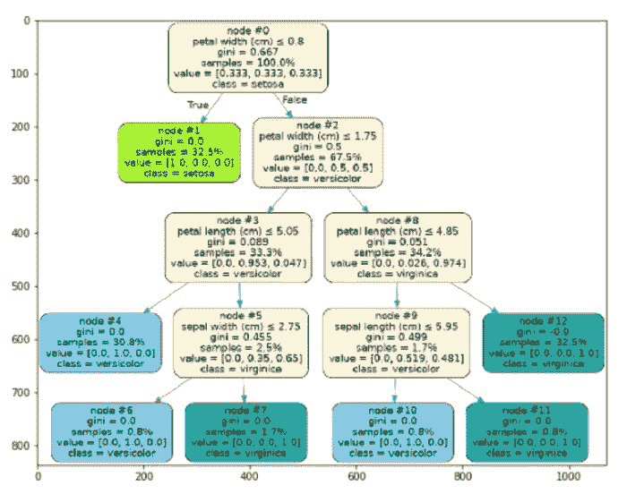
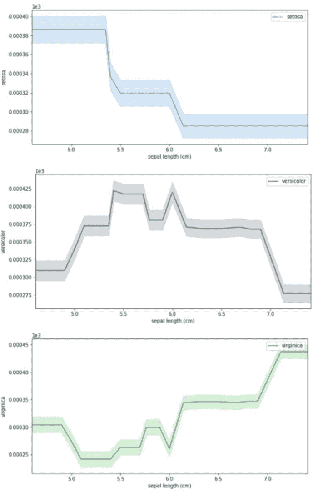
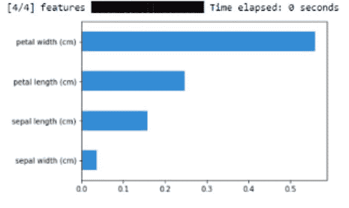

# 机器学习模型解释

> 原文：[`www.kdnuggets.com/2021/06/machine-learning-model-interpretation.html`](https://www.kdnuggets.com/2021/06/machine-learning-model-interpretation.html)

评论

**[Himanshu Sharma](https://www.linkedin.com/in/himanshusharmads/)，生物信息学数据分析师**



树（来源： [作者](https://www.linkedin.com/in/himanshusharmads/)）

* * *

## 我们的前三大课程推荐

 1\. [谷歌网络安全证书](https://www.kdnuggets.com/google-cybersecurity) - 快速进入网络安全职业生涯。

 2\. [谷歌数据分析专业证书](https://www.kdnuggets.com/google-data-analytics) - 提升你的数据分析技能

 3\. [谷歌 IT 支持专业证书](https://www.kdnuggets.com/google-itsupport) - 支持你的组织的 IT 工作

* * *

解释机器学习模型是一项困难的任务，因为我们需要了解模型在后台如何工作、模型使用了哪些参数以及模型是如何生成预测的。有不同的 Python 库可以用来创建机器学习模型的可视化并分析模型的工作情况。

[**机器学习模型仪表板**](https://towardsdatascience.com/machine-learning-model-dashboard-4544daa50848)

创建仪表板以解释机器学习模型

Skater 是一个开源 Python 库，能够对不同类型的黑箱模型进行机器学习模型解释。它帮助我们创建不同类型的可视化，使我们更容易理解模型的工作原理。

在这篇文章中，我们将探索 Skater 及其不同的功能。让我们开始吧……

### 安装所需的库

我们将开始使用 pip 安装 Skater。以下命令将使用 pip 安装 Skater。

```py
!pip install -U skater
```

### 导入所需库

下一步将是导入所需的库。要使用 Skater 解释模型，我们首先需要创建一个模型。

```py
%matplotlib inline 
import matplotlib.pyplot 
import matplotlib.pyplot as plt 
import numpy as np 
from sklearn.model_selection 
import train_test_split from sklearn.ensemble 
import RandomForestClassifier 
from sklearn import datasets 
from sklearn import svm
from skater.core.explanations import Interpretation
from skater.model import InMemoryModel
from skater.core.global_interpretation.tree_surrogate 
import TreeSurrogate
from skater.util.dataops import show_in_notebook
```

### 创建模型

我们将创建一个随机森林分类器并使用 IRIS 数据集。

```py
iris = datasets.load_iris()
digits = datasets.load_digits()
X = iris.data
y = iris.target
clf = RandomForestClassifier(random_state=0, n_jobs=-1)

xtrain, xtest, ytrain, ytest = train_test_split(X,y,test_size=0.2, random_state=0) 
clf = clf.fit(xtrain, ytrain)

y_pred=clf.predict(xtest)
prob=clf.predict_proba(xtest)

from skater.core.explanations import Interpretation
from skater.model import InMemoryModel
from skater.core.global_interpretation.tree_surrogate import TreeSurrogate
from skater.util.dataops import show_in_notebook

interpreter = Interpretation(
        training_data=xtrain, training_labels=ytrain, feature_names=iris.feature_names
    )

pyint_model = InMemoryModel(
            clf.predict_proba,
            examples=xtrain,
            target_names=iris.target_names,
            unique_values=np.unique(ytrain).tolist(),
            feature_names=iris.feature_names,
        )
```

### 创建可视化

我们将开始创建不同的可视化图，以帮助我们分析我们创建的模型的工作情况。

**1\. 部分依赖图**

该图显示了某个特征如何影响模型的预测。

```py
interpreter.partial_dependence.plot_partial_dependence(
   ['sepal length (cm)'] , pyint_model, n_jobs=-1, progressbar=**False**, grid_resolution=30, with_variance=**True**,figsize = (10, 5)
)
```



PDP 图（来源： [作者](https://www.linkedin.com/in/himanshusharmads/)）

**2. 特征重要性**

在这个图中，我们将分析我们创建的模型中各个特征的重要性。

```py
plots = interpreter.feature_importance.plot_feature_importance(pyint_model, ascending=True, progressbar=True,
                                n_jobs=-1)
```



特征重要性（来源：[作者](https://www.linkedin.com/in/himanshusharmads/)）

**3. 替代树**

这是我们创建的随机森林模型的图示表示。在每一步中，它显示了基尼指数值、类别等。

```py
surrogate_explainer = interpreter.tree_surrogate(oracle=pyint_model, seed=5)
surrogate_explainer.fit(xtrain, ytrain)
surrogate_explainer.plot_global_decisions(show_img=True)
```


替代树（来源：[ 作者](https://www.linkedin.com/in/himanshusharmads/)）

这是我们如何使用 Skater 创建不同图表的示例，这些图表帮助我们分析模型的表现。请尝试使用不同的数据集，并在评论区告诉我你的反馈。

本文与 [Piyush Ingale](https://medium.com/u/40808d551f5a?source=post_page-----47b4bc29d17f--------------------------------) 合作完成

### 在你离开之前

***感谢***你阅读！如果你想与我联系，可以随时通过 hmix13@gmail.com 或我的*[***LinkedIn 个人主页***](http://www.linkedin.com/in/himanshusharmads)*与我取得联系。你还可以查看我的*[***Github***](https://github.com/hmix13)*个人主页，了解不同的数据科学项目和包教程。同时，欢迎你浏览*[***我的个人主页***](https://medium.com/@hmix13)*，阅读我撰写的与数据科学相关的不同文章。*

**个人简介: [Himanshu Sharma](https://www.linkedin.com/in/himanshusharmads/)** 是 MEDGENOME 的生物信息学数据分析师。Himanshu 是数据科学爱好者，拥有分析数据集、创建机器学习和深度学习模型的实际经验。他曾为不同组织创建各种数据科学项目和概念验证。他在创建用于图像识别和物体检测的 CNN 模型以及用于时间序列预测的 RNN 模型方面拥有丰富的经验。Himanshu 是一名活跃的博主，已在数据科学领域发表了约 100 篇文章。

[原文](https://towardsdatascience.com/machine-learning-model-interpretation-47b4bc29d17f)。已获得许可重新发布。

**相关:**

+   自动化机器学习模型优化

+   可解释增强机器

+   可解释性、解释性与机器学习——数据科学家需要了解的内容

### 更多相关话题

+   [Segment Anything Model: 图像分割的基础模型](https://www.kdnuggets.com/2023/07/segment-anything-model-foundation-model-image-segmentation.html)

+   [如何使用合成数据克服机器学习模型训练中的数据短缺](https://www.kdnuggets.com/2022/03/synthetic-data-overcome-data-shortages-machine-learning-model-training.html)

+   [SHAP: 在 Python 中解释任何机器学习模型](https://www.kdnuggets.com/2022/11/shap-explain-machine-learning-model-python.html)

+   [数据质量在成功机器学习模型中的重要性](https://www.kdnuggets.com/2022/03/significance-data-quality-making-successful-machine-learning-model.html)

+   [挑选示例以理解机器学习模型](https://www.kdnuggets.com/2022/11/picking-examples-understand-machine-learning-model.html)

+   [最佳稀疏数据机器学习模型](https://www.kdnuggets.com/2023/04/best-machine-learning-model-sparse-data.html)
