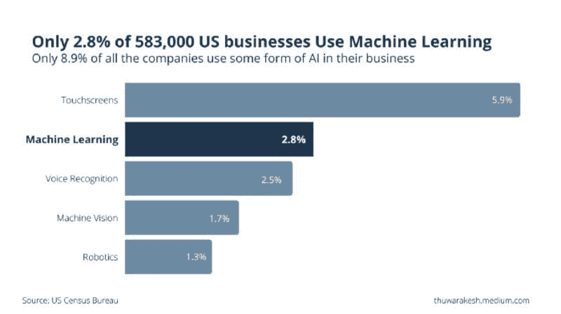

# 为什么机器学习模型在沉默中消亡？

> 原文：[`www.kdnuggets.com/2022/01/machine-learning-models-die-silence.html`](https://www.kdnuggets.com/2022/01/machine-learning-models-die-silence.html)
> 
> 生命的意义因人而异，因日而异，因时而异。
> 
> — 维克多·E·弗兰克尔，《人类寻求意义》

* * *

## 我们的前三个课程推荐

 1\. [谷歌网络安全证书](https://www.kdnuggets.com/google-cybersecurity) - 快速进入网络安全职业生涯。

 2\. [谷歌数据分析专业证书](https://www.kdnuggets.com/google-data-analytics) - 提升你的数据分析技能

 3\. [谷歌 IT 支持专业证书](https://www.kdnuggets.com/google-itsupport) - 支持你的组织的 IT 需求

* * *

弗兰克尔不仅对生命的意义有正确的看法。他关于生产中机器学习模型的说法也是正确的。

机器学习模型在生产环境中表现良好。然而，它们的性能会随着时间的推移而下降。预测质量逐渐衰退，变得不再有价值。

这是软件部署和机器学习部署之间的主要区别。软件程序每次都以相同的方式执行任务。即使在创建数十年后，它们仍然保持有用，除非新技术取代它们或最初创建的目的已经过时。

大多数公司尝试但未能在业务操作中使用机器学习而不了解这一差异。他们在未能从这项技术中获得价值之前就很快放弃了。

使用机器学习和人工智能来推动业务操作的公司越来越少。— 图片由[作者](https://linkedin.com/in/thuwarakesh)提供。

根据美国人口普查局对 2018 年 583,000 家美国公司的[调查](https://conference.nber.org/conf_papers/f138039.pdf)，只有 2.8%使用机器学习来提升他们的业务操作。约有[8.9%的受访者使用某种形式的 AI](https://www.wired.com/story/ai-why-not-more-businesses-use/)，例如语音识别。

## 为什么机器学习模型在生产中表现会下降？

你花了几周甚至几个月训练一个机器学习模型，最终，它被投入生产。现在，你应该看到你辛勤工作的成果。

但相反，你会注意到模型的性能随着时间的推移缓慢下降。这可能是什么原因？

如果不进行持续监控和充分评估预测质量的衰退，概念漂移可能会在预期的退役日期之前就使机器学习模型失效。

## 什么是概念漂移？

概念漂移发生在训练集示例的分布发生变化时。

> 在最基本的层面上，概念漂移会导致曾经被认为是一个概念的的数据点随着时间的推移被视为完全不同的概念。

例如，当欺诈的概念不断变化时，欺诈检测模型面临概念漂移的风险。

这可能导致模型性能退化，特别是在概念漂移持续发生且未被监控系统检测到的长时间段内。

## 什么是概念漂移？

概念漂移发生的主要原因是应用中的基础数据分布不断变化。

当数据分布发生变化时，旧的机器学习模型可能无法做出准确的预测，必须重新定义或完全重新训练以适应这些变化。

尽管这听起来像是你绝对不希望在应用程序中发生的事情，但许多机器学习模型的目标是尽可能频繁地更新。

这是因为从生产环境中收集的新数据包含有价值的信息，有助于提高模型预测的准确性。

输入数据的分布可能会因为外部原因或由于预测本身而发生变化。例如，客户的购买行为受宏观经济趋势的影响。然而，他们在你的平台上的行为也可能是你推荐系统的直接结果。

## 如何解决生产中模型的概念漂移？

尽管概念漂移看起来非常令人畏惧，但有办法解决它。这是所有机器学习开发人员迟早都会面对的一个普遍问题。

概念漂移随着时间推移而变化，数据从用于训练模型的数据中发生了变化。如果你没有监控这种漂移的方法，你的准确性将会逐渐下降，直到最终没有人再信任你的预测。

## 随时间监控模型的输入和输出。

通过监控输入和输出数据的分布，我们可以识别性能泄漏是否是数据问题或模型问题。

如果这是数据问题，你可以查看是什么变化导致了这种转变。这可能是数据收集方法的改变或趋势的真正变化。

如果这是模型问题，你应该检查模型的哪个特征可能导致这种分布变化。这可能是由于模型中出现了偏差，或者是环境变化导致训练集与实际数据不匹配。

## 随时间跟踪模型预测质量

随时间监控不同的性能指标至关重要，因为我们可以通过仔细查看这些指标来发现任何漂移。一些关键的模型性能指标包括精度、召回率、F-measure 和 ROC。

[**精确度**](https://developers.google.com/machine-learning/crash-course/classification/precision-and-recall) 是当真正的正例被所有预测结果除时，预测的准确度。如果你查看精确度随时间的变化，这表明我们的模型从实际数据分布到当前预测的漂移程度。

[**召回率**](https://developers.google.com/machine-learning/crash-course/classification/precision-and-recall) 告诉我们是否捕获了足够的正例。

如果召回率随时间下降，这表明我们的模型从真正的正例漂移到了假阴例，这对于业务决策是不适用的。

[**F-度量**](https://link.springer.com/article/10.1007/s10994-021-05964-1) 通过使用它们值的调和平均数将精确度和召回率结合成一个单一的数字。如果 F-度量随着准确性变化，那么这也表明模型漂移。

[**ROC**](https://towardsdatascience.com/understanding-auc-roc-curve-68b2303cc9c5) 使我们能够查看一个真正的正例与所有其他预测结果的对比，这有助于识别任何分类器偏差问题或导致假阳性的特征变化。它可以被视为精确度和召回率的扩展，但信息更多。

## 定期使用新数据重新训练你的模型，以保持准确性

虽然跟踪性能指标可以尽早识别概念漂移，但定期重新训练主动尝试消除这种情况。

不断重新训练你的模型可能需要大量的时间和资源，但这是一个长期投资的回报。

重新训练的频率在很大程度上取决于领域。在电子商务中，每周重新训练模型可能是合理的。但对于欺诈检测系统，其中欺诈用户的行为不断变化，你可能需要每天重新训练你的模型。

## 使用模型集成

这些都是防止或解决生产中机器学习漂移的优秀策略。然而，解决这个问题的另一种方法是使用集成模型。

集成模型同时使用多个算法，并将它们的预测结果结合成一个最终预测，这比任何单个算法的预测更准确。

这可以是提高准确性和防止时间推移过程中出现漂移的好方法。

## 最后的思考

概念漂移导致生产中的机器学习模型表现不同于训练期间的表现。这是一个大问题，如果漂移没有被正确预测，可能会导致糟糕的用户体验甚至模型失败。

概念漂移在生产中最常见的方式是当你的数据随时间变化（例如，添加了新特征，移除了某些现有特征）。监控你的数据并尽早检测漂移是至关重要的。

你还应该使用如定期重新训练或集成的方法来防止漂移的发生。

你必须在用户开始报告产品体验不佳之前解决机器学习漂移。如果发生这种情况，它将迅速导致信任丧失和后续修复成本的显著增加。要有前瞻性！

**[Thuwarakesh Murallie](https://www.linkedin.com/in/thuwarakesh/)** (**[@Thuwarakesh](https://twitter.com/Thuwarakesh)**) 是 Stax, Inc.的首席数据科学家，也是 Medium 上的分析领域顶尖作者。Murallie 分享了他在数据科学领域每天的探索。

### 更多相关话题

+   [3 个理由说明你应该使用线性回归模型而不是……](https://www.kdnuggets.com/2021/08/3-reasons-linear-regression-instead-neural-networks.html)

+   [机器学习没有为我的业务带来价值。为什么？](https://www.kdnuggets.com/2021/12/machine-learning-produce-value-business.html)

+   [4 个理由说明你不应该使用机器学习](https://www.kdnuggets.com/2021/12/4-reasons-shouldnt-machine-learning.html)

+   [为什么越来越多的开发者在他们的机器学习项目中使用 Python？](https://www.kdnuggets.com/2022/01/developers-python-machine-learning-projects.html)

+   [KDnuggets™新闻 22:n05, 2 月 2 日: 掌握机器学习的 7 个步骤……](https://www.kdnuggets.com/2022/n05.html)

+   [机器学习算法 - 什么，为什么以及如何？](https://www.kdnuggets.com/2022/09/machine-learning-algorithms.html)
