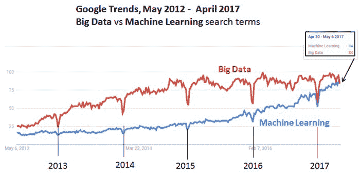
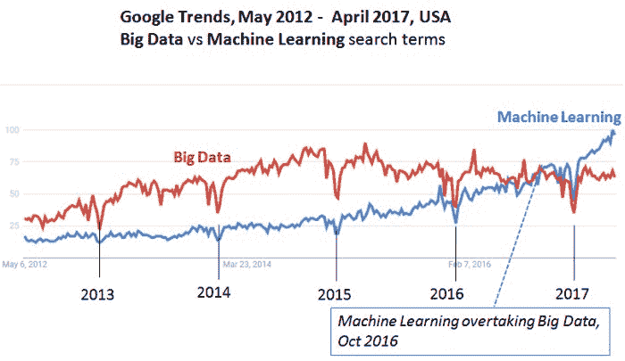
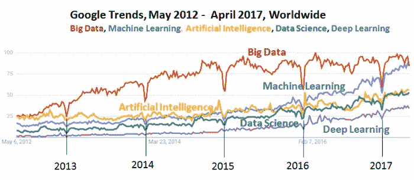

# 机器学习超越大数据了吗？

> 原文：[`www.kdnuggets.com/2017/05/machine-learning-overtaking-big-data.html`](https://www.kdnuggets.com/2017/05/machine-learning-overtaking-big-data.html)

 评论 大数据在 2011 年左右作为一个领域和流行词汇突然流行起来。

然而，最近它的光彩有所减退，Gartner 在 2015 年将大数据从其炒作周期中移除，并将其替换为机器学习。

我们注意到，2012 年的 KDnuggets 投票曾询问大数据何时会过时，中位预测为 2015 年，因此 KDnuggets 的读者预测是准确的（尽管他们预计智能数据将取代大数据，而不是机器学习）。

“机器学习”现在比“大数据”更受欢迎了吗？

我们使用 Google Trends 进行调查。

看过去五年的数据（2012 年 5 月 - 2017 年 4 月），[全球范围内的大数据与机器学习](https://trends.google.com/trends/explore?date=2012-05-01%202017-04-30&q=Machine%20Learning,Big%20Data)在 Google Trends 上显示，“机器学习”的受欢迎程度增长更快，而就在本周（2017 年 4 月 30 日 - 5 月 6 日），机器学习的搜索量首次与大数据的搜索量持平！

 **图 1：Google Trends，2012 年 5 月 - 2017 年 4 月，全球范围**

“大数据”与“机器学习”搜索词全球对比

搜索量的下降对应着圣诞节/新年假期。

如果我们仅限于[美国](https://trends.google.com/trends/explore?date=2012-05-01%202017-04-30&geo=US&q=Machine%20Learning,Big%20Data)进行比较，我们会看到“机器学习”在 2016 年 10 月左右已经超过了“大数据”。

 **图 2：Google Trends，2012 年 5 月 - 2017 年 4 月，美国**

“大数据”与“机器学习”搜索词对比

最后，我们还加入了其他三个热门搜索词：“人工智能”（Artificial Intelligence）、“数据科学”（Data Science）和“深度学习”（Deep Learning），并检查了[全球范围内的大数据、机器学习、人工智能、数据科学和深度学习的 Google Trends](https://trends.google.com/trends/explore?date=2012-05-01%202017-04-30&q=Machine%20Learning,Big%20Data,Artificial%20Intelligence,Data%20Science,Deep%20Learning)，从 2012 年 5 月 1 日到 2017 年 4 月 30 日。

 **图 3：Google Trends，2012 年 5 月 - 2017 年 4 月，全球范围**

“大数据”（Big Data）与“机器学习”（Machine Learning）与“人工智能”（Artificial Intelligence）与“数据科学”（Data Science）与“深度学习”（Deep Learning）搜索词对比。

我们注意到，尽管深度学习（Deep Learning）增长速度较快，但仍然不如其他四个术语受欢迎。

在 2012 年、2013 年和 2014 年，前四名术语的排名是

1.  大数据

1.  人工智能（Artificial Intelligence）

1.  机器学习

1.  数据科学

2015 年，机器学习超越了“人工智能”，位居第二，而 2016 年“数据科学”追赶上人工智能，排名第 3-4 位。

告诉我你的想法！

**相关内容：**

+   什么将取代大数据以及何时会发生

+   **大数据过于庞大而无法消亡**

+   **Gartner 2015 炒作周期：大数据已过时，机器学习为主流**

+   KDnuggets 顶级推文，8 月 18-19 日：大数据在 Gartner 炒作周期中进入“失望低谷”

* * *

## 我们的前三课程推荐

 1\. [Google 网络安全证书](https://www.kdnuggets.com/google-cybersecurity) - 快速进入网络安全职业

 2\. [Google 数据分析专业证书](https://www.kdnuggets.com/google-data-analytics) - 提升你的数据分析能力

 3\. [Google IT 支持专业证书](https://www.kdnuggets.com/google-itsupport) - 支持你的组织的 IT 工作

* * *

### 更多相关内容

+   [停止学习数据科学以寻找目标，并通过寻找目标来…](https://www.kdnuggets.com/2021/12/stop-learning-data-science-find-purpose.html)

+   [学习数据科学统计学的顶级资源](https://www.kdnuggets.com/2021/12/springboard-top-resources-learn-data-science-statistics.html)

+   [建立一个坚实的数据团队](https://www.kdnuggets.com/2021/12/build-solid-data-team.html)

+   [成功数据科学家的 5 个特征](https://www.kdnuggets.com/2021/12/5-characteristics-successful-data-scientist.html)

+   [成为优秀数据科学家所需的 5 项关键技能](https://www.kdnuggets.com/2021/12/5-key-skills-needed-become-great-data-scientist.html)

+   [每个初学者数据科学家应掌握的 6 个预测模型](https://www.kdnuggets.com/2021/12/6-predictive-models-every-beginner-data-scientist-master.html)
