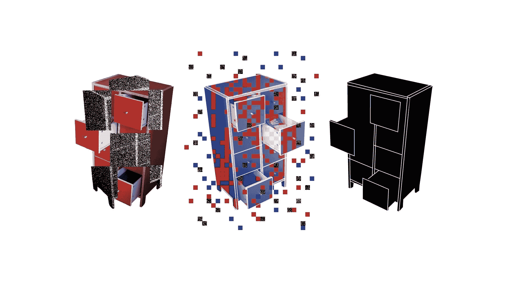

# 机器学习没有为我的业务创造价值。为什么？

> 原文：[`www.kdnuggets.com/2021/12/machine-learning-produce-value-business.html`](https://www.kdnuggets.com/2021/12/machine-learning-produce-value-business.html)

**由[Necati Demir](https://www.linkedin.com/in/necatidemir/)，datagran.io 的联合创始人兼首席技术官**

[Anton Grabolle](https://www.instagram.com/antongrabolle) / [Better Images of AI](https://www.betterimagesofai.org) / Classification Cupboard / [Licenced by CC-BY 4.0](https://creativecommons.org/licenses/by/4.0/)

关键词“机器学习”一直在被提及。你不断听到它，人们把它说成是解决一切问题的魔法，作为领导者，你希望在业务中解决你的问题。你开始招聘数据科学家，并要求他们做 X，你不断听到他们在测试数据集中“有很好的准确性结果”，你喜欢你听到的；你听说这是一件好事。一段时间后，你想在日常操作中使用它，它却开始失败。那么，发生了什么？发生了什么事？

当然，可能有多个需要关注的原因，但在这篇文章中，我将重点关注三个非技术点：

+   无法区分问题和解决方案

+   不使用正确的指标

+   不进行迭代

## **区分问题和解决方案**

上一段有以下句子：

> 你开始招聘数据科学家，并要求他们做 X……

你是怎么想到 X 的？数据科学团队还有其他可以帮助的 X 吗？可能，X 是你认为最适合你问题的解决方案，但你是否考虑过其他解决方案？在继续之前，让我们非常简短地解释一下什么是*问题*，什么是*解决方案*。

+   *问题*是你想要实现的目标

+   *解决方案*是你想要如何实现

让我们用这个例子来说明问题-解决方案的关系：

> 我希望通过开发一个推荐系统来提高我的电子商务网站的转化率。

你的业务问题（你想要实现的目标）是提高转化率，而你认为最好的解决方案是开发一个推荐系统。

对同一个问题可能有多种解决方案，你可以

+   构建一个基于机器学习的推荐系统，或者

+   提高你网站搜索引擎的质量。

可能有多种方法来解决你的问题。数据科学团队可能倾向于跳到他们脑海中的第一个解决方案，或者业务领导者可能倾向于要求数据科学团队实施她听说过的大公司的解决方案。*那么，应该怎么做呢？*

实际上，解决方案非常简单；作为领导者，你需要解释你想要实现的目标，然后与团队一起进行头脑风暴。 当然，可能会有挑战，这里的挑战可能是；

+   数据科学团队需要更多地考虑业务，而不仅仅是技术，

+   业务领导者需要更加开放，清楚地解释业务情况并理解机器学习过程。

## **使用正确的指标**

让我们继续使用相同的*“提高转化率 + 构建推荐系统”*示例。如果你只是想出一个*“构建推荐系统”*的想法，并通过测量转化率来评估数据科学家团队的表现，那可能是错误的。

这个示例的边缘情况是：将公司的收入作为评估数据科学家团队表现的指标。你可以很容易地想象，收入不仅仅与推荐系统的结果相关。*那该怎么办呢？*

构建中间指标并进行测量。

> 指标 1 -> 指标 2 -> 指标 3 ->… -> 最终指标

在推荐系统的示例中；数据科学家团队可以立即衡量的指标是*点击率（CTR）*，它测量了推荐项目被点击的次数。下一个层级的指标可以是*加入购物车率*，用来衡量推荐项目被加入购物车的次数。就这样继续下去…

> CTR -> 加入购物车率 -> 指标 x -> 指标 y -> 转化率

你只需知道，越往右滑，数据科学家团队的信心就越少。作为领导者，你需要在业务目标和数据科学家团队有信心且有影响力的指标之间找到正确的平衡。

## **迭代**

我很少看到一个想法在第一次尝试时就能成功。机器学习项目也不例外。开发机器学习项目是一个高度迭代的过程，期望第一次尝试就取得成功是一个错误。数据科学家团队在测试数据集上可能有很好的准确率，但在现实世界中情况会有所不同。

在实际应用机器学习时，可能会出现许多问题和解决方案选项；

+   如果这是一个推荐系统，可以开发一个流程，将点击数据输入推荐引擎，以便推荐引擎可以进行自我调整，

+   如果这是一个计算机视觉应用，可能是工厂的光照条件不够好，输入到视觉系统中的图像非常黑暗，

+   也许用户行为发生了变化，数据科学家团队用来开发机器学习系统的数据分布不再有效；这正是 COVID 爆发时信用卡欺诈检测系统发生的情况，因为每个人开始在网站上使用信用卡购物，造成了急剧的变化。

*那该怎么办呢？*

接受开发机器学习项目是一个高度迭代的过程。构建一个数据科学家团队可以从生产系统中获得反馈的过程。不要将机器学习项目视为技术问题，机器学习带来了组织变革，可能需要公司内部多个部门的协作。

## **结论**

在这篇简短的文章中，我尝试解释了可能导致机器学习项目未能产生价值的三个非技术性问题，并提到了可能的挑战。

+   *分离问题与解决方案* 是找到正确的机器学习项目来实施的关键。这可以通过头脑风暴来实现，但面临的挑战是数据科学家团队和商业领导者需要理解对方的立场。

+   *使用正确的指标* 是衡量项目和团队的关键。这可以通过找到中间指标来实现，但面临的挑战是如果指标对数据科学家团队变得模糊，他们可能会缺乏信心。

+   *迭代* 是在现实世界与数据科学家团队所处理的数据集之间建立桥梁的关键。这可以通过构建一个将生产/现实世界数据提供给数据科学家团队的过程来实现，但这面临着一个挑战，即商业领导者可能不会将其视为组织变革，而只是将其视为技术问题。

**简历: [Necati Demir](https://www.linkedin.com/in/necatidemir/)** 是 [datagran.io](https://www.datagran.io/) 的联合创始人兼首席技术官。Necati 是一位计算机工程师，拥有机器学习博士学位，并在私营行业有 15 年的软件开发经验。

[原文](https://blog.demir.io/machine-learning-does-not-produce-value-for-my-business-why-cc016c242b1d#ed03-df28ce1186b)。经许可转载。

* * *

## 我们的前三大课程推荐

 1\. [Google 网络安全证书](https://www.kdnuggets.com/google-cybersecurity) - 快速进入网络安全职业轨道。

 2\. [Google 数据分析专业证书](https://www.kdnuggets.com/google-data-analytics) - 提升您的数据分析能力

 3\. [Google IT 支持专业证书](https://www.kdnuggets.com/google-itsupport) - 支持您的组织 IT

* * *

### 更多相关内容

+   [7 个生成可读数据科学代码的技巧](https://www.kdnuggets.com/2022/11/7-tips-produce-readable-data-science-code.html)

+   [ChatGPT 在做什么？为什么它有效？](https://www.kdnuggets.com/2023/04/chatgpt-work.html)

+   [数据血统是什么？它为何重要？](https://www.kdnuggets.com/what-is-data-lineage-and-why-does-it-matter)

+   [为什么你不应该过度使用 Python 列表推导式](https://www.kdnuggets.com/why-you-should-not-overuse-list-comprehensions-in-python)

+   [ETL 与机器学习有什么关系？](https://www.kdnuggets.com/2022/08/etl-machine-learning.html)

+   [使用 Datawig：一个用于缺失值填补的 AWS 深度学习库](https://www.kdnuggets.com/2021/12/datawig-aws-deep-learning-library-missing-value-imputation.html)
