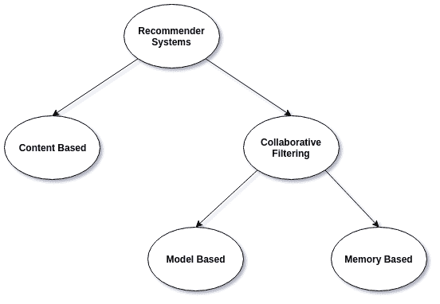
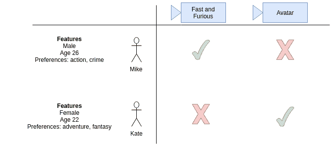

# 机器学习推荐系统的简单介绍

> 原文：[`www.kdnuggets.com/2019/09/machine-learning-recommender-systems.html`](https://www.kdnuggets.com/2019/09/machine-learning-recommender-systems.html)

评论


YouTube 如何知道你会观看哪些视频？Google 如何总是能知道你会阅读哪些新闻？它们使用一种叫做[*推荐系统*](https://en.wikipedia.org/wiki/Recommender_system)的[机器学习](https://en.wikipedia.org/wiki/Machine_learning)技术。

实际上，推荐系统包括一类能够向用户建议“相关”项目的技术和算法。理想情况下，建议的项目对用户越相关越好，以便用户能够参与这些项目：YouTube 视频、新闻文章、在线产品等等。

项目根据其相关性进行排名，最相关的项目会显示给用户。相关性是推荐系统必须确定的，主要基于历史数据。如果你最近观看了很多关于大象的 YouTube 视频，那么 YouTube 会开始向你推荐许多标题和主题相似的大象视频！

推荐系统一般分为两大类：协同过滤和基于内容的系统。



图 1：不同类型推荐系统的分类树。

### 协同过滤系统

[协同过滤](https://en.wikipedia.org/wiki/Collaborative_filtering)方法是仅基于用户与目标项目之间过去的互动。因此，协同过滤系统的输入将是所有用户与目标项目互动的历史数据。这些数据通常存储在一个矩阵中，其中行表示用户，列表示项目。

这种系统的核心思想是用户的历史数据应该足以做出预测。即我们不需要比这些历史数据更多的东西，不需要额外的用户推动，也不需要当前的趋势信息等。


图 2：展示了协同过滤如何预测用户对四个事物的评分：一张图片、一册书、一段视频和一个视频游戏。根据用户的历史数据，每个项目的喜欢和不喜欢，系统试图预测用户对一个他们还没有评分的新项目的评分。预测本身基于其他用户的过去评分，这些用户的评分和因此假设的偏好与当前用户相似。在这种情况下，系统做出了预测/推荐，即当前用户可能不会喜欢这个视频。[来源](https://en.wikipedia.org/wiki/Collaborative_filtering)由[Moshanin](https://commons.wikimedia.org/w/index.php?title=User:Moshanin&action=edit&redlink=1)

除此之外，协同过滤方法进一步分为两个子组：基于记忆的方法和基于模型的方法。

基于记忆的方法最为简单，因为它们完全不使用模型。它们假设可以基于对过去数据的纯粹“记忆”进行预测，通常只使用简单的距离度量方法，比如最近邻方法。

另一方面，基于模型的方法总是假设某种潜在的模型，并基本上试图确保所有预测结果都能很好地适应模型。

举个例子，假设我们有一个用户到首选午餐项目的矩阵，其中所有用户都是喜欢芝士汉堡的美国人（它们非常棒）。基于记忆的方法只会查看用户在过去一个月中吃过什么，而不会考虑他们是喜欢芝士汉堡的美国人的这个小事实。另一方面，基于模型的方法将确保预测结果总是稍微倾向于芝士汉堡，因为潜在的模型假设是数据集中的大多数人应该喜欢芝士汉堡！

**代码**

我们可以使用[Graph Lab](https://turi.com/)轻松创建一个协同过滤推荐系统！我们将采取以下步骤：

1.  使用 pandas 加载数据

1.  将 pandas 数据框转换为 graph lab SFrames

1.  训练模型

1.  提供推荐

```py
import graphlab
import pandas as pd

# Load up the data with pandas
r_cols = ['user_id', 'food_item', 'rating']
train_data_df = pd.read_csv('train_data.csv', sep='\t', names=r_cols)
test_data_df = pd.read_csv('test_data.csv', sep='\t', names=r_cols)

# Convert the pandas dataframes to graph lab SFrames
train_data = graphlab.SFrame(train_data_df)
test_data = graphlab.SFrame(test_data_df)

# Train the model
collab_filter_model = graphlab.item_similarity_recommender.create(train_data, 
                                                                  user_id='user_id', 
                                                                  item_id='food_item', 
                                                                  target='rating', 
                                                                  similarity_type='cosine')

# Make recommendations
which_user_ids = [1, 2, 3, 4]
how_many_recommendations = 5
item_recomendation = collab_filter_model.recommend(users=which_user_ids,
                                                   k=how_many_recommendations)

```

### 基于内容的系统

与协同过滤相比，基于内容的方法会使用关于用户和/或项目的额外信息来进行预测。

例如，在上面的动图中，基于内容的系统在进行预测时可能会考虑年龄、性别、职业和其他个人用户因素。如果我们知道视频是关于滑板的，但用户的年龄是 87 岁，那么预测这个人不会喜欢这个视频会容易得多！



这就是为什么当你注册许多在线网站和服务时，它们会要求你（可选）提供你的出生日期、性别和种族！这只是为他们的系统提供更多数据，以便进行更好的预测。

因此，基于内容的方法在某种程度上更类似于经典的机器学习，因为我们将根据用户和项目数据构建特征，并利用这些特征来帮助我们进行预测。我们的系统输入是用户的**特征**和项目的**特征**。我们的系统输出是预测用户是否喜欢或不喜欢该项目。

**代码**

我们可以使用[Graph Lab](https://turi.com/)轻松创建一个协同过滤推荐系统！我们将采取以下步骤：

1.  使用 pandas 加载数据

1.  将 pandas 数据框转换为 graph lab SFrames

1.  训练模型

1.  提供推荐

```py
import graphlab
import pandas as pd

# Load up the data with pandas
r_cols = ['user_id', 'food_item', 'rating']
train_data_df = pd.read_csv('train_data.csv', sep='\t', names=r_cols)
test_data_df = pd.read_csv('test_data.csv', sep='\t', names=r_cols)

# Convert the pandas dataframes to graph lab SFrames
train_data = graphlab.SFrame(train_data_df)
test_data = graphlab.SFrame(test_data_df)

# Train the model
cotent_filter_model = graphlab.item_content_recommender.create(train_data, 
                                                              user_id='user_id', 
                                                              item_id='food_item', 
                                                              target='rating')

# Make recommendations
which_user_ids = [1, 2, 3, 4]
how_many_recommendations = 5
item_recomendation = cotent_filter_model.recommend(users=which_user_ids,
                                                   k=how_many_recommendations)

```

**喜欢学习吗？**

关注我在[twitter](https://twitter.com/GeorgeSeif94)上，我会发布最新最棒的人工智能、技术和科学内容！也可以在[LinkedIn](https://www.linkedin.com/in/georgeseif/)上与我联系！

**相关内容：**

+   [构建推荐系统](https://www.kdnuggets.com/2019/04/building-recommender-system.html)

+   [推荐引擎 - 胶水代码下的秘密](https://www.kdnuggets.com/2018/02/recommender-engine.html)

+   [推荐系统算法概述](https://www.kdnuggets.com/2017/08/recommendation-system-algorithms-overview.html)

* * *

## 我们的前三个课程推荐

 1\. [Google 网络安全证书](https://www.kdnuggets.com/google-cybersecurity) - 快速开启网络安全职业生涯。

 2\. [Google 数据分析专业证书](https://www.kdnuggets.com/google-data-analytics) - 提升你的数据分析技能

 3\. [Google IT 支持专业证书](https://www.kdnuggets.com/google-itsupport) - 支持你的组织 IT 部门

* * *

### 更多相关主题

+   [使用 Python 为 Amazon 产品构建推荐系统](https://www.kdnuggets.com/2023/02/building-recommender-system-amazon-products-python.html)

+   [选择正确机器学习算法的简单指南](https://www.kdnuggets.com/2020/05/guide-choose-right-machine-learning-algorithm.html)

+   [设计有效且可靠的机器学习系统！](https://www.kdnuggets.com/2023/05/manning-design-effective-reliable-machine-learning-systems.html)

+   [TensorFlow 计算机视觉 - 转移学习轻松入门](https://www.kdnuggets.com/2022/01/tensorflow-computer-vision-transfer-learning-made-easy.html)

+   [Python 数据预处理简易指南](https://www.kdnuggets.com/2020/07/easy-guide-data-preprocessing-python.html)

+   [OpenAI API 入门指南：简单易懂的入门指南](https://www.kdnuggets.com/openai-api-for-beginners-your-easy-to-follow-starter-guide)
