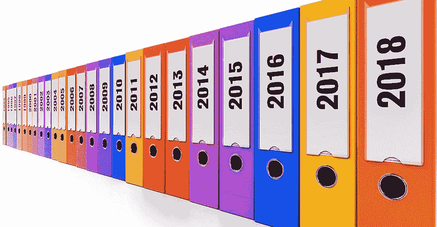
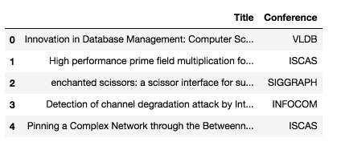
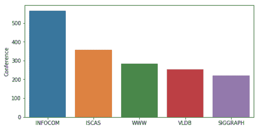
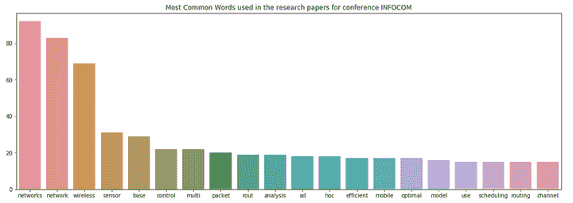
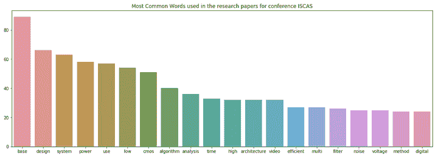

# 使用 Python 中的 SpaCy 进行文本分类的机器学习

> 原文：[`www.kdnuggets.com/2018/09/machine-learning-text-classification-using-spacy-python.html`](https://www.kdnuggets.com/2018/09/machine-learning-text-classification-using-spacy-python.html)

 评论

**由[苏珊·李](https://www.linkedin.com/in/susanli/)，高级数据科学家**



图片来源: Pixabay

* * *

## 我们的前三个课程推荐

 1\. [Google 网络安全证书](https://www.kdnuggets.com/google-cybersecurity) - 快速进入网络安全职业生涯

 2\. [Google 数据分析专业证书](https://www.kdnuggets.com/google-data-analytics) - 提升你的数据分析能力

 3\. [Google IT 支持专业证书](https://www.kdnuggets.com/google-itsupport) - 支持你的组织 IT

* * *

[**spaCy**](https://spacy.io/) 是一个流行且易于使用的 Python 自然语言处理库。它提供了当前最先进的准确性和速度水平，并且拥有一个活跃的开源社区。然而，由于 SpaCy 是一个相对较新的 NLP 库，它的采用程度还不及[NLTK](https://www.nltk.org/)，目前还没有足够的教程可用。

在这篇文章中，我们将演示如何使用**spaCy**实现文本分类，而无需具备深度学习经验。

### 数据

对于年轻研究者来说，寻找和选择合适的学术会议以提交学术论文通常是耗时且令人沮丧的经历。我们定义的“合适会议”是指会议与研究者的工作相一致，并且具有良好的学术排名。

使用会议论文集数据集，我们将按会议对研究论文进行分类。让我们开始吧。数据集可以在[这里](https://raw.githubusercontent.com/susanli2016/Machine-Learning-with-Python/master/research_paper.csv)找到。

### 探索

快速浏览一下：

```py
import pandas as pd
import numpy as np
import seaborn as sns
import matplotlib.pyplot as plt
import base64
import string
import re
from collections import Counter
from nltk.corpus import stopwords
stopwords = stopwords.words('english')

df = pd.read_csv('research_paper.csv')
df.head()
```



图 1

没有缺失值。

```py
df.isnull().sum()
```

***标题 0

会议 0

dtype: int64***

将数据分割为训练集和测试集：

```py
from sklearn.model_selection import train_test_split
train, test = train_test_split(df, test_size=0.33, random_state=42)

print('Research title sample:', train['Title'].iloc[0])
print('Conference of this paper:', train['Conference'].iloc[0])
print('Training Data Shape:', train.shape)
print('Testing Data Shape:', test.shape)
```

***研究标题示例：与智能合作：在自组织网络中使用异构智能天线。

这篇论文的会议: INFOCOM

训练数据形状: (1679, 2)

测试数据形状: (828, 2)***

数据集包含 2507 个短篇研究论文标题，这些标题被分类为 5 个类别（按会议）。下图总结了不同会议的研究论文分布。

```py
fig = plt.figure(figsize=(8,4))
sns.barplot(x = train['Conference'].unique(), y=train['Conference'].value_counts())
plt.show()
```



图 2

以下是使用 SpaCy 进行文本预处理的一种方法。之后，我们尝试找出提交至第一类和第二类（会议）INFOCOM 和 ISCAS 的论文中使用的最常见词汇。

```py
import spacy

nlp = spacy.load('en_core_web_sm')
punctuations = string.punctuation

def cleanup_text(docs, logging=False):
    texts = []
    counter = 1
    for doc in docs:
        if counter % 1000 == 0 and logging:
            print("Processed %d out of %d documents." % (counter, len(docs)))
        counter += 1
        doc = nlp(doc, disable=['parser', 'ner'])
        tokens = [tok.lemma_.lower().strip() for tok in doc if tok.lemma_ != '-PRON-']
        tokens = [tok for tok in tokens if tok not in stopwords and tok not in punctuations]
        tokens = ' '.join(tokens)
        texts.append(tokens)
    return pd.Series(texts)

INFO_text = [text for text in train[train['Conference'] == 'INFOCOM']['Title']]

IS_text = [text for text in train[train['Conference'] == 'ISCAS']['Title']]

INFO_clean = cleanup_text(INFO_text)
INFO_clean = ' '.join(INFO_clean).split()

IS_clean = cleanup_text(IS_text)
IS_clean = ' '.join(IS_clean).split()

INFO_counts = Counter(INFO_clean)
IS_counts = Counter(IS_clean)

INFO_common_words = [word[0] for word in INFO_counts.most_common(20)]
INFO_common_counts = [word[1] for word in INFO_counts.most_common(20)]

fig = plt.figure(figsize=(18,6))
sns.barplot(x=INFO_common_words, y=INFO_common_counts)
plt.title('Most Common Words used in the research papers for conference INFOCOM')
plt.show()

```



图 3

```py
IS_common_words = [word[0] for word in IS_counts.most_common(20)]
IS_common_counts = [word[1] for word in IS_counts.most_common(20)]

fig = plt.figure(figsize=(18,6))
sns.barplot(x=IS_common_words, y=IS_common_counts)
plt.title('Most Common Words used in the research papers for conference ISCAS')
plt.show()
```



图 4

INFOCOM 中的最常见词是“networks”和“network”。显然，INFOCOM 是一个网络及相关领域的会议。

ISCAS 中的最常见词是“base”和“design”。这表明 ISCAS 是一个关于数据库、系统设计及相关主题的会议。

### 使用 spaCy 的机器学习

```py
from sklearn.feature_extraction.text import CountVectorizer
from sklearn.base import TransformerMixin
from sklearn.pipeline import Pipeline
from sklearn.svm import LinearSVC
from sklearn.feature_extraction.stop_words import ENGLISH_STOP_WORDS
from sklearn.metrics import accuracy_score
from nltk.corpus import stopwords
import string
import re
import spacy
spacy.load('en')
from spacy.lang.en import English
parser = English()
```

以下是使用 spaCy 清理文本的另一种方法：

```py
STOPLIST = set(stopwords.words('english') + list(ENGLISH_STOP_WORDS))
SYMBOLS = " ".join(string.punctuation).split(" ") + ["-", "...", "”", "”"]

class CleanTextTransformer(TransformerMixin):

   def transform(self, X, **transform_params):
        return [cleanText(text) for text in X]

   def fit(self, X, y=None, **fit_params):
        return self

   def get_params(self, deep=True):
        return {}

def cleanText(text):
    text = text.strip().replace("\n", " ").replace("\r", " ")
    text = text.lower()

def tokenizeText(sample):
    tokens = parser(sample)
    lemmas = []
    for tok in tokens:
        lemmas.append(tok.lemma_.lower().strip() if tok.lemma_ != "-PRON-" else tok.lower_)
    tokens = lemmas
    tokens = [tok for tok in tokens if tok not in STOPLIST]
    tokens = [tok for tok in tokens if tok not in SYMBOLS]
    return tokens
```

定义一个函数来打印出最重要的特征，即具有最高系数的特征：

```py
def printNMostInformative(vectorizer, clf, N):
    feature_names = vectorizer.get_feature_names()
    coefs_with_fns = sorted(zip(clf.coef_[0], feature_names))
    topClass1 = coefs_with_fns[:N]
    topClass2 = coefs_with_fns[:-(N + 1):-1]
    print("Class 1 best: ")
    for feat in topClass1:
        print(feat)
    print("Class 2 best: ")
    for feat in topClass2:
        print(feat)

vectorizer = CountVectorizer(tokenizer=tokenizeText, ngram_range=(1,1))
clf = LinearSVC()

pipe = Pipeline([('cleanText', CleanTextTransformer()), ('vectorizer', vectorizer), ('clf', clf)])

# data
train1 = train['Title'].tolist()
labelsTrain1 = train['Conference'].tolist()

test1 = test['Title'].tolist()
labelsTest1 = test['Conference'].tolist()

# train
pipe.fit(train1, labelsTrain1)

# test
preds = pipe.predict(test1)
print("accuracy:", accuracy_score(labelsTest1, preds))
print("Top 10 features used to predict: ")

printNMostInformative(vectorizer, clf, 10)
pipe = Pipeline([('cleanText', CleanTextTransformer()), ('vectorizer', vectorizer)])
transform = pipe.fit_transform(train1, labelsTrain1)

vocab = vectorizer.get_feature_names()
for i in range(len(train1)):
    s = ""
    indexIntoVocab = transform.indices[transform.indptr[i]:transform.indptr[i+1]]
    numOccurences = transform.data[transform.indptr[i]:transform.indptr[i+1]]
    for idx, num in zip(indexIntoVocab, numOccurences):
        s += str((vocab[idx], num))
```

***准确率：0.7463768115942029

用于预测的前 10 个特征：

第 1 类最佳：

(-0.9286024231429632, ‘database’)

(-0.8479561292796286, ‘chip’)

(-0.7675978546440636, ‘wimax’)

(-0.6933516302055982, ‘object’)

(-0.6728543084136545, ‘functional’)

(-0.6625144315722268, ‘multihop’)

(-0.6410217867606485, ‘amplifier’)

(-0.6396374843938725, ‘chaotic’)

(-0.6175855765947755, ‘receiver’)

(-0.6016682542232492, ‘web’)

第 2 类最佳：

(1.1835964521070819, ‘speccast’)

(1.0752051052570133, ‘manets’)

(0.9490176624004726, ‘gossip’)

(0.8468395015456092, ‘node’)

(0.8433107444740003, ‘packet’)

(0.8370516260734557, ‘schedule’)

(0.8344139814680707, ‘multicast’)

(0.8332232077559836, ‘queue’)

(0.8255429594734555, ‘qos’)

(0.8182435133796081, ‘location’)***

```py
from sklearn import metrics
print(metrics.classification_report(labelsTest1, preds, 
    target_names=df['Conference'].unique()))

precision    recall  f1-score   support

       VLDB       0.75      0.77      0.76       159
      ISCAS       0.90      0.84      0.87       299
   SIGGRAPH       0.67      0.66      0.66       106
    INFOCOM       0.62      0.69      0.65       139
        WWW       0.62      0.62      0.62       125

avg / total       0.75      0.75      0.75       828
```

这就是了。我们现在已经在 SpaCy 的帮助下完成了文本分类的机器学习。

源代码可以在 [Github](https://github.com/susanli2016/Machine-Learning-with-Python/blob/master/machine%20learning%20spaCy.ipynb) 上找到。祝你学习愉快！

参考资料：[Kaggle](https://www.kaggle.com/)

**个人简介：[Susan Li](https://www.linkedin.com/in/susanli/)** 正在通过一篇文章改变世界。她是一位资深数据科学家，位于加拿大多伦多。

[原文](https://towardsdatascience.com/machine-learning-for-text-classification-using-spacy-in-python-b276b4051a49)。已获许可转载。

**相关内容：**

+   使用 Scikit-Learn 的多分类文本分类

+   LSA、PLSA、LDA 和 lda2Vec 的主题建模

+   自然语言处理技巧：开始使用 NLP

### 更多相关主题

+   [使用 spaCy 进行 NLP 入门](https://www.kdnuggets.com/2022/11/getting-started-spacy-nlp.html)

+   [使用 spaCy 进行自然语言处理](https://www.kdnuggets.com/2023/01/natural-language-processing-spacy.html)

+   [什么是文本分类？](https://www.kdnuggets.com/2022/07/text-classification.html)

+   [文本分类任务的最佳架构：基准测试…](https://www.kdnuggets.com/2023/04/best-architecture-text-classification-task-benchmarking-options.html)

+   [使用 Tensorflow 训练图像分类模型的指南](https://www.kdnuggets.com/2022/12/guide-train-image-classification-model-tensorflow.html)

+   [分类的机器学习算法](https://www.kdnuggets.com/2022/03/machine-learning-algorithms-classification.html)
