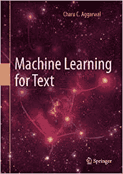

# 文本的机器学习

> 原文：[`www.kdnuggets.com/2018/04/machine-learning-text.html`](https://www.kdnuggets.com/2018/04/machine-learning-text.html)

赞助广告。

文本的机器学习，Springer，2018 年 3 月

Charu C. Aggarwal。

### **关于文本的综合教材：** [** 目录**](http://www.charuaggarwal.net/Text-Learning.pdf)

[PDF 下载链接](https://rd.springer.com/book/10.1007/978-3-319-73531-3)  （仅对连接到订阅机构的计算机免费）

[购买硬封面或 PDF](http://www.springer.com/us/book/9783319735306)  （供普通读者使用）

[使用右侧目的页链接购买低价平装本](https://rd.springer.com/book/10.1007/978-3-319-73531-3)  （链接仅对连接到订阅机构的计算机显示，平装本折扣价为$25）

本书涵盖了使用词袋和以序列为中心的两种方法的文本机器学习技术。覆盖范围广泛，包括传统的信息检索方法以及来自神经网络和深度学习的最新方法。书中的章节可以分为三个类别：

**经典机器学习方法：**  这些章节讨论了经典的机器学习方法，如矩阵分解、主题建模、降维、聚类、分类、线性模型和评估。所有这些技术将文本视为词袋。还涵盖了将不同类型的文本和异构数据类型相结合的上下文学习方法。

**经典信息检索和搜索引擎：**  虽然本书重点是文本挖掘，但在挖掘应用中检索和排序方法的重要性非常显著。因此，本书涵盖了信息检索的关键方面，如数据结构、网页排名、爬虫和搜索引擎设计。重点介绍了不同类型的信息检索评分模型和学习排序技术。

**以序列为中心的深度学习和语言学方法：**  虽然词袋表示对传统应用如分类和聚类很有用，但更高级的应用如机器翻译、图像描述、情感分析、信息提取和文本分割要求将文本视为序列。这些章节讨论了以序列为中心的挖掘方法，如深度学习技术、word2vec、递归神经网络、LSTM、最大熵马尔可夫模型和条件随机场。还讨论了文本摘要、情感分析和事件检测等应用的自定义方法。

这本书既可以用作教科书，也包含大量练习。然而，它也旨在对研究人员和工业从业者有所帮助。因此，它包含了大量的文献参考资料供研究人员使用，文献部分还包含了供从业者使用的软件参考资料。书中提供了大量的示例和练习。

### **获取电子版和硬拷贝版本**

**这本书有硬拷贝（精装版）和电子版两种形式。精装版可以通过所有常见渠道（如 Amazon、Barnes and Noble 等）购买，也可以以 Kindle 格式购买，或直接从 Springer 以硬拷贝和 PDF 格式购买。电子版可通过以下** [**Springerlink 链接**](https://rd.springer.com/book/10.1007/978-3-319-73531-3) **获取。对于订阅机构**，**请从直接连接到您机构网络的计算机上点击下载免费书籍。** **Springer 使用计算机的域名来管理访问权限。要符合条件，您的机构必须订阅“e-book package english (Computer Science)”或“e-book package english (full collection)”。除了从订阅机构免费下载 PDF 版本外，在格式方面，它优于付费 Kindle 版本。电子 PDF 包含嵌入链接，您也可以在 Kindle 阅读器上加载。**

* * *

## 我们的前三大课程推荐

 1\. [Google 网络安全证书](https://www.kdnuggets.com/google-cybersecurity) - 快速入门网络安全职业。

 2\. [Google 数据分析专业证书](https://www.kdnuggets.com/google-data-analytics) - 提升您的数据分析技能

 3\. [Google IT 支持专业证书](https://www.kdnuggets.com/google-itsupport) - 支持您的 IT 组织

* * *

### 相关话题

+   [使用 BERT 对长文本文件进行分类](https://www.kdnuggets.com/2022/02/classifying-long-text-documents-bert.html)

+   [如何使用 ChatGPT 将文本转换为 PowerPoint 演示文稿](https://www.kdnuggets.com/2023/08/chatgpt-convert-text-powerpoint-presentation.html)

+   [文本摘要的方法概述](https://www.kdnuggets.com/2019/01/approaches-text-summarization-overview.html)

+   [自动文本摘要入门](https://www.kdnuggets.com/2019/11/getting-started-automated-text-summarization.html)

+   [什么是文本分类？](https://www.kdnuggets.com/2022/07/text-classification.html)

+   [使用 tfidfvectorizer 将文本文件转换为 TF-IDF 矩阵](https://www.kdnuggets.com/2022/09/convert-text-documents-tfidf-matrix-tfidfvectorizer.html)
