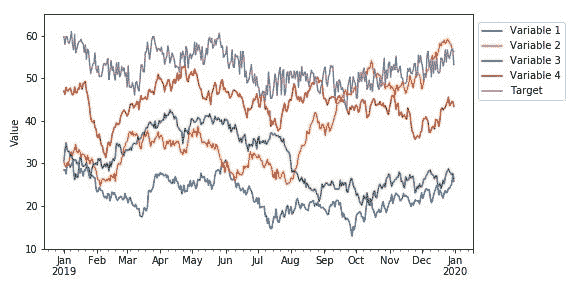
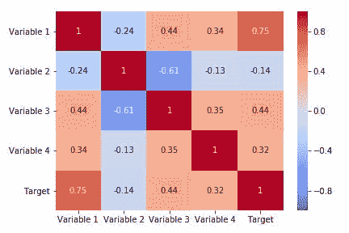
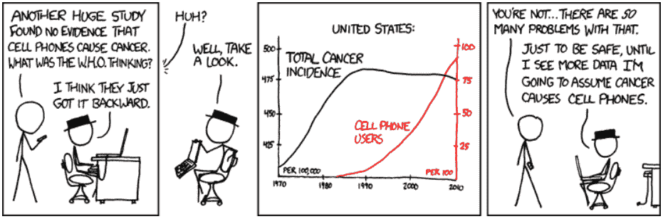
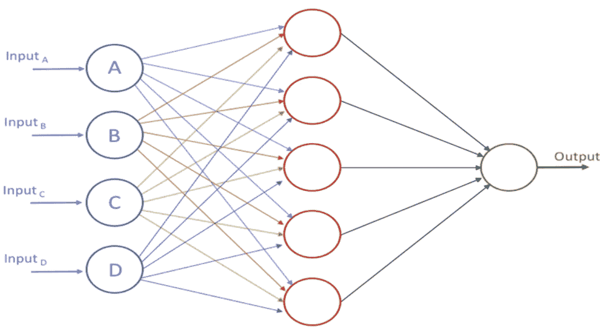
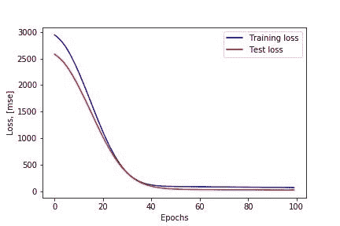
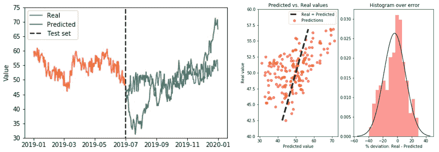
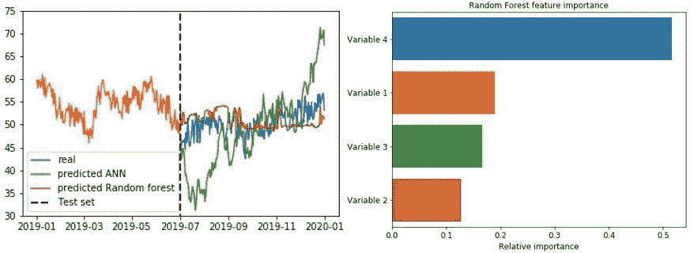
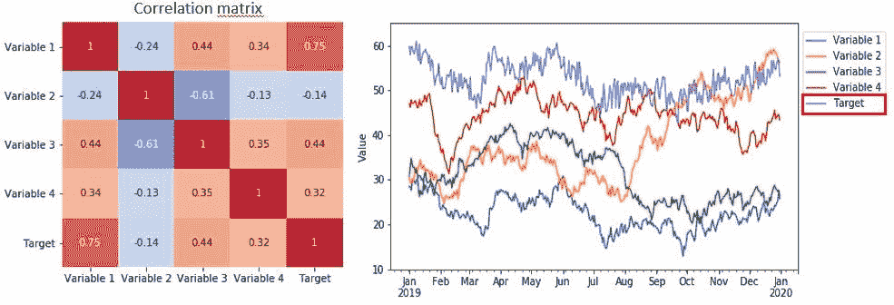
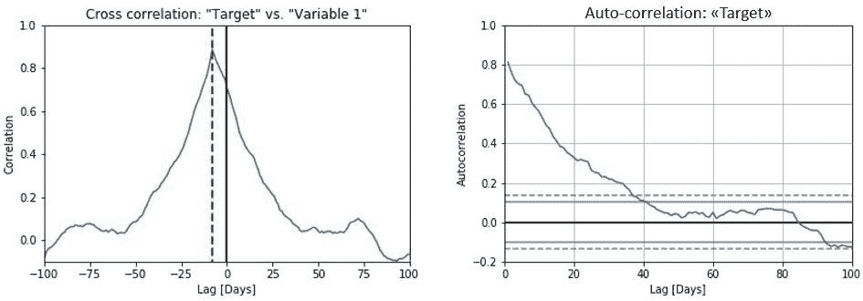

# 如何（不）使用机器学习进行时间序列预测：续集

> 原文：[`www.kdnuggets.com/2020/03/machine-learning-time-series-forecasting-sequel.html`](https://www.kdnuggets.com/2020/03/machine-learning-time-series-forecasting-sequel.html)

评论

**由 [Vegard Flovik](https://www.linkedin.com/in/vegard-flovik/)，数据科学家，Axbit AS**。

时间序列预测是机器学习的一个重要领域。之所以重要，是因为有许多预测问题涉及时间因素。然而，尽管时间因素增加了额外的信息，但它也使时间序列问题比许多其他预测任务更难处理。时间序列数据，顾名思义，与其他类型的数据不同，因为时间方面是重要的。好的一面是，这为我们在构建机器学习模型时提供了额外的信息——不仅输入特征包含有用的信息，还有输入/输出随时间的变化。

我之前关于同一主题的文章，[如何（不）使用机器学习进行时间序列预测](https://www.kdnuggets.com/2019/05/machine-learning-time-series-forecasting.html)，收到了很多反馈。基于此，我认为时间序列预测和机器学习对人们非常感兴趣，许多人也认识到我在文章中讨论的潜在陷阱。由于对这个主题的极大兴趣，我选择撰写了一篇后续文章，讨论一些与 [时间序列预测](https://en.wikipedia.org/wiki/Time_series)和机器学习相关的问题，并且如何避免一些常见的陷阱。

通过一个具体的例子，我将演示如何看似拥有一个良好的模型并决定将其投入生产，而实际上，该模型可能完全没有预测能力。重要的是，我会详细讨论一些这些问题，并说明如何在为时已晚之前发现它们。

### 示例案例：时间序列数据的预测

本案例中使用的示例数据如下面的图所示。我们稍后会更详细地回到数据，但现在假设这些数据代表，例如，股票指数的年度演变、产品的销售/需求、某些传感器数据或设备状态，或者其他与您的情况最相关的内容。现在的基本思路是，数据实际代表的内容并不会真正影响以下的分析和讨论。

从图中可以看到，我们共有 4 个“输入特征”或“输入变量”以及一个目标变量，即我们尝试预测的内容。类似情况下的基本假设是，我们模型的输入变量包含一些有用的信息，这些信息可以基于这些特征来预测目标变量（这可能是对的，也可能不是）。

### 相关性和因果性

在 [统计学](https://en.wikipedia.org/wiki/Statistics) 中，相关性或依赖性是任何统计关系，无论是否 [因果](https://en.wikipedia.org/wiki/Causality)。相关性很有用，因为它们可以指示一种可以在实践中利用的预测关系。例如，电力公司可能会根据电力需求与天气的相关性在温和的日子里减少发电。在这个例子中，存在一个 [因果关系](https://en.wikipedia.org/wiki/Causality)，因为极端天气导致人们使用更多的电力来取暖或制冷。然而，通常情况下，相关性的存在不足以推断因果关系的存在（即，[相关性不意味着因果性](https://en.wikipedia.org/wiki/Correlation_does_not_imply_causation)）。这是一个非常重要的区别，我们稍后会更详细地探讨这个问题。

为了检查我们的数据，我们可以计算相关矩阵，它表示数据集中所有变量之间的相关系数。在 [统计学](https://en.wikipedia.org/wiki/Statistics) 中，皮尔逊相关系数是衡量两个变量之间线性 [相关性](https://en.wikipedia.org/wiki/Correlation) 的一种度量。根据 [柯西-施瓦茨不等式](https://en.wikipedia.org/wiki/Cauchy%E2%80%93Schwarz_inequality)，它的值介于 +1 和 −1 之间，其中 1 表示完全正线性相关，0 表示没有线性相关，−1 表示完全负线性相关。

然而，虽然 **相关性** 是一回事，我们通常感兴趣的却是 **因果性**。传统格言 "[相关性不意味着因果性](https://en.wikipedia.org/wiki/Correlation_does_not_imply_causation)" 意味着相关性不能单独用来推断变量之间的因果关系（无论哪个方向）。

儿童的年龄与身高之间的相关性是相当因果透明的，但人们的情绪与健康之间的相关性则较少如此。改善情绪是否会导致健康改善，还是良好的健康会带来良好的情绪，或两者都有？或者是否有其他因素在两个方面都起作用？换句话说，相关性可以作为潜在因果关系的证据，但不能指示如果存在的话，因果关系可能是什么。

*(来源: [`xkcd.com/925/`](https://xkcd.com/925/))*

相关性和因果性的重大区别是构建基于机器学习的预测模型时面临的主要挑战之一。模型是基于我们希望能够代表我们试图预测的过程的数据进行训练的。模型利用输入变量与目标之间的任何特征模式/相关性来建立一种关系，从而进行新的预测。

在我们的情况下，从相关矩阵中，我们看到我们的目标变量确实与一些输入变量相关。然而，在我们的数据上训练模型时，这种明显的相关性可能仅仅是统计上的偶然，并且它们之间可能根本没有因果关系。不过，现在我们先忽略这一点，尝试建立我们的预测模型。我们稍后会更详细地讨论这些潜在的陷阱。

### 用于时间序列预测的机器学习模型

用于时间序列预测的模型有几种类型。在我之前的文章中，我使用了一种长短期记忆网络，简称 [LSTM 网络](https://en.wikipedia.org/wiki/Long_short-term_memory)。这是一种特殊的神经网络，根据之前的时间数据进行预测，即，它在模型结构中明确地内置了“记忆”概念。

然而，根据我的经验，在许多情况下，更简单类型的模型实际上能够提供同样准确的预测。因此，在这个例子中，我实现了一个基于 [前馈神经网络](https://en.wikipedia.org/wiki/Feedforward_neural_network) 的预测模型（如下所示），而不是 [递归神经网络](https://en.wikipedia.org/wiki/Recurrent_neural_network)。我还将预测结果与 [随机森林](https://en.wikipedia.org/wiki/Random_forest) 模型进行比较（这是我常用的模型之一，基于其简单性和通常良好的开箱即用性能）。

### 使用开源软件库实现模型

我通常使用 [Keras](https://keras.io/) 定义我的神经网络模型，Keras 是一个高级神经网络 API，使用 Python 编写，能够在 [TensorFlow](https://github.com/tensorflow/tensorflow)、 [CNTK](https://github.com/Microsoft/cntk) 或 [Theano](https://github.com/Theano/Theano) 之上运行。对于其他类型的模型（比如这次的随机森林模型），我通常使用 [Scikit-Learn](http://scikit-learn.org/stable/)，这是一个免费的机器学习库。它提供了各种 [分类](https://en.wikipedia.org/wiki/Statistical_classification)、 [回归](https://en.wikipedia.org/wiki/Regression_analysis) 和 [聚类](https://en.wikipedia.org/wiki/Cluster_analysis) 算法，并且设计为与 Python 数值和科学库 [NumPy](https://en.wikipedia.org/wiki/NumPy) 和 [SciPy](https://en.wikipedia.org/wiki/SciPy) 互操作。

本文的主要主题并不涉及如何实现时间序列预测模型的细节，而是如何评估预测结果。因此，我不会详细讨论模型构建等内容，因为还有很多其他博客文章和文章涉及这些主题。（不过，如果你对本例中使用的代码感兴趣，请在下面的评论中告诉我，我会与您分享代码）。

### 训练模型

在使用 Keras 设置神经网络模型后，我们将数据分为训练集和测试集。前 6 个月的数据用于训练，其余数据用作持出测试集。在模型训练过程中，10% 的数据用于验证，以跟踪模型的表现。然后可以从下面的训练曲线中可视化训练过程，其中绘制了训练损失和验证损失与周期的关系。从训练曲线来看，模型确实从数据中学到了一些有用的信息。训练损失和验证损失随着训练进度而减少，然后在大约 50 个周期后开始趋于平稳（没有明显的[过拟合/欠拟合](https://en.wikipedia.org/wiki/Overfitting)迹象）。到目前为止，一切顺利。

### 评估结果

现在让我们可视化模型预测与持出测试集中的真实数据的对比，以查看我们是否得到了一个良好的匹配。我们还可以在散点图中绘制真实值与预测值，并可视化误差分布，如右侧下方的图所示。

从上面的图中可以清楚地看到，我们的模型在比较真实值和预测值时并没有得到一个很好的匹配。我们的模型明明看似能够学习到有用的信息，但在持出测试集上的表现却如此糟糕，这可能是什么原因呢？

为了获得更好的比较，我们还将在相同的数据上实现一个[random forest model](https://en.wikipedia.org/wiki/Random_forest)，以查看是否能获得更好的结果。从左侧下方的图中可以看到，随机森林模型的表现并没有比神经网络模型好太多。然而，随机森林模型的一个有用特性是它还可以在训练过程中输出“特征重要性”，指示最重要的变量（根据模型）。这种特征重要性在许多情况下可以为我们提供有用的信息，这也是我们稍后会详细讨论的内容。

### 虚假相关性和因果关系

有趣的是，从上图中我们注意到，根据随机森林模型，变量 4 显然是最重要的输入变量。然而，从下方的相关矩阵和图表中，我们注意到与目标最强相关的变量是“变量 1”（其特征重要性排名第二）。实际上，如果你仔细查看下面绘制的变量，你可能会发现变量 1 和目标完全遵循相同的趋势。这是有意义的，正如我们在接下来的数据讨论中将显而易见的。

### 本例中数据的来源

随着我们接近完成文章，现在是揭示一些关于所用数据来源的额外细节的时候了。如果你阅读了我之前关于[时间序列预测中机器学习的陷阱](https://www.linkedin.com/pulse/how-use-machine-learning-time-series-forecasting-vegard-flovik-phd/)的文章，你可能已经意识到我对随机游走过程（以及[随机过程](https://en.wikipedia.org/wiki/Stochastic_process)）非常感兴趣。在本文中，我确实选择了类似的方法来处理虚假相关性和因果关系。

实际上，数据集中所有的变量（4 个输入变量和一个“目标”）都是通过随机游走过程生成的。我最初生成了 4 个随机游走者，为了得到目标变量，我只是对“变量 1”实施了 1 周的时间偏移（加上了一些随机噪声，以使其不易被一眼发现）。

因此，变量与目标之间当然没有因果关系。至于第一个变量，由于目标时间上比变量 1 提前了一周，目标变量的任何变化都会发生在变量 1 的相应变化**之前**。因此，唯一与目标变量的耦合是通过随机游走过程本身的固有[自相关](https://en.wikipedia.org/wiki/Autocorrelation)。

如果我们计算变量 1 与目标之间的互相关，可以很容易发现这种时间偏移，如下图左侧所示。在互相关中，7 天的时间偏移有一个明显的峰值。然而，从上面的相关矩阵和下面的图中，我们注意到，即使在零天的滞后下，目标与变量 1 之间也存在显著的相关性（精确地说，相关系数为 0.75）。然而，这种相关性仅仅是由于目标变量有一个缓慢衰减的自相关（比一周的时间偏移显著更长），如下图右侧所示。

### Granger 因果关系检验

如前所述，我们模型的输入变量与目标变量相关，但这并不意味着它们之间有因果关系。这些变量在尝试估计目标变量的后期阶段时实际上可能没有预测能力。然而，在建立数据驱动的预测模型时，混淆相关性和因果关系是一个容易陷入的陷阱。这就引出了一个重要的问题：我们可以做些什么来避免这种情况？

**格兰杰因果检验**是一种用于确定一个[时间序列](https://en.wikipedia.org/wiki/Time_series)是否对[预测](https://en.wikipedia.org/wiki/Forecasting)另一个[时间序列](https://en.wikipedia.org/wiki/Time_series)有用的[统计假设检验](https://en.wikipedia.org/wiki/Statistical_hypothesis_testing)。通常，[回归分析](https://en.wikipedia.org/wiki/Regression_analysis)反映的是“仅仅是”[相关性](https://en.wikipedia.org/wiki/Correlation)，但[克莱夫·格兰杰](https://en.wikipedia.org/wiki/Clive_Granger)认为可以通过测量使用另一个时间序列的先前值来预测时间序列的未来值，从而检验[因果关系](https://en.wikipedia.org/wiki/Causality)。如果能通过一系列的[t 检验](https://en.wikipedia.org/wiki/T-test)和[F 检验](https://en.wikipedia.org/wiki/F-test)（包括*Y*的滞后值）显示那些*X*值提供了关于*Y*未来值的[统计显著](https://en.wikipedia.org/wiki/Statistical_significance)信息，那么一个时间序列*X*就被称为格兰杰导致*Y*。

格兰杰基于两个原则定义了因果关系：

1.  **原因发生在结果之前。**

1.  **原因对其结果的未来值有独特的信息。**

当时间序列*X*对时间序列*Y*有格兰杰因果关系（如下所示），*X*中的模式会在经过一定时间滞后后大致重复出现在*Y*中（两个示例用箭头标出）。因此，*X*的过去值可以用于预测*Y*的未来值。

*[来源](https://en.wikipedia.org/wiki/Granger_causality).*

格兰杰因果关系的原始定义没有考虑到[潜在的混淆效应](https://en.wikipedia.org/wiki/Confounding)，也未能捕捉瞬时和非线性的因果关系。因此，进行格兰杰因果检验无法给出你输入变量和你尝试预测的目标之间是否存在因果关系的确切答案。然而，它确实值得关注，并且比仅仅依赖（可能虚假的）相关性提供了额外的信息。

### 非平稳时间序列的“危险”

大多数统计预测方法基于这样一种假设：通过数学变换，时间序列可以被近似地变为平稳（即，“平稳化”）。一个[平稳时间序列](https://www.otexts.org/fpp/8/1)是一个其统计特性，如[均值](https://en.wikipedia.org/wiki/Mean)、[方差](https://en.wikipedia.org/wiki/Variance)、[自相关](https://en.wikipedia.org/wiki/Autocorrelation)等，都在时间上保持不变的序列。一个基本的变换是对数据进行[时间差分](https://www.otexts.org/fpp/8/1)。

这种变换的作用是，相较于直接考虑数值，我们计算的是连续时间步骤之间的*difference*。定义模型来预测时间步骤之间的*difference*，而不是数值本身，是对模型预测能力的更强测试。在这种情况下，它不能仅仅利用数据的强自相关性，使用时间“*t*”的值作为“*t+*1”的预测。因此，它提供了对模型的更好测试，以及模型是否从训练阶段中学到了有用的东西，历史数据分析是否能实际帮助模型预测未来的变化。

### 总结

我希望通过这篇文章强调的主要点是，在处理时间序列数据时要非常小心。如上例所示，人们很容易被误导（在我之前的一篇关于[AI 和大数据的隐藏风险](https://www.kdnuggets.com/2019/09/risk-ai-big-data.html)的文章中也讨论过）。仅仅定义一个模型，做出一些预测，并计算常见的准确度指标，人们似乎就有了一个好的模型，并决定将其投入生产。然而，实际上，该模型可能根本没有预测能力。

随着高质量且易于使用的机器学习库和工具箱的出现，构建模型的实际编码部分变得相当简单。这一进展是好消息。它节省了我们大量的时间和精力，并且在实现过程中限制了编码错误的风险。在模型构建过程中节省下来的时间应该用来专注于提出正确的问题。在我看来，这是数据科学中最重要的方面之一。你如何正确验证模型预测？你的数据中是否存在任何隐藏的偏差可能会扭曲你的预测，或者是否有任何微妙的反馈循环可能会导致意外结果？

我想强调的最重要一点是，**始终**对数据告诉你的信息保持怀疑。提出关键问题，绝不要仓促下结论。科学方法应在数据科学中应用，就像在其他科学领域一样。

[原文](https://towardsdatascience.com/how-not-to-use-machine-learning-for-time-series-forecasting-the-sequel-e117e6ff55f1)。经许可转载。

**简介：** [Vegard Flovik](https://www.linkedin.com/in/vegard-flovik/) 是 Axbit AS 机器学习和高级分析领域的首席数据科学家。

**相关：**

+   [使用时间序列分析进行股票市场预测](https://www.kdnuggets.com/2020/01/stock-market-forecasting-time-series-analysis.html)

+   [数据科学家常犯的 10 个统计错误](https://www.kdnuggets.com/2019/06/statistics-mistakes-data-scientists.html)

+   [如何无痛分析你的时间序列](https://www.kdnuggets.com/2020/03/painlessly-analyze-time-series.html)

* * *

## 我们的前三大课程推荐

 1\. [Google 网络安全证书](https://www.kdnuggets.com/google-cybersecurity) - 快速进入网络安全职业生涯。

 2\. [Google 数据分析专业证书](https://www.kdnuggets.com/google-data-analytics) - 提升你的数据分析技能

 3\. [Google IT 支持专业证书](https://www.kdnuggets.com/google-itsupport) - 支持你的组织进行 IT

* * *

### 更多相关话题

+   [成为优秀数据科学家所需的 5 个关键技能](https://www.kdnuggets.com/2021/12/5-key-skills-needed-become-great-data-scientist.html)

+   [每个初学者数据科学家都应该掌握的 6 个预测模型](https://www.kdnuggets.com/2021/12/6-predictive-models-every-beginner-data-scientist-master.html)

+   [2021 年最佳 ETL 工具](https://www.kdnuggets.com/2021/12/mozart-best-etl-tools-2021.html)

+   [每位数据科学家都应该了解的三个 R 库（即使你使用 Python）](https://www.kdnuggets.com/2021/12/three-r-libraries-every-data-scientist-know-even-python.html)

+   [使用 Ploomber、Arima、Python 和 Slurm 进行时间序列预测](https://www.kdnuggets.com/2022/03/time-series-forecasting-ploomber-arima-python-slurm.html)

+   [使用 statsmodels 和 Prophet 进行时间序列预测](https://www.kdnuggets.com/2023/03/time-series-forecasting-statsmodels-prophet.html)
