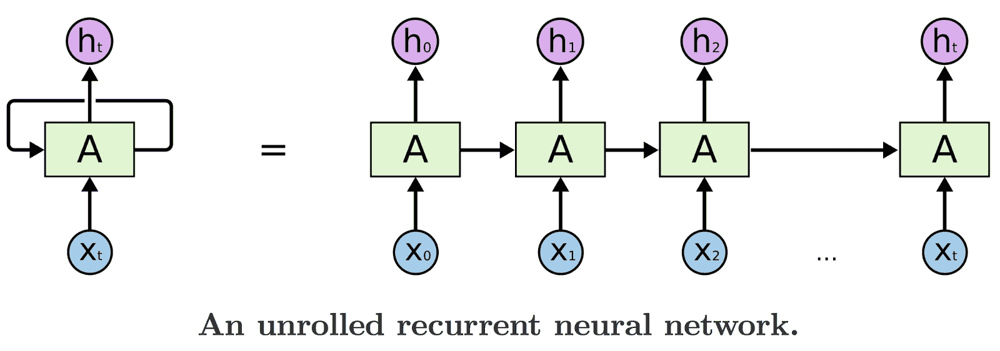
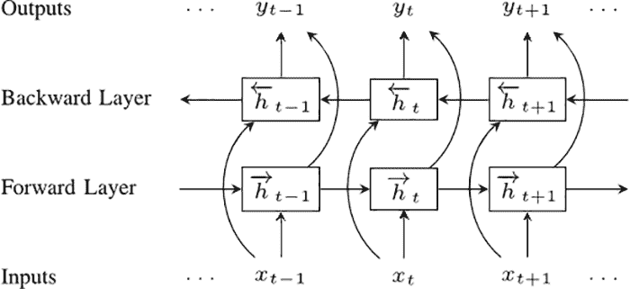
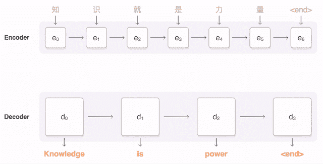
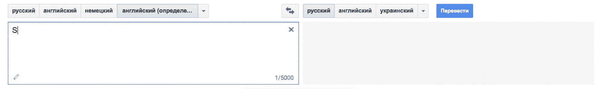

# 机器学习翻译与谷歌翻译算法

> 原文：[`www.kdnuggets.com/2017/09/machine-learning-translation-google-translate-algorithm.html`](https://www.kdnuggets.com/2017/09/machine-learning-translation-google-translate-algorithm.html)

**作者：达尼尔·科尔布特，[Statsbot](https://statsbot.co/)。**

[谷歌机器翻译](https://research.googleblog.com/2016/11/zero-shot-translation-with-googles.html)

* * *

## 我们的三大课程推荐

 1\. [谷歌网络安全证书](https://www.kdnuggets.com/google-cybersecurity) - 快速开启网络安全职业生涯。

 2\. [谷歌数据分析专业证书](https://www.kdnuggets.com/google-data-analytics) - 提升你的数据分析技能

 3\. [谷歌 IT 支持专业证书](https://www.kdnuggets.com/google-itsupport) - 支持你的组织的 IT 工作

* * *

每天我们使用不同的技术，却不知道它们具体是如何工作的。事实上，了解由机器学习驱动的引擎并不容易。 [Statsbot](http://statsbot.co/?utm_source=kdnuggets)团队希望通过在这篇博客中讲述数据故事来使机器学习变得清晰。今天，我们决定探讨机器翻译器，并解释谷歌翻译算法的工作原理。

多年前，将文本从未知语言翻译过来非常耗时。使用简单的词汇逐字翻译存在两个困难：1) 读者必须了解语法规则；2) 翻译整个句子时需要记住所有语言版本。

现在，我们不需要再费那么多劲了——我们可以通过将短语、句子甚至大型文本放入谷歌翻译来进行翻译。但大多数人实际上并不关心机器学习翻译引擎是如何工作的。这篇文章是给那些关心的人准备的。

### **深度学习翻译问题**

如果谷歌翻译引擎试图保持对即使是短句的翻译，这将不起作用，因为可能的变体数量巨大。最好的办法可能是教计算机一组语法规则，并根据这些规则翻译句子。只可惜这并不像听起来那么简单。

如果你曾经尝试学习一门外语，你就会知道总是有很多规则的例外。当我们试图在程序中捕捉所有这些规则、例外以及例外的例外时，翻译的质量会下降。

> *现代机器翻译系统使用不同的方法：通过分析大量文档来从文本中提取规则。*

创建你自己的简单机器翻译器将是[**任何数据科学简历中的一个伟大项目**](https://blog.statsbot.co/data-scientist-resume-projects-806a74388ae6?utm_source=kdnuggets)。

让我们试着深入探究我们称之为机器翻译器的“黑箱”中隐藏的内容。深度神经网络能够在非常复杂的任务（语音/视觉对象识别）中取得优异的结果，但尽管它们具有灵活性，它们只能应用于输入和目标具有固定维度的任务。

### **递归神经网络**

这时，长短期记忆网络（LSTMs）发挥作用，帮助我们处理长度无法先验确定的序列。

LSTMs 是一种特殊的递归神经网络（RNN），能够学习长期依赖关系。所有 RNN 看起来像是一个重复模块的链条。

[展开的递归神经网络](http://colah.github.io/posts/2015-08-Understanding-LSTMs/)

因此，LSTM 将数据从一个模块传递到另一个模块，例如，为了生成 Ht，我们不仅使用 Xt，还使用所有之前的输入值 X。要了解有关 LSTM 结构和数学模型的更多信息，可以阅读这篇精彩的文章“[理解 LSTM 网络](http://colah.github.io/posts/2015-08-Understanding-LSTMs/)”。

### **双向 RNNs**

我们的下一步是双向递归神经网络（BRNNs）。BRNN 的作用是将常规 RNN 的神经元分为两个方向。一个方向用于正时间，或前向状态。另一个方向用于负时间，或后向状态。这两个状态的输出与相反方向状态的输入不相连。

[双向递归神经网络](https://www.semanticscholar.org/paper/Hybrid-speech-recognition-with-Deep-Bidirectional-Graves-Jaitly/5807664af8e63d5207f59fb263c9e7bd3673be79)

为了理解为什么 BRNNs 比简单 RNN 效果更好，想象一下我们有一个 9 个单词的句子，我们想预测第 5 个单词。我们可以让它知道前 4 个单词，或者前 4 个单词和最后 4 个单词。当然，第二种情况的质量会更好。

### **序列到序列**

现在我们准备转向序列到序列模型（也称为 seq2seq）。基本的 seq2seq 模型由两个 RNN 组成：一个编码器网络处理输入，一个解码器网络生成输出。

[序列到序列模型](https://research.googleblog.com/2016/09/a-neural-network-for-machine.html)

最终，我们可以制作我们的第一个机器翻译器！

不过，让我们考虑一个技巧。Google 翻译[目前支持 103 种语言](https://www.newscientist.com/article/2114748-google-translate-ai-invents-its-own-language-to-translate-with/)，因此我们应该有 103x102 个不同的模型来处理每对语言。显然，这些模型的质量会根据语言的流行程度和训练网络所需的文档量而有所不同。我们能做的最好的是制作一个神经网络，接受任何语言作为输入并翻译成任何语言。

### **Google 翻译**

这个想法在 2016 年底由 Google 工程师 [实现](https://research.googleblog.com/2016/09/a-neural-network-for-machine.html)。NN 的架构基于 seq2seq 模型，这是我们已经研究过的。

唯一的例外是，在编码器和解码器之间有 8 层 LSTM-RNN，这些层之间有残差连接，并进行了一些调整以提高准确性和速度。如果你想深入了解，可以查看文章 [Google 的神经机器翻译系统](https://arxiv.org/abs/1609.08144)。

> 这个方法的主要优点是，现在 Google 翻译算法只使用一个系统，而不是每对语言使用一整套系统。

系统需要在输入句子的开头指定一个“标记”，以说明你尝试将短语翻译成的语言。

这提高了翻译质量，并使得即使在系统尚未见过的两种语言之间进行翻译也成为可能，这种方法被称为“零样本翻译”。

### **什么是更好的翻译？**

当我们谈论 Google 翻译算法的改进和更好的结果时，我们如何正确评估第一个候选翻译是否优于第二个？

这不是一个简单的问题，因为对于一些常用的句子，我们拥有来自专业翻译人员的参考翻译集，这些翻译集之间自然会有一些差异。

有很多方法部分解决了这个问题，但最流行和有效的指标是 [BLEU](https://en.wikipedia.org/wiki/BLEU) （双语评价理解）。想象一下，我们有两个来自机器翻译的候选翻译：

> 候选 1：Statsbot 使公司可以通过自然语言轻松地紧密监控来自各种分析平台的数据。
> 
> 候选 2：Statsbot 使用自然语言准确分析来自不同分析平台的业务指标。

尽管它们具有相同的含义，但在质量和结构上存在差异。

让我们看看两个人工翻译：

> 参考文献 1：Statsbot 帮助公司通过自然语言紧密监控来自不同分析平台的数据。
> 
> 参考文献 2：Statsbot 允许公司通过自然语言仔细监控来自各种分析平台的数据。

显然，候选 1 更好，相比候选 2 分享了更多的单词和短语。这是简单 BLEU 方法的关键思想。我们可以比较候选翻译与参考翻译的[n-grams](https://en.wikipedia.org/wiki/N-gram)，并计算匹配的数量（与它们的位置无关）。我们只使用 n-gram 精确度，因为计算召回率在有多个参考的情况下很困难，结果是 n-gram 分数的几何平均值。

现在你可以评估复杂的机器学习翻译引擎。下次当你用 Google 翻译翻译某些内容时，想象一下它分析了多少百万份文档才为你提供了最佳的语言版本。

**简介：[丹尼尔·科尔布特](https://medium.com/@daniilkorbut)** 是[Statsbot](https://statsbot.co/)的初级数据科学家。

[原文](https://blog.statsbot.co/machine-learning-translation-96f0ed8f19e4)。经许可转载。

**相关：**

+   深度学习和 NLP 中的注意力与记忆

+   Top /r/MachineLearning 帖子，5 月：深度图像类比；风格化面部动画；Google 开源 Sketch-RNN

+   5 个免费的自然语言处理深度学习入门资源

### 更多相关主题

+   [OpenAI 的 Whisper API 用于转录和翻译](https://www.kdnuggets.com/2023/06/openai-whisper-api-transcription-translation.html)

+   [如何使用 MarianMT 和 Hugging Face Transformers 翻译语言](https://www.kdnuggets.com/how-to-translate-languages-with-marianmt-and-hugging-face-transformers)

+   [用 AI 阅读思想：研究人员将脑电波转换为图像](https://www.kdnuggets.com/2023/03/reading-minds-ai-researchers-translate-brain-waves-images.html)

+   [将机器学习算法完整部署到…](https://www.kdnuggets.com/2021/12/deployment-machine-learning-algorithm-live-production-environment.html)

+   [揭开选择完美机器学习算法的秘密！](https://www.kdnuggets.com/2023/07/ml-algorithm-choose.html)

+   [机器学习中的 DBSCAN 聚类算法](https://www.kdnuggets.com/2020/04/dbscan-clustering-algorithm-machine-learning.html)
