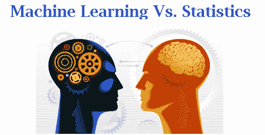
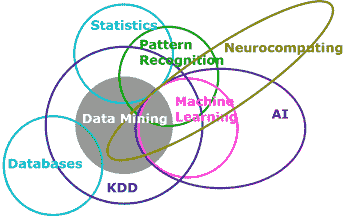

# 机器学习与统计学

> 原文：[`www.kdnuggets.com/2016/11/machine-learning-vs-statistics.html`](https://www.kdnuggets.com/2016/11/machine-learning-vs-statistics.html)

**[Edvancer Eduventures](http://www.edvancer.in/) 的首席执行官 Aatash Shah。**

许多人对统计学和机器学习之间的区别感到疑惑。机器学习与统计学之间真的存在差异吗？

从传统的数据分析角度来看，以上问题的答案很简单。

+   *机器学习是* *一种能够从数据中学习的算法，无需依赖基于规则的编程。*

+   *统计建模是* *一种**通过数学方程形式来形式化数据中变量之间关系的方法。***

机器学习主要涉及预测、监督学习、无监督学习等。

统计学涉及样本、总体、假设等。

两种不同的生物，对吧？那么，让我们看看它们是否真的那么不同！

### 机器学习和统计学有相同的目标

根据拉里·瓦瑟曼的说法：

> 它们都关注同一个问题：我们如何从数据中学习？

在他的[博客](http://normaldeviate.wordpress.com/2012/06/12/statistics-versus-machine-learning-5-2/http:/normaldeviate.wordpress.com/2012/06/12/statistics-versus-machine-learning-5-2/)中，他指出在这两个领域中，相同的概念有不同的名称：

| 统计学 | 机器学习 |
| --- | --- |
| 估计 | 学习 |
| 分类器 | 假设 |
| 数据点 | 示例/实例 |
| 回归 | 监督学习 |
| 分类 | 监督学习 |
| 协变量 | 特征 |
| 响应 | 标签 |

统计学家及斯坦福大学的机器学习专家**罗伯特·提布希拉尼**称机器学习为“[被美化的统计学](http://statweb.stanford.edu/~tibs/stat315a/glossary.pdf)。”

现在，无论是机器学习还是统计学技术都用于模式识别、知识发现和数据挖掘。尽管下图可能将它们显示为几乎互不相交，但这两个领域正越来越趋于融合。

*来源： [SAS Institute](http://blogs.sas.com/content/subconsciousmusings/2014/08/22/looking-backwards-looking-forwards-sas-data-mining-and-machine-learning/) - 一个展示机器学习和统计学关系的维恩图*

机器学习和统计学的共同目标是**从数据中学习**。这两种方法都专注于从数据中提取知识或洞见，但它们的方法受其固有文化差异的影响。

**它们确实相关，但它们的“父母”不同。**

[机器学习](https://en.wikipedia.org/wiki/Machine_learning) 是计算机科学和人工智能的一个子领域。它涉及构建能够从数据中学习的系统，而不是明确编程指令。

一个 [统计模型](https://en.wikipedia.org/wiki/Statistical_model)，另一方面，是数学的一个子领域。

机器学习是一个相对较新的领域。

便宜的计算能力和大量数据的可用性使数据科学家能够通过分析数据来训练计算机学习。但统计建模早在计算机发明之前就已存在。

### 机器学习与统计学之间的方法论差异

两者之间的区别在于，机器学习强调优化和性能，而统计学则关注推断。

这就是统计学家和机器学习从业者对同一模型结果的描述方式：

+   *机器学习专业人士：“在给定 a、b 和 c 的情况下，模型预测 Y 的准确率为 85%。”*

+   *统计学家：“在给定 a、b 和 c 的情况下，模型预测 Y 的准确率为 85%；我有 90%的把握你会得到相同的结果。”*

机器学习不需要对变量之间的基本关系做出先验假设。你只需将所有数据输入，算法会处理数据并发现模式，利用这些模式可以对新数据集进行预测。机器学习将算法视为一个黑匣子，只要它有效。它通常应用于 [高维数据集](https://www.researchgate.net/post/What_are_some_examples_of_high-dimensional_data)，数据越多，预测越准确。

相比之下，统计学家必须理解数据的收集方式、估计量的统计性质（p 值、无偏估计量）、他们研究的总体的基本分布以及如果多次进行实验你会期望得到的属性。你需要准确知道自己在做什么，并制定出提供预测能力的参数。统计建模技术通常应用于低维数据集。

### 结论

机器学习和统计建模可能看起来像是预测建模的两个不同分支。过去十年这两者之间的差异已经显著减少。这两个领域相互学习了很多，并将继续在未来更加接近。

但理解关联和了解它们之间的差异使机器学习者和统计学家能够扩展他们的知识，甚至将方法应用到他们专业领域之外。这就是“数据科学”的概念，旨在弥合差距。两个数据驱动领域之间的合作和沟通使我们能够做出更好的决策，最终将积极影响我们的生活方式。

在我们的 **[认证商业分析专业课程](http://www.edvancer.in/course/cbap/)** 中，你可以学习一些基于统计学的机器学习技术。

**简介：[Aatash Shah](http://www.edvancer.in/user/admin-2/)** 是 Edvancer Eduventures 的联合创始人兼首席执行官。在创办 Edvancer 之前，他在投资银行行业有超过 6 年的经验。

[原文](http://www.edvancer.in/machine-learning-vs-statistics/)。转载经许可。

**相关：**

+   数据科学基础：数据挖掘与统计学

+   数据科学基础：初学者的 3 个见解

+   数据科学与大数据，解释

* * *

## 我们的 3 个课程推荐

 1\. [Google 网络安全证书](https://www.kdnuggets.com/google-cybersecurity) - 快速进入网络安全职业轨道。

 2\. [Google 数据分析专业证书](https://www.kdnuggets.com/google-data-analytics) - 提升你的数据分析水平

 3\. [Google IT 支持专业证书](https://www.kdnuggets.com/google-itsupport) - 支持你的组织在 IT 方面

* * *

### 更多相关话题

+   [成为优秀数据科学家所需的 5 项关键技能](https://www.kdnuggets.com/2021/12/5-key-skills-needed-become-great-data-scientist.html)

+   [每个初学者数据科学家应该掌握的 6 种预测模型](https://www.kdnuggets.com/2021/12/6-predictive-models-every-beginner-data-scientist-master.html)

+   [2021 年最佳 ETL 工具](https://www.kdnuggets.com/2021/12/mozart-best-etl-tools-2021.html)

+   [学习数据科学统计的最佳资源](https://www.kdnuggets.com/2021/12/springboard-top-resources-learn-data-science-statistics.html)

+   [停止学习数据科学来寻找目标，寻找目标来…](https://www.kdnuggets.com/2021/12/stop-learning-data-science-find-purpose.html)

+   [建立一个坚实的数据团队](https://www.kdnuggets.com/2021/12/build-solid-data-team.html)
