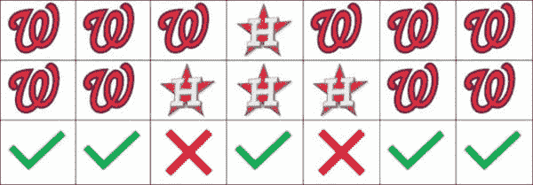
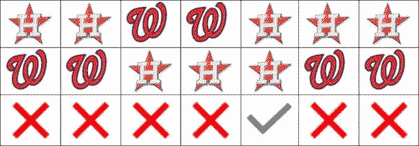
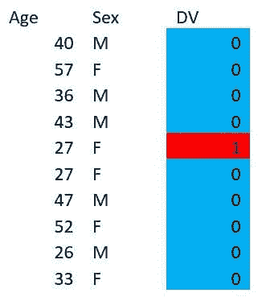
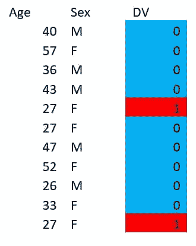
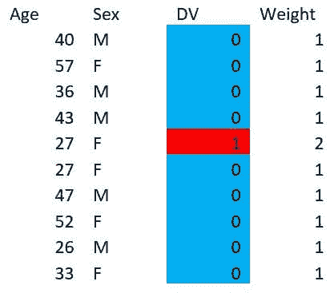
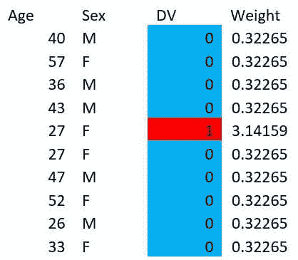
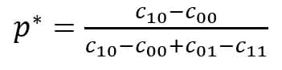
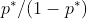
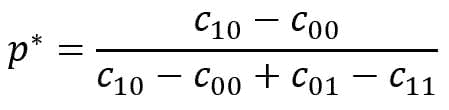

# 机器学习 101：权重的定义、目的和方法

> 原文：[`www.kdnuggets.com/2019/11/machine-learning-what-why-how-weighting.html`](https://www.kdnuggets.com/2019/11/machine-learning-what-why-how-weighting.html)

评论

**作者 [Eric Hart](https://www.linkedin.com/in/erichart07)，Altair**。

### 介绍

* * *

## 我们的三大课程推荐

 1\. [谷歌网络安全证书](https://www.kdnuggets.com/google-cybersecurity) - 快速进入网络安全职业生涯。

 2\. [谷歌数据分析专业证书](https://www.kdnuggets.com/google-data-analytics) - 提升你的数据分析技能

 3\. [谷歌 IT 支持专业证书](https://www.kdnuggets.com/google-itsupport) - 支持你的组织的 IT

* * *

我经常被问到关于权重的事情。它是什么？我怎么做？我需要注意什么？根据大家的需求，我最近在公司举办了一次午餐学习活动，旨在解答这些问题。目标是适用于广大受众（例如，进行温和的介绍），同时也提供一些良好的技术建议/细节以帮助从业者。这个博客是从那次演讲中改编而来的。

### 模型基础

在讨论权重之前，我们需要对模型是什么、它们的用途以及建模过程中常见的一些问题有一个共同的认识。模型基本上是人类用来以严谨的方式（过度）简化现实世界的工具。通常，它们表现为方程式或规则集，通常尝试捕捉数据中的模式。人们通常将模型分为两个高层次的类别（是的，也可能有重叠）：推断和预测。推断意味着尝试使用模型来帮助理解世界。想象一下科学家从数据中揭示物理真相。预测则意味着尝试对未来发生的事情进行猜测。在接下来的讨论中，我们将重点关注以预测为目的构建的模型。

如果你正在建立一个模型来进行预测，你需要一种衡量该模型预测效果的方法。一个好的起点是准确率。模型的准确率只是它的预测结果中正确的百分比。这可以是一个有用的指标，实际上它也是许多自动训练模型工具的默认指标，但它确实有一些缺点。例如，准确率不关心模型认为每个预测的*可能性*（与猜测相关的概率）。准确率也不关心模型做出的预测（例如，如果它在决定正面事件或负面事件，准确率不会优先考虑其中一个）。准确率也不关心准确率测量的记录集与模型应该适用的实际人群之间的差异。这些可能是重要的。

让我们来看一个例子。最近，2019 年世界大赛结束了。我将对比一些关于那个世界大赛的预测。剧透警告：我将告诉你谁赢得了世界大赛。

2019 年世界大赛是在华盛顿国民队和休斯顿太空人队之间进行的

我们来调查一些模型。我脑海中有一个内部模型，我不会解释。它给出了该系列赛 7 场比赛的这些预测：

显然，我对国民队的期望很高。与此同时，我最喜欢的网站之一，FiveThirtyEight，有一个先进的统计模型，用于[预测比赛](https://projects.fivethirtyeight.com/2019-mlb-predictions/games/)。它给出了这些预测：

值得注意的是：这些是单场比赛的预测，提前做出，如果比赛真的会发生；这些预测不是针对整个系列赛的。由于系列赛是七场四胜制，一旦一个队赢得 4 场比赛，将不再进行更多比赛，因此显然上述两组预测都不会完全如预期发生。

这些预测是基于团队实力、主场优势和每场比赛首发投手的具体情况。FiveThirtyEight 的模型预测主队会赢得每场比赛，除了第 5 场比赛，当时休斯顿最好的投手，杰里特·科尔，正在华盛顿投球。

无论如何，让我们揭示系列赛的结果，看看发生了什么，并比较准确率。这里是实际结果：

系列赛进行了 7 场比赛，华盛顿赢得了前两场和最后两场。（顺便提一下，在这个系列赛中，客队赢得了每一场比赛，这在这个或其他任何主要的北美职业运动中从未发生过。）

那么，我们来看看我们每个人的表现：

我的结果：

我正确预测了 7 场比赛中的 5 场，准确率为 0.71

FiveThirtyEight 的结果：

FiveThirtyEight 只预测对了 1 场比赛，准确率为 0.14。

因此，你可能会被诱导认为我的模型比 FiveThirtyEight 的更好，或者至少在这种情况下表现更好。但预测并不是全部。FiveThirtyEight 的模型不仅有预测，还有有用的概率，建议 FiveThirtyEight 认为每个队伍赢的可能性。在这种情况下，这些概率是这样的：

同时，我是那个总是确信自己对一切都正确的讨厌鬼。你们都知道这种人。我的概率看起来是这样的。

记住这一点，尽管我的准确率更高，你可能需要重新考虑你更喜欢哪个模型。

讨论这一点很重要，因为我们将很快再次谈论准确性，同时解决某些模型的缺陷。重要的是要记住，准确性可以是一个有用的指标，但它并不总是提供完整的情况。还有其他工具可以衡量模型的质量，这些工具关注诸如概率等更微妙的概念，而不仅仅是预测。我喜欢使用的一些例子是提升图、ROC 曲线和精准度-召回曲线。这些都是选择好模型的好工具，但单独使用任何一个都不是万无一失的。此外，这些工具更具可视化性质，通常，机器学习算法需要一个单一的数值，因此准确性常常被作为许多算法的默认选择，即使这对某些外部目标有害。

### 权重的意义

请考虑以下数据表：

假设你想建立一个只用年龄和性别来预测‘DV’的模型。因为只有一个例子 DV=1，你可能会很难预测这个值。如果这是一个关于信用贷款的数据集，而 DV 是某人是否会违约（1 表示违约），你可能更关心 DV=1 的案例，而不是 DV=0 的案例。花一点时间看看你是否能提出一个好的模型（例如一些规则）来预测这个数据集中的 DV=1。（剧透，你不可能得到 100%的准确率）。

这里是一些可能的例子：

1.  仅拦截模型

    +   总是预测 0

    +   准确率 = 0.9

1.  27 岁

    +   对 27 岁的人预测 DV=1，其余预测 0

    +   准确率 = 0.9

1.  年轻女性

    +   对于 30 岁以下的女性预测 DV=1，其余预测 0

    +   准确率 = 0.9

所有这些模型的准确率相同，但其中一些在某些用例中可能更有用。如果你要求决策树或逻辑回归算法在这些数据集上建立模型，它们默认都会给你模型#1。这些模型不知道你可能更关心 DV=1 的案例。那么，我们如何让 DV=1 的案例对模型更重要呢？

想法 #1：过采样：复制现有的稀有事件记录，保持常见事件记录不变。

想法 #2：欠采样：移除一些常见事件记录，保留所有稀有事件记录。

在这两种情况下，我们都使用了与自然数据不同的人群来训练模型，目的在于影响我们将要构建的模型。

权重类似于这样，但不是复制或删除记录，而是将不同的权重分配给每条记录作为单独的列。例如，不是这样做：

我们可以这样做：

你可能会合理地问，机器学习算法是否可以以这种方式处理加权数据，但一个合理的回答是：“是的，没问题，不用担心。”

实际上，我们甚至不需要给出整数权重。你可以像这样做：

但现在，让我们坚持使用整数权重。假设你想在上述加权数据集上构建你的模型：

然后如果我们回顾之前讨论的可能模型，我们会看到：

1.  仅拦截模型

    +   加权准确率（用于训练模型）：0.82

    +   实际准确率 = 0.9

1.  27 岁

    +   加权准确率（用于训练模型）：0.91

    +   实际准确率 = 0.9

1.  年轻女性

    +   加权准确率（用于训练模型）：0.91

    +   实际准确率 = 0.9

通过加权，虽然我们没有改变实际准确率，但我们改变了加权准确率，这会使得在训练时，第一个选项不如后两个选项理想。实际上，如果你在这个加权表上构建模型，决策树自然会找到第二个模型，而逻辑回归自然会找到第三个模型。

关于加权，我常常遇到一个问题：在模型训练之后你如何处理这些权重？你是否需要在验证或部署过程中应用这些权重？答案是否定的！加权的目的是影响你的模型，而不是影响现实世界。一旦你的模型训练完成，权重就不再需要（或有用）。

### 加权的原因

在上一节中，我们对为什么可能想使用加权来影响模型选择有了一个模糊的了解，但让我们更深入地探讨一下。

你可能想使用加权的一个原因是如果你的训练数据不是你计划应用模型的数据的代表性样本。民意测验者经常遇到这个问题。有趣的事实是：用一个真正随机的 2500 人样本，民意测验者可以在+/- 1%范围内预测选举结果。问题是如何获得一个真正的随机样本。这很困难，因此民意测验者通常对不同的投票者应用权重，使样本人口统计更接近预期的投票人口统计。2016 年有一个很棒的故事，讲述了一个人如何强烈地扭曲了整个民意测验。你可以[在这里](https://www.nytimes.com/2016/10/13/upshot/how-one-19-year-old-illinois-man-is-distorting-national-polling-averages.html)阅读。

这是我听到的另一个你可能想使用加权的常见理由：

1.  欺诈很少见

1.  需要增加稀有案例的权重

1.  这样模型整体表现会更好

这个常见的论点被证明是错误的。一般来说，加权会使模型整体表现更差，但在某些人群中表现更好。在欺诈的情况下，上述论点的遗漏之处在于，未能捕捉到欺诈通常比错误标记非欺诈交易的成本更高。

我们真正想讨论的作为加权的一个好理由是成本敏感分类。一些例子：

+   在欺诈检测中，假阴性往往比假阳性更昂贵

+   在信用贷款中，违约往往比被拒绝的不会违约的贷款更昂贵

+   在预防性维护中，部件故障通常比过早维护更昂贵

所有这些仅在合理范围内才成立。你不能走到极端，因为将每个交易标记为欺诈、拒绝所有贷款申请或花费所有时间维修系统而不是使用它们显然都是糟糕的商业决策。但关键是，某些类型的错误分类比其他类型的错误分类更昂贵，因此我们可能希望影响我们的模型，使其做出更多错误的决定，但整体上仍然更便宜。使用加权是一种合理的工具来解决这个问题。

### 加权的方法

*提前说明：本节的许多有用信息来自[同一篇论文](http://web.cs.iastate.edu/~honavar/elkan.pdf)。*

这引出了一个重要的问题：你如何加权？使用大多数现代数据科学软件，你只需使用计算机魔法，权重就会被处理好。

但当然，还有重要的决策要做。你应该过采样还是欠采样，还是仅仅使用加权？你应该使用像 SMOTE 或 ROSE 这样的高级包吗？你应该选择什么权重？

好消息是：我要告诉你最优的做法。但当然，由于我是数据科学家，我会先给你很多警告：

1.  这种方法仅对成本敏感的分类问题（例如，你对预测结果有不同的成本）是“最佳”的。我不会在这里帮助民调机构（抱歉）。

1.  这种方法假设你知道与你的问题相关的成本，并且这些成本是固定的。如果真实成本未知或可变，这会变得更加困难。

在我们深入公式之前，先谈谈你可能会陷入的基准/参考错误的一个小陷阱。这是来自[Statlog 项目](https://archive.ics.uci.edu/ml/datasets/Statlog+%28German+Credit+Data%29)的德国信用数据集的一个典型成本矩阵示例。

|  | 实际坏 | 实际好 |
| --- | --- | --- |
| 预测坏 | 0 | 1 |
| 预测好 | 5 | 0 |

如果你看几分钟，这个来源的理由就会变得清晰。这意味着如果你错误分类了一个会违约的人并给他们贷款，你会损失$5，但如果你错误分类了一个不会违约的人而不给他们信用，你会失去赚取$1 的机会，这本身也是一种成本。

但这里似乎有些问题。如果目的是当你预测坏时不延长某人的信用，那么预测坏所关联的成本应当是相同的，无论实际情况如何。事实上，这个成本矩阵可能应该是这样的：

|  | 实际坏 | 实际好 |
| --- | --- | --- |
| 预测坏 | 0 | 0 |
| 预测好 | 5 | -1 |

其中对一个实际会偿还贷款的人预测好会有负成本（或收益）。虽然这两个成本矩阵类似，但不能互换。如果你想象一下每种类型一个客户的情况，第一个矩阵建议你的总成本是$6，而第二个矩阵建议你的总成本是$4。第二个显然是这里的意图。因此，将矩阵以收益而非成本的形式呈现通常是有益的。尽管如此，我还是将以成本的形式给出公式，留给读者自己将其转化为收益公式。

所以，假设你有一个看起来像这样的成本矩阵：

|  | 实际负面 | 实际正面 |
| --- | --- | --- |
| 预测负 | C[00] | C[01] |
| 预测积极 | C[10] | C[11] |

首先，我们将陈述两个合理性标准：

+   C[10] > C[00]

+   C[01] > C[11]

这些标准基本上表明，如果你错误分类某个事物的成本会高于你不分类的成本。合理，对吧？

现在定义：

那么你应该通过加重你的负面样本的权重（并保持你的正面样本不变）。

实际上，我们甚至可以更进一步。许多机器学习模型生成的是概率（而不是仅仅预测），然后使用阈值将该概率转换为预测。换句话说，你有一些规则，比如：如果正例的概率大于 0.5，则预测为正例，否则预测为负例。但你可以有另一种规则，例如，如果正例的概率大于 0.75，则预测为正例，否则预测为负例。这里的数字（上面例子中的 0.5 或 0.75）称为“阈值”。稍后会有更多相关内容，但现在，我们可以写下一个公式，说明如何让具有阈值 p[0] 的模型表现得像具有阈值 p^* 一样，我们可以通过上调负例的权重来实现：

注意，在 p[0] 为 0.5 的特殊情况下（这很典型），这将简化为之前的公式。

再次值得注意的是，变动成本的情况要困难得多。如果你使用决策树，一些平滑处理是个好主意，但一般来说，这里不便详细讨论。你可以查看[这篇论文](http://cseweb.ucsd.edu/~elkan/kddbianca.pdf)以获取一些想法。

### 权重调整的理由

权重调整有点像是为了更好地决策而假装生活在幻想世界中。你可以直接做出更好的决策，而不需要假装部分。

让我们回到上一节讨论阈值的内容。与其使用权重让一个具有某一阈值的机器学习模型表现得像具有不同阈值一样，你可以直接更改该模型的阈值。这可能（假设）会导致模型校准不佳，但它仍可能是一个好的商业决策，因为它可能减少成本。

实际上，如果你回到之前考虑的成本矩阵，

|  | 实际负例 | 实际正例 |
| --- | --- | --- |
| 预测为负例 | C[00] | C[01] |
| 预测为正例 | C[10] | C[11] |

为了最小化成本，做出决策的最佳阈值恰好是 p^*

这通常更简单，实证证据表明，直接调整阈值比权重调整[在实践中](http://web.cs.iastate.edu/~honavar/elkan.pdf)效果稍好。

所以，总的来说，经过这些关于权重的讨论，我的建议是，如果可能的话，尽量不要使用权重，而是调整你的阈值！但当然，许多想法是重叠的，所以希望这次讨论仍然有用。

另外，最后一个提示：如果你不担心成本敏感的分类问题（例如，你有不同的预测和 DV 情况相关的不同成本），你可能不应该考虑使用权重作为工具。除非你是一个民意调查员。

**个人简介：** [埃里克·哈特博士](https://www.linkedin.com/in/erichart07) 是 Altair 服务团队的高级数据科学家。他拥有工程和数学背景，喜欢运用自己的问题解决技巧来应对有趣的数据挑战。他还是 Blokus 世界冠军。

**相关：**

+   [如何平衡五个分析维度](https://www.kdnuggets.com/2015/09/how-balance-five-analytic-dimensions.html)

+   [如何修复不平衡的数据集](https://www.kdnuggets.com/2019/05/fix-unbalanced-dataset.html)

+   [比较机器学习模型：统计意义与实际意义](https://www.kdnuggets.com/2019/01/comparing-machine-learning-models-statistical-vs-practical-significance.html)

### 更多相关内容

+   [数据科学家的线性编程基础](https://www.kdnuggets.com/2023/02/linear-programming-101-data-scientists.html)

+   [LangChain 基础：构建你自己的 GPT 驱动应用](https://www.kdnuggets.com/2023/04/langchain-101-build-gptpowered-applications.html)

+   [提示工程基础：掌握有效的 LLM 沟通](https://www.kdnuggets.com/prompt-engineering-101-mastering-effective-llm-communication)

+   [机器学习算法 - 什么，为什么，以及如何？](https://www.kdnuggets.com/2022/09/machine-learning-algorithms.html)

+   [为什么机器学习模型在沉默中消亡？](https://www.kdnuggets.com/2022/01/machine-learning-models-die-silence.html)

+   [机器学习没有为我的业务带来价值。为什么？](https://www.kdnuggets.com/2021/12/machine-learning-produce-value-business.html)
