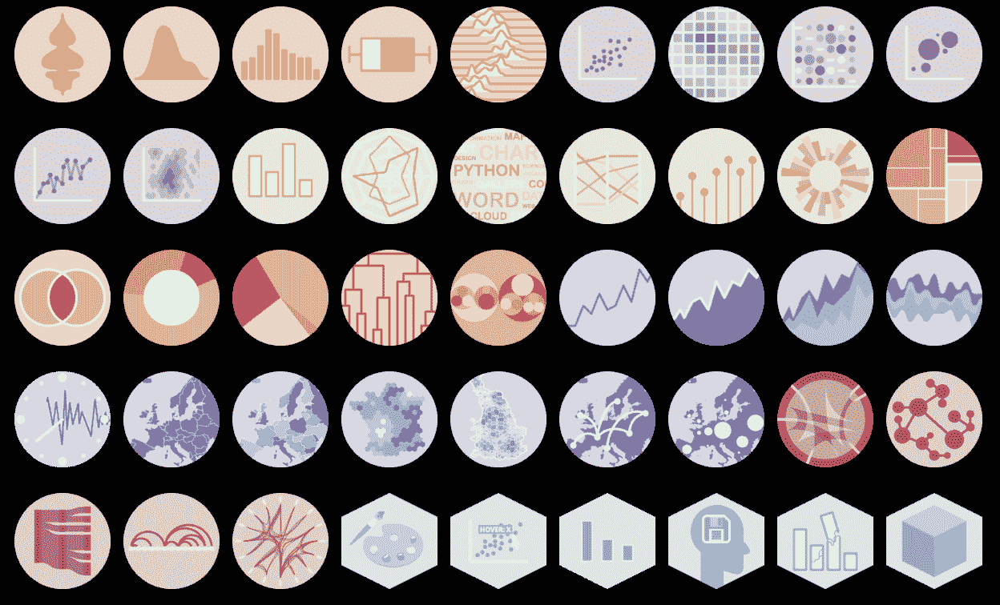
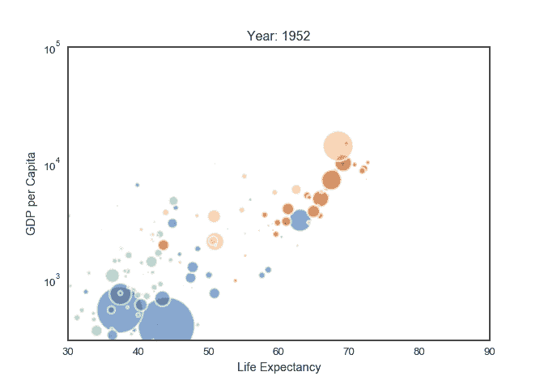
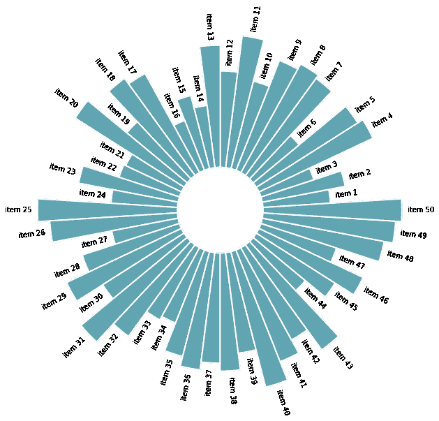
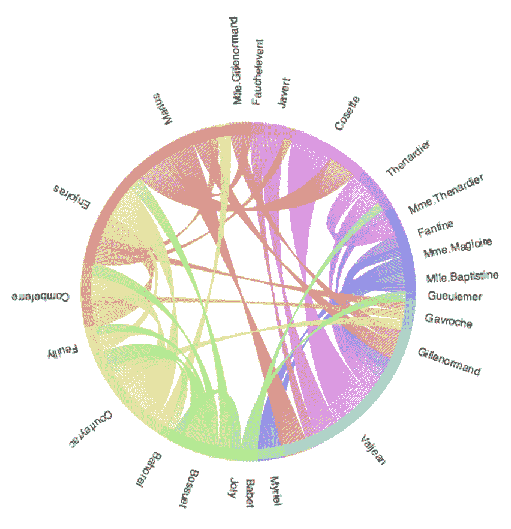
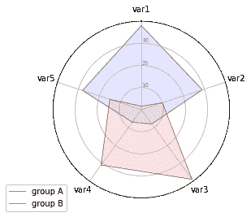

# 用 Python 图表画廊制作惊人的可视化

> 原文：[`www.kdnuggets.com/2022/12/make-amazing-visualizations-python-graph-gallery.html`](https://www.kdnuggets.com/2022/12/make-amazing-visualizations-python-graph-gallery.html)

截图来自 [Python 图表画廊](https://www.python-graph-gallery.com/)

如果你希望让你的数据更具视觉效果，[Python 图表画廊](https://www.python-graph-gallery.com/) 提供了约 400 个图表，分为 40 个不同类别。所有类别都有多个示例和可重复的代码以及一些解释。

* * *

## 我们的前三大课程推荐

 1. [Google 网络安全证书](https://www.kdnuggets.com/google-cybersecurity) - 快速进入网络安全职业。

 2. [Google 数据分析专业证书](https://www.kdnuggets.com/google-data-analytics) - 提升你的数据分析技能

 3. [Google IT 支持专业证书](https://www.kdnuggets.com/google-itsupport) - 支持你的组织的 IT

* * *

# 前提条件

要充分利用这个免费资源，掌握以下工具的基本知识将非常有用：

+   Matplotlib

+   Seaborn

+   Plotly

如果你对这些工具的了解不是最全面的，下面是它们的官方文档和教程，可以帮助你：

+   [Matplotlib 文档](https://matplotlib.org/2.0.2/contents.html)

+   [Seaborn 教程](https://seaborn.pydata.org/tutorial.html)

+   [Plotly 库](https://plotly.com/python/)

如果你需要进一步的资源，可以尝试以下内容：

+   [Python 中的数据可视化（Mplib, Seaborn, Plotly, Dash）](https://www.udemy.com/course/data-visualization-in-python/) - Udemy

+   [Matplotlib 教程](https://www.youtube.com/watch?v=wB9C0Mz9gSo) - YouTube

+   [Seaborn 教程](https://www.youtube.com/watch?v=6GUZXDef2U0) - YouTube

+   [Plotly 教程](https://www.youtube.com/watch?v=GGL6U0k8WYA) - YouTube

一旦你掌握了这些工具，你可以应用它们来创建美丽的可视化，如下所示。

# 示例可视化

## 动态气泡图

## 基本圆形条形图

## 和弦图

## 雷达图

# 结论

数据可视化是展示你工作的最佳方式。解释数据可能是一个挑战。然而，大多数人可以欣赏可视化内容。可视化易于解释和理解。能够创建惊人的可视化是每个数据科学家应该掌握的技能，而 Python 图表库对此提供了帮助。

**[妮莎·阿里亚](https://www.linkedin.com/in/nisha-arya-ahmed/)** 是一名数据科学家和自由技术写作人。她特别感兴趣于提供数据科学职业建议或教程以及关于数据科学的理论知识。她还希望探索人工智能如何能促进人类寿命的不同方式。作为一个热衷学习者，她寻求拓宽自己的技术知识和写作技能，同时帮助指导他人。

### 更多相关内容

+   [2023 年你需要了解的 10 个令人惊叹的机器学习可视化](https://www.kdnuggets.com/2022/11/10-amazing-machine-learning-visualizations-know-2023.html)

+   [使用 Pandas 制作漂亮的互动可视化的最简单方法](https://www.kdnuggets.com/2021/12/easiest-way-make-beautiful-interactive-visualizations-pandas.html)

+   [10 个获取数据科学项目惊人数据的网站](https://www.kdnuggets.com/2023/04/10-websites-get-amazing-data-data-science-projects.html)

+   [2023 年你需要尝试的 5 个令人惊叹的免费 LLMs 游乐场](https://www.kdnuggets.com/5-amazing-free-llms-playgrounds-you-need-to-try-in-2023)

+   [了解不同数据可视化的工作原理](https://www.kdnuggets.com/2022/09/datacamp-learn-different-data-visualizations-work.html)

+   [如何让 Python 代码运行得飞快](https://www.kdnuggets.com/2021/06/make-python-code-run-incredibly-fast.html)
