# 如何使你的机器学习模型对离群值具有鲁棒性

> 原文：[`www.kdnuggets.com/2018/08/make-machine-learning-models-robust-outliers.html`](https://www.kdnuggets.com/2018/08/make-machine-learning-models-robust-outliers.html)

 评论

**由 [Alvira Swalin](https://www.linkedin.com/in/alvira-swalin)，旧金山大学**

*“这个漏洞的出现如此出乎意料，以至于数年间分析臭氧数据的计算机系统性地抛弃了本应指向臭氧增长的读数。” — 《新科学家》1988 年 3 月 31 日*

* * *

## 我们的前三名课程推荐

 1\. [Google 网络安全证书](https://www.kdnuggets.com/google-cybersecurity) - 快速进入网络安全职业

 2\. [Google 数据分析专业证书](https://www.kdnuggets.com/google-data-analytics) - 提升你的数据分析技能

 3\. [Google IT 支持专业证书](https://www.kdnuggets.com/google-itsupport) - 支持你的组织的 IT

* * *

根据维基百科，**离群值**是指与其他观测值相距较远的观测点。这个定义模糊，因为它没有量化“远离”这个词。在本博客中，我们将尝试理解这个“远离”概念的不同解释。我们还将探讨离群值检测和处理技术，同时观察它们对不同类型的机器学习模型的影响。

离群值的产生可能是由于系统行为的变化、欺诈行为、人为错误、仪器误差，或仅仅是自然偏差。样本可能被外部因素污染。

许多机器学习模型，如线性回归和逻辑回归，容易受到训练数据中离群值的影响。像 AdaBoost 这样的模型在每次迭代中增加被误分类点的权重，因此可能对这些离群值施加较高的权重，因为它们通常被误分类。如果这些离群值是某种错误，或者如果我们希望模型具有良好的泛化能力而不关注极端值，这可能会成为一个问题。

为了克服这个问题，我们可以更改模型或度量标准，或者对数据进行一些修改并使用相同的模型。在分析中，我们将查看 [House Prices Kaggle Data](https://www.kaggle.com/c/house-prices-advanced-regression-techniques/data)。所有绘图和实施的代码可以在这个 [Github 仓库](https://github.com/aswalin/Outlier-Impact-Treatment)中找到。

### 我们所说的离群值是什么意思？

极端值可能出现在依赖变量和自变量中，特别是在监督学习方法的情况下。

这些极端值不一定会影响模型的性能或准确性，但当它们确实会影响时，它们被称为**“影响点”**。

**自变量中的极端值**

这些被称为**“高杠杆点”**。对于单一预测变量，极端值只是特别高或低的值。对于多个预测变量，极端值可能是一个或多个预测变量特别高或低的值***(单变量分析——逐一分析变量)***，也可能是预测变量值的“异常”组合***(多变量分析)***。

在下图中，所有在橙色线右侧的点都是杠杆点。

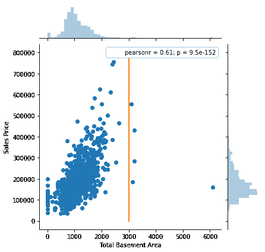

**因变量中的极端值**

回归——这些极端值被称为**“异常值”**。它们可能是也可能不是影响点，我们稍后会看到。在下图中，所有在橙色线以上的点都可以被归类为异常值。

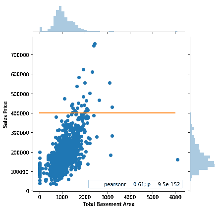

分类：这里我们有两种类型的极端值：

**1\. 异常值：**例如，在一个图像分类问题中，我们试图识别狗/猫，但训练集中有一张错误地包含猩猩（或其他不属于问题目标类别的类别）的图像。在这里，猩猩图像显然是噪声。在这里检测异常值没有意义，因为我们已经知道要关注哪些类别以及要丢弃哪些类别。

**2\. 新颖性：**很多时候我们处理的是新颖性，这个问题通常被称为**监督异常检测**。在这种情况下，目标不是去除异常值或减少其影响，而是我们关注的是检测新观察中的异常。因此我们不会在此帖子中讨论它。它特别用于信用卡交易中的欺诈检测、虚假电话等。

我们之前讨论的所有点，包括影响点，一旦我们可视化以下图形，就会变得非常清晰。

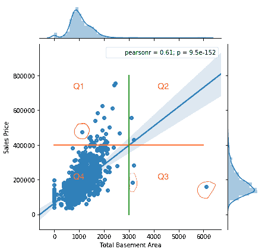

> ***推断***
> 
> *- Q1 中的点：异常值
> 
> - Q3 中的点：杠杆点
> 
> - Q2 中的点：既是异常值也是杠杆点，但不是影响点
> 
> - 圈出的点：影响点的示例。可能还有更多，但这些是显著的*

我们的主要关注点将是异常值（**因变量中的极端值**，以进一步调查和处理）。我们将看到这些极端值对模型性能的影响。

### 检测异常值的常用方法

在检测离群值时，我们要么进行单变量分析，要么进行多变量分析。当你的线性模型只有一个预测变量时，你可以使用单变量分析。然而，如果你对多个预测变量使用它，它可能会给出误导性的结果。执行离群值检测的一种常见方法是**假设常规数据来自已知分布**（例如，数据呈高斯分布）。这一假设在下面的 Z-Score 方法部分进行了讨论。

**箱形图**

识别离群值最快最简单的方法是通过可视化图形。如果你的数据集不是很庞大（大约最多 10k 个观察值和 100 个特征），我强烈推荐你绘制变量的散点图和箱形图。如果没有离群值，你仍然可以获得其他见解，比如相关性、变异性，或如世界大战/经济衰退对经济因素的影响等外部因素。然而，这种方法不适用于高维数据，因为可视化的效果会减弱。

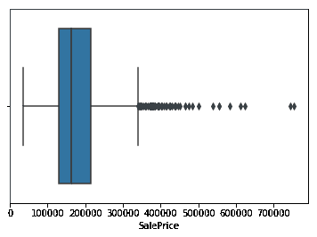

箱形图使用四分位距来检测离群值。在这里，我们首先确定四分位数 *Q*1 和 *Q*3。

四分位距由以下公式给出：IQR = Q3 — Q1

上限 = Q3 + 1.5 * IQR

下限 = Q1 – 1.5 * IQR

低于下限和高于上限的任何值都被认为是离群值

**库克距离**

这是一种用于寻找影响点的多变量方法。这些点可能是也可能不是离群值，如上所述，但它们有能力影响回归模型。我们将在博客的后面部分看到它们的影响。

该方法仅用于线性回归，因此应用有限。**[库克距离](https://en.wikipedia.org/wiki/Cook%27s_distance)** 衡量删除某个观察值的效果。它表示当观察值**“i”** 从回归模型中移除时，模型中所有变化的总和。

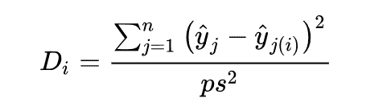

这里，p 是预测变量的数量，s² 是回归模型的均方误差。关于用来识别高度影响点的截断值有不同的观点。经验法则是 D(i) > 4/n，可以作为影响点的良好截断值。

R 有一个 [car](http://cran.r-project.org/web/packages/car/index.html)（应用回归的伴侣）包，你可以直接使用库克距离来查找离群值。实现可以在这个 [R-Tutorial](https://www.statmethods.net/stats/rdiagnostics.html) 中找到。另一种类似的方法是**DFFITS**，你可以在 [这里](https://newonlinecourses.science.psu.edu/stat501/node/340/) 查看详细信息。

**Z-Score**

该方法假设变量具有高斯分布。它表示一个观察值离均值的标准差数：

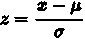

在这里，我们通常将离群点定义为 z-score 的模值大于某个阈值的点。这个阈值通常大于 2（3 是一个常见值）。

参考: [`slideplayer.com/slide/6394283/`](http://slideplayer.com/slide/6394283/)

上述所有方法适用于数据的初步分析，但在多变量设置或高维数据中它们的价值有限。对于这样的数据集，我们需要使用像**主成分分析（PCA）、局部离群因子（LOF）和 HiCS: 高对比度子空间用于基于密度的离群点排序**等高级方法。

我们不会在这篇博客中讨论这些方法，因为它们超出了博客的范围。我们在这里的重点是看看各种离群点处理技术如何影响模型的性能。有关这些方法的详细信息，你可以阅读[这篇博客](https://www.datasciencecentral.com/profiles/blogs/introduction-to-outlier-detection-methods)。

### 离群点的影响与处理

离群点的影响不仅可以在预测建模中看到，还可以在统计测试中看到，它会降低测试的效能。大多数参数统计，如均值、标准差和相关性，以及基于这些的每个统计量，都对离群点高度敏感。但在这篇文章中，我们只关注离群点在预测建模中的影响。

**是否删除**

我认为删除数据始终是一个严厉的步骤，只应在极端条件下进行，当我们非常确定**离群点是测量误差**时，这种情况我们通常并不了解。数据收集过程很少提供。当我们删除数据时，我们会失去关于数据变异性的的信息。当观察值过多且**离群点较少**时，我们可以考虑删除这些观察值。

在以下示例中，我们可以看到回归线的斜率在顶部的极端值存在时变化很大。因此，删除这些极端值以获得更好的拟合和更通用的解决方案是合理的。

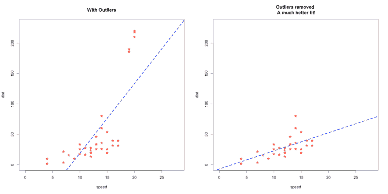

来源: [`www.r-bloggers.com/outlier-detection-and-treatment-with-r/`](https://www.r-bloggers.com/outlier-detection-and-treatment-with-r/)

**其他基于数据的方法**

+   **Winsorizing（温索化）：** 这种方法涉及将属性的极端值设置为某个指定的值。例如，对于 90% 的 Winsorization，底部 5% 的值被设置为第 5 百分位的最小值，而顶部 5% 的值被设置为第 95 百分位的最大值。这比仅仅排除极端值的修剪方法要更高级。

+   **对数尺度变换：** 这种方法通常用于减少包括离群观察在内的数据的变异性。在这里，y 值被更改为 log(y)。当响应变量遵循**指数分布或右偏分布**时，这种方法通常更受欢迎。

+   然而，这是一种有争议的步骤，并**不一定减少**方差。例如，这个[答案](https://stats.stackexchange.com/questions/130262/why-not-log-transform-all-variables-that-are-not-of-main-interest)很好地捕捉了所有这些情况。

+   变换的糟糕示例 -

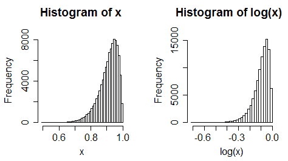

初始左偏的分布在对数变换后变得更加偏斜

+   **分箱：** 这指的是将一组连续变量划分为多个组。我们这样做是为了发现连续变量中的模式集合，这些模式在其他情况下难以分析。然而，它也会导致**信息丢失**和能力损失。

**基于模型的方法**

+   使用不同的模型：与线性模型不同，我们可以使用像随机森林和梯度提升技术这样的树基方法，这些方法不容易受到异常值的影响。这个[答案](https://www.quora.com/Why-are-tree-based-models-robust-to-outliers)清楚地解释了为什么树基方法对异常值具有鲁棒性。

+   指标：使用 MAE 代替 RMSE 作为损失函数。我们还可以使用截断损失：

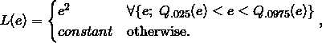

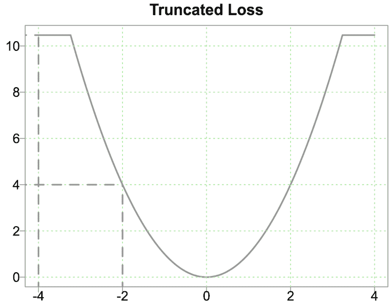

来源：[`eranraviv.com/outliers-and-loss-functions/`](https://eranraviv.com/outliers-and-loss-functions/)

**案例研究比较**

在这个比较中，我仅选择了四个重要预测变量（总体质量、MSubClass、总地下室面积、地面生活面积），从总共 80 个预测变量中进行预测。目的是看看异常值如何影响线性和树基方法。

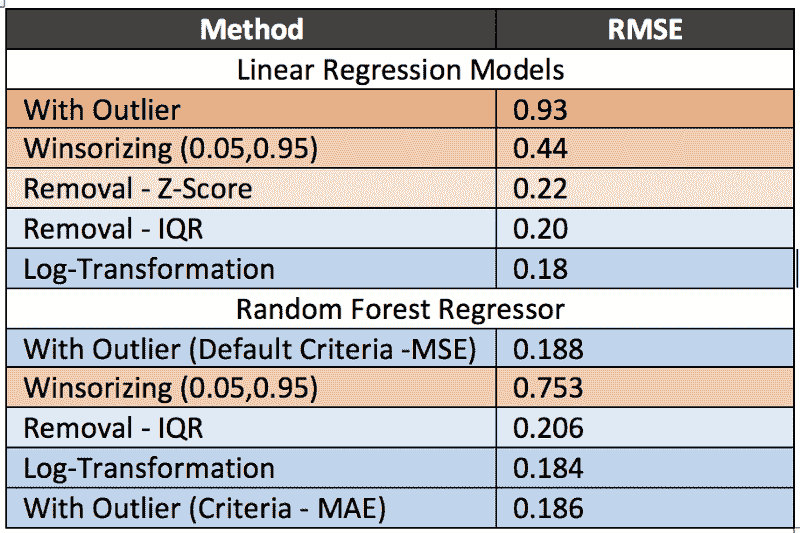

**结束注释**

+   由于数据集中只有 1400 个观察值，异常值对线性回归模型的影响相当大，正如我们从“**有异常值**”（0.93）和“**无异常值**”（0.18）的 RMSE 分数中可以看到——显著下降。

+   对于这个数据集，目标变量右偏。因此，对数变换比去除异常值效果更好。因此，我们应始终尝试先转换数据而不是去除它。然而，温莎化效果不如去除异常值。这可能是因为通过硬性替换，我们在数据中引入了某些不准确性。

+   显然，随机森林不受异常值影响，因为在去除异常值后，RMSE 增加了。这可能是将标准从 MSE 更改为 MAE 并没有太大帮助的原因（从 0.188 到 0.186）。即使在这种情况下，对数变换也被证明是赢家：原因在于目标变量的偏斜特性。经过变换后，数据变得更均匀，随机森林中的分裂也变得更好。

从以上结果可以得出结论，变换技术通常比丢弃技术更有效于提高线性模型和基于树的模型的预测准确性。如果你使用的是线性回归模型，处理异常值（无论是丢弃还是变换）都非常重要。

如果我遗漏了任何关于异常值处理的重要技术，欢迎在评论中告诉我。感谢阅读。

**关于我：** 研究生毕业于 USF 的数据科学专业。对与跨职能团队合作以从数据中提取见解以及将机器学习知识应用于解决复杂的数据科学问题感兴趣。 [`alviraswalin.wixsite.com/alvira`](https://alviraswalin.wixsite.com/alvira)

查看我的其他博客 [这里](https://medium.com/@aswalin)！

**LinkedIn: **[**www.linkedin.com/in/alvira-swalin**](http://www.linkedin.com/in/alvira-swalin)

**参考资料：**

1.  治疗方法由 [雅内特·因特里安（Yannet Interian）在 USF 教授](https://www.usfca.edu/faculty/yannet-interian)。

1.  [代码的 Github 仓库](https://github.com/aswalin/Outlier-Impact-Treatment)

1.  [房价分析数据](https://www.kaggle.com/c/house-prices-advanced-regression-techniques/data)

1.  [关于异常值与高杠杆观测值区分的课程](https://newonlinecourses.science.psu.edu/stat462/node/170/)

1.  [异常值检测方法介绍](https://www.datasciencecentral.com/profiles/blogs/introduction-to-outlier-detection-methods)

1.  [数据探索全面指南](https://www.analyticsvidhya.com/blog/2016/01/guide-data-exploration/)

1.  [R 中的 Cook’s D 实现](https://www.statmethods.net/stats/rdiagnostics.html)

**在 **[**Hacker News**](https://news.ycombinator.com/item?id=17197027)** 上讨论此帖子。**

**个人简介：[阿尔维拉·斯瓦林（Alvira Swalin）](https://www.linkedin.com/in/alvira-swalin)** ([**Medium**](https://medium.com/@aswalin)) 目前在 USF 攻读数据科学硕士学位，特别关注机器学习与预测建模。她是 Price (Fx) 的数据科学实习生。

[原文](https://heartbeat.fritz.ai/how-to-make-your-machine-learning-models-robust-to-outliers-44d404067d07)。已获许可转载。

**相关：**

+   CatBoost vs. Light GBM vs. XGBoost

+   选择正确的度量标准评估机器学习模型  –  第一部分

+   选择正确的度量标准评估机器学习模型 – 第二部分

### 相关话题

+   [使用 Python 中的标准差移除异常值](https://www.kdnuggets.com/2017/02/removing-outliers-standard-deviation-python.html)

+   [如何使用 Pandas 处理数据集中的异常值](https://www.kdnuggets.com/how-to-handle-outliers-in-dataset-with-pandas)

+   [如何让大型语言模型与您的软件友好协作……](https://www.kdnuggets.com/how-to-make-large-language-models-play-nice-with-your-software-using-langchain)

+   [CatBoost 机器学习带给您的数据的五大优势，让数据更出色](https://www.kdnuggets.com/2023/02/top-5-advantages-catboost-ml-brings-data-make-purr.html)

+   [在您的数据科学旅程中迈出量子飞跃](https://www.kdnuggets.com/2023/02/make-quantum-leaps-data-science-journey.html)

+   [使用 ChatGPT 的 GPTs 创建您自己的 GPT！](https://www.kdnuggets.com/make-your-own-gpts-with-chatgpts-gpts)
