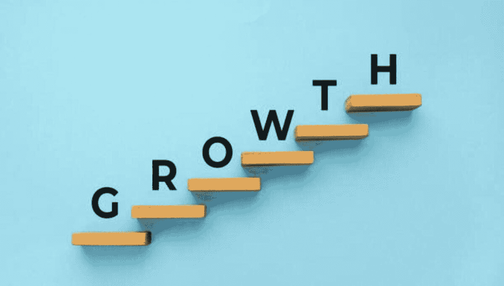
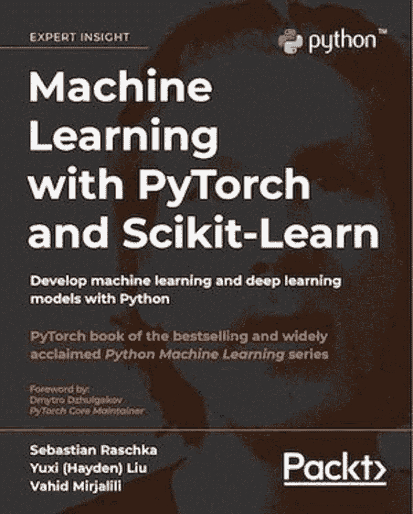

# 在数据科学旅程中实现量子飞跃

> 原文：[`www.kdnuggets.com/2023/02/make-quantum-leaps-data-science-journey.html`](https://www.kdnuggets.com/2023/02/make-quantum-leaps-data-science-journey.html)

来自 Unsplash 的图片

## 主要收获

* * *

## 我们的三大课程推荐

 1\. [谷歌网络安全证书](https://www.kdnuggets.com/google-cybersecurity) - 快速进入网络安全职业生涯。

 2\. [谷歌数据分析专业证书](https://www.kdnuggets.com/google-data-analytics) - 提升你的数据分析技能

 3\. [谷歌 IT 支持专业证书](https://www.kdnuggets.com/google-itsupport) - 支持你所在组织的 IT

* * *

+   数据科学是一个不断发展的领域

+   在数据科学领域，学习是终身的。

+   数据科学专业人员必须不断提升领域知识，以跟上新的技术发展和软件应用。

# 介绍

我还记得大约 6 年前开始我的数据科学旅程时的喜悦和兴奋。对我来说，由于在高级数学和计算物理方面的强大背景，向数据科学的过渡相当顺利。

然而，随着我在数据科学旅程中的深入，我意识到在学习高级概念方面进展不大。我只是专注于基础概念的学习。与其将已有的基础知识应用到实际的数据科学项目中，我却不停地在 DataCamp、Udemy、YouTube、edX 和 Coursera 等平台上参加各种数据科学课程和专业化课程。

一度，这几乎成了一种瘾，我不断寻找免费的数据科学课程来注册。这些平台上的大多数课程仅覆盖基础概念，尽管引入了高级概念，但大多只是表面上的。

回顾我的数据科学旅程，如果可以重来，我会更加注重基于项目的学习。在我看来，基于项目的学习是学习数据科学的**最可靠**方式，因为它让你在实践中学习，并有机会将知识应用到实际数据科学项目中。

虽然获得尽可能多的基础知识令人兴奋，但重点应是从基础概念逐步进阶到更高级的概念。数据科学领域的初学者必须在从入门级到高级数据科学专业人士的过渡过程中不断实现量子飞跃。

在接下来的内容中，我们讨论数据科学的一些基本级别。

# 一级数据科学

一级数据科学也可以称为基础级。在一级水平，数据科学学习者应能够掌握以下技能：

+   能够处理以 CSV（逗号分隔值）文件格式呈现的数据

+   能够清理和组织非结构化数据

+   能够处理数据框

+   能够使用不同类型的可视化工具来可视化数据，如折线图、散点图、QQ 图、密度图、直方图、饼图、散点对图、热图等

+   能够进行简单和多重回归分析

+   熟练掌握数据科学所需的基本 Python 库，如 numpy、pandas、scikit-learn、seaborn 和 matplotlib

# 二级数据科学

二级数据科学也可以称为中级。在二级水平，数据科学学习者应掌握以下内容：

+   能够使用机器学习分类算法，如逻辑回归、KNN（K-最近邻）、SVM（支持向量机）、决策树等

+   能够构建、测试和评估机器学习模型

+   能够进行超参数优化

+   熟悉高级概念，如 k 折交叉验证、网格搜索和集成方法

+   应该在使用 scikit-learn 库进行机器学习应用方面成为专家

# 三级数据科学

三级数据科学可以称为高级。在三级水平，数据科学学生应获得以下能力：

+   能够处理以高级格式呈现的数据，如文本、图像、语音或视频

+   熟悉高级机器学习技术，如聚类

+   熟悉深度学习和神经网络

+   熟悉深度学习库，如 TensorFlow 和 PyTorch

+   熟悉用于机器学习部署的云平台，如 AWS 和 Azure

# 结论

上述三个数据科学级别可以在下图中总结。

数据科学的三个级别 | 作者提供的图像。

虽然一级和二级的能力可以通过在线课程获得，但学习三级（高级）概念需要大量的自学。一项重要的资源是以下教科书：**《使用 PyTorch 和 Scikit-Learn 进行机器学习》**。

[书籍](https://github.com/rasbt/machine-learning-book)封面

该教科书的 GitHub 仓库可以在[这里](https://github.com/rasbt/machine-learning-book)找到。

总结来说，我们讨论了数据科学的三个层次。由于数据科学是一个不断发展的领域，每个数据科学爱好者都应该继续努力，以实现向下一个层次的飞跃。

**[本杰明·O·泰约](https://www.linkedin.com/in/benjamin-o-tayo-ph-d-a2717511/)** 是一位物理学家、数据科学教育者和作家，同时也是 DataScienceHub 的创始人。之前，本杰明在中央俄克拉荷马大学、大峡谷大学和匹兹堡州立大学教授工程学和物理学。

### 更多相关主题

+   [解析量子计算：对数据科学和 AI 的影响](https://www.kdnuggets.com/breaking-down-quantum-computing-implications-for-data-science-and-ai)

+   [规划你的 SAS 认证之旅](https://www.kdnuggets.com/2022/11/sas-map-journey-towards-sas-certification.html)

+   [通过 Uplimit 的 Metaflow 加速你的机器学习之旅…](https://www.kdnuggets.com/2023/10/uplimit-accelerate-your-machine-learning-journey-metaflow-mastery-course)

+   [加速你的 AI 之旅！加入 Uplimit 的免费构建 AI 课程…](https://www.kdnuggets.com/2024/01/uplimit-supercharge-your-ai-journey-openai-course)

+   [用这 5 个免费课程启动你的 NLP 之旅](https://www.kdnuggets.com/kickstart-your-nlp-journey-with-these-5-free-courses)

+   [探索 AI/DL 最新趋势：从元宇宙到量子计算](https://www.kdnuggets.com/2023/07/exploring-latest-trends-aidl-metaverse-quantum-computing.html)
