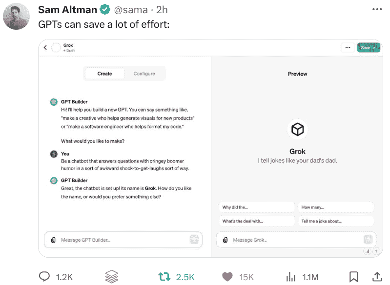

# 使用 ChatGPT 的 GPTs 创建你自己的 GPTs！

> 原文：[`www.kdnuggets.com/make-your-own-gpts-with-chatgpts-gpts`](https://www.kdnuggets.com/make-your-own-gpts-with-chatgpts-gpts)

Sam Altman 抓住机会[推特](https://twitter.com/sama/status/1722766374588830101)推广 GPTs，同时批评 Elon 的 Grok

# GPTs 概述

* * *

## 我们的前三大课程推荐

 1\. [谷歌网络安全证书](https://www.kdnuggets.com/google-cybersecurity) - 快速进入网络安全职业的快车道。

 2\. [谷歌数据分析专业证书](https://www.kdnuggets.com/google-data-analytics) - 提升你的数据分析技能

 3\. [谷歌 IT 支持专业证书](https://www.kdnuggets.com/google-itsupport) - 支持你组织的 IT

* * *

它们来了！

上周刚刚[宣布](https://openai.com/blog/introducing-gpts)的 OpenAI，现在推出了其雄心勃勃的新 ChatGPT 附加功能：恰如其分命名的 GPTs。

> 任何人都可以轻松构建自己的 GPT——无需编码。你可以为自己、仅供公司内部使用或为所有人创建它们。创建一个就像开始对话一样简单，给它指令和额外知识，并选择它可以做的事情，比如搜索网络、制作图像或分析数据。

这一举措背后的理由是什么？

> 自从 ChatGPT 推出以来，人们一直在寻求定制 ChatGPT 以适应他们使用方式的方法。我们在 7 月推出了自定义指令，允许你设置一些偏好，但对更多控制的请求不断增加。许多高级用户维护一份精心制作的提示和指令集，手动将它们复制到 ChatGPT 中。GPTs 现在为你完成所有这些工作。

这是否可以替代经过微调的语言模型，如 GPT-3.5 Turbo 或开源替代品？嗯，不能。这更像是结合了上述的自定义指令、自定义提示词以及对你上传文档的检索增强生成。GPTs 类似于使用一个普通的 LLM 与[LangChain](https://www.langchain.com/)、一系列提示模板、像[文本生成 Web UI](https://github.com/oobabooga/text-generation-webui)这样的用户界面，以及一个[RAG](https://arxiv.org/abs/2005.11401)实施方案用于知识检索。

GPT 的目标是使这些操作的组合和配置快速且简单，不过，我们可以试一试。

# 在 5 分钟内创建一个 GPT

我想看看创建我自己的 GPT 是否像 [Sam Altman 的 Open AI Dev Days 演示](https://www.youtube.com/watch?v=U9mJuUkhUzk) 那样快捷无痛，因此我进行了这个过程。注意，这是一时兴起的决定，一旦我发现可以使用 GPT Builder，所以并未经过精心策划。让我们看看我们能多快且顺利地完成这项工作。

我的 5 分钟 GPT 创建：[乔治代理](https://chat.openai.com/g/g-d4hBUujBP-agent-george)

我通过一系列……嗯，实际上什么也没有，决定创建一个房地产咨询聊天机器人。并且它将具有乔治·科斯坦扎的声音和个性。

为此，我开始了 GPT Builder 过程。首先，我需要让它知道 GPT 的高级描述是什么。

> 创建一个顾问，为希望购买或了解更多房地产及房地产市场的用户提供见解和建议。

接下来，我被问及如何为 GPT 设定回应框架以及其他与 GPT 个性相关的重要事项。我首先说明了回应应基于事实，并且 GPT 应在必要时提出澄清问题。为了赋予其个性，我下载了一个 [《塞恩菲尔德》剧本数据集](https://www.kaggle.com/datasets/thec03u5/seinfeld-chronicles/)，解压后将原始内容作为知识上传，以便检索，并指导 GPT 学习和模仿乔治·科斯坦扎的“声音”和互动。以下是 GPT Builder 从这些指令中学到的内容。

> 乔治代理将把乔治·科斯坦扎独特的语调和反应融入他的互动中。他会用神经质的幽默和过度思考的倾向来表达观点，经常转入个人轶事或夸张的情景。乔治代理会使用修辞性问题、自嘲，以及带有些许偏执的建议，完全符合乔治·科斯坦扎的风格。他的建议会以简短、有力的言辞呈现，充满紧迫感和偶尔的激动语调。他将富有人情味、引人入胜，并为房地产咨询带来独特的喜剧视角，同时避免详细的财务或法律建议。

经过几次与 GPT Builder 的配置互动（例如，它创建了一个头像，但我不喜欢，因此上传了自己的头像），我添加了一个指令，在每次用户互动结束时附上一个与情境相关的《塞恩菲尔德》引用。就是这样。[乔治代理](https://chat.openai.com/g/g-d4hBUujBP-agent-george) 准备就绪，整个过程大约花了 5 分钟。

OpenAI 的 GPTs 创建、配置和共享都如承诺般简单。我认为这是一个聪明的举措，以应对未知的局面，即谷歌神秘的 Gemini，这个项目可能很快会出现，也可能会不符合其炒作。 然而，我心中的问题仍然是 OpenAI 的 GPTs 是否会像 OpenAI 期望的那样有用。我想时间会告诉我们答案。

与此同时，[去问 George 关于房地产市场](https://chat.openai.com/g/g-d4hBUujBP-agent-george)。

现在保持宁静！

****[Matthew Mayo](https://www.kdnuggets.com/wp-content/uploads/./profile-pic.jpg)**** ([**@mattmayo13**](https://twitter.com/mattmayo13)) 拥有计算机科学硕士学位和数据挖掘研究生文凭。作为 [KDnuggets](https://www.kdnuggets.com/) 和 [Statology](https://www.statology.org/) 的执行编辑，以及 [Machine Learning Mastery](https://machinelearningmastery.com/) 的特邀编辑，Matthew 旨在使复杂的数据科学概念变得易于理解。他的职业兴趣包括自然语言处理、语言模型、机器学习算法，以及探索新兴的人工智能。他致力于使数据科学社区的知识民主化。Matthew 从 6 岁开始编程。

### 更多相关话题

+   [LangChain 101：构建你自己的 GPT 驱动应用](https://www.kdnuggets.com/2023/04/langchain-101-build-gptpowered-applications.html)

+   [用 LlamaIndex 构建你自己的 PandasAI](https://www.kdnuggets.com/build-your-own-pandasai-with-llamaindex)

+   [个性化 AI 变得简单：无代码指南，帮助你适配 GPTs](https://www.kdnuggets.com/personalized-ai-made-simple-your-no-code-guide-to-adapting-gpts)

+   [7 个 GPT 帮助提升你的数据科学工作流程](https://www.kdnuggets.com/7-gpts-to-help-improve-your-data-science-workflow)

+   [利用 ChatGPT 和 AI 赚钱的 3 种方法](https://www.kdnuggets.com/3-ways-to-make-money-with-chatgpt-and-ai)

+   [ChatGPT CLI：将你的命令行界面转变为 ChatGPT](https://www.kdnuggets.com/2023/07/chatgpt-cli-transform-commandline-interface-chatgpt.html)
