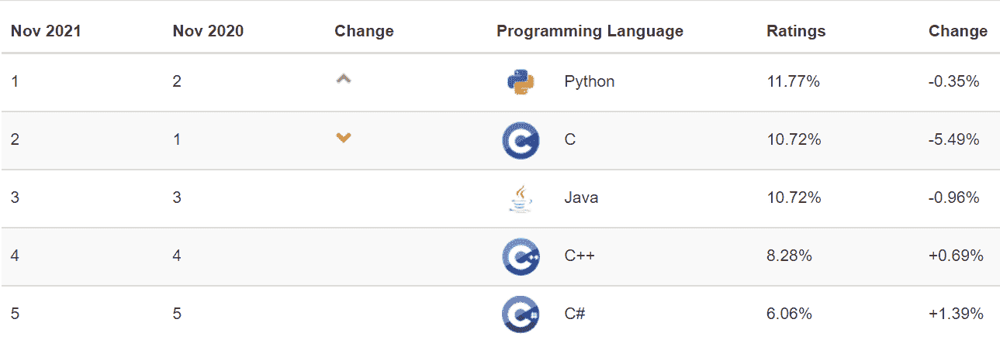

# 什么使 Python 成为初创企业理想的编程语言

> 原文：[`www.kdnuggets.com/2021/12/makes-python-ideal-programming-language-startups.html`](https://www.kdnuggets.com/2021/12/makes-python-ideal-programming-language-startups.html)

**由[Nikita Bajaj](https://www.linkedin.com/company/scalexcloud/)撰写，数字营销负责人**

* * *

## 我们的三大课程推荐

 1\. [Google 网络安全证书](https://www.kdnuggets.com/google-cybersecurity) - 快速进入网络安全职业轨道。

 2\. [Google 数据分析专业证书](https://www.kdnuggets.com/google-data-analytics) - 提升你的数据分析能力

 3\. [Google IT 支持专业证书](https://www.kdnuggets.com/google-itsupport) - 支持你的组织进行 IT 工作

* * *

在市场上有多种编程语言表现出色的情况下，选择合适的编程语言在你初创企业的早期阶段总是一个艰巨的任务。无论你是希望构建一个最小可行产品（MVP）以获得对你概念的关注，还是希望尽快将完成的产品推向市场，编程语言的选择都应该是明智的，并且基于充分的理由。并非所有编程语言都适合你的业务需求。

初创企业在选择编程语言时必须仔细考虑语言的受欢迎程度、预算、开发速度、库、集成、可扩展性、稳定性、软件安全性和开发者成本。正因如此，Python 通常被认为是最适合初创企业的编程语言之一，因为它满足了所有这些要求。

在这篇博客中，我们将探讨是什么让 Python 如此受欢迎，它的特点是什么，以及为什么你应该将 Python 作为你的初创企业的编程语言进行考虑。

### **Python 的受欢迎程度**

Python 已经在市场上存在了 30 年，吸引了全球开发者社区越来越多的追随者。Python 是一种强大且高级的面向对象编程语言，以其构建可扩展和强健应用程序的能力而闻名。Python 使公司能够开发各种各样的应用程序，包括网页应用程序、软件和游戏开发、网络编程、图形用户界面（GUI）、科学和数值应用等。

*TIOBE 编程社区指数将[Python 排为全球最受欢迎的编程语言第一](https://www.tiobe.com/tiobe-index/)（截至 2021 年 11 月）。*

[*Python 在 2021 年 6 月被 RedMonk 语言排名评为第二名*](https://redmonk.com/sogrady/2021/08/05/language-rankings-6-21/)*，仅次于 JavaScript。* RedMonk 排名根据考察 Stack Overflow 和 GitHub 的公式评估语言的使用情况。全球科技巨头如 Google、Facebook、Spotify、Netflix、IBM 和 Dropbox 都在很大程度上依赖于 Python。

报告、研究和使用情况清楚地显示，Python 仍然受到需求，并且是世界上大多数公司和企业家在开发项目中首选的顶级编程语言之一。现在，让我们看看为什么如此多人认为 [Python 是创业公司最佳编程语言](https://scalexcloud.com/python-development-services/)。

### **选择 Python 作为你创业公司的 8 个理由**

让我们更深入地探讨一下是什么使得 Python 成为你创业公司的绝佳选择。

**高度可扩展**

创业公司需要灵活性来成长，而 Python 提供了扩展业务应用程序的灵活性。由于 Python 是一种面向对象的语言，它支持多种编程范式。通过使用 Django，这个流行的 Python 框架，企业可以轻松创建易于维护的高度可扩展的应用程序。Django 框架由一系列组件组成，这些组件可以解耦，这意味着这些组件可以根据项目需求轻松地进行更改、移除甚至替换。

**受欢迎**

Python 是增长最快的编程语言，并且已经获得了相当大的受欢迎程度。像 Google、Quora 和 Instagram 等主要公司都依赖于用 Python 编写的代码。到现在为止，你应该已经理解了 Python 的受欢迎程度及其庞大的追随者。

**简单且用户友好**

与 C++ 或 Java 等其他编程语言相比，Python 简单且相对容易学习。它具有干净且结构化的代码库，这使得开发人员能够轻松更新和维护应用程序。因此，它成为开发者社区中最用户友好的语言之一。

**多才多艺**

Python 支持所有主要的操作系统和架构。它是一种多用途的语言，可以用于各种项目，从网页开发到数据科学。它可以在包括 Windows、Linux、UNIX 和 Macintosh 在内的多种平台上运行。Python 可以用于开发各种各样的应用程序，从网页应用到科学计算、机器学习（ML）和其他大数据计算系统。数据科学和机器学习的兴起是推动 Python 作为编程语言发展的主要驱动因素。

**开源**

Python 是一种开源编程语言，这意味着任何人都可以在社区中改进它。这也意味着 Python 可以用于任何你需要的项目，并且可以根据你的项目范围进行修改。

**庞大且支持性强的社区**

对于一种编程语言来说，拥有一个强大的社区支持是很重要的，这样的社区能为用户提供广泛的支持。Python 社区不断致力于改善语言的核心功能和特性。在开发过程中，你将始终获得快速支持和解决方案。

**构建 MVP 和原型**

作为一个初创公司，你可能想要迅速测试项目的想法或吸引投资者。由于其强大而快速的开发能力，Python 是[构建最小可行产品（MVP）](https://scalexcloud.com/product-engineering/mvp-development/)的好选择，这有助于初创公司进行快速迭代。它配备了内置的包和模块，帮助加快产品完成过程。使用 Python，你可以用更少的代码行实现相同的功能，这对初创公司来说是相当节省时间的。Python 帮助你在几周内构建一个完全功能的原型，而不是几个月。因此，它是创建 MVP 的完美选择。

**非常适合人工智能（AI）、机器学习（ML）和大数据**

如果你的初创公司希望在 AI、ML 和数据科学领域进行创新，Python 是一个很好的选择。Python 拥有丰富而成熟的库集合、扩展性、易用性，并且在科学社区中得到广泛采用。它是与大数据、机器学习和人工智能相关的所有开发类型的完美选择。这是因为它具有针对这些任务的强大包和通过 API 进行数据可视化的广泛可能性。

### **总结**

那么，你应该为你的初创公司选择 Python 吗？

Python 非常适合初创公司，在所有这些领域表现出色，并以效率、速度和质量超越任何其他语言。Python 的特性使其成为大型企业和初创公司都极好的选择。

**个人简介: [Nikita Bajaj](https://www.linkedin.com/company/scalexcloud/)** 曾在 SaaS、IT、旅游、软件、电商和数字营销公司工作过。她在开发数据驱动的营销活动和策略方面有着丰富的经验。她领导营销团队，并通过内容营销策略和社交媒体渠道成功吸引潜在客户。

### 更多相关话题

+   [每个数据科学家都应了解的三大 R 库（即使你使用 Python）](https://www.kdnuggets.com/2021/12/three-r-libraries-every-data-scientist-know-even-python.html)

+   [停止学习数据科学来寻找目标，找到目标再…](https://www.kdnuggets.com/2021/12/stop-learning-data-science-find-purpose.html)

+   [一个 90 亿美元的 AI 失败，分析](https://www.kdnuggets.com/2021/12/9b-ai-failure-examined.html)

+   [学习数据科学统计的顶级资源](https://www.kdnuggets.com/2021/12/springboard-top-resources-learn-data-science-statistics.html)

+   [成功数据科学家的 5 个特征](https://www.kdnuggets.com/2021/12/5-characteristics-successful-data-scientist.html)

+   [使用管道编写干净的 Python 代码](https://www.kdnuggets.com/2021/12/write-clean-python-code-pipes.html)
