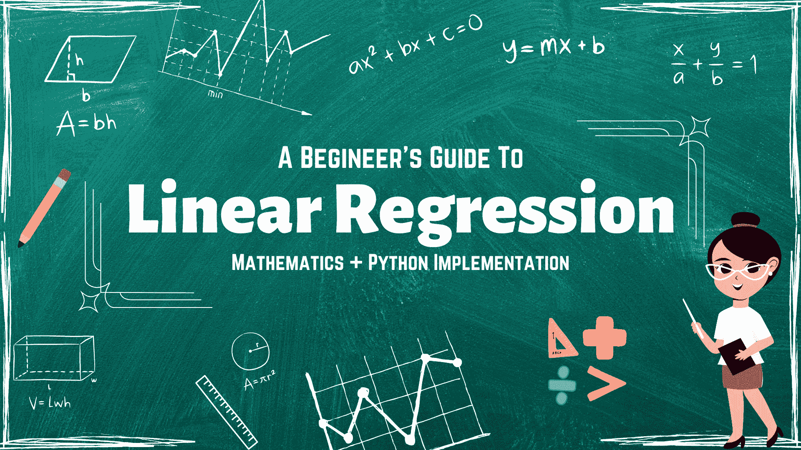
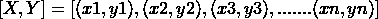
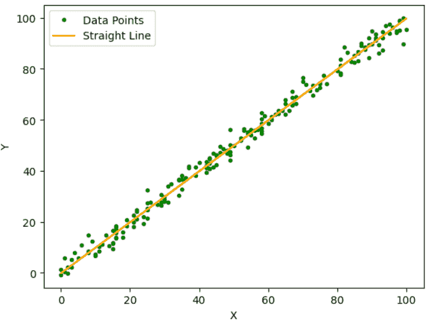
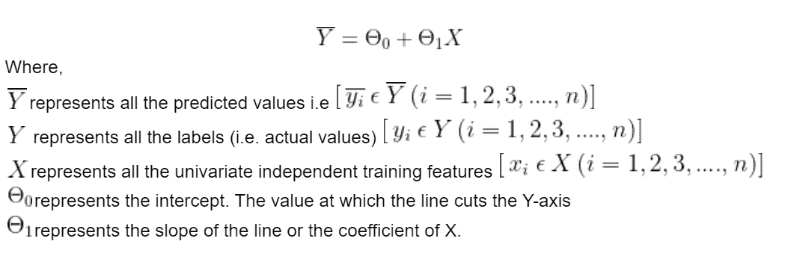
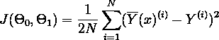
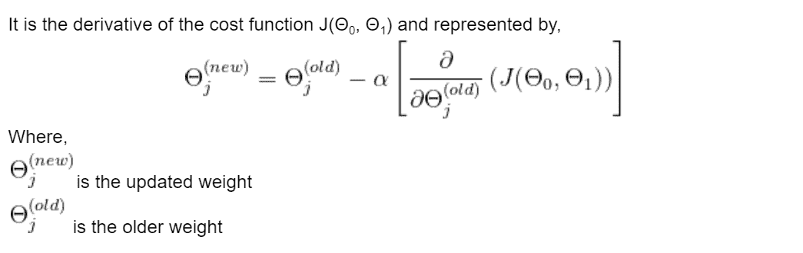
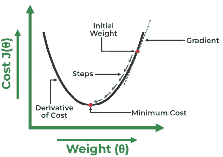
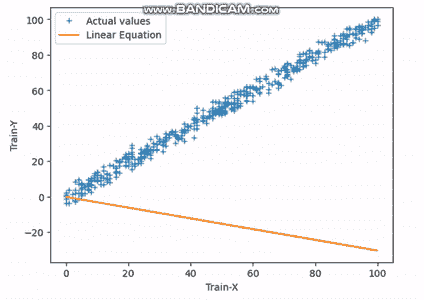
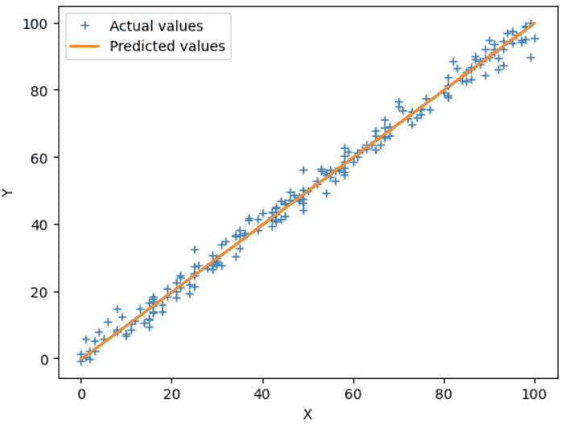
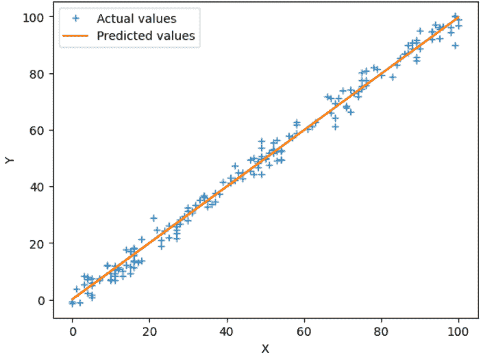

# 预测：Python 中线性回归的初学者指南

> 原文：[`www.kdnuggets.com/2023/06/making-predictions-beginner-guide-linear-regression-python.html`](https://www.kdnuggets.com/2023/06/making-predictions-beginner-guide-linear-regression-python.html)



图片由作者提供

线性回归是数据科学家在开始数据科学职业生涯时学习的最受欢迎且最早的机器学习算法。它是最重要的监督学习算法，因为它为所有其他高级机器学习算法奠定了基础。这就是为什么我们需要非常清楚地学习和理解这个算法的原因。

* * *

## 我们的前三个课程推荐

 1\. [谷歌网络安全证书](https://www.kdnuggets.com/google-cybersecurity) - 快速进入网络安全职业生涯。

 2\. [谷歌数据分析专业证书](https://www.kdnuggets.com/google-data-analytics) - 提升你的数据分析能力

 3\. [谷歌 IT 支持专业证书](https://www.kdnuggets.com/google-itsupport) - 支持你的组织在 IT 方面

* * *

在这篇文章中，我们将从头开始介绍线性回归、其数学和几何直觉，以及其 Python 实现。唯一的前提是你有学习的愿望和基本的 Python 语法知识。让我们开始吧。

# 什么是线性回归？

线性回归是一种[监督式机器学习](https://www.javatpoint.com/supervised-machine-learning)算法，用于解决回归问题。回归模型用于根据一些其他因素预测连续输出。例如，通过考虑利润率、总市值、年度增长等来预测下个月的股票价格。线性回归还可以用于预测天气、股票价格、销售目标等应用。

顾名思义，线性回归，它在两个变量之间建立了线性关系。该算法找到最佳的直线（`y=mx+c`），可以根据自变量(x)预测因变量(y)。被预测的变量称为因变量或目标变量，而用于预测的变量称为自变量或特征。如果只使用一个自变量，则称为单变量线性回归。否则，称为多变量线性回归。

为了简化本文，我们将仅考虑一个自变量(x)，以便我们可以在二维平面上轻松可视化。在接下来的部分，我们将讨论它的数学直觉。

# 数学直觉

现在我们将深入理解线性回归的几何和数学。如果我们有一组 X 和 Y 值的样本对，



我们必须使用这些值来学习一个函数，以便如果我们给它一个未知的 (x)，它可以根据学习结果预测一个 (y)。在回归中，可以使用许多函数进行预测，但线性函数是所有函数中最简单的。



图 1 样本数据点 | 作者提供的图片

该算法的主要目的是在这些数据点中找到最佳拟合线，如上图所示，从而得到最小的残差误差。残差误差是预测值与实际值之间的差异。

## 线性回归的假设

在继续之前，我们需要讨论线性回归的一些假设，以确保得到准确的预测。

1.  **线性关系：** 线性关系意味着独立变量和因变量必须遵循线性关系。否则，将难以获得一条直线。此外，数据点必须彼此独立，即一个观察的数据不依赖于另一个观察的数据。

1.  **同方差性：** 这意味着残差误差的方差必须是恒定的。这意味着误差项的方差应该是恒定的，即使独立变量的值变化也不应改变。此外，模型中的误差必须遵循正态分布。

1.  **无多重共线性：** 多重共线性意味着独立变量之间存在相关性。因此，在线性回归中，独立变量之间不能存在相关性。

## 假设函数

我们将假设因变量 (Y) 和独立变量 (X) 之间存在线性关系。我们可以如下表示线性关系。



我们可以观察到，直线依赖于参数 Θ0 和 Θ1。因此，为了得到最佳拟合线，我们需要调整这些参数。这些参数也称为模型的权重。为了计算这些值，我们将使用损失函数，也称为成本函数。它计算预测值与实际值之间的[**均方误差**](https://en.wikipedia.org/wiki/Mean_squared_error)。我们的目标是最小化这个成本函数。Θ0 和 Θ1 的值，使得成本函数最小化，将形成我们的最佳拟合线。成本函数用 (J) 表示。



其中，

N 是样本的总数

选择平方误差函数来处理负值（即预测值低于实际值）。此外，将函数除以 2 以简化微分过程。

## 优化器（梯度下降）

[优化器](https://www.datarobot.com/blog/introduction-to-optimizers/#:~:text=In%20simpler%20terms%2C%20optimizers%20shape,component%20of%20AI%2FML%20governance.) 是一种通过迭代更新模型的属性（如权重或学习率）来最小化均方误差的算法，以实现最佳拟合线。在线性回归中，使用梯度下降算法来通过更新 Θ0 和 Θ1 的值来最小化成本函数。



是一个超参数，称为学习率。它决定了我们的权重相对于梯度损失的调整幅度。学习率的值应当是最佳的，不应过高或过低。如果过高，模型难以收敛到全局最小值；如果过小，则收敛速度较慢。

我们将绘制成本函数与权重之间的图表，以找到最佳的 Θ0 和 Θ1。



图 2 梯度下降曲线 | 图片由 [GeeksForGeeks](https://www.geeksforgeeks.org/ml-linear-regression/) 提供

初始时，我们将随机赋值给 Θ0 和 Θ1，然后计算成本函数和梯度。对于负梯度（即成本函数的导数），我们需要朝着增加 Θ1 的方向移动以达到最小值。而对于正梯度，我们必须向回移动以达到全局最小值。我们的目标是找到梯度几乎等于零的点。在这个点上，成本函数的值是最小的。

到目前为止，你已经理解了线性回归的工作原理和数学基础。接下来的部分将展示如何在 Python 中使用样本数据集从头开始实现它。

# 线性回归 Python 实现

在这一部分，我们将学习如何从头开始实现线性回归算法，仅使用 Numpy、Pandas 和 Matplotlib 等基础库。我们将实现单变量线性回归，其中包含一个因变量和一个自变量。

我们将使用的数据集包含大约 700 对 (X, Y)，其中 X 是自变量，Y 是因变量。此数据集由 Ashish Jangra 提供，你可以从 [这里](https://github.com/AshishJangra27/Machine-Learning-with-Python-GFG/tree/main/Linear%20Regression) 下载。

## 导入库

```py
# Importing Necessary Libraries
import pandas as pd
import numpy as np
import matplotlib.pyplot as plt
import matplotlib.axes as ax
from IPython.display import clear_output
```

Pandas 读取 CSV 文件并获取数据框，而 Numpy 执行基本的数学和统计操作。Matplotlib 负责绘制图表和曲线。

## 加载数据集

```py
# Dataset Link:
# https://github.com/AshishJangra27/Machine-Learning-with-Python-GFG/tree/main/Linear%20Regression

df = pd.read_csv("lr_dataset.csv")
df.head()

# Drop null values
df = df.dropna()

# Train-Test Split
N = len(df)
x_train, y_train = np.array(df.X[0:500]).reshape(500, 1), np.array(df.Y[0:500]).reshape(
    500, 1
)
x_test, y_test = np.array(df.X[500:N]).reshape(N - 500, 1), np.array(
    df.Y[500:N]
).reshape(N - 500, 1)
```

首先，我们将获取数据框 `df`，然后删除空值。之后，我们将数据拆分为训练集和测试集 `x_train`、`y_train`、`x_test` 和 `y_test`。

## 构建模型

```py
class LinearRegression:
    def __init__(self):
        self.Q0 = np.random.uniform(0, 1) * -1  # Intercept
        self.Q1 = np.random.uniform(0, 1) * -1  # Coefficient of X
        self.losses = []  # Storing the loss of each iteration

    def forward_propogation(self, training_input):
        predicted_values = np.multiply(self.Q1, training_input) + self.Q0  # y = mx + c
        return predicted_values

    def cost(self, predictions, training_output):
        return np.mean((predictions - training_output) ** 2)  # Calculating the cost

    def finding_derivatives(self, cost, predictions, training_input, training_output):
        diff = predictions - training_output
        dQ0 = np.mean(diff)  # d(J(Q0, Q1))/d(Q0)
        dQ1 = np.mean(np.multiply(diff, training_input))  # d(J(Q0, Q1))/d(Q1)
        return dQ0, dQ1

    def train(self, x_train, y_train, lr, itrs):
        for i in range(itrs):
            # Finding the predicted values (Using the linear equation y=mx+c)
            predicted_values = self.forward_propogation(x_train)

            # Calculating the Loss
            loss = self.cost(predicted_values, y_train)
            self.losses.append(loss)

            # Back Propagation (Finding Derivatives of Weights)
            dQ0, dQ1 = self.finding_derivatives(
                loss, predicted_values, x_train, y_train
            )

            # Updating the Weights
            self.Q0 = self.Q0 - lr * (dQ0)
            self.Q1 = self.Q1 - lr * (dQ1)

            # It will dynamically update the plot of the straight line
            line = self.Q0 + x_train * self.Q1
            clear_output(wait=True)
            plt.plot(x_train, y_train, "+", label="Actual values")
            plt.plot(x_train, line, label="Linear Equation")
            plt.xlabel("Train-X")
            plt.ylabel("Train-Y")
            plt.legend()
            plt.show()
        return (
            self.Q0,
            self.Q1,
            self.losses,
        )  # Returning the final model weights and the losses
```

我们创建了一个名为`LinearRegression()`的类，其中包含了所有必要的函数。

`__init__` : 这是一个构造函数，当创建这个类的对象时，它会用随机值初始化权重。

`forward_propogation()`: 这个函数将使用直线的方程找到预测的输出。

`cost()`: 这个函数将计算与预测值相关的残差误差。

`finding_derivatives()`: 这个函数计算权重的导数，导数可以用于之后更新权重以减少误差。

`train()`: 该函数将接受训练数据、学习率和总迭代次数作为输入。它将使用反向传播来更新权重，直到达到指定的迭代次数。最后，它将返回最佳拟合线的权重。

## 模型训练

```py
lr = 0.0001  # Learning Rate
itrs = 30  # No. of iterations
model = LinearRegression()
Q0, Q1, losses = model.train(x_train, y_train, lr, itrs)

# Output No. of Iteration vs Loss
for itr in range(len(losses)):
    print(f"Iteration = {itr+1}, Loss = {losses[itr]}")
```

**输出：**

```py
Iteration = 1, Loss = 6547.547538061649
Iteration = 2, Loss = 3016.791083711492
Iteration = 3, Loss = 1392.3048668536044
Iteration = 4, Loss = 644.8855797373262
Iteration = 5, Loss = 301.0011032250385
Iteration = 6, Loss = 142.78129818453215
.
.
.
.
Iteration = 27, Loss = 7.949420840198964
Iteration = 28, Loss = 7.949411555664398
Iteration = 29, Loss = 7.949405538972356
Iteration = 30, Loss = 7.949401025888949
```

你可以观察到在第一次迭代中，损失最大，而在随后的迭代中，这个损失逐渐减少，并在第 30 次迭代结束时达到最小值。



图 3 最佳拟合线的寻找 | 图片作者

上面的 gif 显示了直线如何在完成第 30 次迭代后达到最佳拟合线。

## 最终预测

```py
# Prediction on test data
y_pred = Q0 + x_test * Q1
print(f"Best-fit Line: (Y = {Q1}*X + {Q0})")

# Plot the regression line with actual data pointa
plt.plot(x_test, y_test, "+", label="Data Points")
plt.plot(x_test, y_pred, label="Predited Values")
plt.xlabel("X-Test")
plt.ylabel("Y-Test")
plt.legend()
plt.show()
```

这是最佳拟合线的最终方程。

```py
Best-fit Line: (Y = 1.0068007107347927*X + -0.653638673779529)
```



图 4 实际值与预测值的对比 | 图片作者

上面的图展示了最佳拟合线（橙色）和测试集的实际值（蓝色 `+`）。你还可以调整超参数，例如学习率或迭代次数，以提高准确性和精确度。

# 线性回归（使用 Sklearn 库）

在上一节中，我们已经学习了如何从头实现单变量线性回归。但是，sklearn 也提供了一个可以直接用来实现线性回归的内置库。我们来简要讨论一下如何实现。

我们将使用相同的数据集，但如果你愿意，也可以使用不同的数据集。你需要额外导入两个库，如下所示。

```py
# Importing Extra Libraries
from sklearn.linear_model import LinearRegression
from sklearn.model_selection import train_test_split
```

## 加载数据集

```py
df = pd.read_csv("lr_dataset.csv")

# Drop null values
df = df.dropna()

# Train-Test Split
Y = df.Y
X = df.drop("Y", axis=1)
x_train, x_test, y_train, y_test = train_test_split(
    X, Y, test_size=0.25, random_state=42
)
```

之前，我们需要使用 numpy 库手动执行训练集和测试集的划分。但现在我们可以使用 sklearn 的 `train_test_split()` 直接通过指定测试集大小来划分数据。

## 模型训练与预测

```py
model = LinearRegression()
model.fit(x_train, y_train)
y_pred = model.predict(x_test)

# Plot the regression line with actual data points
plt.plot(x_test, y_test, "+", label="Actual values")
plt.plot(x_test, y_pred, label="Predicted values")
plt.xlabel("X")
plt.ylabel("Y")
plt.legend()
plt.show()
```

现在，我们不需要为前向传播、反向传播、成本函数等编写代码。我们可以直接使用`LinearRegression()`类并在输入数据上训练模型。下面是从训练模型的测试数据中获得的图。结果与我们自己实现算法时类似。



图 5 Sklearn 模型输出 | 作者提供的图片

## 参考文献

1.  GeeksForGeeks: [ML 线性回归](https://www.geeksforgeeks.org/ml-linear-regression/)

# 总结

完整代码的 Google Colab 链接 - [线性回归教程代码](https://colab.research.google.com/drive/1MnLDoDRZPezWMAIkD-QtpviUXc5E9iRc?usp=sharing)

在本文中，我们详细讨论了什么是线性回归，它的数学直觉以及它的 Python 实现，包括从零开始的实现和使用 sklearn 库的实现。这个算法直观且易于理解，因此有助于初学者奠定坚实的基础，并帮助获得实际的编码技能，以使用 Python 做出准确的预测。

感谢阅读。

**[Aryan Garg](https://www.linkedin.com/in/aryan-garg-1bbb791a3/)** 是一名电气工程专业的 B.Tech.学生，目前在本科最后一年。他对网页开发和机器学习领域充满兴趣。他已经追求了这一兴趣，并渴望在这些方向上继续工作。

### 主题更多内容

+   [比较线性回归和逻辑回归](https://www.kdnuggets.com/2022/11/comparing-linear-logistic-regression.html)

+   [你应该使用线性回归模型而不是……的 3 个理由](https://www.kdnuggets.com/2021/08/3-reasons-linear-regression-instead-neural-networks.html)

+   [线性回归与逻辑回归：简明解释](https://www.kdnuggets.com/2022/03/linear-logistic-regression-succinct-explanation.html)

+   [KDnuggets 新闻 22:n12, 3 月 23 日：最佳数据科学书籍…](https://www.kdnuggets.com/2022/n12.html)

+   [数据科学中的线性回归](https://www.kdnuggets.com/2022/07/linear-regression-data-science.html)

+   [用 NumPy 从零开始进行线性回归](https://www.kdnuggets.com/linear-regression-from-scratch-with-numpy)
