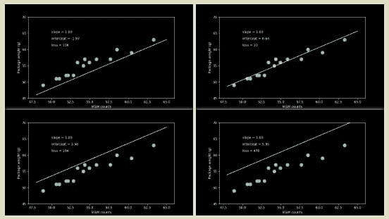

# 端到端机器学习：从图像制作视频

> 原文：[`www.kdnuggets.com/2019/05/making-videos-from-images.html`](https://www.kdnuggets.com/2019/05/making-videos-from-images.html)

 评论

### 你可以将图像拼接成电影

`ffmpeg -pattern_type glob -i '*.png' -y -c:v libx264 movie_name.mp4`

### 或将电影的帧分解为图像

`ffmpeg -i movie_name.mp4 img_%05d.png`

视频是我们理解三维和时间变化信息的自然方式。这是我们导航世界的方式。将图像转换为视频是提升数据科学结果的好方法。它帮助你更清晰地沟通，并在过程中提供引人注目的 GIF。

你也可以反向操作，将视频转换为一系列图像。如果你想对视频进行逐帧分析，这会很有帮助，尤其是在机器学习应用中。

**前提条件**

+   [安装 FFmpeg](https://ffmpeg.org/download.html)。这是一个强大的开源音视频处理工具。它有一系列令人眼花缭乱的神秘命令行选项，因此当你找到满足需求的选项时，这确实是一个 Wingardium Leviosa 时刻。它在 Linux、MacOS 和 Windows 上都可用。

+   确保所有图像的大小相同 - 即具有相同数量的像素行和列。

+   将所有你想用作视频帧的 `.png` 图像放入一个目录中。

图像按文件名的字母顺序排列，并拼接成你的视频。

对于喜欢冒险的人，你可以对这个过程的每一步进行绝对控制。想要改变帧率？使用不同的视频文件类型？添加音乐？只需阅读 [FFmpeg 文档](https://ffmpeg.org/ffmpeg.html)。

**你可以帮助保持开源的开放性**

如果这个解决方案对你有效，考虑 [向 FFmpeg 项目捐款](https://ffmpeg.org/donations.html)。也许够买一杯咖啡。或者一台咖啡机。它用于维持他们的服务器运行。所有的人工工作都是捐赠的。

祝你视频制作顺利！

[原文](https://brohrer.github.io/images_to_video.html)。经许可转载。

**相关：**

+   深度学习的预处理：从协方差矩阵到图像白化

+   使用 Numpy 和 OpenCV 进行基础图像数据分析 – 第一部分

+   掌握 Python 数据准备的 7 个步骤

* * *

## 我们的前 3 名课程推荐

 1\. [谷歌网络安全证书](https://www.kdnuggets.com/google-cybersecurity) - 快速进入网络安全职业生涯。

 2\. [谷歌数据分析专业证书](https://www.kdnuggets.com/google-data-analytics) - 提升你的数据分析技能

 3\. [谷歌 IT 支持专业证书](https://www.kdnuggets.com/google-itsupport) - 支持你的组织 IT

* * *

### 更多相关主题

+   [初学者端到端机器学习指南](https://www.kdnuggets.com/2021/12/beginner-guide-end-end-machine-learning.html)

+   [机器学习算法的完整端到端部署](https://www.kdnuggets.com/2021/12/deployment-machine-learning-algorithm-live-production-environment.html)

+   [5 种最佳端到端开源 MLOps 工具](https://www.kdnuggets.com/5-best-end-to-end-open-source-mlops-tools)

+   [一个简单实现的 HuggingFace 端到端项目](https://www.kdnuggets.com/a-simple-to-implement-end-to-end-project-with-huggingface)

+   [2024 年你必须尝试的 7 个端到端 MLOps 平台](https://www.kdnuggets.com/7-end-to-end-mlops-platforms-you-must-try-in-2024)

+   [数据质量在成功机器学习模型中的重要性](https://www.kdnuggets.com/2022/03/significance-data-quality-making-successful-machine-learning-model.html)
