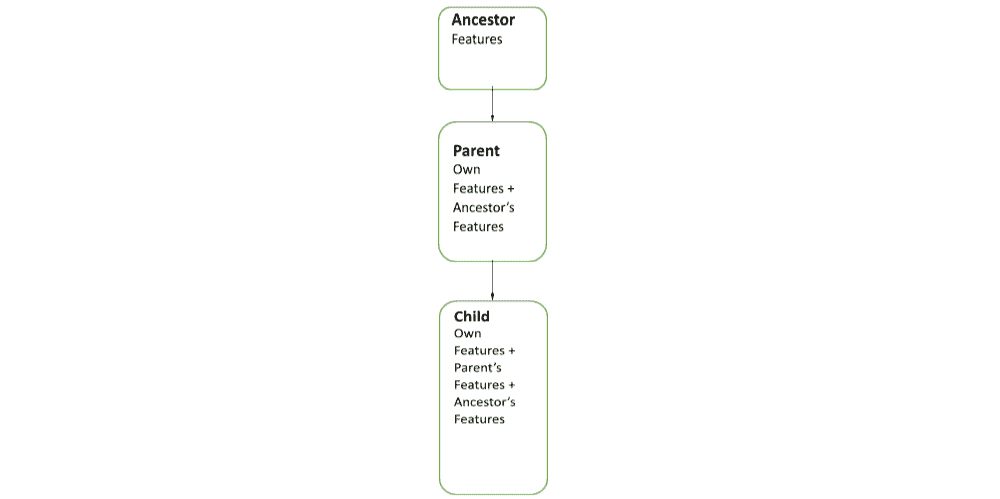
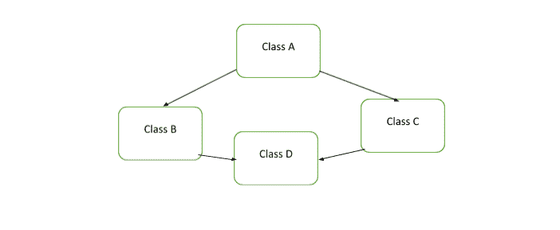
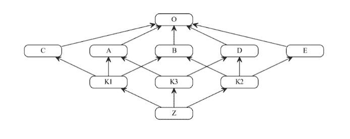

# 如何管理 Python 中的多重继承

> 原文：[`www.kdnuggets.com/2022/03/manage-multiple-inheritance-python.html`](https://www.kdnuggets.com/2022/03/manage-multiple-inheritance-python.html)


图片由 [Hitesh Choudhary](https://unsplash.com/@hiteshchoudhary?utm_source=unsplash&utm_medium=referral&utm_content=creditCopyText) 在 [Unsplash](https://unsplash.com/s/photos/python-code?utm_source=unsplash&utm_medium=referral&utm_content=creditCopyText) 提供

高级 面向对象编程语言 如 C# 和 Java 不支持多重继承。这也是有原因的。它避免了模糊性，促进了强类型和封装。这最终导致了更清晰的代码和更少令人困惑的类/对象模型结构。然而，多重继承允许更多灵活的设计模式。

* * *

## 我们的前三大课程推荐

 1\. [谷歌网络安全证书](https://www.kdnuggets.com/google-cybersecurity) - 快速进入网络安全职业生涯。

 2\. [谷歌数据分析专业证书](https://www.kdnuggets.com/google-data-analytics) - 提升你的数据分析技能

 3\. [谷歌 IT 支持专业证书](https://www.kdnuggets.com/google-itsupport) - 支持你的组织的 IT

* * *

它也可以非常方便，让程序员编写更少的代码，更快地推向生产。然而，当你处理大型、复杂的应用程序（特别是与机器学习相关的应用程序）时，多重继承可能会很难管理和维护。在本指南中，我们将学习如何使用多重继承并使其可持续。

# Python 中的多重继承

与 C++ 类似，Python 中的类可以从多个类派生（而不仅仅是一个）。派生类继承所有父类的特性（变量和方法/函数）。实际上，定义一个具有多重继承的类与定义一个具有单一继承的类没有什么不同。以下是一个示例来帮助说明这一点：

## **单一继承**

```py
class Parent:
    pass
class Child(Parent):
    pass
```

## **多重继承**

```py
class Parent1:
    pass
class Parent2:
    pass
class Child(Parent1, Parent2):
    pass
```

由于子类从两个类派生，它继承了这两个类的特性。当然，你可以从多个类继承。从理论上讲，构建子类时可以使用的类数没有限制。

# 多级继承

与大多数面向对象编程语言一样，[Python 具有多级继承](https://www.educba.com/multilevel-inheritance-in-python/)。如果你的子类是从一个继承了另一个类特性的类派生的，它将继承两个类的所有特性。



图 1

从上面的图示可以看出，类层次结构中最低的类继承了两个上层类的所有函数/方法和变量。结合多重继承，多层继承可以为开发者提供灵活的设计选项。它们还可以增加代码的重用性。然而，它们也可能使类结构变得更复杂。

例如，如果你使用一个与超类或基类中的方法具有相同名称和结构的特性（方法或变量），那么从子类中将首先调用哪个方法？你的类层次结构中可能有相同名称和签名的函数和变量。Python 是如何处理这种情况的？

# 方法解析顺序

再次说明，与大多数面向对象（OO）编程语言一样，所有类都派生自一个单一的类。在 Python 中，[这被称为](https://www.tutorialspoint.com/python/python_classes_objects.htm)对象类。因此，默认情况下，你创建的每一个类都是 Object 类的子类/派生类/子类。在尝试理解 Python 中方法和变量的调用顺序时，你必须始终记住这些信息，以便绘制程序的方法调用顺序图。

由于 Python 特性包括多重和多层继承，它需要一个系统来解决继承冲突，其中相同的属性在多个基类/超类中具有不同的定义。理解这一点的最佳方式是查看一个编码示例：

```py
class A:
    num = 10
class B(A):
    pass
class C(A):
    num = 1
class D(B,C):
    pass
```

类 A 继承自 Object 类（正如 Python 中的所有类一样）。类 B 使用类 A 作为基类。它没有自己的特性。然而，它确实从类 A 继承了 num 类对象属性（以及来自对象类的其他特性）。

类 C 也是类 A 的子类，并定义了一个类对象属性，该属性与类 A 中定义的一个属性同名。类 D 从 D 和 C 继承，但没有定义自己的属性。关系看起来像这样：



图 2

上面的图示说明了[所谓的钻石问题](https://phioro.com/jeweler/how-diamond-problem-is-handled-in-python.html)（或致命的钻石问题）。方法解析顺序（MRO）是一种解决这个问题的规则。它使用 MRO 来组织方法和属性的调用。

*注意：图 2 不是严格的依赖图。它展示了继承的流程。*

让我们添加一个引用 D 类继承的 num 属性的方法。这个方法应该在所有类之外被调用。

```py
print(D.num)
```

如果我们将其与之前的代码一起运行，它应该返回数字 1 作为输出。你可能会发现它是类 C 中 num 属性的值。但为什么会返回这个特定的属性和值呢？

MRO 从当前类开始进行属性搜索，然后移动到父类。如果有多个父类，MRO 将从左到右进行搜索。因此，在我们的示例中，搜索将按照以下顺序进行：D -> B -> C -> A -> object 类。

虽然像构建[商业计划](https://www.waveapps.com/blog/entrepreneurship/importance-of-a-business-plan)那样详细构建一个依赖图或类图会很有帮助，但这并非必要。你可以简单地使用 Python 内置的*mro()*方法来查找解析顺序。

如果我们对 D 类运行 mro() 方法并打印输出（即 print(D.mro())），控制台应显示以下结果：

`[<class '__main__.D'>, <class '__main__.B'>, <class '__main__.C'>, <class '__main__.A'>, <class 'object'>]`

再次翻译为：D -> B -> C -> A -> object 类。然而，对于如上所述的简单钻石问题，这很容易理解。然而，如果你得到：



图 3（来源：[维基媒体公用领域 (CC) 许可](https://upload.wikimedia.org/wikipedia/commons/4/47/C3_linearization_example.svg)）

MRO 使用称为深度优先搜索的算法来解析所有方法和属性调用。Python 的最新版本修订了 MRO 的工作方式。目前还不确定 Python 的类路径规则和 MRO 是否会在未来的版本中得到完善。因此，许多开发者（包括我自己）建议你避免构建过多的多重和多层次继承的程序或算法。

如果你编写的代码具有类似于上述图示的依赖结构，可以认为你写了坏代码。实际上，这个指南中的示例几乎没有类之间的真实功能代码。然而，这些结构仍然令人困惑。现在，假设你定义了具有相同结构的方法和属性并开始调用它们……

## 结论

虽然 MRO 存在并且每个 Python 开发者都应该理解它，但你的代码不应该像图 3 那样结构化。然而，作为开发者（特别是从事机器学习的开发者），你很可能会遇到具有复杂依赖关系的类结构。使用*mro()*方法应有助于你调试、解开和理解你可能没有编写的代码。

Python 相对于其他面向对象编程语言的主要优势在于其灵活性和自由度。然而，这种流动性也可能被视为一个劣势。错误和低效代码的空间过大。因此，程序员，特别是那些从事机器学习和深度学习的程序员，应学习和应用最优化的设计模式。尽管如此，为了安全起见，你可以选择完全避免在代码中使用多重继承。然而，如果你决定实现它，请谨慎且节俭地使用。

**[Nahla Davies](http://nahlawrites.com/)** 是一位软件开发者和技术写作专家。在全职投入技术写作之前，她曾担任一家 Inc. 5000 体验品牌组织的首席程序员，该组织的客户包括三星、时代华纳、Netflix 和索尼。

### 更多相关话题

+   [管理过多的 Python 版本？Pyenv 来拯救你](https://www.kdnuggets.com/too-many-python-versions-to-manage-pyenv-to-the-rescue)

+   [准备好通过…的网络安全硕士学位来管理威胁](https://www.kdnuggets.com/2022/07/baypath-prepared-manage-threat-ms-cybersecurity.html)

+   [优化和管理机器学习生命周期的前 10 个 MLOps 工具](https://www.kdnuggets.com/2022/10/top-10-mlops-tools-optimize-manage-machine-learning-lifecycle.html)

+   [准备好通过…的网络安全硕士学位来管理威胁](https://www.kdnuggets.com/2022/12/baypath-prepared-manage-threat-ms-cybersecurity.html)

+   [如何在 Bash 中管理文件和目录](https://www.kdnuggets.com/how-to-manage-files-and-directories-in-bash)

+   [如何通过 AIOps 管理复杂的 IT 生态系统](https://www.kdnuggets.com/2022/05/manage-complex-landscape-aiops.html)
