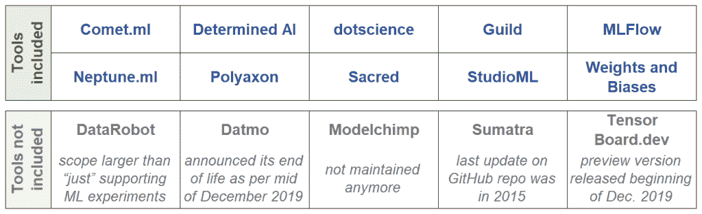

# 管理机器学习周期：从比较数据科学实验/协作工具中获得的五个经验

> 原文：[`www.kdnuggets.com/2020/01/managing-machine-learning-cycles.html`](https://www.kdnuggets.com/2020/01/managing-machine-learning-cycles.html)

评论

**由 [Dr. Michael Eble](http://twitter.michael-eble.de) 提供，hlthfwd 的联合创始人及总经理**。

机器学习项目需要处理不同版本的输入数据、源代码、超参数、环境配置等。通常，在机器学习模型可以投入生产之前，需要计算许多模型迭代。

* * *

## 我们的三大课程推荐

 1\. [谷歌网络安全证书](https://www.kdnuggets.com/google-cybersecurity) - 快速进入网络安全职业生涯。

 2\. [谷歌数据分析专业证书](https://www.kdnuggets.com/google-data-analytics) - 提升你的数据分析能力

 3\. [谷歌 IT 支持专业证书](https://www.kdnuggets.com/google-itsupport) - 支持你所在组织的 IT

* * *

在实验过程中，其工件及其相互依赖关系会增加数据科学项目的复杂性。为了管理这种复杂性，我们需要适当的结构和流程以及涵盖机器学习周期的足够软件工具。

如果你遇到类似的挑战，从比较这些工具中获得的经验可能对你有帮助。你可以在文章末尾找到我们原始数据的链接。

### 问题陈述和用例

对我们来说，相应的工具需要涵盖以下用例，并且适应典型的机器学习工作流：

+   在机器学习周期中，我们需要跟踪输入数据、源代码、环境配置、超参数和性能指标的来源及其变化。

+   此外，我们还需要比较工件的差异，以分析不同方法的效果。

+   此外，我们需要能够内部和外部解释最终投入生产的模型是如何构建的。

+   最终，能够协作和复现迭代是重要的（即使或特别是当团队成员离开项目/公司时）。

### 考虑或排除的工具

我们发现，AI、dotscience、MLFlow 和 Polyaxon 针对大型企业，而 Comet.ml、Neptune.ml 以及 Weights and Biases 面向较小的组织/初创公司。

### 选择标准

1.  支持的库和框架：该工具与哪些机器学习/深度学习框架和库（在 Python 生态系统内）兼容？到目前为止，我们主要使用 TensorFlow 和 Keras。然而，切换到 Caffe2 和 PyTorch 是可能的。

1.  与基础设施的集成：该工具支持哪些类型的基础设施？这对于将模型投入生产以及例如从 Google 迁移到 Amazon 等迁移路径的实现是相关的。

1.  指标和参数的跟踪：该工具记录了哪些性能指标（例如准确率）？它跟踪了哪些附加元数据？该标准涵盖超参数（例如批量大小）、环境配置等。

1.  额外功能：该工具是否跟踪输入数据、代码等的变化？它提供了哪些自动化超参数优化的方法？关于在团队内导出和共享实验数据的功能如何？

1.  商业模型/社区：工具可作为开源版本和/或商业版本提供。关于开源，相关 GitHub 仓库的维护活跃程度如何？在商业提供方面，业务模型是什么样的？

### 选择过程中的收获

1.  支持的库和框架：所有考虑支持 TensorFlow 和 Keras 的工具。在大多数情况下（10 个中的 8 个），scikit-learn 也得到支持。至于 Caffe2 和 PyTorch，只有 Comet.ml 和 Polyaxon 似乎支持这些工具。一些工具还附带对 MXNet、Chainer、Theano 等的额外支持。

1.  与基础设施的集成：几乎所有工具覆盖了广泛的基础设施组件——从 AWS、AML 和 GCP 到 Docker 和 Kubernetes。特别是 MLFlow、Neptune.ml 和 Polyaxon 满足了各种需求。然而，似乎没有工具支持 CNTK。工具允许在本地或 PaaS/SaaS 上部署，有些工具提供了这两种选项。

1.  指标和参数的跟踪：所有工具跟踪常见的性能指标（准确率、损失、训练时间等）和超参数（批量大小、层数、优化器名称、学习率等）。例如，MLFlow 还允许用户定义指标。模型图形等的可视化在几个工具中都是可能的。

1.  额外功能：查看代码和数据源差异是常见的——Comet.ml、dotscience、Guild 和 MLFlow 提供了这种功能，仅举几例。在至少四种情况下，这包括与 GitHub 仓库的集成。五种工具提供基于网格、随机、贝叶斯、自适应和/或 Hyperband 搜索方法的超参数优化。关于共享和协作，Jupyter 和专有数据空间是首选接口。

1.  商业模型/社区：Comet.ml、Determined AI、dotscience、Neptune.ml，以及 Weights and Biases，均提供专有许可证和相应的支付方案。Guild、MLFlow、Sacred 和 StudioML 是开源的——要么是 Apache 2.0 许可证，要么是 MIT 许可证。从贡献者、分支、观察者和 GitHub 上的星标数量来看，MLFlow 似乎拥有最活跃的社区。Polyaxon 提供其软件的商业版本和开源版本。

### 数据收集和数据来源/参考

关于这些工具的信息是在 2019 年第三季度和第四季度收集的，并逐步更新。我们尚未完全完成对所有入围工具的动手测试，但审查了相关网站、GitHub 仓库和文档。进一步的调查涉及数据可视化、服务器位置（在 PaaS/SaaS 的情况下）等方面。

你可以从 GitHub 下载包含更详细数据的完整 [电子表格](https://github.com/michael-eble/overview-ml-cycle-tools)。

**简介：** [迈克尔·艾布尔博士](http://linkedin.michael-eble.de) 是德国一家数字健康初创公司的联合创始人，负责其数据驱动的商业模型。在当前职位之前，迈克尔曾是 [管理咨询公司 mm1](https://www.mm1.com/) 的首席顾问，并负责该咨询公司的“数据思维”实践。他领导了在电信和移动等行业的项目团队，重点是新产品开发。迈克尔拥有经济学和管理学硕士学位，以及计算语言学和媒体研究硕士学位。他在波恩大学获得博士学位，同时在 [弗劳恩霍夫 IAIS 研究所](https://www.iais.fraunhofer.de/en.html) 执行数据分析项目。迈克尔目前正在完成计算机科学的学习，并撰写关于医疗领域机器学习的硕士论文。

**相关：**

+   [操作性机器学习：成功 MLOps 的七个考虑因素](https://www.kdnuggets.com/2018/04/operational-machine-learning-successful-mlops.html)

+   [数据科学家如何提高生产力](https://www.kdnuggets.com/2017/05/data-scientist-improve-productivity.html)

+   [使用 MLflow 管理机器学习生命周期  –  第一部分](https://www.kdnuggets.com/2018/07/manage-machine-learning-lifecycle-mlflow.html)

### 更多相关内容

+   [上下文、一致性和协作对数据科学成功至关重要](https://www.kdnuggets.com/2022/01/context-consistency-collaboration-essential-data-science-success.html)

+   [数据科学团队协作的 5 个最佳实践](https://www.kdnuggets.com/2023/06/5-best-practices-data-science-team-collaboration.html)

+   [数据协作失败的原因（以及修复的 4 个建议）](https://www.kdnuggets.com/2023/01/collaboration-fails-around-data-4-tips-fixing.html)

+   [协作的力量：开源项目如何推动人工智能发展](https://www.kdnuggets.com/2023/08/power-collaboration-opensource-projects-advancing-ai.html)

+   [学习如何设计、衡量和实施可靠的 A/B 测试……](https://www.kdnuggets.com/2023/01/sphere-design-measure-implement-trustworthy-ab-tests-ronny-kohavi.html)

+   [管理数据科学项目的 4 个步骤](https://www.kdnuggets.com/2022/05/4-steps-managing-data-science-project.html)
