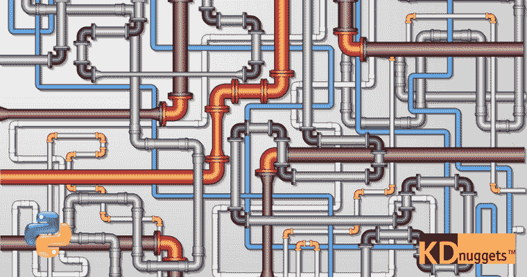

# 使用 Scikit-learn Pipelines 管理机器学习工作流 第一部分：温和的介绍

> 原文：[`www.kdnuggets.com/2017/12/managing-machine-learning-workflows-scikit-learn-pipelines-part-1.html`](https://www.kdnuggets.com/2017/12/managing-machine-learning-workflows-scikit-learn-pipelines-part-1.html)

 评论



你熟悉 Scikit-learn Pipelines 吗？

* * *

## 我们的前三大课程推荐

 1\. [谷歌网络安全证书](https://www.kdnuggets.com/google-cybersecurity) - 快速进入网络安全职业生涯。

 2\. [谷歌数据分析专业证书](https://www.kdnuggets.com/google-data-analytics) - 提升你的数据分析技能

 3\. [谷歌 IT 支持专业证书](https://www.kdnuggets.com/google-itsupport) - 支持你组织的 IT

* * *

它们是管理机器学习工作流的极其简单但非常有用的工具。

一个典型的机器学习任务通常涉及不同程度的数据准备。我们不会在这里深入探讨数据准备的各种活动，[但有很多](https://2017/06/7-steps-mastering-data-preparation-python.html)。这些任务以占用大量机器学习任务时间而闻名。

在数据集从潜在的初始大混乱状态中清理干净之后，仍然有几个较不密集但同样重要的变换数据预处理步骤，如 [特征提取](https://en.wikipedia.org/wiki/Feature_extraction)、[特征缩放](https://en.wikipedia.org/wiki/Feature_scaling) 和 [降维](https://en.wikipedia.org/wiki/Dimensionality_reduction)，仅举几例。

也许你的预处理只需要其中一种转换，比如某种形式的缩放。但也许你需要将多个转换串联起来，并*最终*用某种估算器完成。这就是 Scikit-learn Pipelines 可以提供帮助的地方。

Scikit-learn 的 [Pipeline 类](http://scikit-learn.org/stable/modules/generated/sklearn.pipeline.Pipeline.html) 旨在以可管理的方式应用一系列 [数据转换](http://scikit-learn.org/stable/data_transforms.html)，然后应用 [估算器](http://scikit-learn.org/stable/tutorial/machine_learning_map/index.html)。事实上，这就是它的全部功能：

> 转换管道与最终估算器。

就是这样。*最终*，这个简单的工具对以下内容非常有用：

+   创建连贯且易于理解的工作流的便利性

+   强制执行工作流实施和步骤应用的期望顺序

+   可重复性

+   持久化整个管道对象的价值（涉及到可重复性和便利性）

那么让我们快速了解管道。具体来说，我们将做以下事情。

**构建 3 个管道**，每个使用不同的估计器（分类算法），采用默认超参数：

+   [逻辑回归](http://scikit-learn.org/stable/modules/generated/sklearn.linear_model.LogisticRegression.html)

+   [支持向量机](http://scikit-learn.org/stable/modules/svm.html)

+   [决策树](http://scikit-learn.org/stable/modules/tree.html)

为了演示管道**转换**，将进行：

+   特征缩放

+   降维，使用 PCA 将数据投影到二维空间

然后我们将以拟合我们的最终**估计器**来结束。

之后，几乎完全不相关，为了让它更像一个完整的工作流（虽然还不是，但更接近），我们将：

+   跟进评分测试数据

+   比较管道模型的准确性

+   确定“最佳”模型，即在我们的测试数据上准确度最高的模型

+   [持久化](http://scikit-learn.org/stable/modules/model_persistence.html)（保存到文件）“最佳”模型的整个管道

当然，由于我们将使用默认超参数，这可能不会产生最准确的模型，但它会提供如何使用简单管道的感觉。我们将在之后回到更复杂的建模、超参数调整和模型评估的问题上。

哦，为了额外的简便，我们使用了鸢尾花数据集。代码注释完善，应该很容易跟随。

让我们运行我们的脚本，看看会发生什么。

```py
 $ python3 pipelines.py
```

```py
Logistic Regression pipeline test accuracy: 0.933
Support Vector Machine pipeline test accuracy: 0.900
Decision Tree pipeline test accuracy: 0.867
Classifier with best accuracy: Logistic Regression
Saved Logistic Regression pipeline to file
```

所以，这就是它；一个简单的 Scikit-learn 管道实现。在这个特定的案例中，我们基于逻辑回归的管道使用默认参数取得了最高准确率。

如上所述，这些结果可能并不代表我们的最佳努力。如果我们想测试一系列不同的超参数怎么办？我们可以使用网格搜索吗？我们可以引入自动化方法来调整这些超参数吗？AutoML 可以融入这个过程吗？使用交叉验证怎么样？

在接下来的几篇文章中，我们将关注这些额外的问题，并看看这些简单的部分如何组合在一起，使管道比初始示例看起来更强大。

**相关：**

+   掌握 Python 数据准备的 7 个步骤

+   从零开始的 Python 机器学习工作流第一部分：数据准备

+   从零开始的 Python 机器学习工作流第二部分：k-means 聚类

### 主题更多

+   [自然语言处理的温和介绍](https://www.kdnuggets.com/2022/06/gentle-introduction-natural-language-processing.html)

+   [支持向量机的温和介绍](https://www.kdnuggets.com/2023/07/gentle-introduction-support-vector-machines.html)

+   [管理深度学习数据集的新方法](https://www.kdnuggets.com/2022/03/new-way-managing-deep-learning-datasets.html)

+   [作为数据科学家管理可重用的 Python 代码](https://www.kdnuggets.com/2021/06/managing-reusable-python-code-data-scientist.html)

+   [管理数据科学项目的 4 个步骤](https://www.kdnuggets.com/2022/05/4-steps-managing-data-science-project.html)

+   [使用 MLOps 管理生产中的模型漂移](https://www.kdnuggets.com/2023/05/managing-model-drift-production-mlops.html)
