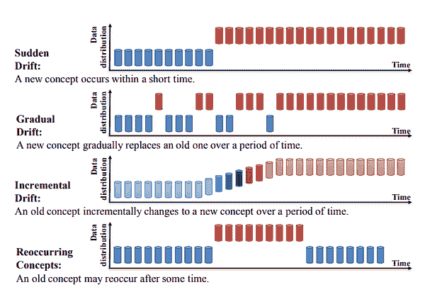

# 在生产中管理模型漂移与 MLOps

> 原文：[`www.kdnuggets.com/2023/05/managing-model-drift-production-mlops.html`](https://www.kdnuggets.com/2023/05/managing-model-drift-production-mlops.html)

机器学习模型是强大的工具，可以帮助企业做出更明智的决策并优化运营。然而，随着这些模型的部署和运行，它们会受到称为模型漂移的现象的影响。

模型漂移发生在机器学习模型的性能因底层数据的变化而随着时间下降，导致不准确的预测，并可能对企业产生重大影响。为了解决这一挑战，组织正在转向 MLOps，这是一套帮助管理生产机器学习生命周期的实践和工具。

* * *

## 我们的前三大课程推荐

 1\. [谷歌网络安全证书](https://www.kdnuggets.com/google-cybersecurity) - 快速进入网络安全职业轨道

 2\. [谷歌数据分析专业证书](https://www.kdnuggets.com/google-data-analytics) - 提升你的数据分析技能

 3\. [谷歌 IT 支持专业证书](https://www.kdnuggets.com/google-itsupport) - 支持你的组织的 IT 需求

* * *

在这篇文章中，我们将深入探讨模型漂移、不同类型的模型漂移、如何检测模型漂移以及最重要的，如何在生产中使用 MLOps 来处理模型漂移。通过理解和管理模型漂移，企业可以确保其机器学习模型随时间保持准确和有效，提供他们所需的洞察和结果以蓬勃发展。

图片由 [Nicolas Peyrol](https://unsplash.com/ko/@nicolaspeyrol?utm_source=unsplash&utm_medium=referral&utm_content=creditCopyText) 提供，来源于 [Unsplash](https://unsplash.com/photos/wRIqMJE-XaU?utm_source=unsplash&utm_medium=referral&utm_content=creditCopyText)

# 什么是模型漂移？

模型漂移，也称为模型衰退，是一种机器学习现象，指模型性能随着时间的推移而降低。这意味着模型会逐渐开始给出不准确的预测，从而导致准确性随时间降低。

模型漂移的原因有很多，例如数据收集的变化或变量之间的基本关系变化。因此，模型无法捕捉这些变化，随着变化的增加，性能会下降。

发现和解决模型漂移是 MLOps 解决的基本任务之一。技术如模型监控被用来检测模型漂移的存在，而模型重新训练是克服模型漂移的主要技术之一。

# 漂移的类型

理解模型漂移的类型对于根据数据变化更新模型至关重要。模型漂移主要有三种类型：

## 概念漂移

概念漂移发生在目标与输入之间的关系发生变化时。因此，机器学习算法将无法提供准确的预测。概念漂移主要有四种类型：

+   **突发漂移**：如果自变量与因变量之间的关系突然发生变化，就会发生突发概念漂移。一个非常著名的例子是新冠疫情的突然爆发。疫情的发生突然改变了目标变量与不同领域特征之间的关系，因此，基于预训练数据的预测模型将无法在疫情期间提供准确的预测。

+   **渐进漂移**：在渐进概念漂移中，输入与目标之间的关系可能会缓慢而微妙地变化。这会导致机器学习模型的性能缓慢下降，因为模型随着时间推移变得不那么准确。渐进概念漂移的一个例子是欺诈行为。欺诈者往往会了解欺诈检测系统的工作原理，并随着时间的推移调整自己的行为以逃避系统。因此，基于历史欺诈交易数据训练的机器学习模型将无法准确预测欺诈者行为的渐进变化。例如，考虑一个用于预测股票价格的机器学习模型，该模型以过去五年的数据进行训练，并在当前年份的新数据上评估其性能。然而，随着时间的推移，市场动态可能会发生变化，影响股票价格的变量之间的关系可能会逐渐演变。这可能导致渐进漂移，即模型的准确性随着时间的推移逐渐恶化，因为它变得越来越难以捕捉变量之间不断变化的关系。

+   **增量漂移**：增量漂移发生在目标变量与输入之间的关系随时间逐渐变化时，这通常是由于数据生成过程的变化。

+   **重复漂移**：这也称为季节性漂移。一个典型的例子是圣诞节或黑色星期五期间销售的增加。如果机器学习模型未能准确考虑这些季节性变化，将最终提供不准确的预测。

下面的图中展示了这四种概念漂移类型。

概念漂移类型 | 图片来源于[在概念漂移下学习：综述](https://arxiv.org/pdf/2004.05785.pdf)。

## 数据漂移

数据漂移发生在输入数据的统计属性发生变化时。一个例子是某个应用程序用户的年龄分布随时间变化，因此，训练时基于特定年龄分布的模型将需要调整，因为年龄变化会影响营销策略。

## 上游数据变化

第三种类型的漂移是上游数据变化。这指的是数据管道中的操作数据变化。一个典型的例子是某个特征不再生成，导致缺失值。另一个例子是测量单位的变化，例如某个传感器原本用摄氏度测量数量，然后改为华氏度。

# 检测模型漂移

检测模型漂移并不简单，并且没有通用的方法来检测它。然而，我们将讨论一些流行的方法来检测它：

+   **Kolmogorov-Smirnov 检验（K-S 检验）：** K-S 检验是一种非参数检验，用于检测数据分布的变化。它用于比较训练数据和训练后数据之间的分布变化。该检验的零假设是两个数据集的分布相同，因此如果零假设被拒绝，则说明存在模型漂移。

+   **人口稳定性指数（PSI）：** PSI 是一种统计度量，用于测量两个不同数据集中类别变量分布的相似性。因此，它可以用来测量训练数据集和训练后数据集类别变量特征的变化。

+   **Page-Hinkley 方法：** Page-Hinkley 方法也是一种统计方法，用于观察数据均值随时间的变化。它通常用于检测数据中不明显的小变化。

+   **性能监控：** 监控机器学习模型在生产环境中的性能并观察其变化是检测概念漂移的重要方法之一。如果性能变化超过某个阈值，我们可以触发某种动作来纠正这种概念漂移。

# 处理生产环境中的漂移

处理生产环境中的漂移 | 图片由 [ijeab](https://www.freepik.com/author/ijeab) 提供，来自 Freepik。

最后，让我们来看看如何处理生产环境中检测到的模型漂移。处理模型漂移的策略有广泛的范围，取决于漂移类型、我们所处理的数据以及生产中的项目。以下是处理生产环境中模型漂移的几种流行方法的总结：

+   **在线学习：** 由于大多数现实世界应用运行在流数据上，在线学习是处理漂移的常见方法之一。在在线学习中，模型在处理一个样本时会实时更新。

+   **定期重新训练模型：** 一旦模型性能下降到某个阈值以下或观察到数据漂移，可以设置触发器，用最新数据重新训练模型。

+   **在代表性子样本上定期重新训练：** 处理概念漂移的一个更有效的方法是选择一个具有代表性的子样本，并使用人工专家标注它们，然后在这些样本上重新训练模型。

+   **特征丢弃：** 这是一种简单但有效的方法，用于处理概念漂移。使用此方法，我们将训练多个模型，每个模型使用一个特征，并监控每个模型的 AUC-ROC 响应，如果 AUC-ROC 值超出特定阈值，则可以丢弃该特征，因为它可能参与了漂移。

## 参考文献

+   [处理概念漂移的最佳实践](https://neptune.ai/blog/concept-drift-best-practices)

+   [理解数据漂移和模型漂移：Python 中的漂移检测](https://www.datacamp.com/tutorial/understanding-data-drift-model-drift)

+   [机器学习概念漂移？—?它是什么以及五个处理步骤](https://www.seldon.io/machine-learning-concept-drift)

在本文中，我们讨论了模型漂移，这是指机器学习中由于基础数据的变化导致模型性能随着时间恶化的现象。为了克服这些挑战，企业正在转向 MLOps，一套管理生产中机器学习模型生命周期的实践和工具。

我们概述了可能发生的不同类型的漂移，包括概念漂移、数据漂移和上游数据变化，以及如何使用 Kolmogorov-Smirnov 检验、人口稳定性指数和 Page-Hinkley 方法检测模型漂移。最后，我们讨论了处理生产中模型漂移的流行技术，包括在线学习、定期模型重新训练、在代表性子样本上定期重新训练和特征丢弃。

**[Youssef Rafaat](https://www.linkedin.com/in/youssef-hosni-b2960b135)** 是一名计算机视觉研究员和数据科学家。他的研究集中在为医疗保健应用开发实时计算机视觉算法。他还在市场营销、金融和医疗保健领域担任数据科学家超过 3 年。

### 更多相关话题

+   [使用 Eurybia 检测数据漂移以确保生产 ML 模型质量](https://www.kdnuggets.com/2022/07/detecting-data-drift-ensuring-production-ml-model-quality-eurybia.html)

+   [MLOps 心态：始终保持生产就绪](https://www.kdnuggets.com/2023/07/mlops-mindset-always-productionready.html)

+   [将机器学习模型部署到云端生产环境](https://www.kdnuggets.com/deploying-your-ml-model-to-production-in-the-cloud)

+   [作为数据科学家的可重用 Python 代码管理](https://www.kdnuggets.com/2021/06/managing-reusable-python-code-data-scientist.html)

+   [管理深度学习数据集的新方法](https://www.kdnuggets.com/2022/03/new-way-managing-deep-learning-datasets.html)

+   [管理数据科学项目的 4 个步骤](https://www.kdnuggets.com/2022/05/4-steps-managing-data-science-project.html)
