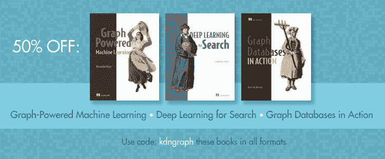

# 关于图形驱动机器学习、图形数据库、搜索深度学习的书籍——享受 50%折扣

> 原文：[`www.kdnuggets.com/2019/05/manning-books-graph-machine-learning-databases.html`](https://www.kdnuggets.com/2019/05/manning-books-graph-machine-learning-databases.html)

**由 Manning 出版社出版。** 赞助文章。

在现实世界中，数据很少像行和列那样简单。数据模式更像是一个网络，存在着大量的链接、连接和不同数据点之间的关系。作为机器学习工程师，我们如何建模这种复杂的互联性，以改善我们的机器学习应用？这正是基于图形的机器学习的优势所在。

基于图形的机器学习是处理大数据集中的模式匹配任务的一个极其强大的工具。通过将数据组织和分析为图形，你的应用程序能够更流畅地发现连接和识别关系。这可能是你提升搜索结果优化、推荐引擎或社交网络等常见机器学习任务性能的关键。

Manning 出版社有三本书能帮助你充分利用图形驱动的数据库。更棒的是，限时优惠，使用代码**kdngraph**，你可以在[manning.com](https://www.manning.com/)上享受**半价优惠**！以下是每本书的简要介绍。

[《Graph-Powered Machine Learning》](https://www.manning.com/books/graph-powered-machine-learning)教你如何使用基于图形的算法和策略来开发优越的机器学习应用。基于作者与真实客户合作的三个端到端应用实例，让主题生动有趣！

在[《Graph Databases in Action》](https://www.manning.com/books/graph-databases-in-action)中，你将学习如何为你的任务选择合适的数据库解决方案，以及如何利用新知识构建敏捷、灵活和高性能的图形驱动应用程序！

[《Deep Learning for Search》](https://www.manning.com/books/deep-learning-for-search)将所有内容结合在一起，教你如何利用神经网络、自然语言处理和深度学习技术来提升搜索性能，并每次都给客户提供正确的结果。

无论你是希望帮助客户找到更好的搜索结果，还是希望在你的工具包中增加更多技能，这三本书都是实现目标的完美选择。

今天**任何一本书都可以享受 50%折扣！** 只需在 manning.com 结账时使用代码**kdngraph**。此优惠适用于电子书和印刷版。

* * *

## 我们的前三个课程推荐

 1\. [Google 网络安全证书](https://www.kdnuggets.com/google-cybersecurity) - 快速进入网络安全职业生涯。

 2\. [谷歌数据分析专业证书](https://www.kdnuggets.com/google-data-analytics) - 提升你的数据分析技能

 3\. [谷歌 IT 支持专业证书](https://www.kdnuggets.com/google-itsupport) - 支持你组织的 IT 部门

* * *

### 更多相关内容

+   [如何使用图数据库构建实时推荐引擎](https://www.kdnuggets.com/2023/08/build-realtime-recommendation-engine-graph-databases.html)

+   [使用向量数据库进行语义搜索](https://www.kdnuggets.com/semantic-search-with-vector-databases)

+   [使用网格搜索和随机搜索在 Python 中调整超参数](https://www.kdnuggets.com/2022/10/hyperparameter-tuning-grid-search-random-search-python.html)

+   [构建视觉搜索引擎 - 第二部分：搜索引擎](https://www.kdnuggets.com/2022/02/building-visual-search-engine-part-2.html)

+   [通过 Uplimit 的机器学习搜索课程提升你的搜索引擎技能！](https://www.kdnuggets.com/2023/10/uplimit-elevate-your-search-engine-skills-search-with-ml-course)

+   [通过 DataCamp 以 25% 折扣获取世界级数据科学学习](https://www.kdnuggets.com/2023/03/datacamp-world-class-data-science-learning.html)
