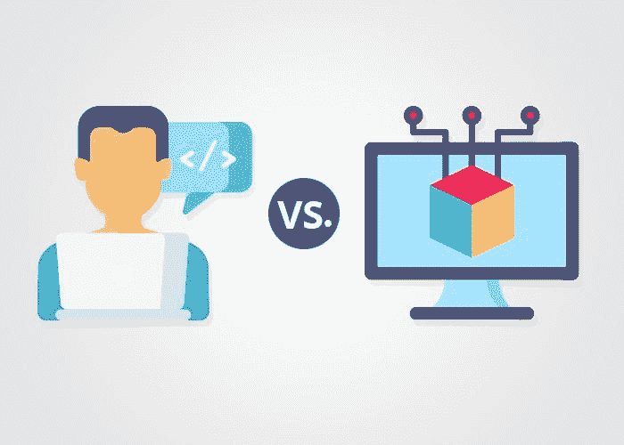
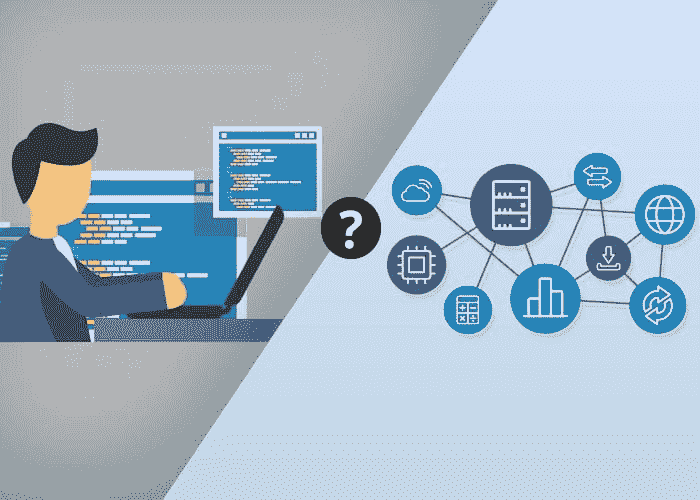
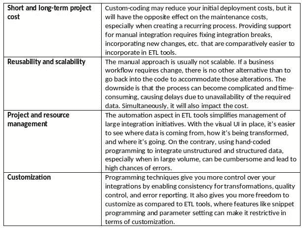

# 手动编码还是自动化数据集成 – 何者为最佳的数据集成方式？

> 原文：[`www.kdnuggets.com/2019/08/manual-coding-automated-data-integration-best-way.html`](https://www.kdnuggets.com/2019/08/manual-coding-automated-data-integration-best-way.html)

 评论

**作者 [Tehreem Naeem](https://www.linkedin.com/in/tehreem-naeem/)，Astera**

* * *

## 我们的前三大课程推荐

 1\. [谷歌网络安全证书](https://www.kdnuggets.com/google-cybersecurity) - 快速进入网络安全职业轨道。

 2\. [谷歌数据分析专业证书](https://www.kdnuggets.com/google-data-analytics) - 提升您的数据分析能力

 3\. [谷歌 IT 支持专业证书](https://www.kdnuggets.com/google-itsupport) - 支持您的组织进行 IT 管理

* * *

数据到洞察的旅程对每个组织在做出决策和获得盈利结果方面都非常重要。集成是这一旅程中的关键步骤，它简化了数据处理流程，使决策者能够获取信息。

[Gartner 估计](https://www.gartner.com/smarterwithgartner/use-a-hybrid-integration-approach-to-empower-digital-transformation/)到 2020 年，构建数字平台的成本和时间中有 50%将用于集成。这意味着通过简化集成，您可以消除数据管道中的瓶颈。

所有这些挑战使得企业必须将[数据集成](https://www.astera.com/type/blog/data-integration-tools-for-businesses/)作为一种策略进行适应；这种策略应符合您的企业需求和目标。选择合适的数据集成策略时，数据的类型、量和质量都会影响决定。根据这些因素和其他一些因素，组织会决定是采用手动还是自动化的集成方式。

### 设计数据集成策略 – 需要考虑的因素

设计一个良好的数据集成策略时，必须评估您的企业数据的范围及其对初始集成项目之外的计划的影响。关键在于，随着公司增长，您的数据量也会增加。设计一个考虑到这种增长的集成策略将有助于您建立作为数据驱动型组织的声誉。

这三大因素将帮助您规划一个强大的数据集成策略：

**长期计划**

在大多数组织中，数据集成是迈向更大目标的第一步，比如迁移或数据仓库。例如，一个最初希望整合其市场营销和销售数据的组织，可能最终目标是创建一个具有详细客户记录的主数据管理系统。因此，在做出选择时，应该考虑项目的最终目标。

**成本**

无论是手动还是自动化的数据集成方案都会产生成本。这包括设计、维护和扩展持续流项目所需的资源，如果你希望建立数据驱动的组织声誉。同时，这可能还需要在公司范围内对组织功能进行变更，除了技术方面。如果你希望修改公司的数据环境，请确保与那些了解这些变化如何影响业务和数据工作的 IT 用户的利益相关者合作。

**可扩展性**

将新技术与现有系统集成的能力为你的组织带来了显著的改善。然而，如果你倾向于手动方法，你将无法在数据生态系统中纳入这些技术，而不需要投入大量的开发时间和开发人员资源。一个足够可扩展的集成策略，能够适应如云应用和基础设施等新技术进展，能够为组织带来显著的改善。

### 手动与自动化的困境——找到正确的方法

手动与自动化的方法一直是数据专业人士讨论的焦点。倾向于手动方法的组织认为这是一个成本效益高的选项，而使用 ETL 工具的用户则看重其自动化功能。

根据数据管理专家[里克·谢尔曼](https://www.elsevier.com/books/business-intelligence-guidebook/sherman/978-0-12-411461-6)的说法，一些组织仍然倾向于手动集成方法。这在中小型企业中是一种普遍的做法。即使一些大型企业也会使用 SQL 编码和存储过程来提取和集成数据，以进行报告和分析。

对于其他组织来说，可能合适的选择，对你来说也许是一个错误的方向。为了使这一点更加透明，我们根据常见的决定因素讨论了这两种方法：

两种方法都有其优点，但主要问题是，如何找到适合你组织的方法。考虑以下问题，这将帮助你做出决定：

**你是否有足够的开发人员资源来完成集成任务？**

找到优秀的开发人员很难，尤其是使用新技术（如云平台或 Hadoop）的专家。如果业务用户和编码新手可以使用 ETL 工具完成相同的任务，而且所需时间更少，您不会更愿意将他们的专业技能用于更复杂的任务吗？

**这是一次性的任务还是定期任务，或者您是否计划扩展项目的范围？**

如果您正在进行使用大数据或分析的集成工作，那么它可能是一个定期任务。在这种情况下，修改代码或寻找专家以维护任务以维持集成流可能会很耗时。而对于一次性任务，您可能更适合使用手动编码。

**您是否能够在不同的技术平台上重用代码？**

在规划项目成本和时间表时，考虑到如果您决定将其纳入数据管道，可能需要额外的努力来重新开发代码以适应任何新平台。大多数 ETL 工具允许数据从一个处理平台轻松转移到另一个平台。

**谁将负责集成项目的维护？**

如果您在编写手动代码，您的开发人员不仅需要负责编写代码，还需要维护代码。后者可能是一个耗时的任务，使他们难以兼顾其他项目。

**该项目是否涉及多个用户？**

可视化界面、自动化、易于重用；这些只是使 ETL 工具成为涉及多个用户的集成项目的首选选项的一些因素。

### 收获

在当今世界，数据集成是获取商业关键洞察和获得竞争优势的最快方法之一。因此，选择正确的策略和工具来实现预期的商业目标对于组织来说至关重要。手动编码的简单性使其成为一个有吸引力的选择，但从长远来看，ETL 的自动化、直接体验效果更佳。哪种集成策略适合您的组织？

**简历：[Tehreem Naeem](https://www.linkedin.com/in/tehreem-naeem/)** 是 Astera 的技术内容策略师，Astera 是一家数据管理解决方案提供商，她在这里创建以产品为重点的内容。她拥有来自知名机构的电子工程学位，并在该领域有超过 7 年的经验。

**相关：**

+   数据工程师的角色正在发生变化

+   ETL 与 ELT：考虑数据仓库的进展

+   数据集成与数据工程有什么区别？

### 更多相关话题

+   [通过 Scikit-LLM 将 LLM 轻松集成到您的 Scikit-learn 工作流程中](https://www.kdnuggets.com/easily-integrate-llms-into-your-scikit-learn-workflow-with-scikit-llm)

+   [轻松从网站上抓取图片，无需编码](https://www.kdnuggets.com/2022/06/octoparse-scrape-images-easily-websites-nocoding-way.html)

+   [人工智能如何改变数据集成](https://www.kdnuggets.com/2022/04/artificial-intelligence-transform-data-integration.html)

+   [SQL 与数据集成：ETL 与 ELT](https://www.kdnuggets.com/2023/01/sql-data-integration-etl-elt.html)

+   [ETL 与 ELT：数据集成对决](https://www.kdnuggets.com/2022/08/etl-elt-data-integration-showdown.html)

+   [AI/ML 技术集成如何帮助企业实现…](https://www.kdnuggets.com/2021/12/aiml-technology-integration-help-business-achieving-goals-2022.html)
