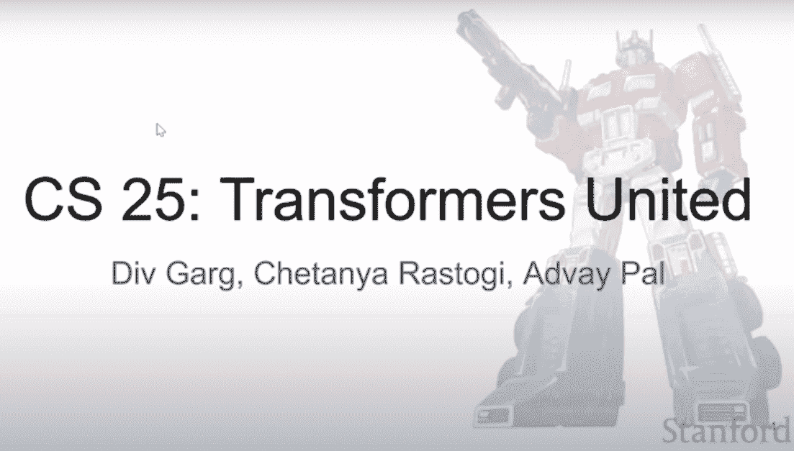

# 使用这门免费的斯坦福课程掌握变换器！

> 原文：[`www.kdnuggets.com/2022/09/master-transformers-free-stanford-course.html`](https://www.kdnuggets.com/2022/09/master-transformers-free-stanford-course.html)

截图来自于 [Transformers United: DL Models that have revolutionized NLP, CV, RL](https://www.youtube.com/watch?v=P127jhj-8-Y&list=PLoROMvodv4rNiJRchCzutFw5ItR_Z27CM)

最先进（SOTA）的自然语言处理（NLP）意味着变换器！

* * *

## 我们的三大课程推荐

 1\. [Google 网络安全证书](https://www.kdnuggets.com/google-cybersecurity) - 快速进入网络安全职业生涯。

 2\. [Google 数据分析专业证书](https://www.kdnuggets.com/google-data-analytics) - 提升你的数据分析能力

 3\. [Google IT 支持专业证书](https://www.kdnuggets.com/google-itsupport) - 支持你的组织 IT

* * *

不是 [擎天柱或大黄蜂](https://i.imgur.com/G0wiCyI.jpeg)（80 年代的小伙伴们站起来！），而是这种神经网络架构，在过去几年里彻底改变了 NLP 领域。

有很多资源可以学习变换器及其在 SOTA NLP 中的应用，但似乎只有这门课程采用了系统的、学术的方法来真正理解变换器的内在，而这门课程就是斯坦福大学的 [CS25: Transformers United](https://web.stanford.edu/class/cs25/)。

让我立刻说明：这不是一个你可以报名并获得学分的课程。这是第一门关于变换器的大学课程的免费内容（据我了解），由斯坦福大学的讲师提供，在著名自然语言处理（NLP）研究员和教职工克里斯·曼宁的指导下进行。但不要灰心；所有课程材料都可以获得，包括阅读资料、视频等。如果你真的对深入理解变换器感兴趣，这门课程就是为你准备的。

尽管变换器可能最常与 NLP 应用相关，但还有更多内容值得关注。

> 自 2017 年推出以来，变换器已经彻底改变了自然语言处理（NLP）。现在，变换器正在深度学习领域得到应用，无论是计算机视觉（CV）、强化学习（RL）、生成对抗网络（GANs）、语音还是生物学等。变换器不仅促进了强大语言模型如 GPT-3 的创建，还在 DeepMind 最近的 AlphaFold2 中发挥了重要作用，该模型解决了蛋白质折叠问题。
> 
> 来自斯坦福大学的 [CS25: Transformers United](https://web.stanford.edu/class/cs25/) 课程主页

该课程内容全面，分为 10 周的讲座。你将首先学习注意力机制，这一概念催生了变换器，然后学习变换器本身，接着是它们在自然语言处理中的应用、视觉变换器、预训练变换器、开关变换器等等。课程包括 Geoff Hinton、Chris Olah、Aidan Gomez 及许多该领域的知识渊博的研究人员的讲座。课程讲师为 Div Garg、Chetanya Rastogi、Advay Pal，Chris Manning，如前所述，担任教师顾问。

你可以在下面找到讲座视频，也可以在 [YouTube](https://www.youtube.com/playlist?list=PLoROMvodv4rNiJRchCzutFw5ItR_Z27CM) 上观看。

这似乎是目前任何地方可以获得的变换器课程中的巅峰之作，因此，如果你认真想要深入学习变换器，请访问 [课程页面](https://web.stanford.edu/class/cs25/) 并立即开始学习。

**[Matthew Mayo](https://www.linkedin.com/in/mattmayo13/)** ([**@mattmayo13**](https://twitter.com/mattmayo13)) 是数据科学家以及 KDnuggets 的主编，KDnuggets 是开创性的在线数据科学和机器学习资源。他的兴趣包括自然语言处理、算法设计与优化、无监督学习、神经网络以及机器学习的自动化方法。Matthew 拥有计算机科学硕士学位和数据挖掘研究生文凭。他可以通过 editor1 at kdnuggets[dot]com 联系到。

### 更多相关内容

+   [免费学习斯坦福大学计算机科学中的概率论](https://www.kdnuggets.com/learn-probability-in-computer-science-with-stanford-university-for-free)

+   [来自哈佛、斯坦福等的免费数据科学课程合集](https://www.kdnuggets.com/a-collection-of-free-data-science-courses-from-harvard-stanford-mit-cornell-and-berkeley)

+   [5 个免费的斯坦福大学数据科学学习课程](https://www.kdnuggets.com/5-free-stanford-university-courses-to-learn-data-science)

+   [5 个免费的斯坦福 AI 课程](https://www.kdnuggets.com/5-free-stanford-ai-courses)

+   [关于 AI 质量管理的免费 4 周数据科学课程](https://www.kdnuggets.com/2022/02/truera-free-4-week-data-science-course-ai-quality-management.html)

+   [通过这个免费的 DevOps 速成课程释放你的潜力](https://www.kdnuggets.com/2023/03/corise-unlock-potential-with-this-free-devops-crash-course.html)
