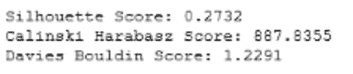
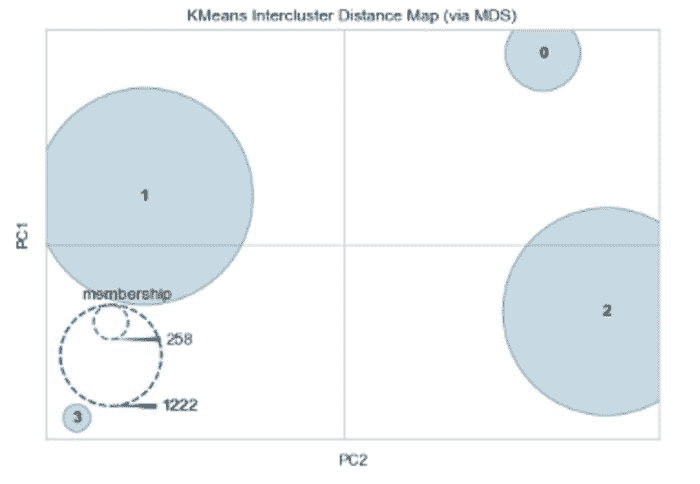
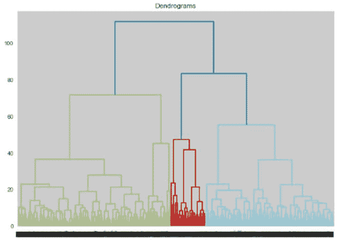
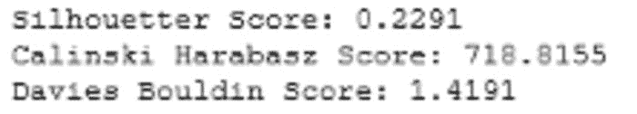
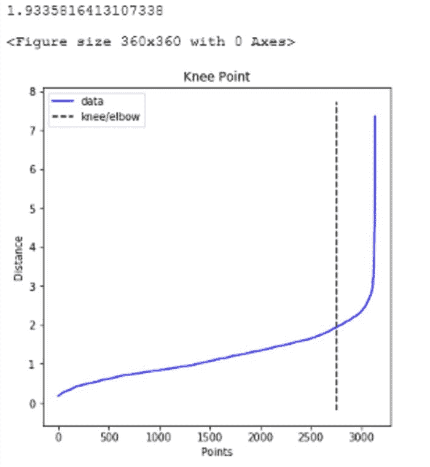
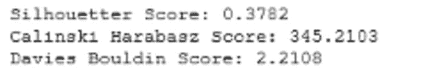
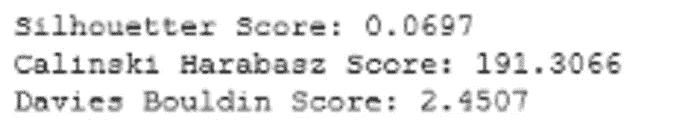

# 掌握具有细分问题的聚类

> 原文：[`www.kdnuggets.com/2021/08/mastering-clustering-segmentation-problem.html`](https://www.kdnuggets.com/2021/08/mastering-clustering-segmentation-problem.html)

评论

**由 [Indraneel Dutta Baruah](https://indraneeldb1993ds.medium.com/) 提供，人工智能驱动的解决方案开发者**


照片由 [Mel Poole](https://unsplash.com/@melipoole) 提供，发布于 [Unsplash](https://unsplash.com/?utm_source=medium&utm_medium=referral)

在当前时代，针对大量客户/产品的详细数据的可用性和处理 PB 级数据的技术能力正在迅速增长。因此，现在可以提出非常有战略意义和有效的目标群体集群。识别目标细分需要一个强大的细分过程。在这篇博客中，我们将讨论最流行的无监督聚类算法及其在 python 中的实现方法。

在这篇博客中，我们将使用来自在线商店的点击流 [数据](https://archive.ics.uci.edu/ml/datasets/clickstream+data+for+online+shopping)，该商店提供孕妇服装。数据包括产品类别、网页上照片的位置、IP 地址的来源国家和以美元计的产品价格。数据时间范围从 2008 年 4 月到 2008 年 8 月。

*第一步是为细分准备数据。我建议你查看下面的文章，以获取有关数据准备的详细说明，然后再继续：*

[*独热编码、标准化、PCA：Python 中细分的数据准备步骤*](https://towardsdatascience.com/one-hot-encoding-standardization-pca-data-preparation-steps-for-segmentation-in-python-24d07671cf0b)

*选择最佳聚类数是处理细分问题时应了解的另一个关键概念。如果你阅读下面的文章，将有助于理解选择聚类的全面指标列表：*

[*在 Python 中实现选择最佳聚类数的 7 种方法的备忘单*](https://towardsdatascience.com/cheat-sheet-to-implementing-7-methods-for-selecting-optimal-number-of-clusters-in-python-898241e1d6ad)

在这篇博客中，我们将讨论 4 类模型：

1.  K-means

1.  凝聚层次聚类

1.  基于密度的空间聚类（DBSCAN）

1.  高斯混合模型（GMM）

## **K-means**

K-means 算法是一个迭代过程，包括三个关键阶段：

**1\. 选择初始聚类中心**

该算法首先选择初始 k 个聚类中心，即质心。确定最佳聚类数 k 以及正确选择初始聚类对模型性能至关重要。聚类数应始终依赖于数据集的性质，而初始聚类选择不当可能会导致局部收敛问题。幸运的是，我们有解决这两个问题的方法。

有关选择最佳聚类数的更多细节，请参阅这篇详细的[博客](https://towardsdatascience.com/cheat-sheet-to-implementing-7-methods-for-selecting-optimal-number-of-clusters-in-python-898241e1d6ad)。对于初始聚类的选择，我们可以通过运行多个不同初始化的模型迭代来选择最稳定的聚类，或者使用“k-means++”算法，其步骤如下：

1.  *从数据集中随机选择第一个质心*

1.  *计算数据集中所有点与选择的质心之间的距离*

1.  *选择具有最大概率的点作为新的质心，按距离的比例*

1.  *重复步骤 2 和 3，直到采样到 k 个质心*

该算法将质心初始化为彼此远离，从而比随机初始化更稳定。

**2. 聚类分配**

K-means 然后根据点到所有质心的欧几里得距离，将数据点分配到最近的聚类质心。

**3. 移动质心**

模型最终计算聚类中所有点的平均值，并将质心移动到该平均位置。

步骤 2 和 3 会重复，直到聚类没有变化或满足其他停止条件（如最大迭代次数）。

在 Python 中实现模型时，我们需要首先指定聚类数。我们使用了肘部法、Gap Statistic、轮廓系数、Calinski Harabasz 分数和 Davies Bouldin 分数。每种方法的最佳聚类数如下：

1.  肘部法: 8

1.  Gap statistic: 29

1.  轮廓系数: 4

1.  Calinski Harabasz 分数: 2

1.  Davies Bouldin 分数: 4

如上所述，5 种方法中有 2 种建议使用 4 个聚类。如果每种模型建议不同数量的聚类，我们可以取其平均值或中位数。找到最佳 k 数的代码可以在[这里](https://github.com/IDB-FOR-DATASCIENCE/Segmentation-Modelling.git)找到，而每种方法的进一步细节可以在这篇[博客](https://towardsdatascience.com/cheat-sheet-to-implementing-7-methods-for-selecting-optimal-number-of-clusters-in-python-898241e1d6ad)中找到。

一旦我们有了最佳聚类数，就可以拟合模型，并使用轮廓系数、Calinski Harabasz 分数和 Davies Bouldin 分数来评估模型的性能。

```py
# K meansfrom sklearn.cluster import KMeans
from sklearn.metrics import silhouette_score 
from sklearn.metrics import calinski_harabasz_score
from sklearn.metrics import davies_bouldin_score# Fit K-Means
kmeans_1 = KMeans(n_clusters=4,random_state= 10)# Use fit_predict to cluster the dataset
predictions = kmeans_1.fit_predict(cluster_df)# Calculate cluster validation metricsscore_kemans_s = silhouette_score(cluster_df, kmeans_1.labels_, metric='euclidean')score_kemans_c = calinski_harabasz_score(cluster_df, kmeans_1.labels_)score_kemans_d = davies_bouldin_score(cluster_df, predictions)print('Silhouette Score: %.4f' % score_kemans_s)
print('Calinski Harabasz Score: %.4f' % score_kemans_c)
print('Davies Bouldin Score: %.4f' % score_kemans_d)
```



图 1: K-Means 聚类验证指标（作者提供的图像）

我们还可以使用聚类间距离图来检查聚类的相对大小和分布。

```py
# Inter cluster distance map
from yellowbrick.cluster import InterclusterDistance# Instantiate the clustering model and visualizervisualizer = InterclusterDistance(kmeans_1)visualizer.fit(cluster_df)        # Fit the data to the visualizer
visualizer.show()        # Finalize and render the figure
```



图 2：聚类间距离图：K-Means（作者提供的图片）

如上图所示，两个聚类相较于其他聚类较大，并且它们之间似乎有良好的分隔。然而，如果两个聚类在二维空间中重叠，这并不意味着它们在原始特征空间中也重叠。有关模型的更多细节可以在[这里](https://projecteuclid.org/euclid.bsmsp/1200512992)找到。最后，像 Mini Batch K-means、K-Medoids 这样的 K-Means 变体将在另一篇博客中讨论。

## 聚合聚类

聚合聚类是一种通用的聚类算法家族，通过连续合并数据点来构建嵌套的聚类。这种层级的聚类可以表示为称为树状图的树形图。树的顶端是一个包含所有数据点的单一聚类，而底部包含单个点。有多种选项可以以连续的方式链接数据点：

+   **单链式连接：** 它最小化聚类对之间最近观察值的距离

+   **完整或最大链式连接：** 尝试最小化聚类对之间观察值的最大距离

+   **平均链式连接：** 它最小化所有聚类对之间观察值距离的平均值

+   **Ward：** 类似于 k-means，因为它最小化所有聚类内的平方差之和，但采用层级方法。我们将在练习中使用这个选项。

理想的选项可以通过检查哪种连接方法在聚类验证指标（轮廓系数、Calinski Harabasz 评分和 Davies Bouldin 评分）中表现最佳来选择。与 K-means 类似，我们还需要在此模型中指定聚类数，树状图可以帮助我们做到这一点。

```py
# Dendrogram for Hierarchical Clustering
import scipy.cluster.hierarchy as shc
from matplotlib import pyplot
pyplot.figure(figsize=(10, 7))  
pyplot.title("Dendrograms")  
dend = shc.dendrogram(shc.linkage(cluster_df, method='ward'))
```



图 3：树状图（作者提供的图片）

从图 3 中，我们可以选择 4 或 8 个聚类。我们还使用肘部法、轮廓系数和 Calinski Harabasz 评分来寻找最佳聚类数，得到以下结果：

1.  肘部法：10

1.  Davies Bouldin 评分：8

1.  轮廓系数：3

1.  Calinski Harabasz 评分：2

我们将选择 8，因为 Davies Bouldin 评分和树状图都建议这样做。如果指标给出不同的聚类数，我们可以选择树状图建议的数量（因为它基于这个特定模型）或取所有指标的平均值/中位数。寻找最佳聚类数的代码可以在[这里](https://github.com/IDB-FOR-DATASCIENCE/Segmentation-Modelling.git)找到，关于每种方法的更多细节可以在这个[博客](https://towardsdatascience.com/cheat-sheet-to-implementing-7-methods-for-selecting-optimal-number-of-clusters-in-python-898241e1d6ad)中找到。

与 K-means 类似，我们可以通过优化的聚类数量和连接类型来拟合模型，并使用 K-means 中使用的三种度量标准来测试其性能。

```py
# Agglomerative clustering
from numpy import unique
from numpy import where
from sklearn.cluster import AgglomerativeClustering
from matplotlib import pyplot# define the model
model = AgglomerativeClustering(n_clusters=4)
# fit model and predict clusters
yhat = model.fit(cluster_df)
yhat_2 = model.fit_predict(cluster_df)
# retrieve unique clusters
clusters = unique(yhat)# Calculate cluster validation metricsscore_AGclustering_s = silhouette_score(cluster_df, yhat.labels_, metric='euclidean')score_AGclustering_c = calinski_harabasz_score(cluster_df, yhat.labels_)score_AGclustering_d = davies_bouldin_score(cluster_df, yhat_2)print('Silhouette Score: %.4f' % score_AGclustering_s)
print('Calinski Harabasz Score: %.4f' % score_AGclustering_c)
print('Davies Bouldin Score: %.4f' % score_AGclustering_d)
```



图 4：聚类验证指标：层次聚类（作者提供的图像）

比较图 1 和图 4，我们可以看到 K-means 在所有聚类验证指标上优于层次聚类。

## 基于密度的空间聚类 (DBSCAN)

DBSCAN 将紧密聚集在一起的点分组，而将那些孤立在低密度区域的点标记为离群点。模型中定义“密度”的两个关键参数是：形成密集区域所需的最小点数 `min_samples` 和定义邻域的距离 `eps`。较高的 `min_samples` 或较低的 `eps` 需要更高的密度来形成一个簇。

基于这些参数，DBSCAN 从一个任意点 x 开始，根据 `eps` 识别 x 的邻域内的点，并将 x 分类为以下之一：

1.  **核心点**：如果邻域中的点数至少等于 `min_samples` 参数，则称其为核心点，并且围绕 x 形成一个簇。

1.  **边界点**：如果 x 是一个聚类的一部分，该聚类的核心点不同，但其邻域中的点数少于 `min_samples` 参数，则 x 被认为是边界点。直观上，这些点位于聚类的边缘。

1.  **离群点或噪声**：如果 x 不是核心点，并且与任何核心样本的距离至少等于或大于 `eps`，则它被认为是离群点或噪声。

为了调整模型参数，我们首先通过查找点邻域之间的距离并绘制最小距离来识别最佳的 `eps` 值。这会给我们一个肘部曲线来找出数据点的密度，最佳的 `eps` 值可以在拐点处找到。我们使用 `NearestNeighbours` 函数来获取最小距离，并使用 `KneeLocator` 函数来识别拐点。

```py
# parameter tuning for eps
from sklearn.neighbors import NearestNeighbors
nearest_neighbors = NearestNeighbors(n_neighbors=11)
neighbors = nearest_neighbors.fit(cluster_df)
distances, indices = neighbors.kneighbors(cluster_df)
distances = np.sort(distances[:,10], axis=0)from kneed import KneeLocator
i = np.arange(len(distances))
knee = KneeLocator(i, distances, S=1, curve='convex', direction='increasing', interp_method='polynomial')
fig = plt.figure(figsize=(5, 5))
knee.plot_knee()
plt.xlabel("Points")
plt.ylabel("Distance")print(distances[knee.knee])
```



图 5：eps 的最佳值（作者提供的图像）

如上所示，最佳的 `eps` 值为 1.9335816413107338。我们将使用这个值作为参数，并根据轮廓系数、Calinski Harabasz 评分和 Davies Bouldin 评分来尝试找出最佳的 `min_samples` 参数值。对于这些方法，每种方法的最佳簇数量如下：

1.  轮廓系数：18

1.  Calinski Harabasz 评分：29

1.  Davies Bouldin 评分：2

查找最优 `min_samples` 的代码可以在 [这里](https://github.com/IDB-FOR-DATASCIENCE/Segmentation-Modelling.git) 找到，每种方法的进一步细节可以在这个 [博客](https://towardsdatascience.com/cheat-sheet-to-implementing-7-methods-for-selecting-optimal-number-of-clusters-in-python-898241e1d6ad) 中找到。我们选择了 Silhouette 评分的中位数建议，即 18。如果没有时间对这些指标进行网格搜索，一条快速的经验法则是将 `min_samples` 参数设置为特征数的两倍。

```py
# dbscan clustering
from numpy import unique
from numpy import where
from sklearn.cluster import DBSCAN
from matplotlib import pyplot
# define dataset
# define the model
model = DBSCAN(eps=1.9335816413107338, min_samples= 18)# rule of thumb for min_samples: 2*len(cluster_df.columns)# fit model and predict clusters
yhat = model.fit_predict(cluster_df)
# retrieve unique clusters
clusters = unique(yhat)# Calculate cluster validation metricsscore_dbsacn_s = silhouette_score(cluster_df, yhat, metric='euclidean')score_dbsacn_c = calinski_harabasz_score(cluster_df, yhat)score_dbsacn_d = davies_bouldin_score(cluster_df, yhat)print('Silhouette Score: %.4f' % score_dbsacn_s)
print('Calinski Harabasz Score: %.4f' % score_dbsacn_c)
print('Davies Bouldin Score: %.4f' % score_dbsacn_d)
```



图 6：聚类验证指标：DBSCAN（图片来源：作者）

比较图 1 和图 6，我们可以看到 DBSCAN 在 Silhouette 评分上优于 K-means。该模型在论文中进行了描述：

[一种用于发现大型空间数据库中簇的基于密度的算法](https://www.osti.gov/biblio/421283)，1996 年。

在另一篇博客中，我们将讨论一种更高级的 DBSCAN 版本，称为层次密度聚类（HDBSCAN）。

## 高斯混合建模（GMM）

高斯混合模型是一种基于距离的概率模型，它假设所有数据点是从具有未知参数的多变量高斯分布的线性组合中生成的。与 K-means 一样，它考虑了潜在高斯分布的中心，但与 K-means 不同的是，还考虑了分布的协方差结构。该算法实现了期望最大化 (EM) 算法，通过迭代找到使模型质量度量（称为对数似然）最大的分布参数。该模型执行的关键步骤包括：

1.  初始化 k 个高斯分布

1.  计算每个点与每个分布的关联概率

1.  根据每个点与分布的关联概率重新计算分布参数

1.  重复过程直到对数似然最大化

GMM 中计算协方差有 4 种选项：

1.  **完全：**每个分布具有自己的总体协方差矩阵

1.  **绑带：**所有分布共享总体协方差矩阵

1.  **对角线：**每个分布具有自己的对角协方差矩阵

1.  **球形：**每个分布具有自己的单一方差

除了选择协方差类型，我们还需要选择模型中的最佳簇数。我们使用 BIC 评分、Silhouette 评分、Calinski Harabasz 评分和 Davies Bouldin 评分，通过网格搜索来选择这两个参数。对于每种方法，最佳簇数如下：

1.  BIC 评分：协方差-‘完全’和簇数-26

1.  Silhouette 评分：协方差-‘绑带’和簇数-2

1.  Calinski Harabasz 评分：协方差-‘球形’和簇数-4

1.  Davies Bouldin 评分：协方差-‘完全’和簇数-8

查找最佳参数值的代码可以在[这里](https://github.com/IDB-FOR-DATASCIENCE/Segmentation-Modelling.git)找到，关于每种方法的更多细节可以在这个[博客](https://towardsdatascience.com/cheat-sheet-to-implementing-7-methods-for-selecting-optimal-number-of-clusters-in-python-898241e1d6ad)中找到。我们选择了“full”协方差和 26 个聚类数，是基于特定模型的 BIC 得分。如果我们从多个指标中获得相似的配置，我们可以取所有指标的平均值/中位数/众数。现在我们可以拟合模型并检查模型性能。

```py
# gaussian mixture clustering
from numpy import unique
from numpy import where
from sklearn.mixture import GaussianMixture
from matplotlib import pyplot
# define the model
model = GaussianMixture(n_components= 26,covariance_type= "full", random_state = 10)
# fit the model
model.fit(cluster_df)
# assign a cluster to each example
yhat = model.predict(cluster_df)
# retrieve unique clusters
clusters = unique(yhat)# Calculate cluster validation scorescore_dbsacn_s = silhouette_score(cluster_df, yhat, metric='euclidean')score_dbsacn_c = calinski_harabasz_score(cluster_df, yhat)score_dbsacn_d = davies_bouldin_score(cluster_df, yhat)print('Silhouette Score: %.4f' % score_dbsacn_s)
print('Calinski Harabasz Score: %.4f' % score_dbsacn_c)
print('Davies Bouldin Score: %.4f' % score_dbsacn_d)
```



图 7: 聚类验证指标：GMM（图像由作者提供）

比较图 1 和图 7，我们可以看到 K-means 在所有聚类验证指标上优于 GMM。在另一个博客中，我们将讨论一种更先进的 GMM 版本，称为变分贝叶斯高斯混合模型。

## 结论

这个博客的目的是帮助读者理解 4 种流行的聚类模型的工作原理以及它们在 python 中的详细实现。如下面所示，每种模型都有其优缺点：


图 8: 聚类算法的优缺点（图像由作者提供）

最后，重要的是要理解这些模型只是找到逻辑性和易于理解的客户/产品细分的一种手段，可以有效地针对这些细分市场。因此，在大多数实际情况下，我们最终会尝试多个模型，并从每次迭代中创建客户/产品档案，直到找到最具商业意义的细分市场。因此，细分既是一门艺术，也是一门科学。

对这个博客有任何问题或建议吗？请随时留言。

**感谢阅读！**

如果你像我一样，对 AI、数据科学或经济学充满热情，请随时在[LinkedIn](http://www.linkedin.com/in/indraneel-dutta-baruah-ds)、[Github](https://github.com/IDB-FOR-DATASCIENCE)和[Medium](https://medium.com/@indraneeldb1993ds)上添加/关注我。

**参考文献**

1.  Ester, M, Kriegel, H P, Sander, J, 和 Xiaowei, Xu. *一种基于密度的算法，用于发现具有噪声的大型空间数据库中的聚类*。美国：N. p., 1996。网络。

1.  MacQueen, J. 一些用于分类和分析多变量观察的方法。第五届伯克利统计与概率研讨会论文集，第 1 卷：统计学, 281–297，加州大学出版社，伯克利，加州，1967。 [`projecteuclid.org/euclid.bsmsp/1200512992`](https://projecteuclid.org/euclid.bsmsp/1200512992)

1.  [Scikit-learn: Python 中的机器学习](http://jmlr.csail.mit.edu/papers/v12/pedregosa11a.html)，Pedregosa *等人*，JMLR 12，第 2825–2830 页，2011 年。

**简介: [Indraneel Dutta Baruah](https://indraneeldb1993ds.medium.com/)** 正在努力通过 AI 解决商业问题，追求卓越！

[原文](https://towardsdatascience.com/k-means-dbscan-gmm-agglomerative-clustering-mastering-the-popular-models-in-a-segmentation-c891a3818e29)。经许可转载。

**相关内容：**

+   k-means 聚类的质心初始化方法

+   关键数据科学算法解析：从 k-means 到 k-medoids 聚类

+   使用 K 均值聚类进行客户细分

* * *

## 我们的前三推荐课程

 1\. [谷歌网络安全证书](https://www.kdnuggets.com/google-cybersecurity) - 快速进入网络安全职业。

 2\. [谷歌数据分析专业证书](https://www.kdnuggets.com/google-data-analytics) - 提升你的数据分析技能

 3\. [谷歌 IT 支持专业证书](https://www.kdnuggets.com/google-itsupport) - 支持你的组织 IT 需求

* * *

### 更多相关话题

+   [聚类的释放：理解 K 均值聚类](https://www.kdnuggets.com/2023/07/clustering-unleashed-understanding-kmeans-clustering.html)

+   [k-means 聚类的质心初始化方法](https://www.kdnuggets.com/2020/06/centroid-initialization-k-means-clustering.html)

+   [Python 中 PyCaret 的聚类介绍](https://www.kdnuggets.com/2021/12/introduction-clustering-python-pycaret.html)

+   [为你的数据集选择正确的聚类算法](https://www.kdnuggets.com/2019/10/right-clustering-algorithm.html)

+   [机器学习中的 DBSCAN 聚类算法](https://www.kdnuggets.com/2020/04/dbscan-clustering-algorithm-machine-learning.html)

+   [什么是 K 均值聚类及其算法如何工作？](https://www.kdnuggets.com/2023/05/kmeans-clustering-algorithm-work.html)
