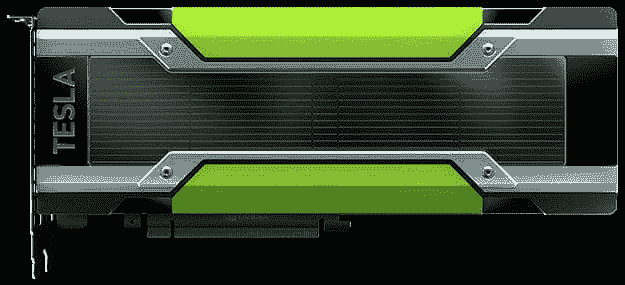
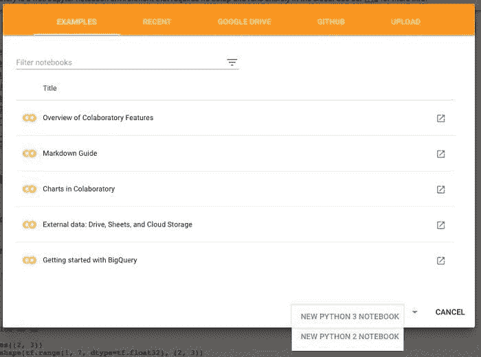
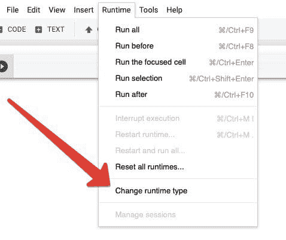
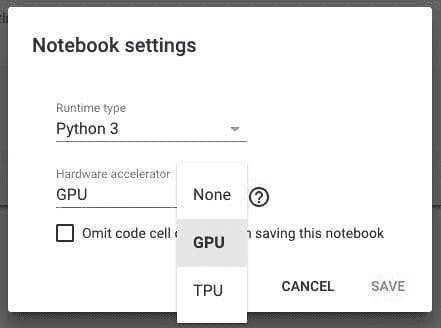
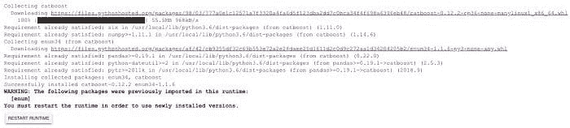
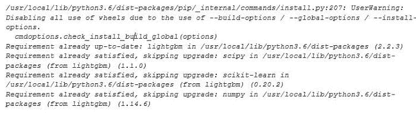

# 在 Google Colaboratory 上掌握快速梯度提升与免费 GPU

> 原文：[`www.kdnuggets.com/2019/03/mastering-fast-gradient-boosting-google-colaboratory-free-gpu.html`](https://www.kdnuggets.com/2019/03/mastering-fast-gradient-boosting-google-colaboratory-free-gpu.html)

 评论

**作者 [Anna Veronika Dorogush](https://www.linkedin.com/in/anna-veronika-dorogush-08739637/)，CatBoost 团队负责人**

**NVIDIA K80 GPU，[`www.nvidia.com/ru-ru/data-center/tesla-k80/`](https://www.nvidia.com/ru-ru/data-center/tesla-k80/)**

**决策树上的梯度提升**（GBDT）是一个最先进的机器学习工具，用于处理异构或结构化数据。在处理数据时，理想的算法高度依赖于数据的类型。对于同质数据，如图像、声音或文本，最佳解决方案是神经网络。而对于结构化数据，例如信用评分、推荐或其他表格数据，最佳解决方案是 GBDT。

因此，许多 [Kaggle](https://www.kaggle.com/) 竞赛的获胜解决方案都是基于 GBDT 的。GBDT 还被广泛用于各种推荐系统、搜索引擎和许多金融结构中。

许多人认为 GBDT 不能通过 GPU 高效加速，但实际上并非如此。在这篇文章中，我将解释如何利用 GPU 加速 GBDT。

对于 GBDT 实现，我将使用**CatBoost**，这是一个以支持分类特征和高效 GPU 实现而闻名的库。它不仅可以处理分类数据，还可以处理任何数据，在许多情况下，它的表现优于其他 GBDT 库。

该库是在领先的俄罗斯科技公司 [Yandex](https://yandex.com) 的生产需求下开发的，约一年半前以 [Apache 2 许可证](https://en.wikipedia.org/wiki/Apache_License) 开源。

我演示的测试环境将是**Google Colaboratory**。这是一个用于机器学习的研究工具，提供免费的 GPU 运行时访问。它是一个不需要设置的 Jupyter notebook 环境。

Google Colaboratory 免费提供相当老旧的 GPU——一块大约 11GB 内存的 Tesla K80 GPU。使用更新的 GPU，速度提升会更加显著。但即使使用这块旧 GPU，你也会看到显著的速度差异。如果谈到 CPU，它是每个实例 2x Intel Xeon E5-2600v3。

下面你将找到几个简单的步骤，以在 Colab 中设置 CatBoost，下载数据集，在 CPU 和 GPU 上训练模型，并比较执行时间。

### 创建 notebook

前往 [Colaboratory](https://colab.research.google.com) 并创建一个新的 Python 3 notebook。

### 设置 GPU 作为硬件加速器

选择 GPU 作为硬件加速器有两个简单步骤：

第 1 步。导航到 “Runtime” 菜单并选择 “Change runtime type”

第 2 步。选择 “GPU” 作为硬件加速器。

### 导入 CatBoost

下一步是将 CatBoost 导入环境中。 Colaboratory 内置了库，大多数库可以通过简单的 *!pip install* 命令快速安装。

请忽略有关已导入 enum 包的警告信息。此外，请注意每次启动新的 Colab 会话时，你需要重新导入库。

*!pip install catboost*

从 pypi 安装的 CatBoost 库支持 GPU，因此你可以直接使用它。 你只需要在机器上安装 NVIDIA 驱动程序，其他一切都会开箱即用。 这对 Windows 也适用，使得希望在 GPU 上训练模型的 Windows 用户更加轻松。

### 下载并准备数据集

现在是编码的时候了！ 一旦我们配置好环境，下一步是下载和准备数据集。 对于 GPU 训练，数据集越大，提速效果越明显。 使用 GPU 训练对于一千个或更少的对象没有太大意义，但从大约 10,000 开始，你将获得很好的加速效果。

我们需要一个大型数据集来展示 GPU 在 GBDT 任务中的强大能力。我们将使用 Epsilon，它有 500,000 个文档和 2,000 个特征，并且包含在 catboost.datasets 中。

下面的代码大约需要 10-15 分钟来完成这个任务。 请耐心等待。

### 在 CPU 上训练

为了打破 GBDT 在 GPU 上没有显著加速的迷思，我想比较 CPU 和 GPU 上的 GBDT 训练时间。 让我们从 CPU 开始。下面的代码创建了一个模型，训练它，并测量训练的执行时间。 它使用默认参数，因为在许多情况下，默认参数提供了相当好的基准。

我们将首先训练所有模型 100 次迭代（因为在 CPU 上训练需要很长时间）。

在运行此代码后，你可以将其更改为默认的 1000 次或更多迭代，以获得更好的质量结果。

CatBoost 在 CPU 上训练 100 次迭代需要大约 15 分钟。

你想展示可以加速的效果，对吗？

如果 feed = training，是的。

在 CPU 上拟合模型的时间：862 秒

### 在 GPU 上训练

所有之前的代码执行都在 CPU 上完成。 现在是使用 GPU 的时候了！

要启用 GPU 训练，你需要使用 *task_type='GPU'* 参数。

让我们在 GPU 上重新运行实验，看看结果时间是多少。

如果 Colab 显示警告“GPU 内存使用接近限制”，只需点击“忽略”。

在 GPU 上适配模型的时间：195 秒

GPU 相比于 CPU 的加速：4 倍

如你所见，GPU 的速度是 **CPU 的 4 倍**。在 GPU 上适配模型仅需 3-4 分钟，而在 CPU 上则需要 14-15 分钟。此外，学习过程在 GPU 上仅需 30 秒，而在 CPU 上则需要 12 分钟。

当我们训练 100 次迭代时，瓶颈在于预处理，而不是训练本身。但对于数千次迭代以获得大数据集上的最佳质量，这个瓶颈将不可见。你可以尝试在 CPU 和 GPU 上训练 5,000 次迭代，再次进行比较。

### 代码

你可以在 CatBoost 仓库的 [教程](https://colab.research.google.com/github/catboost/tutorials/blob/master/tools/google_colaboratory_cpu_vs_gpu_tutorial.ipynb) 中找到上述所有代码。

### 替代 GBDT 库

公平地说，还有至少两个更受欢迎的开源 GBDT 库：

+   [XGBoost](https://github.com/dmlc/xgboost/)

+   [LightGBM](https://github.com/Microsoft/LightGBM)

两者都作为预装库在 Colaboratory 上提供。我们在 CPU / GPU 上训练它们并比较时间。剧透：我们没有从中获得结果。详细信息如下。

### XGBoost

开始时我们尝试 XGBoost 的 CPU 版本。需要强调的是，训练参数与 CatBoost 库相同。

代码相当简单，但一旦我们在 Epsilon 数据集上运行，Colaboratory 会话崩溃。

不幸的是，GPU 版本也出现了相同的错误。启动上述简单代码后，内核会崩溃。

### LightGBM

LightGBM 的 CPU 版本出现相同的错误消息“您的会话在使用完所有可用 RAM 后崩溃。”

Colaboratory 预装的 LightGBM 版本不支持 GPU。并且 [GPU 版本的安装指南](https://github.com/Microsoft/LightGBM/tree/master/python-package) 不幸地无法使用。详见下文。

*!pip install -U lightgbm --install-option=--gpu*

很遗憾，我们无法比较其他库的 CPU 与 GPU 执行时间，除了 CatBoost。可能在较小的数据集上会有效。

### 摘要

+   GBDT 算法在 GPU 上运行效率高。

+   CatBoost 是一个快速实现的 GBDT，开箱即用 GPU 支持。

+   XGBoost 和 LightGBM 在 Colaboratory 上处理大数据集时并不总是有效。

+   Google Colaboratory 是一个有用的工具，提供免费的 GPU 支持。

### 进一步阅读

[1] V. Ershov，[CatBoost 通过 GPU 实现快速梯度提升](https://devblogs.nvidia.com/catboost-fast-gradient-boosting-decision-trees/)，NVIDIA 博客文章

[2] R. Mitchell, [梯度提升、决策树与 CUDA 下的 XGBoost](https://devblogs.nvidia.com/gradient-boosting-decision-trees-xgboost-cuda/)，NVIDIA 博客文章

[3] [LightGBM GPU 教程](https://lightgbm.readthedocs.io/en/latest/GPU-Tutorial.html)

[4] [CatBoost GitHub](https://github.com/catboost)

**简介**： [安娜·维罗妮卡·多罗古什](https://www.linkedin.com/in/anna-veronika-dorogush-08739637/) 是 Yandex 的机器学习系统负责人。

**资源：**

+   [在线和基于网页的：分析、数据挖掘、数据科学、机器学习教育](https://www.kdnuggets.com/education/online.html)

+   [用于分析、数据科学、数据挖掘和机器学习的软件](https://www.kdnuggets.com/software/index.html)

**相关：**

+   [理解梯度提升机](https://www.kdnuggets.com/2019/02/understanding-gradient-boosting-machines.html)

+   [3 个 Google Colab 环境管理小贴士](https://www.kdnuggets.com/2019/01/more-google-colab-environment-management-tips.html)

+   [使用谷歌 CoLaboratory 创建一个简单的文本分类器](https://www.kdnuggets.com/2018/03/simple-text-classifier-google-colaboratory.html)

* * *

## 我们的前三个课程推荐

 1\. [谷歌网络安全证书](https://www.kdnuggets.com/google-cybersecurity) - 快速进入网络安全职业。

 2\. [谷歌数据分析专业证书](https://www.kdnuggets.com/google-data-analytics) - 提升你的数据分析技能

 3\. [谷歌 IT 支持专业证书](https://www.kdnuggets.com/google-itsupport) - 支持你所在的组织进行 IT 工作

* * *

### 更多相关主题

+   [构建 GPU 机器与使用 GPU 云](https://www.kdnuggets.com/building-a-gpu-machine-vs-using-the-gpu-cloud)

+   [终极指南：掌握季节性并提升业务成果](https://www.kdnuggets.com/2023/08/media-mix-modeling-ultimate-guide-mastering-seasonality-boosting-business-results.html)

+   [掌握 GPU：Python 中 GPU 加速 DataFrames 的初学者指南](https://www.kdnuggets.com/2023/07/mastering-gpus-beginners-guide-gpu-accelerated-dataframes-python.html)

+   [提升机器学习算法：概述](https://www.kdnuggets.com/2022/07/boosting-machine-learning-algorithms-overview.html)

+   [宣布博客写作比赛，获胜者将获得 NVIDIA GPU！](https://www.kdnuggets.com/2022/11/blog-writing-contest-nvidia-gpu.html)

+   [使用 RAPIDS cuDF 利用 GPU 进行特征工程](https://www.kdnuggets.com/2023/06/rapids-cudf-leverage-gpu-feature-engineering.html)
