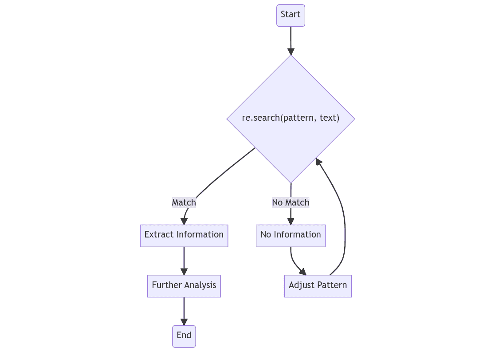

# 精通 Python 中的正则表达式

> 原文：[`www.kdnuggets.com/2023/08/mastering-regular-expressions-python.html`](https://www.kdnuggets.com/2023/08/mastering-regular-expressions-python.html)


图片由作者使用 Midjourney 创建

# 介绍

* * *

## 我们的前三大课程推荐

 1\. [Google 网络安全证书](https://www.kdnuggets.com/google-cybersecurity) - 快速进入网络安全职业道路。

 2\. [Google 数据分析专业证书](https://www.kdnuggets.com/google-data-analytics) - 提升你的数据分析技能

 3\. [Google IT 支持专业证书](https://www.kdnuggets.com/google-itsupport) - 支持你所在的组织 IT

* * *

正则表达式或称 regex，是操作文本和数据的强大工具。它们提供了一种简洁而灵活的方式来‘匹配’（指定和识别）文本字符串，例如特定字符、单词或字符模式。正则表达式在多种编程语言中使用，但在本文中，我们将重点讨论如何在 Python 中使用正则表达式。

Python 以其清晰、易读的语法，是学习和应用正则表达式的绝佳语言。Python 的[re 模块](https://docs.python.org/3/library/re.html)提供了正则表达式操作的支持。该模块包含了根据指定模式搜索、替换和拆分文本的功能。通过掌握 Python 中的正则表达式，你可以高效地处理和分析文本数据。

本文将指导你从正则表达式的基础到更复杂的操作，为你提供应对任何文本处理挑战的工具。我们将从简单的字符匹配开始，然后探讨更复杂的模式匹配、分组和前瞻断言。让我们开始吧！

# 基本正则表达式模式

正则表达式的核心原理是对字符串中的模式进行匹配。这些模式最简单的形式是字面匹配，其中寻找的模式是字符的直接序列。但正则表达式模式可以比简单的字面匹配更为复杂和强大。

在 Python 中，[re](https://docs.python.org/3/library/re.html)模块提供了一整套处理正则表达式的函数。例如，`re.search()`函数扫描给定的字符串，寻找正则表达式模式匹配的位置。我们用一个例子来说明：

```py
import re

# Define a pattern
pattern = "Python"

# Define a text
text = "I love Python!"

# Search for the pattern
match = re.search(pattern, text)

print(match)
```

这段 Python 代码在变量`text`中搜索变量`pattern`定义的模式。如果在文本中找到该模式，`re.search()`函数返回一个 Match 对象，否则返回 None。

Match 对象包括关于匹配的信息，包括原始输入字符串、使用的正则表达式和匹配的位置。例如，使用 `match.start()` 和 `match.end()` 可以提供字符串中匹配的起始和结束位置。

然而，我们通常不仅仅是寻找精确的单词 - 我们希望匹配模式。这就是特殊字符发挥作用的地方。例如，点 (.) 匹配除换行符之外的任何字符。让我们看看实际应用：

```py
# Define a pattern
pattern = "P.th.n"

# Define a text
text = "I love Python and Pithon!"

# Search for the pattern
matches = re.findall(pattern, text)

print(matches)
```

这段代码搜索字符串中任何一个以 "P" 开头、以 "n" 结尾并且中间包含 "th" 的五个字母单词。点代表任何字符，因此它匹配 "Python" 和 "Pithon"。如你所见，即使只有字面字符和点，正则表达式也提供了一个强大的模式匹配工具。

在后续章节中，我们将深入探讨正则表达式的更复杂模式和强大功能。通过理解这些基本构建块，你可以构建更复杂的模式，以匹配几乎任何文本处理和操作任务。

# 元字符

虽然字面字符构成了正则表达式的基础，但元字符通过提供灵活的模式定义来增强其功能。元字符是具有独特含义的特殊符号，决定了正则表达式引擎如何匹配模式。以下是一些常用元字符及其意义和用法：

+   **. (点)** - 点是一个通配符，匹配除换行符之外的任何字符。例如，模式 "a.b" 可以匹配 "acb"、"a+b"、"a2b" 等。

+   **^ (脱字符)** - 脱字符表示字符串的开头。"^a" 将匹配任何以 "a" 开头的字符串。

+   **$ (美元符号)** - 相反，美元符号对应于字符串的结尾。"a$" 将匹配任何以 "a" 结尾的字符串。

+   *** (星号)** - 星号表示前一个元素的零次或多次出现。例如，"a*" 匹配 ""、"a"、"aa"、"aaa" 等。

+   **+ (加号)** - 与星号类似，加号表示前一个元素的一次或多次出现。"a+" 匹配 "a"、"aa"、"aaa" 等，但不匹配空字符串。

+   **? (问号)** - 问号表示前一个元素的零次或一次出现。它使前一个元素变为可选。例如，"a?" 匹配 "" 或 "a"。

+   **{ } (大括号)** - 大括号量化出现的次数。"{n}" 表示恰好 n 次出现，"{n,}" 表示 n 次或更多次出现，"{n,m}" 表示 n 到 m 次之间的出现次数。

+   **[ ] (方括号)** - 方括号指定一个字符集，方括号内的任何单个字符都可以匹配。例如，"[abc]" 匹配 "a"、"b" 或 "c"。

+   **\ (反斜杠)** - 反斜杠用于转义特殊字符，实际上将特殊字符视为字面字符。"\$" 将匹配字符串中的美元符号，而不是表示字符串的结尾。

+   **| (管道符)** - 管道符作为逻辑或使用。匹配管道符前的模式或管道符后的模式。例如，"a|b" 匹配 "a" 或 "b"。

+   **( ) (圆括号)** - 圆括号用于分组和捕获匹配。正则表达式引擎将括号内的所有内容视为一个单一的元素。

掌握这些元字符可以让你在文本处理任务中获得新的控制水平，使你能够创建更精确和灵活的模式。正则表达式的真正威力在于你学会将这些元素组合成复杂的表达式。在接下来的部分，我们将探索这些组合，以展示正则表达式的多样性。

# 字符集

正则表达式中的字符集是强大的工具，允许你指定你希望匹配的字符组。通过将字符放在方括号 "[]" 中，你可以创建一个字符集。例如，"[abc]" 匹配 "a"、"b" 或 "c"。

但字符集不仅仅是指定单个字符的工具 - 它们提供了定义字符范围和特殊组的灵活性。让我们来看一下：

**字符范围**: 你可以使用短横线 ("-") 指定一个字符范围。例如，"[a-z]" 匹配任何小写字母。你甚至可以在一个集合中定义多个范围，如 "[a-zA-Z0-9]" 匹配任何字母数字字符。

**特殊组**: 一些预定义的字符集代表常用的字符组。这些是方便的简写：

+   **\d**: 匹配任何十进制数字；等同于 [0-9]

+   **\D**: 匹配任何非数字字符；等同于 [⁰-9]

+   **\w**: 匹配任何字母数字单词字符（字母、数字、下划线）；等同于 [a-zA-Z0-9_]

+   **\W**: 匹配任何非字母数字字符；等同于 [^a-zA-Z0-9_]

+   **\s**: 匹配任何空白字符（空格、制表符、换行符）

+   **\S**: 匹配任何非空白字符

**否定字符集**: 通过在方括号内将插入符号 "^" 作为第一个字符，你可以创建一个否定集合，它匹配集合中不存在的任何字符。例如，"[^abc]" 匹配任何不是 "a"、"b" 或 "c" 的字符。

让我们看看这些在实际中的应用：

```py
import re

# Create a pattern for a phone number
pattern = "\d{3}-\d{3}-\d{4}"

# Define a text
text = "My phone number is 123-456-7890."

# Search for the pattern
match = re.search(pattern, text)

print(match)
```

这段代码在文本中搜索美国电话号码的模式。模式 "\d{3}-\d{3}-\d{4}" 匹配任何三个数字，后跟一个短横线，然后是任意三个数字，再跟一个短横线，最后是任意四个数字。它成功匹配了文本中的 "123-456-7890"。

字符集和相关的特殊序列大大增强了你的模式匹配能力，提供了一种灵活且高效的方式来指定你希望匹配的字符。通过掌握这些元素，你就能充分发挥正则表达式的潜力。

# 一些常见模式

虽然正则表达式可能看起来令人生畏，但你会发现许多任务只需要简单的模式。这里有五个常见的模式：

## 邮件

提取电子邮件是一个常见的任务，可以通过正则表达式完成。以下模式匹配大多数常见的电子邮件格式：

```py
# Define a pattern
pattern = r'\b[A-Za-z0-9._%+-]+@[A-Za-z0-9.-]+\.[A-Z|a-z]{2,7}\b'

# Search for the pattern
match = re.findall(pattern, text)

print(match)
```

## 电话号码

电话号码的格式可能会有所不同，但以下是匹配北美电话号码的模式：

```py
# Define a pattern
pattern = r'\b\d{3}[-.\s]?\d{3}[-.\s]?\d{4}\b'

# Search for the pattern
...
```

## IP 地址

要匹配 IP 地址，我们需要四个用句点分隔的数字（0-255）：

```py
# Define a pattern
pattern = r'\b(?:\d{1,3}\.){3}\d{1,3}\b'

# Search for the pattern
...
```

## 网络网址

网络网址遵循一致的格式，可以用以下模式匹配：

```py
# Define a pattern
pattern = r'https?://(?:[-\w.]|(?:%[\da-fA-F]{2}))+'

# Search for the pattern
...
```

## HTML 标签

HTML 标签可以使用以下模式进行匹配。要小心，因为这不会捕捉标签内的属性：

```py
# Define a pattern
pattern = r'<[^>]+>'

# Search for the pattern
...
```



Python 正则表达式匹配工作流程

# 提示与建议

以下是一些实用技巧和最佳实践，帮助你有效使用正则表达式。

1.  **从简单开始**：从简单模式开始，逐渐增加复杂性。一开始解决复杂问题可能会让人不知所措。

1.  **增量测试**：每次更改后测试你的正则表达式。这使得定位和修复问题更加容易。

1.  **使用原始字符串**：在 Python 中，使用原始字符串作为正则表达式模式（即 r"text"）。这确保 Python 文字解释字符串，防止与 Python 的转义序列冲突。

1.  **具体明确**：你的正则表达式越具体，就越不容易意外匹配到不需要的文本。例如，与其使用 .*，不如考虑使用 .+? 以非贪婪的方式匹配文本。

1.  **使用在线工具**：在线正则表达式测试工具可以帮助你构建和测试你的正则表达式。这些工具可以实时显示匹配、分组，并提供正则表达式的解释。一些流行的工具有 [regex101](https://regex101.com/) 和 [regextester](https://www.regextester.com/)。

1.  **可读性优于简洁性**：虽然正则表达式允许非常紧凑的代码，但它可能很快变得难以阅读。优先考虑可读性而非简洁性。在必要时使用空白和注释。

记住，掌握正则表达式是一个过程，实际上是一种组装构建块的练习。通过练习和坚持，你将能够处理任何文本处理任务。

# 结论

正则表达式，或称为 regex，确实是 Python 工具箱中的一个强大工具。它的复杂性可能会让人一开始感到困惑，但一旦你深入探讨它的细节，你会开始认识到它的真正潜力。它为处理、解析和操控文本数据提供了无与伦比的强大和多功能性，使其在数据科学、自然语言处理、网页抓取等众多领域中成为一个必不可少的工具。

正则表达式的主要优点之一在于它能够在大量文本中执行复杂的模式匹配和提取操作，代码量极少。把它想象成一个精密的搜索引擎，不仅能定位准确的文本字符串，还能识别模式、范围和特定的序列。这使得它能够从原始的非结构化文本数据中识别和提取关键信息，这在信息检索、数据清理和情感分析等任务中非常必要。

此外，尽管正则表达式的学习曲线看似陡峭，但不应让热情的学习者气馁。是的，正则表达式有其独特的语法和特殊字符，刚开始可能显得难以理解。然而，通过一些专注的学习和实践，你很快会欣赏到其逻辑结构和优雅。正则表达式在处理文本数据时的效率和节省的时间远远超过了初始学习的投资。因此，尽管掌握正则表达式具有挑战性，但其带来的宝贵回报使其成为任何数据科学家、程序员或处理文本数据的人员的重要技能。

我们讨论的概念和例子只是冰山一角。还有许多正则表达式的概念值得深入探讨，如量词、分组、环视断言等。因此，继续练习、实验并掌握 Python 中的正则表达式。祝你*编码愉快*！

**[Matthew Mayo](https://www.linkedin.com/in/mattmayo13/)** ([**@mattmayo13**](https://twitter.com/mattmayo13)) 是数据科学家，也是 KDnuggets 的主编，KDnuggets 是著名的数据科学和机器学习在线资源。他的兴趣包括自然语言处理、算法设计与优化、无监督学习、神经网络以及自动化机器学习方法。Matthew 拥有计算机科学硕士学位和数据挖掘研究生文凭。他可以通过 editor1 at kdnuggets[dot]com 联系。

### 更多相关话题

+   [使用正则表达式进行数据清理的 5 个技巧](https://www.kdnuggets.com/5-tips-for-using-regular-expressions-in-data-cleaning)

+   [2022 年掌握 Python 机器学习的 7 个步骤](https://www.kdnuggets.com/2022/02/7-steps-mastering-machine-learning-python.html)

+   [KDnuggets™ 新闻 22:n05, 2 月 2 日: 掌握机器学习的 7 个步骤…](https://www.kdnuggets.com/2022/n05.html)

+   [掌握数据科学中 Python 的 7 个步骤](https://www.kdnuggets.com/2022/06/7-steps-mastering-python-data-science.html)

+   [掌握 GPU：Python 中 GPU 加速 DataFrames 的初学者指南](https://www.kdnuggets.com/2023/07/mastering-gpus-beginners-guide-gpu-accelerated-dataframes-python.html)

+   [掌握 Python 中数据清理的艺术](https://www.kdnuggets.com/mastering-the-art-of-data-cleaning-in-python)
