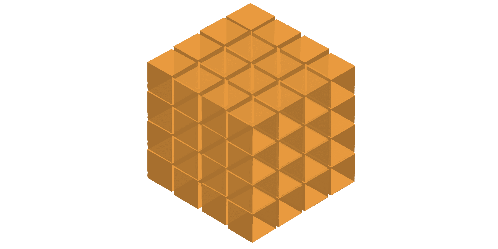
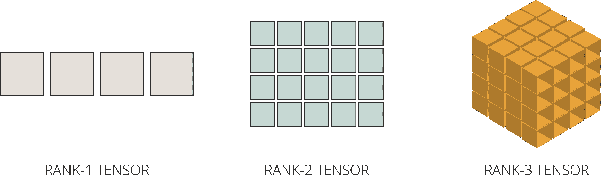
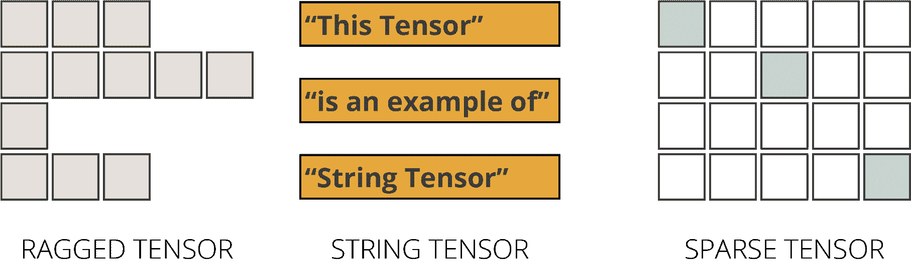

# 通过 5 个简单步骤掌握 TensorFlow 张量

> 原文：[`www.kdnuggets.com/2020/11/mastering-tensorflow-tensors-5-easy-steps.html`](https://www.kdnuggets.com/2020/11/mastering-tensorflow-tensors-5-easy-steps.html)

评论

**作者 [Orhan G. Yalçın](https://www.linkedin.com/in/orhangaziyalcin/)，AI 研究员**

*如果你正在阅读这篇文章，我相信我们有相似的兴趣，并且在相似的行业中。那就通过* [*Linkedin*](https://linkedin.com/in/orhangaziyalcin/) *来联系吧！请不要犹豫发送联系请求！* [*Orhan G. Yalçın — Linkedin*](https://linkedin.com/in/orhangaziyalcin/)

照片由 [Esther Jiao](https://unsplash.com/@estherrj?utm_source=medium&utm_medium=referral) 提供，来自 [Unsplash](https://unsplash.com/?utm_source=medium&utm_medium=referral)

在这篇文章中，我们将深入探讨 TensorFlow [张量](https://www.kdnuggets.com/2018/05/wtf-tensor.html) 的细节。我们将通过这五个简单步骤涵盖所有与 TensorFlow 张量相关的主题：

+   **步骤 I：张量的定义 → ** 张量是什么？

+   **步骤 II：张量的创建 → ** 创建张量对象的函数

+   **步骤 III：张量的资格 → ** 张量对象的特征和属性

+   **步骤 IV：与张量的操作 → ** 索引、基本张量操作、形状调整和广播

+   **步骤 V：特殊类型的张量 → ** 除了常规张量的特殊张量类型

让我们开始吧！

### 张量的定义：张量是什么？

图 1. 三阶张量的可视化（图由作者提供）

张量是 TensorFlow 的多维数组，具有统一的数据类型。它们与 NumPy 数组非常相似，并且是不可变的，这意味着一旦创建后不能被更改。你只能创建一个新的副本并进行编辑。

让我们看看张量如何通过代码示例工作。但首先，为了处理 TensorFlow 对象，我们需要导入 [TensorFlow](http://tensorflow.org/) 库。我们经常与 TensorFlow 一起使用 [NumPy](http://numpy.org/)，所以也需要用以下几行导入 NumPy：

### 张量的创建：创建张量对象

创建 `tf.Tensor` 对象有几种方法。让我们从几个示例开始。你可以使用多个 TensorFlow 函数来创建张量对象，如下面的示例所示：

tf.constant、tf.ones、tf.zeros 和 tf.range 是你可以用来创建张量对象的一些函数

```py
**Output:**
tf.Tensor([[1 2 3 4 5]], shape=(1, 5), dtype=int32)
tf.Tensor([[1\. 1\. 1\. 1\. 1.]], shape=(1, 5), dtype=float32) 
tf.Tensor([[0\. 0\. 0\. 0\. 0.]], shape=(1, 5), dtype=float32) 
tf.Tensor([1 2 3 4 5], shape=(5,), dtype=int32)
```

如你所见，我们使用三种不同的函数创建了形状为 `（1, 5）` 的张量对象，并使用 `tf.range()` 函数创建了一个形状为 `（5,）` 的第四个张量对象。请注意，`tf.ones` 和 `tf.zeros` 接受形状作为必需的参数，因为它们的元素值是预先确定的。

### 张量的资格：张量对象的特征和属性

TensorFlow 张量被创建为 `tf.Tensor` 对象，它们有几个特征。首先，它们的秩基于维度数量。其次，它们有一个形状，一个由所有维度长度组成的列表。所有张量都有一个大小，即张量内元素的总数。最后，它们的元素都记录在统一的数据类型中。让我们更详细地了解这些特征。

### 秩系统与维度

张量根据它们的维度数量进行分类：

+   **秩-0（标量）张量：** 一个包含单个值且没有轴（0 维）的张量；

+   **秩-1 张量：** 一个包含单个轴（1 维）中的值列表的张量；

+   **秩-2 张量：** 一个包含 2 个轴（2 维）的张量；以及

+   **秩-N 张量：** 一个包含 N 个轴（N 维）的张量。

图 2\. 秩-1 张量 | 秩-2 张量 | 秩-3 张量（作者提供的图）

例如，我们可以通过将一个三层嵌套列表对象传递给 `tf.constant` 函数来创建一个秩-3 张量。对于这个例子，我们可以将数字分割成一个每层有三个元素的三层嵌套列表：

创建一个秩-3 张量对象的代码

```py
**Output:** tf.Tensor( [[[ 0  1  2]   
             [ 3  4  5]]   

            [[ 6  7  8]   
             [ 9 10 11]]],
  shape=(2, 2, 3), dtype=int32)
```

我们可以通过 `.ndim` 属性查看我们当前的 `rank_3_tensor` 对象的维度数量。

```py
**Output:** The number of dimensions in our Tensor object is 3
```

### 形状

形状特征是每个张量都有的另一个属性。它以列表形式显示每个维度的大小。我们可以通过 `.shape` 属性查看我们创建的 `rank_3_tensor` 对象的形状，如下所示：

```py
**Output:** The shape of our Tensor object is (2, 2, 3)
```

如你所见，我们的张量在第一层有 2 个元素，在第二层有 2 个元素，在第三层有 3 个元素。

### 大小

大小是张量的另一个特征，意味着张量中的元素总数。我们不能用张量对象的属性来测量大小。相反，我们需要使用 `tf.size()` 函数。最后，我们将输出转换为 NumPy，以通过实例函数 `.numpy()` 获取更可读的结果：

```py
**Output:** The size of our Tensor object is 12
```

### 数据类型

张量通常包含数值数据类型，如浮点数和整数，但也可能包含许多其他数据类型，如复数和字符串。

然而，每个张量对象必须以单一的统一数据类型存储所有元素。因此，我们还可以通过 `.dtype` 属性查看特定张量对象所选择的数据类型，如下所示：

```py
**Output:** The data type selected for this Tensor object is <dtype: 'int32'>
```

### 张量操作

### 索引

索引是项目在序列中的位置的数值表示。这个序列可以指代许多事物：一个列表、一个字符字符串或任何任意的值序列。

TensorFlow 还遵循标准的 Python 索引规则，这与列表索引或 NumPy 数组索引类似。

关于索引的一些规则：

1.  索引从零（0）开始。

1.  负索引（“ -n”）值表示从末尾向后计数。

1.  冒号（“：”）用于切片：`start:stop:step`。

1.  逗号（“，”）用于达到更深的层次。

让我们用以下代码行创建一个 `rank_1_tensor`：

```py
**Output:** 
tf.Tensor([ 0  1  2  3  4  5  6  7  8  9 10 11], 
  shape=(12,), dtype=int32)
```

并测试我们的规则第 1 条、第 2 条和第 3 条：

```py
**Output:** 
First element is: 0 
Last element is: 11 
Elements in between the 1st and the last are: [ 1  2  3  4  5  6  7  8  9 10]
```

现在，让我们用以下代码创建我们的 `rank_2_tensor` 对象：

```py
**Output:** tf.Tensor( [[ 0  1  2  3  4  5]  
            [ 6  7  8  9 10 11]], shape=(2, 6), dtype=int32)
```

并用几个示例测试第四条规则：

```py
**Output:** 
The first element of the first level is: [0 1 2 3 4 5] 
The second element of the first level is: [ 6  7  8  9 10 11] 
The first element of the second level is: 0 
The third element of the second level is: 2
```

现在，我们已经覆盖了索引的基础知识，让我们来看看我们可以对 Tensor 执行的基本操作。

### Tensor 的基本操作

你可以轻松地对 Tensor 执行基本数学操作，例如：

1.  加法

1.  元素级乘法

1.  矩阵乘法

1.  查找最大值或最小值

1.  查找最大元素的索引

1.  计算 Softmax 值

让我们看看这些操作的实际效果。我们将创建两个 Tensor 对象并应用这些操作。

我们可以从加法开始。

```py
**Output:** tf.Tensor( [[ 3\.  7.]  
            [11\. 15.]], shape=(2, 2), dtype=float32)
```

让我们继续进行元素级乘法。

```py
**Output:** tf.Tensor( [[ 2\. 12.]  
            [30\. 56.]], shape=(2, 2), dtype=float32)
```

我们还可以进行矩阵乘法：

```py
**Output:** tf.Tensor( [[22\. 34.]  
            [46\. 74.]], shape=(2, 2), dtype=float32)
```

> **注意：** Matmul 操作是深度学习算法的核心。因此，尽管你不会直接使用 matmul，但了解这些操作至关重要。

我们上面列出的其他操作示例：

```py
**Output:**
The Max value of the tensor object b is: 7.0 
The index position of the Max of the tensor object b is: [1 1] 
The softmax computation result of the tensor object b is: [[0.11920291 0.880797  ]  [0.11920291 0.880797  ]]
```

### 操作形状

就像在 NumPy 数组和 pandas DataFrames 中一样，你也可以重塑 Tensor 对象。

tf.reshape 操作非常快，因为底层数据不需要重复。对于重塑操作，我们可以使用`tf.reshape()` 函数。让我们在代码中使用 `tf.reshape` 函数：

```py
**Output:** The shape of our initial Tensor object is: (1, 6) 
The shape of our initial Tensor object is: (6, 1) 
The shape of our initial Tensor object is: (3, 2) 
The shape of our flattened Tensor object is: tf.Tensor([1 2 3 4 5 6], shape=(6,), dtype=int32)
```

正如你所见，我们可以轻松地重塑我们的 Tensor 对象。但要注意，在进行重塑操作时，开发人员必须合理操作。否则，Tensor 可能会混乱或甚至引发错误。因此，留意这一点 ????。

### 广播

当我们尝试使用多个 Tensor 对象进行组合操作时，较小的 Tensor 可以自动扩展以适应较大的 Tensor，就像 NumPy 数组一样。例如，当你尝试将标量 Tensor 与二阶 Tensor 相乘时，标量会被扩展以与每个二阶 Tensor 元素相乘。请参见下面的示例：

```py
**Output:** tf.Tensor( [[ 5 10]  
            [15 20]], shape=(2, 2), dtype=int32)
```

由于广播，你在对 Tensor 进行数学操作时无需担心匹配尺寸的问题。

### 特殊类型的 Tensor

我们倾向于生成矩形形状的 Tensor 并将数值作为元素存储。然而，TensorFlow 也支持不规则或特殊类型的 Tensor，具体包括：

1.  不规则 Tensor

1.  字符串 Tensor

1.  稀疏 Tensor

图 3\. 不规则 Tensor | 字符串 Tensor | 稀疏 Tensor（图由作者提供）

让我们仔细看看它们每一个是什么。

### 不规则 Tensor

不规则 Tensor 是在大小轴上具有不同元素数量的 Tensor，如图 X 所示。

你可以构建一个不规则 Tensor，如下所示：

```py
**Output:** <tf.RaggedTensor [[1, 2, 3], 
                  [4, 5], 
                  [6]]>
```

### 字符串 Tensor

字符串 Tensor 是存储字符串对象的 Tensor。我们可以像创建普通 Tensor 对象一样创建一个字符串 Tensor。但是，我们传递的是字符串对象作为元素，而不是数值对象，如下所示：

```py
**Output:**
tf.Tensor([b'With this' 
           b'code, I am' 
           b'creating a String Tensor'],
  shape=(3,), dtype=string)
```

### 稀疏 Tensor

最后，稀疏张量是用于稀疏数据的矩形张量。当数据中有空洞（即空值）时，稀疏张量是首选对象。创建一个稀疏张量有点耗时，并且应该更为普及。不过，以下是一个示例：

```py
**Output:**
tf.Tensor( [[ 25   0   0   0   0]
            [  0   0   0   0   0]
            [  0   0  50   0   0]
            [  0   0   0   0   0]
            [  0   0   0   0 100]], shape=(5, 5), dtype=int32)
```

### 恭喜

我们已经成功覆盖了 TensorFlow 的 Tensor 对象基础知识。

> 给自己一个奖励吧！

这应该会让你更有信心，因为你现在对 TensorFlow 框架的构建块有了更多了解。

查看 [本教程系列的第一部分](https://towardsdatascience.com/beginners-guide-to-tensorflow-2-x-for-deep-learning-applications-c7ebd0dcfbee?source=linkShare-ff47ab81282a-1602188004&_branch_match_id=834349989166411892):

[**TensorFlow 2.x 初学者指南，用于深度学习应用**](https://link.medium.com/yJp16uPoqab)

了解 TensorFlow 平台及其对机器学习专家的提供

继续阅读 [系列第三部分](https://towardsdatascience.com/mastering-tensorflow-variables-in-5-easy-step-5ba8062a1756):

[**在 5 个简单步骤中掌握 TensorFlow “变量”**](https://towardsdatascience.com/mastering-tensorflow-variables-in-5-easy-step-5ba8062a1756)

了解如何使用 TensorFlow 变量，它们与普通 Tensor 对象的区别，以及何时优于…

### 订阅邮件列表获取完整代码

如果你希望访问 Google Colab 上的完整代码和我最新的内容，请考虑订阅邮件列表：

滑动以订阅我的通讯

最后，如果你对应用深度学习教程感兴趣，可以查看我的一些文章：

[**用 MNIST 数据集在 10 分钟内进行图像分类**](https://towardsdatascience.com/image-classification-in-10-minutes-with-mnist-dataset-54c35b77a38d)

使用卷积神经网络对手写数字进行分类，采用 TensorFlow 和 Keras | 监督深度学习

[**用生成对抗网络在 10 分钟内生成图像**](https://towardsdatascience.com/image-generation-in-10-minutes-with-generative-adversarial-networks-c2afc56bfa3b)

使用无监督深度学习生成手写数字，采用 TensorFlow 和深度卷积 GANs

[**用卷积自编码器在 10 分钟内减少图像噪声**](https://towardsdatascience.com/image-noise-reduction-in-10-minutes-with-convolutional-autoencoders-d16219d2956a)

使用深度卷积自编码器清洁（或去噪）噪声图像，借助 Fashion MNIST | 无监督…

[**使用递归神经网络预测比特币 (BTC) 价格**](https://towardsdatascience.com/using-recurrent-neural-networks-to-predict-bitcoin-btc-prices-c4ff70f9f3e4)

如果你能够预测明天的比特币 (BTC) 价格，那不是太棒了吗？加密货币市场有…

**简介：[Orhan G. Yalçın](https://www.linkedin.com/in/orhangaziyalcin/)** 是法律领域的 AI 研究员。他是一位合格的律师，拥有商业发展和数据科学技能，曾在 Allen & Overy 担任法律实习生，处理资本市场、竞争和公司法事务。

[原文](https://towardsdatascience.com/mastering-tensorflow-tensors-in-5-easy-steps-35f21998bb86)。已获许可转载。

**相关：**

+   什么是张量？！?

+   TensorFlow 2 入门

+   你应该知道的 PyTorch 最重要基础知识

* * *

## 我们的前三个课程推荐

 1\. [Google 网络安全证书](https://www.kdnuggets.com/google-cybersecurity) - 快速进入网络安全职业生涯。

 2\. [Google 数据分析专业证书](https://www.kdnuggets.com/google-data-analytics) - 提升你的数据分析技能

 3\. [Google IT 支持专业证书](https://www.kdnuggets.com/google-itsupport) - 支持你的组织的 IT 工作

* * *

### 相关话题

+   [你需要知道的关于张量的所有信息](https://www.kdnuggets.com/2022/05/everything-need-know-tensors.html)

+   [TensorFlow 用于计算机视觉 - 轻松实现迁移学习](https://www.kdnuggets.com/2022/01/tensorflow-computer-vision-transfer-learning-made-easy.html)

+   [用 Python 构建 AI 应用的 10 个简单步骤](https://www.kdnuggets.com/build-an-ai-application-with-python-in-10-easy-steps)

+   [用 Python 构建命令行应用的 7 个简单步骤](https://www.kdnuggets.com/build-a-command-line-app-with-python-in-7-easy-steps)

+   [用 Docker 容器化 Python 应用的 5 个简单步骤](https://www.kdnuggets.com/containerize-python-apps-with-docker-in-5-easy-steps)

+   [2022 年掌握 Python 机器学习的 7 个步骤](https://www.kdnuggets.com/2022/02/7-steps-mastering-machine-learning-python.html)
