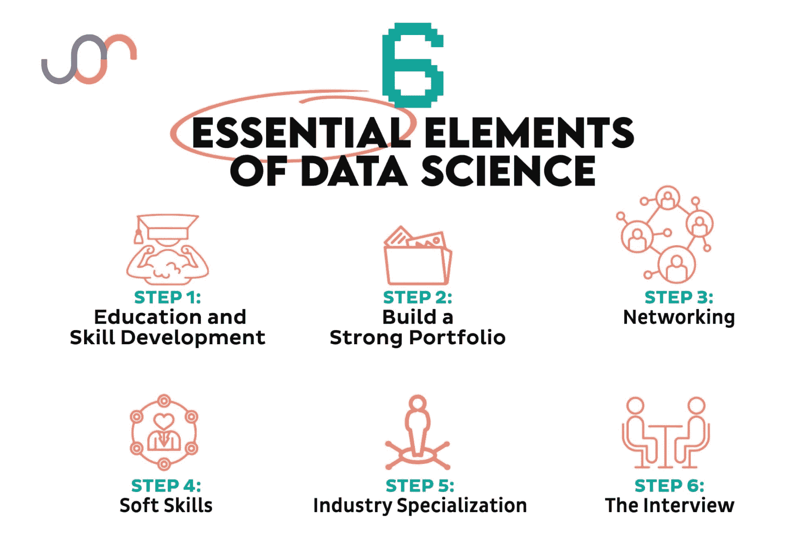
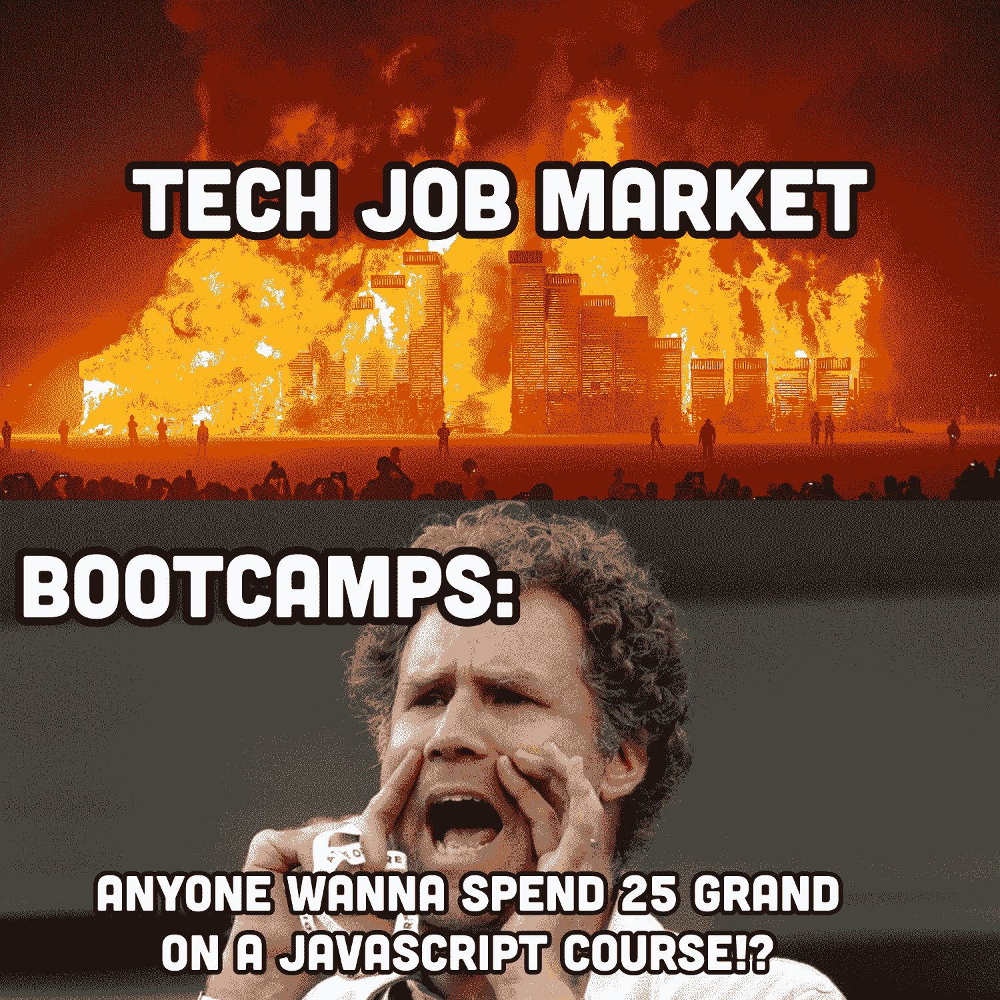
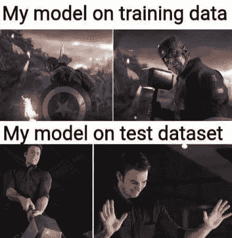

# 掌握数据宇宙：成功数据科学职业的关键步骤

> 原文：[`www.kdnuggets.com/mastering-the-data-universe-key-steps-to-a-thriving-data-science-career`](https://www.kdnuggets.com/mastering-the-data-universe-key-steps-to-a-thriving-data-science-career)

图片作者

要在数据科学领域取得成功，你需要加强我认为的六大支柱：技术技能、建立作品集、网络建设、软技能，以及最后的发展专业领域。一旦具备了这些，你还需要在面试阶段表现出色。

* * *

## 我们的前三大课程推荐

 1\. [Google 网络安全证书](https://www.kdnuggets.com/google-cybersecurity) - 快速进入网络安全职业轨道。

 2\. [Google 数据分析专业证书](https://www.kdnuggets.com/google-data-analytics) - 提升你的数据分析技能

 3\. [Google IT 支持专业证书](https://www.kdnuggets.com/google-itsupport) - 支持你的组织进行 IT 相关工作

* * *

太多想成为数据科学家的人认为只要有技能就足够了，而忽视了网络的重要性。或者你依赖于一个网络联系人来获得面试机会，但在压力下表现不佳，无法充分展示你的技能。

# 1\. 教育和技能发展

这些部分没有真正的选项，但这可能是六个支柱中最重要的一项。如果你不知道对的人，或者你的作品集不完美，你可能会偶然找到一份工作，但如果你没有合适的技能，你将无法获得这份工作。更糟糕的是：你可能会得到这份工作，但最终会失败，并被解雇。

这里是你应该关注的内容：

## 学习基础知识

每个数据科学职位都需要扎实的数学、统计学和编程基础。掌握如 Python 或 R 等编程语言是必不可少的。几乎每个数据科学职位的描述中都会提到这两种语言之一。

我还建议你考虑将 学习 SQL 作为基本要求。SQL 数据库是数据科学家的现实需求，它是一种相对简单的语言。

图片来自 [r/datascience](https://www.reddit.com/r/datascience/comments/s0dn5b/2022_mood/)

## 机器学习与数据处理

不仅仅是最近的 AI 兴起；数据科学家一直以来都需要掌握机器学习。你需要在机器学习算法、数据预处理、特征工程和模型评估方面获得专业知识。

## 数据可视化

数据科学家的发现毫无价值，除非她能将其传达给他人。这通常通过图表、图形和其他数据可视化形式实现。你需要掌握数据可视化工具和技术，以便有效地与公司内的重要利益相关者沟通数据中的见解。

当我谈到软技能时，我会进一步深入——沟通是一个至关重要的技能。

## 大数据技术

数据科学家处理的数据量不再是微不足道的，假如它曾经存在的话。如今，你需要对大数据及其相关工具非常熟悉。即使你的公司不处理真正的“大”数据，他们也会期望做到这一点。

熟悉处理大数据集的工具，如 Hadoop、Spark 和云平台。

# 2\. 建立强大的作品集

进入第二个支柱：你的作品集。

你可能知道合格的数据科学家稀缺。训练营毕业生填补了这一空缺。这带来了新的问题：缺乏信任。公司知道学位不一定是做好工作的必要资格。然而，不良的训练营也给有抱负的数据科学家带来了坏名声，因为许多训练营生产出“毕业生”，他们连连接和子查询都分不清。因此，你的个人作品集是证明你具备专业知识的机会。（值得注意的是，训练营非常昂贵，尤其是相比于目前稍微不乐观的就业前景。）

图片来自 [r/ProgrammerHumor](https://www.reddit.com/r/ProgrammerHumor/comments/z1wbkb/coding_bootcamps_be_like/)

你需要的东西如下：

## 个人项目

从事个人项目来展示你的技能。这些项目可以是 Kaggle 比赛、开源贡献或你自己的数据分析项目。你可以维护一个组织良好的 GitHub 仓库，以展示你的项目、代码样本和贡献。

## 博客或网站

考虑创建一个博客或个人网站，在那里你可以分享与数据科学相关的见解、教程和案例研究。虽然可以通过作弊系统找人代劳，但费用高昂且耗时极长，因此很少有人尝试伪造。博客是展示你知识的绝佳平台。

准备好解释你的项目、方法论和解决问题的思路。复习常见的数据科学面试问题和编码挑战。

# 3\. 网络建设

记住求职的黄金法则，无论哪个领域：潜在的[多达](https://www.cnbc.com/2019/12/27/how-to-get-a-job-often-comes-down-to-one-elite-personal-asset.html) 70% 的职位信息从未被公开。这是一个旧统计数据，但即使是 20%到 30%，也证明了人际关系的重要性。更不用说[三分之一](https://compensationxl.com/study-finds-that-nearly-one-third-of-job-postings-are-fake/#:~:text=COMP%20NEWS%20%E2%80%93%20An%20alarming%20survey,ad%20stays%20online%20for%20months.)的职位招聘实际上是假的，旨在让公司看起来比实际更成功。个人网络可以帮助你避免浪费时间。

你应该做的是：

## 加入专业网络

加入数据科学社区，参加聚会、会议和网络研讨会，以与该领域的其他专业人士建立联系。这种更正式的网络方式可以帮助你结识合适的人，提升你在行业中的影响力，并保持对时事的了解。

## 社交媒体

更随意地，你还应该在 LinkedIn、Twitter 和相关论坛上参与分享你的工作、见解，并从他人那里学习。

# 4\. 软技能

记住，硬技能只是成功的一半。这就是为什么你需要确保软技能没有被忽视。我不是说软技能比硬技能*更*重要。[硬技能与软技能](https://blog.boot.dev/jobs/hard-vs-soft-skills-for-programmers/)的对立是错误的 – 它们都很重要。但人们招聘的不是数据科学机器，而是人。这里是我建议关注的领域：

## 沟通

记住那个数据可视化技能吗？数据科学家需要将复杂的技术发现有效地传达给非技术利益相关者。令人惊讶的是，数据科学家的工作中有多少是为了向市场部解释为什么他们应该理解那个漂亮的图表。

## 问题解决

这几乎是一个毫无意义的流行词，所以一定要真正理解“问题解决”是什么意思。在数据科学的背景下，解决问题不仅仅是调试。还包括知道何时与不同部门合作，何时重新调整项目的技术栈以满足新规格，或在测试数据集上遇到问题时回顾你的模型。

图片来源于 [r/DataScienceMemes](https://www.reddit.com/r/DataScienceMemes/comments/12g78yx/why/?utm_source=share&utm_medium=web2x&context=3)

## 批判性思维

另一个几乎成为流行词但值得深入考虑的概念是批判性思维。批判性思维意味着从多个角度分析数据、质疑假设，并创造性地思考以获得有意义的见解。

## 团队合作

数据科学家并非在真空中工作。你将与网页开发人员、数据分析师、业务分析师、营销人员、销售人员和高管合作。与跨职能团队合作，了解业务需求并协调数据驱动的解决方案。

# 5\. 行业专业化

没听说过吗？我们正处于招聘的技术寒冬中。风险投资资金流动不如从前，公司正在收紧预算。现在不是做全能型人才的好时机。你需要专业化以求生存。

## 选择一个利基

数据科学涵盖了各个行业，如医疗保健、金融、电子商务等。专注于特定领域可以让你在该领域的雇主眼中更具吸引力。寻找你自然感兴趣的领域，或你可能已经具备额外知识的领域。

## 领域知识

获取与你想要从事的行业相关的领域特定知识。这有助于你理解数据的细微差别，并做出更明智的决策。例如，如果你想在谷歌工作，你需要了解搜索算法和用户行为的复杂性。

# 6\. 面试

最后但同样重要的是：准备面试。即使你掌握了前五个支柱，仍然可能在最后关头出现失误。以下是我建议的准备方法：

## 解释

你可以*了解*一个概念，却不一定能够*向他人解释*它。为了面试，你需要准备好解释你的项目、方法论和解决问题的方法。

花时间确保你不仅对你所做的工作、为什么这么做以及它为何在所有项目中有效有一个完整的理解，而且你能够解释得足够清晰，让外行人也能理解。（这也是一个很好的练习“沟通”软技能的方法。）

## 编码准备

白板是编码面试中的一个著名支柱，但很多人在面对那面空白的白板时会感到恐慌。提前[练习面试问题](https://platform.stratascratch.com/coding?code_type=1&utm_source=blog&utm_medium=click&utm_campaign=kdn+ds+career)，你在面试当天的表现会更好。

# 如何在数据科学领域发展成功的职业

即使假装存在一个单一正确答案，或者它可以在一篇文章中解释也是有些自负的。希望这篇博客文章更像是一张路线图，而不是一个全面的解决方案。练习这六大数据科学工作的支柱，你将顺利走上数据科学职业发展的道路，直到你希望的时间。

****[内特·罗西迪](https://twitter.com/StrataScratch)****是一位数据科学家和产品战略专家。他还担任分析学的兼职教授，并且是 StrataScratch 的创始人，该平台帮助数据科学家通过顶级公司的真实面试问题准备面试。内特撰写有关职业市场最新趋势的文章，提供面试建议，分享数据科学项目，并涵盖所有 SQL 相关内容。

### 更多相关话题

+   [KDnuggets™ 新闻 22:n05，2 月 2 日：掌握机器学习的 7 个步骤…](https://www.kdnuggets.com/2022/n05.html)

+   [掌握 SQL 在数据科学中的应用的 7 个步骤](https://www.kdnuggets.com/2022/04/7-steps-mastering-sql-data-science.html)

+   [掌握 Python 在数据科学中的应用的 7 个步骤](https://www.kdnuggets.com/2022/06/7-steps-mastering-python-data-science.html)

+   [掌握数据科学项目管理的 7 个步骤（敏捷方法）](https://www.kdnuggets.com/2023/07/7-steps-mastering-data-science-project-management-agile.html)

+   [掌握数据清洗和预处理技术的 7 个步骤](https://www.kdnuggets.com/2023/08/7-steps-mastering-data-cleaning-preprocessing-techniques.html)

+   [掌握使用 Pandas 和 Python 进行数据整理的 7 个步骤](https://www.kdnuggets.com/7-steps-to-mastering-data-wrangling-with-pandas-and-python)
