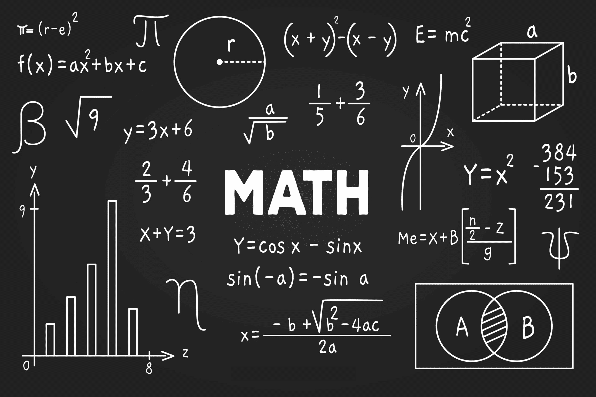
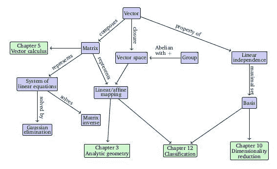

# 机器学习数学：免费电子书

> 原文：[`www.kdnuggets.com/2020/04/mathematics-machine-learning-book.html`](https://www.kdnuggets.com/2020/04/mathematics-machine-learning-book.html)

图片来源于 [Freepik](https://www.freepik.com/free-vector/maths-chalkboard_4565685.htm#query=math&position=8&from_view=search&track=sph)

数学是机器学习的基础，对理解该领域的根基至关重要。要成功成为一名机器学习从业者，掌握相关的数学基础是绝对必要的。你可以转向哪里来复习机器学习数学，或通过扩展基础来加深理解？

* * *

## 我们的前三大课程推荐

 1\. [谷歌网络安全证书](https://www.kdnuggets.com/google-cybersecurity) - 快速进入网络安全职业轨道

 2\. [谷歌数据分析专业证书](https://www.kdnuggets.com/google-data-analytics) - 提升您的数据分析能力

 3\. [谷歌 IT 支持专业证书](https://www.kdnuggets.com/google-itsupport) - 支持您的组织进行 IT 管理

* * *

**[机器学习数学](https://mml-book.com/)** 是由 Marc Peter Deisenroth、A Aldo Faisal 和 Cheng Soon Ong 合著的一本书，旨在激励人们学习数学概念，由剑桥大学出版社出版。根据作者的说法，该书的目标是提供必要的数学技能，以便后续阅读更高级的机器学习主题书籍。

直接来自书中的页面：

> 虽然机器学习取得了许多成功故事，并且有丰富的可用软件来设计和训练灵活的机器学习系统，但我们认为机器学习的数学基础对于理解更复杂的机器学习系统所建立的基本原则是重要的。理解这些原则可以促进创造新的机器学习解决方案，理解和调试现有的方法，并了解我们所使用方法的固有假设和限制。

《机器学习数学》分为两个部分：

+   数学基础

+   使用数学基础的机器学习算法示例

目录内容如下：

## **第一部分：数学基础**

1.  引言和动机

1.  线性代数

1.  解析几何

1.  矩阵分解

1.  向量微积分

1.  概率与分布

1.  连续优化

## **第二部分：核心机器学习问题**

1.  当模型遇见数据

1.  线性回归

1.  使用主成分分析的降维

1.  使用高斯混合模型的密度估计

1.  使用支持向量机的分类

显然，书的第一部分涵盖了纯数学概念，没有涉及机器学习。第二部分则将注意力转向将这些新获得的数学技能应用于机器学习问题。根据你的需求，你可以选择自上而下或自下而上的方式来学习机器学习及其基础数学，或者选择其中一部分作为重点。

图片来自[机器学习数学](https://mml-book.github.io/)

你可以[在这里下载该书的 PDF](https://mml-book.github.io/book/mml-book.pdf)。该书已经出版并可以购买纸质版，作者们还将继续提供免费可下载的 PDF 版本。

该书旨在提供一本简短而精炼的书籍，并通过练习和 Jupyter 笔记本进行补充。要了解更多信息，你可以[在这里找到配套网站](https://github.com/mml-book/mml-book.github.io)。

担心这本书是否值得你的时间？不要只听我的话；看看这些重量级人物怎么说：

> 这本书很好地覆盖了机器学习所需的所有基本数学概念。我期待与学生、同事以及任何有兴趣建立扎实基础的人分享它。”
> 
> —乔厄尔·皮诺，麦吉尔大学和 Facebook
> 
> “近年来，机器学习领域得到了极大的发展，成功应用的范围也越来越广。这本综合性的教材涵盖了现代机器学习的关键数学概念，重点关注线性代数、微积分和概率论。无论是作为新手教程还是机器学习研究人员和工程师的参考书，它都将非常有价值。”
> 
> —克里斯托弗·比晓普，微软研究院剑桥
> 
> “这本书提供了对现代机器学习背后的数学的精彩阐述。强烈推荐给任何想要深入了解机器学习基础的人。”
> 
> —皮特·阿贝尔，加州大学伯克利分校

我希望你觉得这本书和其他人一样有用。

**[马修·梅奥](https://www.linkedin.com/in/mattmayo13/)** （[**@mattmayo13**](https://twitter.com/mattmayo13)）是一名数据科学家，同时也是 KDnuggets 的主编，KDnuggets 是开创性的在线数据科学和机器学习资源。他的兴趣包括自然语言处理、算法设计与优化、无监督学习、神经网络和机器学习的自动化方法。马修拥有计算机科学硕士学位和数据挖掘研究生文凭。他可以通过 editor1 at kdnuggets[dot]com 联系。

### 更多相关主题

+   [深入了解 DeepMind 在利用深度学习推进数学方面的新努力](https://www.kdnuggets.com/2021/12/inside-deepmind-new-efforts-deep-learning-advance-mathematics.html)

+   [梯度下降：优化的山地旅行者指南](https://www.kdnuggets.com/gradient-descent-the-mountain-trekker-guide-to-optimization-with-mathematics)

+   [9 月 26 日至 30 日：SIAM 数据科学数学会议（线上线下混合）](https://www.kdnuggets.com/2022/08/siam-conference-mathematics-data-science-hybrid.html)

+   [命令行下的数据科学：免费电子书](https://www.kdnuggets.com/2022/03/data-science-command-line-free-ebook.html)

+   [SQL 专业笔记：免费电子书评审](https://www.kdnuggets.com/2022/05/sql-notes-professionals-free-ebook-review.html)

+   [超级学习指南：免费算法和数据结构电子书](https://www.kdnuggets.com/2022/06/super-study-guide-free-algorithms-data-structures-ebook.html)
