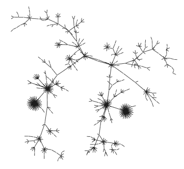
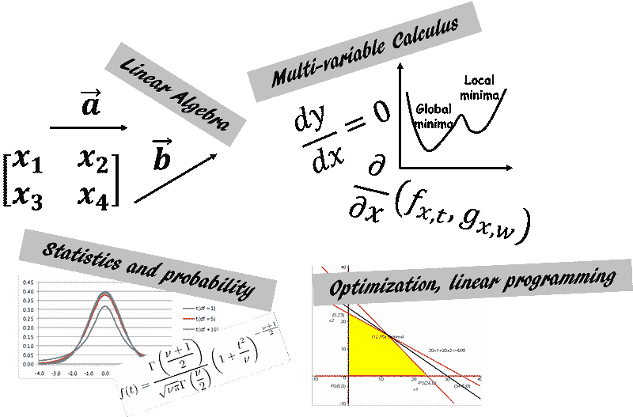
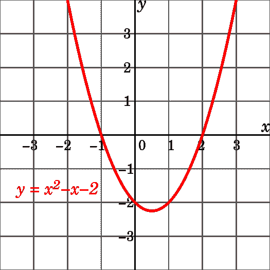
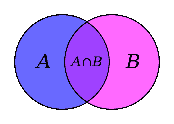
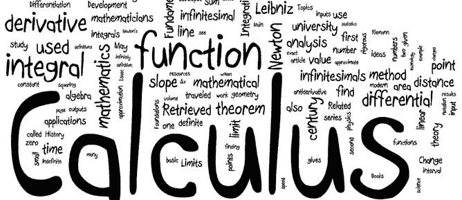
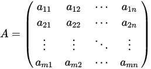
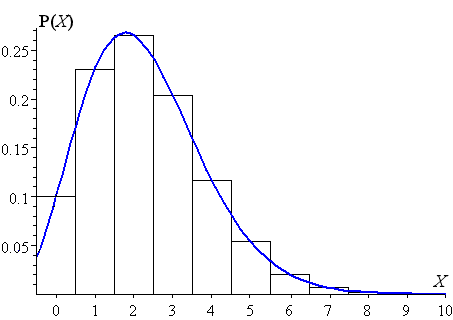
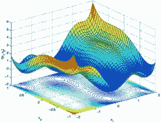

# 一个 IT 工程师需要学习多少数学才能进入数据科学领域？

> 原文：[`www.kdnuggets.com/2017/12/mathematics-needed-learn-data-science-machine-learning.html`](https://www.kdnuggets.com/2017/12/mathematics-needed-learn-data-science-machine-learning.html)

 评论

**免责声明和前言**

* * *

## 我们的前 3 个课程推荐

 1\. [谷歌网络安全证书](https://www.kdnuggets.com/google-cybersecurity) - 快速进入网络安全职业生涯。

 2\. [谷歌数据分析专业证书](https://www.kdnuggets.com/google-data-analytics) - 提升你的数据分析技能

 3\. [谷歌 IT 支持专业证书](https://www.kdnuggets.com/google-itsupport) - 支持你所在的组织进行 IT 工作

* * *

首先，免责声明，我不是 IT 工程师 :-) 我在半导体领域工作，专注于高功率半导体，作为技术开发工程师，我的日常工作主要涉及半导体物理、硅制造过程的有限元模拟或电子电路理论。当然，这项工作中确实涉及一些数学，但无论好坏，我并不需要涉及数据科学家所需的那种数学。

然而，我有许多 IT 行业的朋友，并且观察到许多传统的 IT 工程师对学习/贡献于数据科学和机器学习/人工智能这个激动人心的领域充满热情。我自己也在涉足这个领域，学习一些可以应用于半导体器件或工艺设计领域的技巧。但当我开始深入研究这些激动人心的主题（通过自学）时，我很快发现自己不知道/只对/大多忘记了本科时学习的一些基本数学知识。[在这篇 LinkedIn 文章中，我聊了聊这个话题](https://www.linkedin.com/pulse/whys-hows-studying-mathematics-mldata-science-preamble-sarkar)...

现在，我拥有一所美国知名大学的电气工程博士学位，但仍然觉得自己在准备扎实掌握机器学习或数据科学技术时感到不够全面，因为没有对一些必要的数学知识进行复习。我并无意冒犯 IT 工程师，但我必须说，他/她的工作性质和长期的培训通常使他/她与应用数学的世界保持距离。他/她可能每天处理大量数据和信息，但可能不会强调对这些数据的严格建模。通常情况下，时间压力很大，重点放在“*用数据满足你即时的需求然后继续前进*”而不是对数据进行深入探究和科学探索。不幸的是，数据科学应该始终关于科学（*而非*数据），按照这个思路， [某些工具和技术变得不可或缺](https://medium.freecodecamp.org/how-machines-learn-a-practical-guide-203aae23cafb)。

> 这些工具和技术——通过探查潜在动态建模一个过程（物理或信息），严格估计数据源的质量，训练识别信息流中隐藏模式的能力，或明确理解模型的局限性——是健全科学过程的标志。

这些内容通常在应用科学/工程学科的高级研究生课程中教授。或者，通过类似领域的高质量研究生级别的研究工作也可以掌握。不幸的是，即便在传统 IT（开发运维、数据库或质量保证/测试）领域拥有十年的职业生涯，也不足以严格传授这类培训。简单来说，这没有必要。

**时代在变迁**

直到现在。

你看，在大多数情况下，拥有无可挑剔的 SQL 查询知识、清晰的整体业务需求感和对相应关系型数据库管理系统的一般结构的了解，对于执行提取-转换-加载周期并为公司创造价值来说，已经足够了。但如果有人突然出现，开始问一些奇怪的问题，比如“*你的人工合成测试数据集足够随机吗*”或“*你如何知道下一个数据点是否在你数据的底层分布的 3-sigma 范围内*”？或者，甚至是隔壁计算机科学毕业生/极客偶尔的调侃，即“*与数据表（即矩阵）相关的任何有意义的数学操作的计算负荷随着表的大小（即行和列的数量）的增加呈非线性增长*”，可能会让人感到沮丧和困惑。

> 而且，这些类型的问题正在越来越频繁和紧迫地出现，仅仅因为数据是新的货币。

高管、技术经理、决策者已经不满足于仅仅通过传统 ETL 工具获得的干巴巴的表格描述。他们想要看到隐藏的模式，渴望感受到列之间的微妙互动，希望获取完整的描述性和推断性统计数据，这些数据可能有助于预测建模并将数据集的投影能力扩展到超出其包含的值的即时范围之外。

> 今天的数据必须讲述一个故事，或者，如果你愿意，可以唱一首歌。然而，要听到它美妙的旋律，人们必须掌握音乐的基本音符，并且
> 
> 那些是数学真理。

不再赘述，让我们来探讨核心问题。一个普通的 IT 工程师如果想进入商业分析/数据科学/数据挖掘领域，必须学习/复习哪些基本数学主题/子主题？我将在下面的图表中展示我的想法。

**基础代数、函数、集合论、绘图、几何学**

从根本开始总是一个好主意。现代数学的建筑基于一些关键基础——集合论、泛函分析、数论等。从应用数学学习的角度来看，我们可以通过一些简明的模块（没有特定顺序）来简化这些主题的学习：

a) 集合论基础，b) 实数和复数及其基本性质，c) 多项式函数、指数、对数、三角恒等式，d) 线性和二次方程，e) 不等式、无穷级数、二项式定理，f) 排列和组合，g) 图形绘制和绘图，笛卡尔坐标系和极坐标系，圆锥曲线，h) 基本几何学和定理，三角形性质。

**微积分**

**艾萨克·牛顿**想要解释天体的运动。然而，他没有足够好的数学工具来描述他的物理概念。因此，他在[隐藏在乡村农场避开城市英国的瘟疫爆发时](https://en.wikipedia.org/wiki/Early_life_of_Isaac_Newton)发明了这一分支数学（或某种现代形式的数学）。从那时起，它被认为是任何分析研究——无论是纯科学还是应用科学、工程学、社会科学、经济学等领域高级学习的入口。

因此，微积分的概念和应用出现在数据科学或机器学习领域的许多地方也就不足为奇了。需要覆盖的最重要主题如下 -

a) 单变量函数、极限、连续性和可微性；b) 平均值定理、不确定形式和 L'Hospital 法则；c) 极值和最小值；d) 积分和链式法则；e) 泰勒级数；f) 积分学的基本和平均值定理；g) 定积分和不定积分的计算；h) 贝塔函数和伽马函数；i) 二变量函数、极限、连续性、偏导数；j) 常微分方程和偏微分方程的基础知识。

**线性代数**

在 ***Facebook*** 上收到新的朋友建议？一个久未联系的专业联系人突然在 ***LinkedIn*** 上添加了你？***Amazon*** 突然为你的下次假期阅读推荐了一本绝佳的浪漫惊悚小说？或者 ***Netflix*** 挖掘出一部你正好合口味的小众纪录片？

知道如果你学习线性代数的基础知识，你将掌握关于[技术行业那些高人一等的人所利用的基本数学对象的知识](http://www.uh.edu/engines/epi2514.htm)，这不是很棒吗？

至少，你将了解控制你在 ***Target*** 上购物、使用 ***Google Map*** 驾驶、在 ***Pandora*** 上听的歌曲，或在 ***Airbnb*** 上租房的数学结构的基本属性。

需要学习的基本主题包括（这不是一个有序或详尽的列表）：

a) 矩阵和向量的基本属性——标量乘法、线性变换、转置、共轭、秩、行列式；b) 内积和外积；c) 矩阵乘法规则和各种算法；d) 矩阵的逆；e) 特殊矩阵——方阵、单位矩阵、三角矩阵、稀疏矩阵和密集矩阵的概念、单位向量、对称矩阵、厄米矩阵、反厄米矩阵和单位矩阵；f) 矩阵分解概念/LU 分解、高斯/Gauss-Jordan 消去法、解 Ax=b 线性方程组；g) 向量空间、基、张成、正交性、正交归一性、线性最小二乘法；h) 奇异值分解；i) 特征值、特征向量和对角化。

这里有一篇很好的 Medium 文章，讲述了[你可以用线性代数完成的事情](https://medium.com/@jeremyjkun/here-s-just-a-fraction-of-what-you-can-do-with-linear-algebra-633383d4153f)。

**统计学与概率**

> 死亡和税收是唯一确定的，其余的都遵循正态分布。

在讨论数据科学时，掌握统计学和概率学基本概念的重要性不容低估。许多从业者实际上称机器学习不过是统计学习。我在做我的第一个机器学习 MOOC 时，跟随了广为人知的“[统计学习导论](http://www-bcf.usc.edu/~gareth/ISL/)”，并立即意识到自己在这个主题上的概念缺口。为了弥补这些缺口，我开始参加其他关注基础统计学和概率学的 MOOC，并阅读/观看相关主题的视频。这个领域广泛而无尽，因此有针对性的规划对于覆盖最重要的概念至关重要。我尽力列出这些内容，但我担心这是我最可能短缺的领域。

a) 数据摘要和描述统计、集中趋势、方差、协方差、相关性，b) 概率：基本概念、期望、概率计算、贝叶斯定理、条件概率，c) 概率分布函数——均匀分布、正态分布、二项分布、卡方分布、学生 t 分布、中心极限定理，d) 抽样、测量、误差、随机数，e) 假设检验、A/B 测试、置信区间、p 值，f) 方差分析，g) 线性回归，h) 效能、效应量、均值检验，i) 研究研究和实验设计。

这里有一篇关于[数据科学家统计知识必要性](https://medium.com/towards-data-science/statistics-review-for-data-scientists-and-management-df8f94760221)的不错文章。

**专题：优化理论，算法分析**

这些主题与传统的应用数学讨论略有不同，因为它们主要与理论计算机科学、控制理论或运筹学等专业领域相关且广泛使用。然而，基本理解这些强大技术的能力在机器学习实践中非常有用，因此值得在这里提及。

例如，几乎每种机器学习算法/技术都旨在最小化某种估计误差，并受各种约束条件的限制。这本身就是一个优化问题，通常通过[线性规划](https://en.wikipedia.org/wiki/Linear_programming)或类似技术来解决。另一方面，理解计算机算法的时间复杂度总是一种令人满足和洞察力深刻的体验，因为当算法应用于大数据集时，时间复杂度变得极其重要。在这个大数据时代，数据科学家通常需要提取、转换和分析数十亿条记录，他/她必须非常小心选择合适的算法，因为这可能意味着从惊人的表现到彻底失败的差异。算法的一般理论和属性最好在正式的计算机科学课程中学习，但要理解它们的时间复杂度（即，算法在给定数据大小下运行所需的时间）如何分析和计算，一个必须具备对数学概念如[*动态规划*](https://medium.freecodecamp.org/demystifying-dynamic-programming-3efafb8d4296)或*递归方程*的基础了解。对[*数学归纳法证明*](https://en.wikipedia.org/wiki/Mathematical_induction)的熟悉也可能非常有帮助。

**后记**

感到害怕？学习这些作为前提的主题让你感到困惑？不要担心，你会边学边用。目标是保持你的思维窗户和大门开放，欢迎新知识。

甚至有一个简明的[MOOC 课程](https://www.coursera.org/learn/datasciencemathskills)来帮助你入门。请注意，这是一个针对高中或大一水平知识的初学者课程。这里还有一篇关于数据科学的 15 个最佳数学课程的总结文章在 kdnuggets 网站上。

但你可以放心，在复习这些话题后，许多你可能在本科时学过的，或者即使是学习新概念，你会感到如此充满力量，以至于你肯定会开始听到数据所唱的隐秘音乐。这就意味着你向成为数据科学家的目标迈出了重要的一步……

**#数据科学, #机器学习, #信息, #技术, #数学**

如果你有任何问题或想法，请联系作者，邮箱地址是[**tirthajyoti[AT]gmail.com**](mailto:tirthajyoti@gmail.com)。你也可以查看作者的[**GitHub 库**](https://github.com/tirthajyoti)获取其他有趣的 Python、R 或 MATLAB 代码片段和机器学习资源。你也可以[在 LinkedIn 上关注我](https://www.linkedin.com/in/tirthajyoti-sarkar-2127aa7/)。

**简介：[Tirthajyoti Sarkar](https://www.linkedin.com/in/tirthajyoti-sarkar-2127aa7/)** 是一位半导体技术专家、机器学习/数据科学爱好者、电子工程博士、博客作者和作家。

[原文](https://towardsdatascience.com/how-much-maths-does-an-it-engineer-need-to-learn-to-get-into-data-science-machine-learning-7d6a42f79516)。经许可转载。

**相关：**

+   为什么你应该忘记数据科学代码中的‘for-loop’，而应该拥抱向量化

+   15 门用于数据科学的数学 MOOC 课程

+   回归分析真的属于机器学习吗？

### 更多相关话题

+   [成为一名优秀数据科学家需要的 5 项关键技能](https://www.kdnuggets.com/2021/12/5-key-skills-needed-become-great-data-scientist.html)

+   [每个初学者数据科学家应掌握的 6 种预测模型](https://www.kdnuggets.com/2021/12/6-predictive-models-every-beginner-data-scientist-master.html)

+   [2021 年最佳 ETL 工具](https://www.kdnuggets.com/2021/12/mozart-best-etl-tools-2021.html)

+   [停止为了找到目的而学习数据科学，找一个目的再去学习…](https://www.kdnuggets.com/2021/12/stop-learning-data-science-find-purpose.html)

+   [数据科学中需要多少数学知识？](https://www.kdnuggets.com/2020/06/math-data-science.html)

+   [学习数据科学统计学的顶级资源](https://www.kdnuggets.com/2021/12/springboard-top-resources-learn-data-science-statistics.html)
