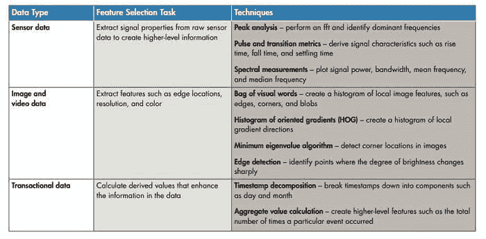
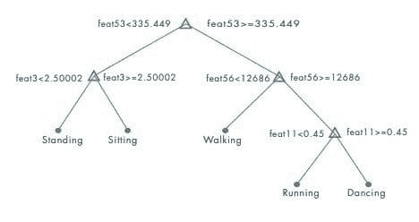
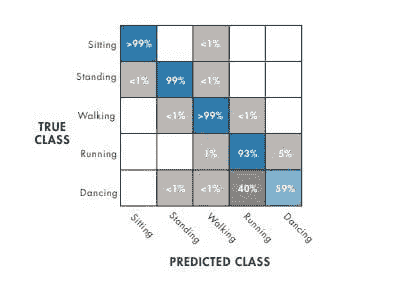
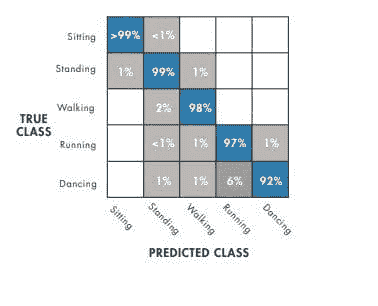
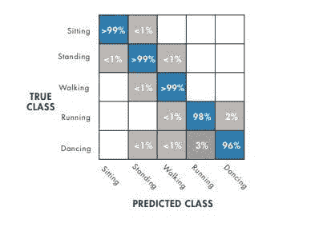

# 通过反复试验建立机器学习模型

> 原文：[`www.kdnuggets.com/2018/09/mathworks-building-machine-learning-model-through-trial-error.html`](https://www.kdnuggets.com/2018/09/mathworks-building-machine-learning-model-through-trial-error.html)

赞助文章。

**由 Seth DeLand, 产品营销经理, 数据分析，[MathWorks](https://www.mathworks.com/)**

* * *

## 我们的前三大课程推荐

 1\. [Google 网络安全证书](https://www.kdnuggets.com/google-cybersecurity) - 快速进入网络安全职业生涯。

 2\. [Google 数据分析专业证书](https://www.kdnuggets.com/google-data-analytics) - 提升你的数据分析技能

 3\. [Google IT 支持专业证书](https://www.kdnuggets.com/google-itsupport) - 支持你的组织的 IT

* * *

机器学习的路线图充满了反复试验。对于概念新手的工程师和科学家来说，他们将不断调整和改变他们的算法和模型。在这个过程中，挑战将会出现，特别是在处理数据和确定正确模型时。

在构建机器学习模型时，了解现实世界的数据是不完美的，不同类型的数据需要不同的方法和工具，并且在确定正确模型时总会有权衡。

以下系统化工作流程描述了如何开发一个用于手机健康监测应用的训练模型，该应用跟踪用户一天中的活动。输入由手机的传感器数据组成。输出将是执行的活动：行走、站立、坐着、跑步或跳舞。由于目标是分类，这个示例将涉及 [监督学习](https://www.mathworks.com/help/stats/supervised-learning-machine-learning-workflow-and-algorithms.html?s_tid=srchtitle&s_eid=PEP_19715.html)。

***获取和加载数据***

用户将坐下并持有手机，记录传感器数据，并将其存储在标记为“sitting”的文本文件中。然后，他们应站立持手机，记录传感器数据，并将其存储在标记为“standing”的文本文件中。对于跑步、行走和跳舞也如此操作。

***预处理数据***

由于机器学习算法无法区分噪声和有价值的信息，因此必须在训练前清理数据。数据可以通过数据分析工具进行预处理，如 MATLAB。为了清理数据，用户可以导入和绘制数据，并去除异常值。在此示例中，异常值可能是由于在加载数据时不小心移动了手机。用户还必须检查缺失的数据，这些数据可以通过近似值或来自另一个样本的可比数据来替换。

图 1：数据预处理包括移除任何异常值，即那些位于数据其余部分之外的数据点。清理后，将数据分成两部分。一半用于训练模型，另一半用于测试和交叉验证。

***使用预处理数据提取特征***

原始数据必须转化为机器学习算法可以使用的信息。为此，用户必须提取能够对电话数据内容进行分类的特征。

在这个例子中，工程师和科学家必须区分特征，以帮助算法在步行（低频率）和跑步（高频率）之间进行分类。

图 2：从数据类型中提取特征将原始数据转化为可以用于机器学习模型的高级信息。***构建和训练模型***

从一个简单的决策树开始。

图 3：决策树根据特征特性建立分类参数。绘制混淆矩阵以观察其性能。图 4：这个矩阵展示了一个在区分跑步和跳舞方面有困难的模型。根据上述混淆矩阵，这表明要么决策树不适用于这种数据，要么应使用不同的算法。

K 最近邻（KNN）算法存储所有训练数据，将新点与训练数据进行比较，并返回“K”个最近点中最频繁的类别。这显示出更高的准确性。

图 5：将 KNN 算法进行更改可以提高准确性——尽管仍有进一步改进的空间。另一种选择是多类支持向量机（SVM）。图 6：SVM 表现很好，几乎所有活动的准确率都达到了 99%。这被证明效果更好，并展示了通过反复试验达成目标的过程。

***改进模型***

如果模型不能可靠地区分跳舞和跑步，则需要进行改进。可以通过使模型更复杂（以更好地适应数据）或更简单（以减少过拟合的可能性）来改进模型。

为了简化模型，可以通过以下方法减少特征数量：相关矩阵，以便可以移除相关性不高的特征；主成分分析（PCA）以消除冗余；或顺序特征减少，重复减少特征直到没有进一步改进。为了使模型更复杂，工程师和科学家可以将多个简单模型合并为一个更大的模型或添加更多数据源。

一旦训练和调整完成，可以使用在预处理期间预留的“留出”数据集来验证模型。如果模型能够可靠地分类活动，那么它就准备好用于手机应用程序了。

对于第一次训练机器学习模型的工程师和科学家来说，会遇到挑战，但应该意识到试错是过程的一部分。上述工作流程提供了构建机器学习模型的路线图，这些模型还可以用于预测维护、自然语言处理和自动驾驶等各种应用。

探索这些其他资源，深入了解机器学习方法和示例。

+   [监督学习工作流程和算法](https://www.mathworks.com/help/stats/supervised-learning-machine-learning-workflow-and-algorithms.html?s_tid=srchtitle&s_eid=PEP_19715.html)：了解监督学习过程中的工作流程和步骤。

+   [MATLAB 机器学习示例](https://www.mathworks.com/solutions/machine-learning/getting-started.html&s_eid=PEP_19715.html)：通过探索示例、文章和教程开始机器学习之旅。

+   [MATLAB 中的机器学习](https://www.mathworks.com/campaigns/offers/machine-learning-with-matlab.html?s_iid=nd_bb15&s_eid=PEP_19715.html)：下载这本电子书，提供机器学习基础知识的逐步指南以及高级技术和算法。

### 更多相关主题

+   [构建机器学习模型的结构化方法](https://www.kdnuggets.com/2022/06/structured-approach-building-machine-learning-model.html)

+   [逐步教程：构建你的第一个机器学习模型](https://www.kdnuggets.com/step-by-step-tutorial-to-building-your-first-machine-learning-model)

+   [探索思维树提示：AI 如何通过搜索学习推理…](https://www.kdnuggets.com/2023/07/exploring-tree-of-thought-prompting-ai-learn-reason-through-search.html)

+   [数据讲述 - 通过数据讲故事的艺术](https://www.kdnuggets.com/2023/07/manning-data-storytelling-the-art-telling-stories-data.html)

+   [通过 Apache Gobblin 扩展数据管理](https://www.kdnuggets.com/2023/01/scaling-data-management-apache-gobblin.html)

+   [通过验证链解锁可靠生成：一个…](https://www.kdnuggets.com/unlocking-reliable-generations-through-chain-of-verification)
