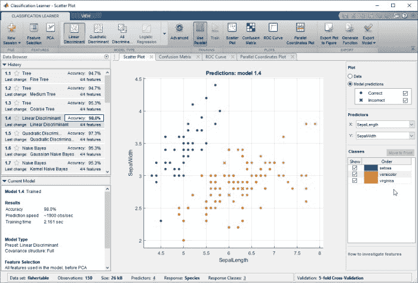
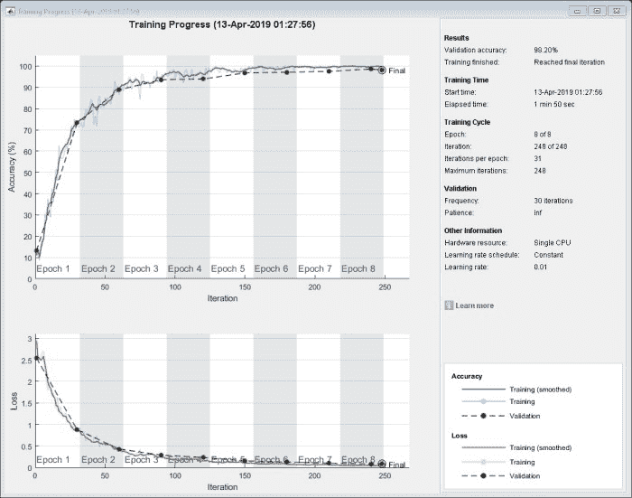

# 常见的机器学习障碍

> 原文：[`www.kdnuggets.com/2019/09/mathworks-common-machine-learning-obstacles.html`](https://www.kdnuggets.com/2019/09/mathworks-common-machine-learning-obstacles.html)

赞助文章。

**作者：Seth DeLand，MathWorks 数据分析产品营销经理**

从事机器学习建模的工程师和科学家在处理数据时常常面临挑战。两个最常见的障碍与选择合适的分类模型和消除数据过拟合有关。

分类模型根据特定特征集将项目分配到离散组或类别。由于每个数据集的独特性和期望结果，确定最佳分类模型通常会遇到困难。过拟合发生在模型与可能包含噪声或错误的有限训练数据过于贴合时。过拟合的模型无法很好地推广到训练集之外的数据，限制了其在生产系统中的实用性。

图 1：分类学习器应用程序用于训练和比较各种分类器。© 1984–2019 The MathWorks, Inc.

通过整合可扩展的软件工具和机器学习技术，工程师和科学家可以识别最佳模型并防止过拟合。

**选择分类模型**

分类模型类型可能具有挑战性，因为每种模型类型都有其自身的特点，这可能是根据问题的不同而成为优势或劣势。

首先，你必须回答一些关于数据类型和用途的问题：

+   这个模型的目的是什么？

+   数据有多少？是什么类型的数据？

+   需要多少细节？存储是否是限制因素？

回答这些问题可以帮助缩小选择范围并选择正确的分类模型。工程师和科学家可以使用交叉验证来测试模型评估数据的准确性。经过交叉验证后，你可以选择最合适的分类模型。

分类模型有很多种类型，这里列出了五种常见类型：

+   [逻辑回归](https://www.mathworks.com/help/stats/mnrfit.html?s_eid=PEP_22192)：由于其简单性，这个模型通常被用作基准。它用于数据可以被分类为两个可能类别的问题。逻辑回归模型返回每个数据点属于各个类别的概率。

+   [*k*-最近邻 (kNN)](https://www.mathworks.com/help/stats/classificationknn.html?s_eid=PEP_22192)：这种简单而有效的分类方法根据数据点与训练数据集中其他点的距离来对数据点进行分类。kNN 的训练时间较短，但除非对数据应用权重，否则该模型可能会将无关属性误认为重要属性，特别是在数据点数量增加时。

+   [决策树](https://www.mathworks.com/help/stats/decision-trees.html?s_eid=PEP_22192)：这些模型通过视觉方式预测响应，从根到叶的决策路径相对容易跟随。当展示结论如何得出时，这种类型的模型特别有用。

+   [支持向量机](https://www.mathworks.com/help/stats/support-vector-machine-classification.html?s_eid=PEP_22192)（SVM）：该模型使用超平面将数据分为两个或更多类别。它准确，不容易过拟合，并且相对容易解释，但对于较大的数据集，训练时间可能较长。

+   人工神经网络（ANNs）：这些网络可以配置和训练以解决各种不同的问题，包括分类和时间序列预测。然而，训练后的模型通常难以解释。

工程师和科学家可以通过使用可扩展的软件工具来简化决策过程，以确定哪个模型最适合一组特征，评估分类器性能，比较和提高模型准确性，并最终导出最佳模型。这些工具还帮助用户探索数据，选择特征，指定验证方案，并训练多个模型。

图 2：深度神经网络的训练进度，显示训练集和验证集的准确性和损失。© 1984–2019 The MathWorks, Inc.

**消除数据过拟合**

过拟合发生在模型适应特定数据集但对新数据的泛化能力较差时。过拟合通常难以避免，因为它通常是训练数据不足的结果，特别是当负责模型的人没有收集数据时。避免过拟合的最佳方法是使用足够的训练数据来准确反映模型的多样性和复杂性。

数据正则化和泛化是工程师和科学家可以应用的两种额外方法来检查过拟合。正则化是一种防止模型过度依赖个别数据点的技术。正则化算法向模型引入额外信息，并通过使模型更简洁和准确来处理多重共线性和冗余预测变量。这些算法通常通过对复杂度施加惩罚来工作，例如将模型的系数添加到最小化中或包括粗糙度惩罚。

泛化将可用数据分成三个子集。第一个是训练集，第二个是验证集。在训练过程中监控验证集上的误差，并对模型进行微调直到准确。第三个子集是测试集，用于在训练和交叉验证阶段后对完全训练的分类器进行测试，以检验模型是否未过拟合训练和验证数据。

有六种交叉验证方法可以帮助防止过拟合：

+   *k*-fold: 将数据划分为 *k* 个随机选择的子集（或折叠），每个子集大小大致相等，其中一个子集用于验证用其余子集训练的模型。这个过程重复 *k* 次，因为每个子集在验证中使用一次。

+   Holdout: 将数据分为指定比例的两个子集，用于训练和验证。

+   Leave one out: 使用 *k*-fold 方法对数据进行分割，其中 *k* 等于数据中的总观察数。

+   Repeated random subsampling: 执行蒙特卡罗重复实验，随机分隔数据并汇总所有运行的结果。

+   Stratify: 将数据分割，使得训练集和测试集在响应或目标的类别比例上大致相同。

+   Resubstitution: 使用训练数据进行验证而不进行分离。这种方法往往会产生过于乐观的性能估计，如果数据量足够，应避免使用。

机器学习的老手和初学者在分类和过拟合方面都可能遇到问题。尽管机器学习中的挑战可能显得令人生畏，但利用正确的工具和使用本文介绍的验证方法将帮助工程师和科学家更轻松地将机器学习应用于现实世界的项目中。

要了解更多关于分类建模和过拟合的信息，以及 MATLAB 如何帮助克服这一机器学习挑战，请参见下面的链接或通过电子邮件联系我 sdeland@mathworks.com。

+   [试用分类学习器应用程序](https://www.mathworks.com/campaigns/offers/machine-learning-try-in-browser.html?s_eid=PEP_22192): 通过在浏览器中运行 MATLAB 来创建和训练机器学习模型。

+   [分类示例](https://www.mathworks.com/help/stats/examples.html?category=classification&s_tid=CRUX_classification?s_eid=PEP_22192): 查看这些 25 个分类示例，包括判别分析和朴素贝叶斯。

+   [提高浅层神经网络的泛化能力并避免过拟合](https://www.mathworks.com/help/deeplearning/ug/improve-neural-network-generalization-and-avoid-overfitting.html?s_eid=PEP_22192): 这是一个过拟合的示例。

* * *

## 我们的前三个课程推荐

 1\. [谷歌网络安全证书](https://www.kdnuggets.com/google-cybersecurity) - 快速进入网络安全职业生涯。

 2\. [谷歌数据分析专业证书](https://www.kdnuggets.com/google-data-analytics) - 提升您的数据分析技能

 3\. [谷歌 IT 支持专业证书](https://www.kdnuggets.com/google-itsupport) - 支持您的组织在 IT 方面的工作

* * *

### 更多相关话题

+   [如何应对 3 个常见的机器学习挑战](https://www.kdnuggets.com/2022/09/comet-tackle-3-common-machine-learning-challenges.html)

+   [常见数据问题（及解决方案）](https://www.kdnuggets.com/2022/02/common-data-problems-solutions.html)

+   [10 个最常见的数据质量问题及其解决方法](https://www.kdnuggets.com/2022/11/10-common-data-quality-issues-fix.html)

+   [5 个常见的 Python 陷阱（以及如何避免）](https://www.kdnuggets.com/5-common-python-gotchas-and-how-to-avoid-them)

+   [避免这 5 个每位 AI 新手都会犯的常见错误](https://www.kdnuggets.com/avoid-these-5-common-mistakes-every-novice-in-ai-makes)

+   [5 个常见的数据科学错误及如何避免](https://www.kdnuggets.com/5-common-data-science-mistakes-and-how-to-avoid-them)
