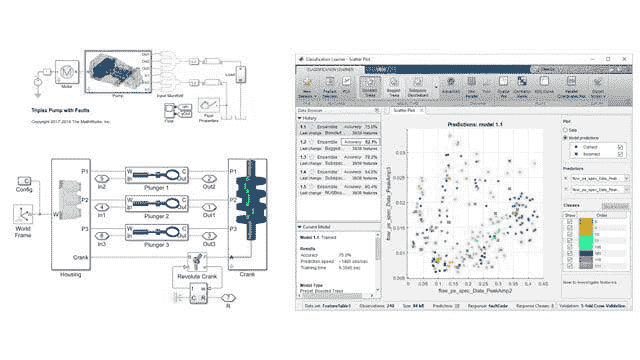
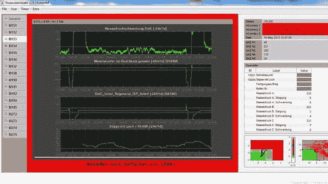

# 将预测性维护从理论转向实践

> 原文：[`www.kdnuggets.com/2019/12/mathworks-predictive-maintenance-theory-practice.html`](https://www.kdnuggets.com/2019/12/mathworks-predictive-maintenance-theory-practice.html)

赞助文章。

**由 Philipp H. F. Wallner，工业自动化与机械行业经理，[MathWorks](http://www.mathworks.com/?s_eid=PEP_22664)**

如今你经常听到预测性维护及其价值。它是一个理想的状态，设备操作员可以预测即将发生的故障，预先安排维修，最小化对工厂操作的干扰，最重要的是，保护设备免受灾难性故障。我们都能欣然接受预测性维护的价值，或者我应该说预测性维护的*预期*价值？

当谈到在现场设备上实施预测性维护时，我们的明亮眼睛很快失去了光泽。事实证明，少数公司实际实施了预测性维护，这引发了一个问题，为什么会这样？

在与行业领袖的对话中，存在一个一致的主题，即设备制造商和操作员必须克服的四个关键挑战，以便成功地与数据科学界合作并在操作中实施预测性维护解决方案：

**1\. 促进合作以利用现有领域知识，同时设计算法。** 公司如何帮助促进数据科学家与领域专家之间的合作，以便设计出基于统计方法结合领域知识的强大预测性维护算法？数据科学家和领域专家如何紧密合作，以确保每个强大预测性维护应用的关键组成部分——数据分析方法*和*领域知识——都得到充分利用？

成功的预测性维护应用程序结合了：基于统计的数据分析方法，如机器学习，以及研发工程师对设备的领域专业知识（在许多情况下，已经在仿真模型中捕获）。仅用数据分析方法来处理预测性维护将会遗漏工程和运营团队中持有的重要信息，这些团队负责构建和支持设备。

**2\. 在缺乏故障数据的情况下训练算法。** 机器学习的一个关键方面是使用来自现场的数据来训练算法。这包括来自正常生产使用的“好”数据以及捕获的故障数据，用于各种操作设备时可能出现的错误场景。但是，当目标是避免设备首先出现故障时，你从哪里获得故障数据呢？

对于将预测性维护应用于从风力涡轮机到空气压缩机等工业系统的组织来说，这成为了一个日益重要的难题。作为解决这一困境的途径，可以使用模拟模型生成合成故障数据，以在缺乏现场测量故障数据的情况下训练算法。

图 1\. 一个用于训练故障分类机器学习算法以克服缺乏测量故障数据的三重泵模拟模型，位于 Simulink 和 Simscape 中。© 1984–2019 The MathWorks, Inc.

**3\. 部署用于运行中的算法。** 一旦预测性维护算法在桌面上完成设计和训练，就需要将其部署到设备上。此步骤的工作量高度依赖于现有的 IT 和 OT 基础设施。虽然有些算法在实时硬件平台上实现（例如，嵌入式控制器、工业 PC 或 PLC），但其他算法将被集成到现有的非实时基础设施中（例如，运行 Windows 或 Linux 的边缘设备）或在云中。越来越多的公司选择使用能够自动生成 C 或 IEC 61131-3 代码、.NET 组件或独立可执行文件的工具链，例如这家[国际包装和纸品制造商](https://www.mathworks.com/company/user_stories/mondi-implements-statistics-based-health-monitoring-and-predictive-maintenance-for-manufacturing-processes-with-machine-learning.html?s_eid=PEP_22664)，它使用预测性维护软件来减少塑料制造厂的废料和机器停机时间。

图 2\. 一个基于 MATLAB 的人机界面（HMI），使设备操作员在故障发生之前能够接收潜在故障的警告。© 1984–2019 The MathWorks, Inc.

**4\. 制定预测性维护的商业案例。** 每个公司在开始实施预测性维护之前必须能够回答的主要问题是，我将如何通过此方法产生收入？

如果你无法回答这个“关键问题”，你为建立复杂的预测性维护解决方案所做的所有努力将很快陷入停滞。了解你的商业案例并制定预测性维护的货币化策略，将有助于说服公司管理层为实施预测性维护应用程序的投资提供正当理由。

对于设备操作员来说，设备在运行过程中不易出现故障通常足以证明投资的合理性，但对设备制造商来说，这一案例则稍显挑战。我见到的一些有希望的想法，用于帮助建立实施预测性维护的案例包括

+   将服务费用与操作员（即他们的客户）运行的设备的预测性维护挂钩；

+   使用知识产权保护销售已部署的预测维护算法；以及

+   转向一种完全新的基于使用的商业模式（例如，销售压缩空气的立方米而不是压缩机，或电梯使用小时而不是整个电梯）。

要了解更多有关本文博客帖子中涵盖的主题的信息，请发送电子邮件至 pwallner@mathworks.com 的工业自动化与机械行业经理 Philipp H. F. Wallner，或查看以下链接：

+   [预测维护](https://www.mathworks.com/videos/series/predictive-maintenance-tech-talk-series.html?s_eid=PEP_22664)（视频系列）：了解更多关于预测维护的概念和工作流程。

+   [使用 Simulink 生成故障数据](https://www.mathworks.com/help/predmaint/ug/Use-Simulink-to-Generate-Fault-Data.html;jsessionid=fb6612944dab76ce72922e571d95?s_eid=PEP_22664)（示例）：此示例展示了如何使用仿真模型生成故障和健康数据。它使用一个传动系统，并对齿轮齿故障、传感器漂移故障和轴磨损故障进行建模。

+   [Mondi 实施基于统计的健康监测和机器学习预测维护以优化制造过程](https://www.mathworks.com/company/user_stories/mondi-implements-statistics-based-health-monitoring-and-predictive-maintenance-for-manufacturing-processes-with-machine-learning.html?s_eid=PEP_22664)（客户参考）：查看 Mondi Gronau 如何减少工厂中的废料和机器停机时间，每年节省超过 50,000 欧元。

+   [MATLAB 中的预测维护简介](https://www.mathworks.com/campaigns/offers/introduction-to-predictive-maintenance-with-matlab.html?s_eid=PEP_22664)（电子书）：学习如何开发你的预测维护、状态监测和异常检测算法。

* * *

## 我们的前三个课程推荐

 1\. [Google 网络安全证书](https://www.kdnuggets.com/google-cybersecurity) - 快速进入网络安全职业。

 2\. [Google 数据分析专业证书](https://www.kdnuggets.com/google-data-analytics) - 提升你的数据分析技能

 3\. [Google IT 支持专业证书](https://www.kdnuggets.com/google-itsupport) - 支持你的组织的 IT 需求

* * *

### 更多相关内容

+   [从理论到实践：构建 k 最近邻分类器](https://www.kdnuggets.com/2023/06/theory-practice-building-knearest-neighbors-classifier.html)

+   [数据可视化：理论与技术](https://www.kdnuggets.com/data-visualization-theory-and-techniques)

+   [数据科学中的统计学：理论与概述](https://www.kdnuggets.com/statistics-in-data-science-theory-and-overview)

+   [监督学习的理解：理论与概述](https://www.kdnuggets.com/understanding-supervised-learning-theory-and-overview)

+   [机器学习评估指标：理论与概述](https://www.kdnuggets.com/machine-learning-evaluation-metrics-theory-and-overview)

+   [如何利用图论来 scout 足球](https://www.kdnuggets.com/2022/11/graph-theory-scout-soccer.html)
