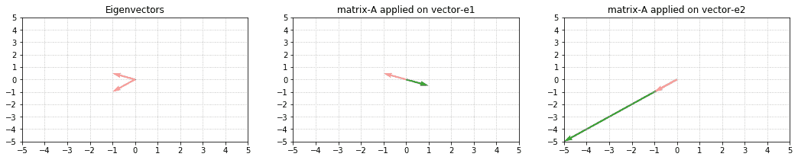
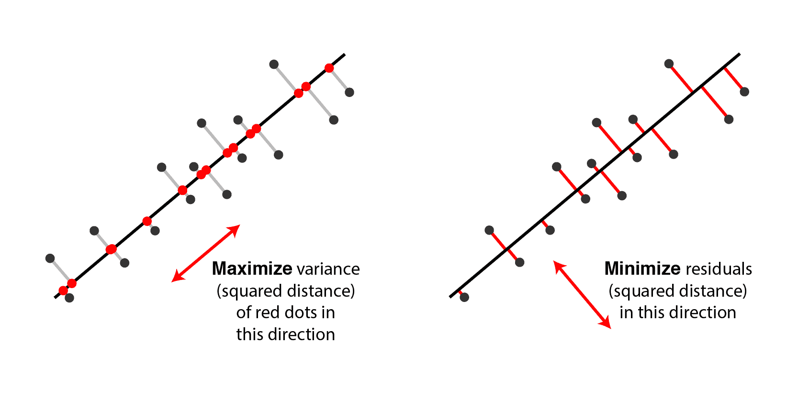
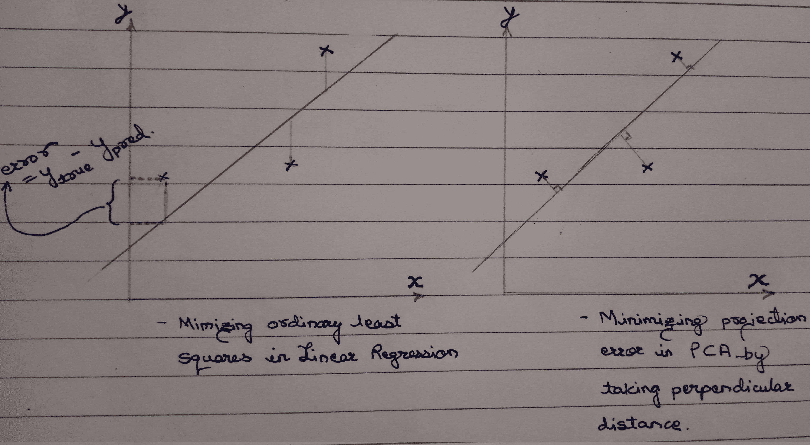
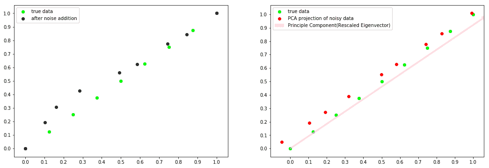

# 矩阵分解解读

> 原文：[`www.kdnuggets.com/2020/12/matrix-decomposition-decoded.html`](https://www.kdnuggets.com/2020/12/matrix-decomposition-decoded.html)

评论

**由 [Tanveer Sayyed](https://www.linkedin.com/in/tanveer-sayyed-739105185/), 数据科学爱好者**

要理解矩阵分解，我们首先需要理解特征值（从现在开始称为 lambda）和特征向量。在理解 lambda 和特征向量的直觉之前，我们首先需要揭示在线性代数中使用矩阵和向量的目的。

### 那么矩阵和向量在线性代数中的目的是什么呢？

在机器学习中，我们通常关注的矩阵的列是特征。因此，我们在心中天然地将矩阵视为神圣的。现在这可能会让你感到惊讶，因为—*矩阵的* *目的是“作用于”（输入）向量，以给出（输出）向量****!*** 记住线性回归的线性代数方程：

```py
 (X^T . X)^-1 . X^T   **.**       y         **------>**  coefficients
***[---m-a-t-r-i-x----]  . [input vector]* ------> *[output vector]***
```

正确的阅读方式是——我们*“应用”*矩阵到一个向量*(y)*上，以得到输出向量*(系数)*。换句话说——矩阵*“转换/扭曲”*输入向量以成为输出向量。一个向量输入，通过矩阵变换/扭曲，输出另一个向量。这就像是微积分中的函数：一个数字 x（比如 3）输入，得到一个数字 *f*(x)（例如 27，如果 *f*(x) = x³）。

### 关于 lambda 和特征向量的直觉

既然矩阵的目的已经明确，那么定义特征向量就会变得容易。如果我们发现输入向量和输出向量*仍然*彼此平行，那么这个向量就是特征向量。这意味着它们保持了变形或未受到影响。“平行”指的是以下两种情况之一：

```py
 ------------**>**                          ------------**>**
     ------------**>**                          **<**------------
          1\.                                     2. 
```

在学校里，我们被教导**力**是一个向量。它具有*方向*以及*magnitude*。同样，特征向量可以被看作是*变形的方向*，而 lambda 则是*在该方向上的变形幅度*。因此，矩阵被分解/因式分解（就像 6= 3*2 一样）为一个向量及其幅度，可以表示为两者的乘积：

```py
 A.x = λ x 
 where,
 …… A is a **square** matrix,
 …… x is eigenvector of A 
 …… λ is the scalar eigenvalue 
```

这称为特征分解。但是我们如何找到特征向量呢？*从 λs 中找！* 这里是方法：

```py
 A.x - λx = 0    …. (rearranging above equation)
(A -  λI) . x = 0 …. (eq.1)Now x is a non-zero vector. 
In matrices, if we want the product to be equal to zero, 
then the term (A - λI) must be singular! That is, 
the determinant of this whole term must be = 0\. 
Hence,
|A - λI| = 0 ….. (eq.2) Solve eq.2 and 
substitute ‘each’ value of λ in eq.1 to get 
the corresponding eigenvector for that λ. 
```

重要的是了解和理解这些步骤，因此我们将*不会*手动执行这些操作，因为在*numpy*库中已经存在一个函数。（我们将使用[***这段代码***](https://gist.github.com/Vernal-Inertia/90b81a3bf6c5abb96c495c905749d072)来展示和重新缩放特征向量）。例如：



特征向量 e1 = [-1, 0.5] 和 e2 = [-1, -1] 是*粉色*的，而输出向量是*绿色*的。

注意 λ 的效果 [-1, 5]。λ 负责特征向量的缩放（大小的变化）。λ1 是 *负的*，因此我们观察到负向变换——输出向量相对于 e1 移动 **相反**，并且缩放为 e1 长度的 1 倍。而 λ2 是 *正的*，因此我们观察到正向变换——输出向量与 e2 在 **相同** 方向上移动，并且缩放为 e2 长度的 5 倍。

现在，在我们转向特征向量和 λ 的应用之前，让我们先了解它们的属性：

1. 我们只能找到 **方形** 矩阵的特征向量和 λ。

2. 如果 A 的形状是（n,n），则最多会有 n 个 **独立的** λ 及其对应的特征向量。

```py
 --------------**>**--------------**>**--------------------------**>**------
            (2,2)          (4,4)                      (8,8)
Take the line above. We can observe 3 eigenvectors, but they are not 
independent as they are just multiples of each other and are part of the **same** line x = y. 
```

3. λ 的 **和** = 矩阵的迹（对角线之和）。

4. λ 的 **积** = 矩阵 A 的行列式。

5. 对于 **三角形** 矩阵，λ 是对角线值。

6. **重复的** λ 是问题的根源。每重复一个 λ，我们将减少一个独立的特征向量。

7. 矩阵的 **对称性** 越好越好。对称矩阵意味着 *A = transpose(A)*。对称矩阵产生“*实数*” λ。随着我们从对称矩阵转向非对称矩阵，λ 开始变成复数（*a + i b*），因此特征向量开始映射到虚拟空间而不是实空间。尽管矩阵 A 的每个元素都是实数，但如代码所示，这种情况仍然发生。

### 特征向量和 λ 的应用

首先，我们需要明确特征值（λ）不是线性的。这意味着如果 x, α 和 y, β 分别是矩阵 A, B 的特征值和 λ，则：

A . B **≠** αβ (x . y)，而且，A + B **≠** αx + βy。

但是当涉及到计算矩阵的幂时，即寻找 A²⁰ 或 B⁵⁰⁰ 时，它们确实很有用。如果 A, B 是小矩阵，可能可以在我们的机器上计算结果。但是想象一下一个巨大的矩阵，列数众多，那时是否可行？我们是否会重复输入 B 500 次或循环 500 次？不，因为矩阵乘法是计算密集型的。所以让我们通过讨论同一矩阵的第二种因式分解/分解方式来理解“特征量”如何提供帮助。这是从以下方程推导出的：

```py
 **S^-1 . A . S = Λ** …. (eq.3)
where,
      S***** is eigenvector matrix (each eigenvector of A is a column in matrix-S)
      A is our square matrix
      Λ (capital lambda) is a diagonal matrix of all lambda values*****[For S to be invertible, all eigenvectors *must* be independent (the above stated property-2 must be satisfied). And by the way, **very few** matrices fulfill it].
**Now, let's get our matrix from eq.3:**
1\. Left multiplication by S     --> (S.S^-1).A.S = S.Λ
                                --> A.S = S.Λ
2\. Right multiplication by S^-1 --> A.S.(S^-1) = S.Λ.(S^-1)
 **--> A = S.Λ.S^-1
*The matrix A has thus been factorized into three terms: S and Λ and S^-1.***
Now 12² can also be calculated as squares of its prime factors viz 3² * 2² * 2². 
Similarly lets also do for A²:
A² = A . A 
   = (S . Λ . S^-1).(S . Λ . S^-1)
   =  S . Λ . (S^-1 . S) . Λ . S^-1
   =  S . Λ . Λ . S^-1
A² =  S . Λ**²**. S^-1
Generalizing as:
**A^K = S . Λ^K. S^-1** 
```

现在看看通过因式分解计算大幂是多么方便。

现在让我们更深入地探讨一下为什么会这样。再举一个例子：

观察 F**¹** 和 F**⁵** 的特征向量。它们保持不变并始终指向相同的方向。因此，矩阵的幂对特征向量完全没有影响！但是观察 λ，当指数从 1 改变为 5 时；λ1 增加（1.618 到 11.09）的速度远远快于 λ2 减少（**-**0.618 到 **-**0.09）。因此 λ2 的影响几乎可以忽略不计。这表明矩阵总体上是递增的，这可以从 F**⁵**[5,3,3,2] 的值中验证。

由于我们知道矩阵乘法在计算上是耗时的，因此对于任何方阵，如果它的每个 |λ| < 0，则我们知道矩阵是一个*稳定*的*矩阵*；如果每个 |λ| > 0，则矩阵在膨胀，是一个*不稳定*的*矩阵*，所以最好不要继续前进。

上面的例子实际上是斐波那契矩阵，其中矩阵 F 每次自乘时会增加/扩展约**1.6180399**倍！我们来验证一下：

```py
 0, 1, 1, 2, 3, 5, 8, 13, 21, 34.... is the Fibonacci Series
5 * 1.6180399 **≈** 8
8 * 1.6180399 **≈** 13
13 * 1.6180399 **≈** 21 
```

*而这个数字就是 λ 的值……这难道不是令人惊讶吗！！！*

特征值**(eigenvalues)**的美妙之处在于，尽管它们数量*非常少*，但它们可以揭示矩阵/变换*f*函数的属性的隐藏秘密。

“特征值”的另一个应用当然是主成分分析——PCA！

### 为什么选择 PCA？

PCA 用于*特征提取*/*维度减少*，这指的是通过*投影*将数据的已知变量减少到较少的变量中，同时保留*“几乎”*相同数量的信息。有两种*等价的*方式来解释 PCA：

(i) 最小化投影误差，

(ii) 最大化投影的方差。

在这里，极其重要的一点是，上述两个陈述实际上是同一个事物的两个方面，因此最小化一个就*等同于*最大化另一个。



[来源](http://alexhwilliams.info/itsneuronalblog/2016/03/27/pca/)

### 投影的必要性是什么？

我们需要它，因为当有 1000 个特征时，我们有 1000 个未知变量。结果是，我们需要 1000 个同时方程来解所有变量！但是*“如果”*没有解决方案呢？例如，考虑一下 2 个变量的情况：

a + b = 2

a + 2b = 2 ….？

PCA 的作用是，它找到最接近当前问题的近似，以便保留初始数据的某些属性（换句话说，噪声被减少）。因此，投影有助于将噪声与数据分离（代码示例见下文）。这是通过最小化最小二乘投影误差来完成的，这给出了最佳可能的解决方案。

### 最小化投影误差是否与线性回归中的最小二乘误差最小化相同？

不。以下是原因：



贡献者：Andrew Ng

这个图示也暗示了为什么 PCA 也可以用于无监督学习！

### 那么“特征值”在哪些方面有所贡献？

为此，我们需要了解 PCA 的步骤：

1.  由于 PCA 对缩放非常敏感，因此我们首先需要对矩阵 A 进行标准化/归一化。M = mean(A)，然后 C = A − M。

1.  下一步是*记住*，为了获得最佳结果，即利用“特征值”，我们需要一个方阵，并且它是对称的（属性-7）。那么，哪个矩阵满足这两个条件呢？嗯……啊哈！——*协方差矩阵*！所以我们得到：V = cov(C)

1.  既然我们已经得到我们想要的东西，就快速分解一下。

    特征值, 特征向量 = np.linalg.eig(V)

1.  然后将特征值按降序排列。它们对应的特征向量现在代表了降维子空间的组件。在降维子空间中，这些组件（特征向量）现在已经成为我们的新坐标轴，我们知道坐标轴总是**正交**的。（这只有在 PCA 中的每个组件都是独立的特征向量时才会发生）。这些坐标轴的组合产生了投影数据。（点击[***这里***](https://www.joyofdata.de/public/pca-3d/)链接以获得更好的理解。让每个组件直接指向你。你会看到第一个组件捕获了最高的方差，其次是第二个，然后是第三个）

1.  选择 k 个特征值以保留最大解释方差。k 个特征值捕获的方差量称为*解释方差*。

重要的是了解这些步骤，所以我们将*不会*手动执行这些操作，因为*sklearn*库中已经存在一个函数。为了简单起见，我们将把二维数据降到一维数据，同时观察噪声在过程中产生的效果。以下是代码：



**注意投影与主成分完全平行。红点和绿点的接近度（相对于黑点和绿点）表明噪声已经在很大程度上减少。**

（如果你发现任何错误/不正确的地方，请回复。欢迎批评。）

参考文献：

[`www.youtube.com/playlist?list=PLE7DDD91010BC51F8(Prof.`](https://www.youtube.com/playlist?list=PLE7DDD91010BC51F8(Prof.) 吉尔伯特·斯特朗，斯坦福大学。我的大部分内容都来自这里。)

[对机器学习的奇异值分解（SVD）的温和介绍](https://machinelearningmastery.com/singular-value-decomposition-for-machine-learning/)

[`www.youtube.com/watch?v=vs2sRvSzA3o`](https://www.youtube.com/watch?v=vs2sRvSzA3o)（可能是对特征值和特征向量的最佳可视化表示）

[`hadrienj.github.io/posts/Deep-Learning-Book-Series-Introduction/`](https://hadrienj.github.io/posts/Deep-Learning-Book-Series-Introduction/)（可视化向量的代码）

[`en.wikipedia.org/wiki/Singular_value_decomposition`](https://en.wikipedia.org/wiki/Singular_value_decomposition)

[你对 PCA 了解的与不了解的一切 · Its Neuronal](http://alexhwilliams.info/itsneuronalblog/2016/03/27/pca/)

[主成分分析（PCA）的示意图](https://www.joyofdata.de/blog/illustration-of-principal-component-analysis-pca/)

[`stats.stackexchange.com/questions/2691/making-sense-of-principal-component-analysis-eigenvectors-eigenvalues`](https://stats.stackexchange.com/questions/2691/making-sense-of-principal-component-analysis-eigenvectors-eigenvalues)（精彩讨论）

[R 和 Python 中的主成分分析（PCA）实用指南](https://www.analyticsvidhya.com/blog/2016/03/practical-guide-principal-component-analysis-python/)

[深入解析：主成分分析](https://jakevdp.github.io/PythonDataScienceHandbook/05.09-principal-component-analysis.html)

[`medium.com/@zhang_yang/python-code-examples-of-pca-v-s-svd-4e9861db0a71`](https://medium.com/@zhang_yang/python-code-examples-of-pca-v-s-svd-4e9861db0a71)

**个人简介：[Tanveer Sayyed](https://www.linkedin.com/in/tanveer-sayyed-739105185/)** 是数据科学爱好者。热情的读者。艺术爱好者。异议爱好者……其余时间则在土星的环上摇摆。

[原文](https://medium.com/@tanveer2407/b06ba3470ca2)。经许可转载。

**相关：**

+   机器学习数学：免费电子书

+   数据科学的基础数学：积分与曲线下的面积

+   数据科学和机器学习的免费数学课程

* * *

## 我们的三大课程推荐

 1\. [谷歌网络安全证书](https://www.kdnuggets.com/google-cybersecurity) - 快速进入网络安全职业生涯。

 2\. [谷歌数据分析专业证书](https://www.kdnuggets.com/google-data-analytics) - 提升你的数据分析技能

 3\. [谷歌 IT 支持专业证书](https://www.kdnuggets.com/google-itsupport) - 支持你的组织的 IT 部门

* * *

### 更多相关话题

+   [数据科学的基础数学：奇异值分解的视觉介绍](https://www.kdnuggets.com/2022/06/essential-math-data-science-visual-introduction-singular-value-decomposition.html)

+   [Python 中的稀疏矩阵表示](https://www.kdnuggets.com/2020/05/sparse-matrix-representation-python.html)

+   [傻瓜指南：精确度、召回率和混淆矩阵](https://www.kdnuggets.com/2020/01/guide-precision-recall-confusion-matrix.html)

+   [在 Scikit-learn 中可视化你的混淆矩阵](https://www.kdnuggets.com/2022/09/visualizing-confusion-matrix-scikitlearn.html)

+   [使用 tfidfvectorizer 将文本文档转换为 TF-IDF 矩阵](https://www.kdnuggets.com/2022/09/convert-text-documents-tfidf-matrix-tfidfvectorizer.html)

+   [混淆矩阵、精确度和召回率解释](https://www.kdnuggets.com/2022/11/confusion-matrix-precision-recall-explained.html)
