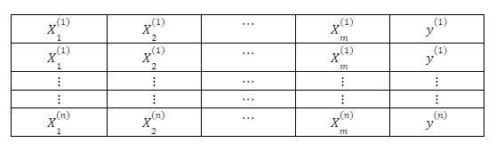
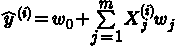
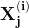
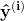
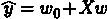
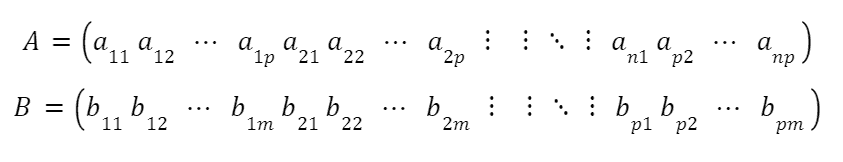
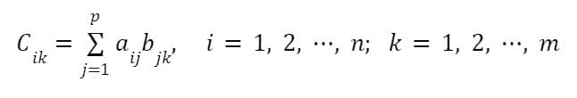

# 数据科学（或机器学习）的矩阵乘法

> 原文：[`www.kdnuggets.com/2022/11/matrix-multiplication-data-science-machine-learning.html`](https://www.kdnuggets.com/2022/11/matrix-multiplication-data-science-machine-learning.html)


作者提供的图片

## 主要收获

+   矩阵乘法在数据科学和机器学习中扮演着重要角色

+   要使两个矩阵之间的乘法定义明确，这两个矩阵必须兼容，即矩阵 **A** 的列数必须等于矩阵 **B** 的行数。

+   矩阵乘法不满足交换律，即 **AB** ≠ **BA**。

* * *

## 我们的前三大课程推荐

 1\. [谷歌网络安全证书](https://www.kdnuggets.com/google-cybersecurity) - 快速进入网络安全职业生涯。

 2\. [谷歌数据分析专业证书](https://www.kdnuggets.com/google-data-analytics) - 提升你的数据分析技能

 3\. [谷歌 IT 支持专业证书](https://www.kdnuggets.com/google-itsupport) - 支持你组织的 IT 工作

* * *

矩阵乘法在数据科学和机器学习中扮演着重要角色。考虑一个具有 *m* 个特征和 *n* 个观测值的数据集，如下所示：



基本的回归模型可以表示如下：



其中  是 *n×m* 特征矩阵，而 ***w*** 是 *m×1* 权重系数或回归系数矩阵。这里我们观察到  的计算涉及特征矩阵 ***X*** 和回归系数矩阵 ***w*** 之间的矩阵乘法。由于 ***X*** 是一个 *n × m* 矩阵，而 ***w*** 是一个 *m × 1* 矩阵，因此 ***X*** 和 ***w*** 之间的矩阵乘法是明确的。在矩阵形式中，上述方程可以简化为



其中 *Xw* 代表矩阵 ***X*** 和 ***w*** 之间的乘法。**

# 矩阵乘法的定义

设 **A** 为一个 *n×p* 矩阵，**B** 为一个 *p×m* 矩阵，



乘积矩阵 **C = AB** 是一个 *n×m* 矩阵，其元素为



## 矩阵乘法的性质

矩阵乘法不具有交换性，也就是说

***AB≠BA***

# Python 中的矩阵乘法实现

## 使用 for 循环

```py
import numpy as np

A = np.array([[1,2,3],[4,5,6]]) # create (2 x 3) matrix

B = np.array([[7,8],[9,10],[11,12]]) # create (3 x 2) matrix

A.shape[1] == B.shape[0] # ensures two matrices are compatible

C = np.zeros((2,2)) # (2 x 2) matrix

for i in range(2):
  for k in range(2):
    for j in range(3):
      C[i,k]= C[i,k] + A[i,j]*B[j,k]

print(C)
```

```py
[[ 58,  64]
 [139, 154]]

```

## 使用 Numpy 库

```py
C = np.dot(A, B)

print(C)
```

```py
[[ 58,  64]
 [139, 154]]

```

请注意，`np.dot(B, A)`会产生以下输出：

```py
print(np.dot(B, A))
```

```py
[[ 39  54  69]
 [ 49  68  87]
 [ 59  82 105]]

```

很明显，我们看到 *np.dot(A, B) ≠ np.dot(B, A)*。

总结来说，我们讨论了矩阵乘法的数学基础。我们还演示了如何使用简短的 python 代码执行矩阵乘法，以及使用 *numpy* 中内置的矩阵乘法方法。

**[本杰明·O·塔约](https://www.linkedin.com/in/benjamin-o-tayo-ph-d-a2717511/)** 是一位物理学家、数据科学教育者和作家，也是 DataScienceHub 的所有者。之前，本杰明曾在中央俄克拉荷马大学、大峡谷大学和匹兹堡州立大学教授工程和物理学。

### 更多相关话题

+   [KDnuggets 新闻，11 月 16 日：LinkedIn 如何使用机器学习 •…](https://www.kdnuggets.com/2022/n45.html)

+   [Python 中的稀疏矩阵表示](https://www.kdnuggets.com/2020/05/sparse-matrix-representation-python.html)

+   [白痴指南：精确度、召回率和混淆矩阵](https://www.kdnuggets.com/2020/01/guide-precision-recall-confusion-matrix.html)

+   [在 Scikit-learn 中可视化你的混淆矩阵](https://www.kdnuggets.com/2022/09/visualizing-confusion-matrix-scikitlearn.html)

+   [使用 tfidfvectorizer 将文本文档转换为 TF-IDF 矩阵](https://www.kdnuggets.com/2022/09/convert-text-documents-tfidf-matrix-tfidfvectorizer.html)

+   [混淆矩阵、精确度和召回率解释](https://www.kdnuggets.com/2022/11/confusion-matrix-precision-recall-explained.html)
