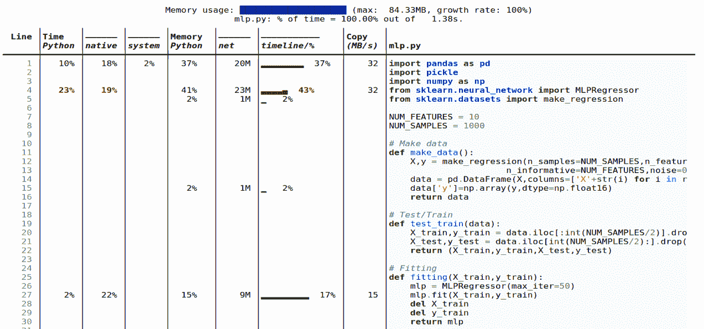
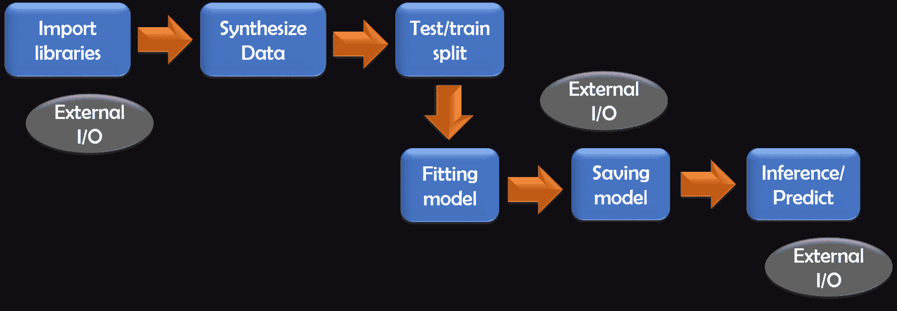
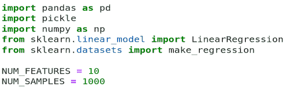
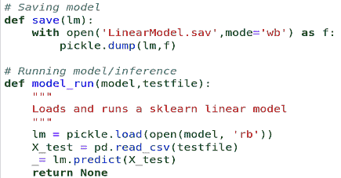
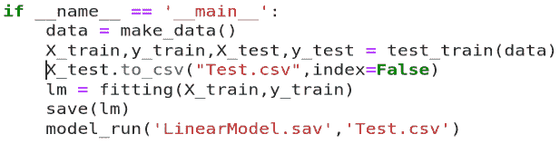
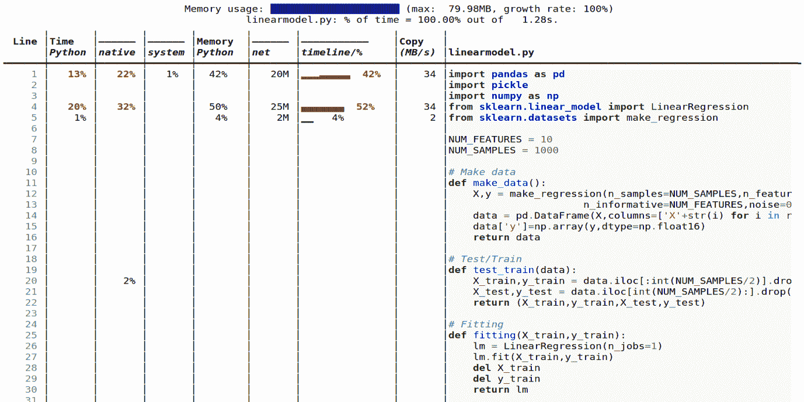
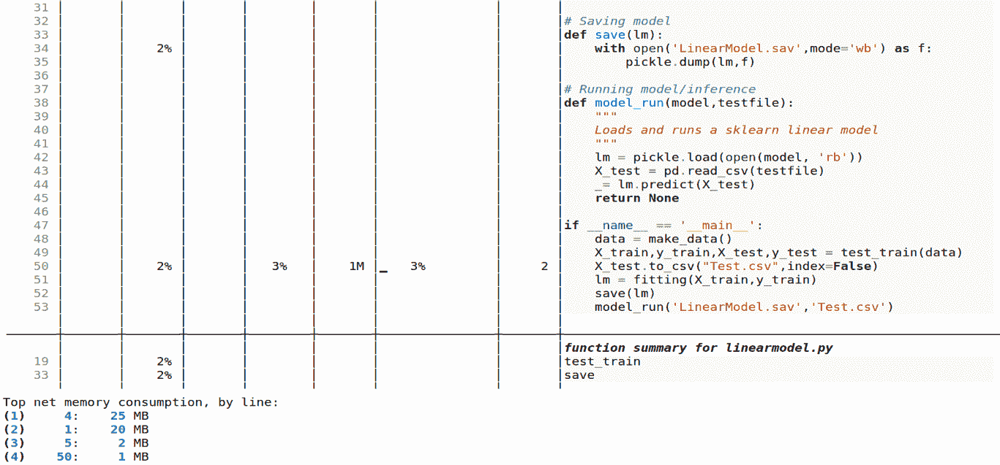
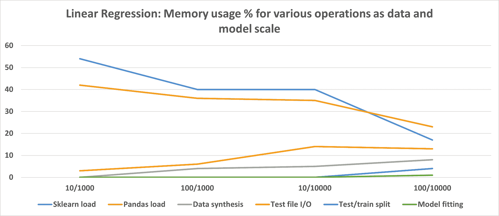
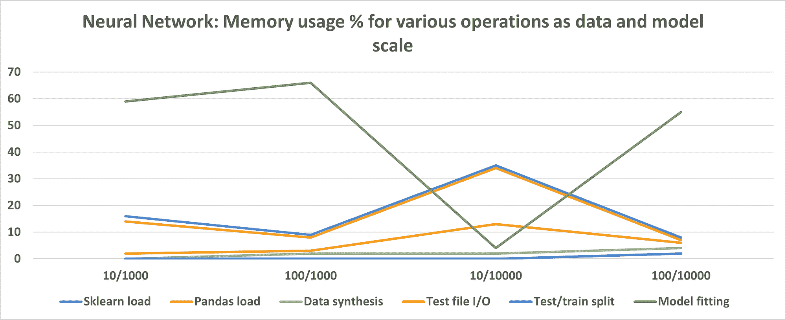
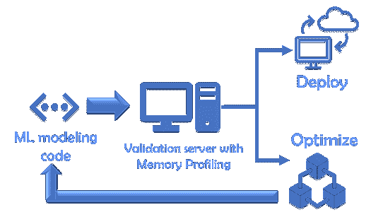

# 你的机器学习代码消耗了多少内存？

> 原文：[`www.kdnuggets.com/2021/07/memory-machine-learning-code-consuming.html`](https://www.kdnuggets.com/2021/07/memory-machine-learning-code-consuming.html)

评论


图片来源：[Pixabay](https://pixabay.com/photos/hourglass-clock-time-period-hours-2910951/)

### 为什么要分析内存使用情况？

假设你写了一个很酷的机器学习（ML）应用程序或创建了一个全新的神经网络模型。现在你想通过某个网络服务或 REST API 部署这个模型。

或者，你可能是基于来自制造厂的工业传感器的数据流开发了这个模型，现在你需要将模型部署到工业控制 PC 之一，以便基于持续输入的数据做出决策。


“兴奋地开发了一个全新的 ML 模型”。图片来源：[Pixabay](https://pixabay.com/photos/children-win-success-video-game-593313/)

作为数据科学家，你可能会收到工程/平台团队非常常见的问题：“***你的模型/代码占用了多少内存？***”或者“***在给定的数据负载下，代码的内存峰值是多少？***”

这很自然，因为**硬件资源可能有限**，单个 ML 模块不应占用系统的全部内存。这在**边缘计算场景中尤其如此**，即 ML 应用可能在边缘运行，例如在工业 PC 上的虚拟化容器内。

此外，你的模型可能是运行在那块硬件上的数百个模型之一，你必须对**内存使用的峰值有一定了解**，因为如果大量模型在同一时间内达到内存峰值，可能会导致系统崩溃。

现在，你开始好奇了，不是吗？


图片来源：[Pixabay](https://pixabay.com/photos/child-surprise-think-interactivity-2800835/)

> **… 硬件资源可能有限**，单个 ML 模块不应占用系统的全部内存。这在**边缘计算场景中尤其如此…**

### 不要犯这个根本错误

注意，我们讨论的是你整个代码的运行时内存剖面（一个动态量）。这与 ML 模型的大小或压缩无关（你可能将其保存为磁盘上的特殊对象，如[Scikit-learn Joblib dump](https://scikit-learn.org/stable/modules/model_persistence.html)、一个简单的 Python Pickle dump、[TensorFlow HFD5](https://www.tensorflow.org/tutorials/keras/save_and_load)等）。

### Scalene：一个整洁的内存/CPU/GPU 分析工具

这里有一篇关于一些旧的内存分析工具的文章，用于 Python。

[**如何管理 Python 中的内存**](https://www.pluralsight.com/guides/profiling-memory-usage-in-python)

在本文中，我们将讨论**Scalene**——你的终极工具，用于解答你的工程团队提出的问题。

根据其[GitHub 页面](https://github.com/plasma-umass/scalene)，“*Scalene 是一个高性能的 CPU、GPU 和内存分析工具，提供其他 Python 分析工具无法做到的功能。它的运行速度比其他分析工具快几个数量级，同时提供更详细的信息。*”

它是在麻省大学开发的。查看这个视频以获取全面的介绍。

### 安装

毕竟，它是一个 Python 包。因此，通常按照常规安装即可，

```py
**pip install scalene**
```

目前仅适用于 Linux 操作系统。我没有在 Windows 10 上进行测试。

### 在 CLI 或 Jupyter Notebook 中使用

使用 Scalene 非常简单直接，

```py
**scalene <yourapp.py>**
```

另外，你可以通过使用这个魔法命令在 Jupyter Notebook 中使用它，

```py
**%load_ext scalene**
```

### 示例输出

这是一个示例输出。我们将很快深入探讨这个话题。



### 特性

以下是 Scalene 的一些酷炫功能。大多数功能都是不言而喻的，可以从上面的截图中了解，

+   **行或函数**：报告整个函数和每个独立代码行的信息

+   **线程**：支持 Python 线程。

+   **多进程**：支持使用`multiprocessing`库

+   **Python 与 C 的时间**：Scalene 区分了在 Python 与原生代码（例如库）中的时间

+   **系统时间**：它区分系统时间（例如，休眠或执行 I/O 操作）

+   **GPU**：它还可以报告在 NVIDIA GPU 上花费的时间（如果存在）

+   **拷贝量**：报告每秒拷贝的数据量（以 MB 为单位）

+   **检测泄漏**：Scalene 可以自动定位可能导致内存泄漏的代码行！

### 一个具体的机器学习代码示例

让我们开始将 Scalene 用于内存分析标准机器学习代码的实际操作。我们将查看两种不同类型的机器学习模型——原因很快会得到澄清。我们将使用 Scikit-learn 库来创建所有三个模型，并利用其合成数据生成函数来创建我们的数据集。

+   一个多重线性回归模型

+   使用相同数据集的深度神经网络模型

建模代码对于所有三个模型遵循完全相同的结构。外部 I/O 操作也在下图中标出，我们将看到它们可能会或不会主导内存分析，具体取决于模型类型。



图片来源：作者制作（拥有版权）

### 线性回归模型

代码文件在[我的 GitHub 仓库中](https://github.com/tirthajyoti/Machine-Learning-with-Python/blob/master/Memory-profiling/Scalene/linearmodel.py)。

我们使用标准导入和两个变量`NUM_FEATURES`和`NUM_SMPLES`来进行一些后续实验。



我们没有展示数据生成和模型拟合代码。它们很标准，可以在[这里](https://github.com/tirthajyoti/Machine-Learning-with-Python/blob/master/Memory-profiling/Scalene/linearmodel.py)查看。我们将拟合的模型保存为 pickle 格式，并与测试 CSV 文件一起加载以进行推理。



我们在`main`循环下运行所有内容，以便清晰地进行 Scalene 执行和报告（你很快会明白的）。



当我们运行命令时，

```py
$ scalene linearmodel.py --html >> linearmodel-scalene.html
```

我们得到这些结果作为输出。**注意，这里我使用了`**--html**`**标志并将输出管道到一个 HTML 文件中以便于报告**。





### **那么，这个结果中有什么引人注目的地方？**

内存占用几乎完全由外部 I/O 主导，比如 Pandas 和 Scikit-learn 估算器的加载，以及少量内存用于将测试数据写入磁盘上的 CSV 文件。

实际的机器学习建模、Numpy 或 Pandas 操作和推理完全不影响内存！

### 随着模型和数据的规模扩大会发生什么？

我们可以扩大数据集大小（行数）和模型复杂性（特征数），并运行相同的内存分析，以记录各种操作在内存消耗方面的表现。结果如下。

这里的**X 轴表示特征数/数据点数的配对**。请注意，这个图展示的是百分比而不是绝对值，以展示各种操作的相对重要性。



图片来源：作者提供（拥有版权）

### 所以，对于线性回归模型……

从这些实验中，我们得出结论，Scikit-learn 的线性回归估算器相当高效，**实际模型拟合或推理并不消耗大量内存**。

但是，它确实有一个固定的内存占用量，这在加载时会被消耗。然而，随着数据大小和模型复杂性的增加，该代码占用的比例会减少。

因此，如果你在处理这样的**小型线性模型时，可能需要关注数据文件 I/O 以优化你的代码**以获得更好的内存性能。

### 深度神经网络会发生什么？

如果我们用一个 2 隐层的神经网络（每个隐层 50 个神经元）运行类似的实验，那么结果如下。代码文件在[这里](https://github.com/tirthajyoti/Machine-Learning-with-Python/blob/master/Memory-profiling/Scalene/mlp.py)。



图片来源：作者提供（拥有版权）

很明显，**神经网络模型在训练/拟合步骤中消耗大量内存，这与线性回归模型不同**。然而，对于特征数量少且数据量大的情况，拟合所需的内存量较少。

你也可以尝试各种架构和超参数，并记录内存使用情况，以找到适合你情况的设置。

### 遵循实验方法

如果你用相同的 [代码文件](https://github.com/tirthajyoti/Machine-Learning-with-Python/tree/master/Memory-profiling/Scalene) 反复进行实验，结果会因硬件、磁盘/CPU/GPU/内存类型而大相径庭。本文的目的是提供一种内存分析实验的方法，而不是关注实际值或趋势。我希望你能带走对你自己代码进行内存分析实验的方法。

### 一些关键建议

+   最好在代码中编写**小函数**，专注于单一任务

+   保留一些**自由变量**，如特征数量和数据点数量，以便可以用最小的修改运行相同的代码文件，检查数据/模型扩展时的内存使用情况。

+   如果你在比较一个机器学习算法与另一个算法，尽量保持**整体代码结构和流程尽可能一致**，以减少混淆。最好只是更改估算器类，并比较内存使用情况。

+   **数据和模型输入/输出**（导入语句、磁盘上的模型持久化）在内存占用方面可能会出乎意料地占据主导地位，具体取决于你的建模场景。在进行优化时，千万不要忽视它们。

+   基于上述原因，考虑比较**来自多个实现/包的相同算法的内存使用情况**（例如 Keras 与 PyTorch 与 Scikit-learn）。如果内存优化是你的主要目标，你可能需要寻找内存占用最小但仍能满意完成工作的实现，即使它在特性或性能方面不是绝对最佳的。

+   如果数据输入/输出成为瓶颈，可以探索**更快的选项或其他存储类型**，例如将 Pandas CSV 替换为 parquet 文件和 Apache Arrow 存储。请查看这篇文章，

[**读取 Parquet 文件（使用 Arrow）与使用 Pandas 读取 CSV 的速度有多快？**](https://towardsdatascience.com/how-fast-is-reading-parquet-file-with-arrow-vs-csv-with-pandas-2f8095722e94)

### 你还可以使用 Scalene 做其他事情

在这篇文章中，我们只讨论了关注于经典机器学习建模代码的最基本内存分析。Scalene CLI 还有其他选项，你可以利用这些选项，

+   仅分析 CPU 时间而不分析内存使用情况

+   仅分析非零内存占用的情况

+   指定 CPU 和内存分配的最低阈值

+   设置 CPU 采样率

+   多线程并检查差异

### 有时需要最终验证

对于资源有限的情况，最好能托管一个验证环境/服务器，该环境将接受给定的建模代码（开发完成后）并通过这样的内存分析器运行，以生成运行时统计数据。如果它满足预定的内存占用标准，建模代码才会被接受用于进一步部署。



图片来源：作者制作（拥有版权）

> 如果内存优化是您的主要目标，您可能需要寻找一种内存占用最小但能够令人满意地完成工作的实现方案。

### 总结

在这篇文章中，我们讨论了内存分析在与平台/工程团队顺畅对接、将代码部署到服务/机器上的重要性。内存分析也可以揭示一些基于特定数据和算法优化代码的惊人方法。

我们展示了一个典型的 ML 建模代码示例，使用强大而轻量的 Python 库 Scalene 进行分析。我们展示了一些线性回归和神经网络模型的代表性结果，并提供了一些一般性的建议。

希望这些工具和技术能帮助您在将 ML 代码实施并部署到生产环境中获得更多成功。

您可以查看作者的[**GitHub**](https://github.com/tirthajyoti?tab=repositories)** 代码库**，获取机器学习和数据科学方面的代码、想法和资源。如果您像我一样，对 AI/机器学习/数据科学充满热情，请随时[在 LinkedIn 上添加我](https://www.linkedin.com/in/tirthajyoti-sarkar-2127aa7/)或[在 Twitter 上关注我](https://twitter.com/tirthajyotiS)。

[原文](https://towardsdatascience.com/how-much-memory-is-your-ml-code-consuming-98df64074c8f)。经许可转载。

**相关：**

+   作为数据科学家的可重用 Python 代码管理

+   5 个 Python 数据处理技巧与代码片段

+   GitHub Copilot：您的 AI 编程伙伴 – 到底有什么大惊小怪的？

* * *

## 我们的前三大课程推荐

 1\. [Google 网络安全证书](https://www.kdnuggets.com/google-cybersecurity) - 快速入门网络安全职业生涯

 2\. [Google 数据分析专业证书](https://www.kdnuggets.com/google-data-analytics) - 提升您的数据分析能力

 3\. [Google IT 支持专业证书](https://www.kdnuggets.com/google-itsupport) - 支持您的组织的 IT 工作

* * *

### 更多相关内容

+   [一种（更好）的方法来评估您的机器学习模型](https://www.kdnuggets.com/2022/01/much-better-approach-evaluate-machine-learning-model.html)

+   [数据科学中需要多少数学知识？](https://www.kdnuggets.com/2020/06/math-data-science.html)

+   [2022 年数据科学家收入多少？](https://www.kdnuggets.com/2022/02/much-data-scientists-make-2022.html)

+   [如何在大型数据集上进行内存高效操作](https://www.kdnuggets.com/how-to-perform-memory-efficient-operations-on-large-datasets-with-pandas)

+   [变压器的内存复杂性](https://www.kdnuggets.com/2022/12/memory-complexity-transformers.html)

+   [Python 中的内存分析简介](https://www.kdnuggets.com/introduction-to-memory-profiling-in-python)
