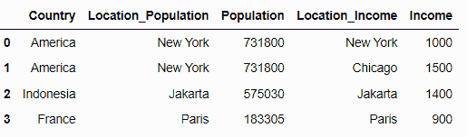
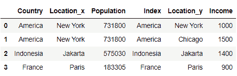
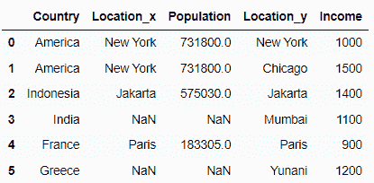
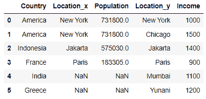
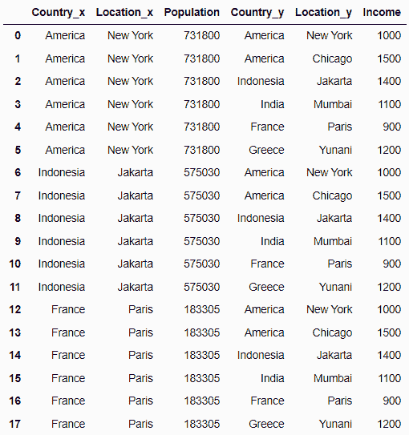
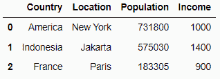

# 如何合并 Pandas DataFrames

> 原文：[`www.kdnuggets.com/2023/01/merge-pandas-dataframes.html`](https://www.kdnuggets.com/2023/01/merge-pandas-dataframes.html)


图片由[catalyststuff](https://www.freepik.com/free-vector/cute-panda-writing-book-with-pencil-cartoon-icon-illustration_12158331.htm#query=pandas&position=9&from_view=search&track=sph)在[Freepik](https://www.freepik.com/)上提供

在数据处理过程中，两个或更多数据集之间的数据合并是典型的。在本博客中，我们将学习如何使用 Pandas 进行数据合并以及各种提升数据合并技能的技巧。让我们深入探讨数据合并技术。

* * *

## 我们的前三个课程推荐

 1\. [Google 网络安全证书](https://www.kdnuggets.com/google-cybersecurity) - 快速进入网络安全职业轨道。

 2\. [Google 数据分析专业证书](https://www.kdnuggets.com/google-data-analytics) - 提升您的数据分析能力

 3\. [Google IT 支持专业证书](https://www.kdnuggets.com/google-itsupport) - 支持您组织的 IT

* * *

# 合并 Pandas DataFrame

首先，我们需要导入 Pandas Python 包。

```py
import pandas as pd
```

合并两个 Pandas DataFrames 需要使用 Pandas 包中的 merge 方法。这个函数会根据我们意图连接的变量或列合并两个 DataFrame。让我们通过一个示例 DataFrame 来尝试 Pandas 的合并方法。

```py
# Create Population DataFrame
df1 = pd.DataFrame({
    'Country': ['America', 'Indonesia', 'France'],
    'Location': ['New York', 'Jakarta', 'Paris'],
    'Population': [731800, 575030, 183305]
})

# Create Income DataFrame
df2 = pd.DataFrame({
    'Country': ['America', 'America', 'Indonesia', 'India', 'France', 'Greece'],
    'Location': ['New York', 'Chicago', 'Jakarta', 'Mumbai', 'Paris', 'Yunani'],
    'Income': [1000, 1500, 1400, 1100, 900, 1200]

})

# Merge Dataframe
merged_df = pd.merge(df1, df2, on='Country')
merged_df
```


图片由作者提供

在上面的示例中，我们创建了两个具有稍微不同列的 DataFrame，并在‘Country’列上合并它们。结果是两个 DataFrame 中具有相似值的行被合并在一起。我们通过一行代码成功合并了两个不同的 DataFrame。

# 应用可选参数

Pandas 的.merge 方法有各种可选参数可以利用。让我们看一下其中一些有用的参数。

## 重命名合并的同名列

在上面的示例中，我们可以看到一个名为‘Location’的列，在合并后该列带有后缀 _x 和 _y。如果我们想在合并时更改列名，可以使用以下代码来实现。

```py
merged_df = pd.merge(df1, df2, on='Country', suffixes = ('_Population', '_Income'))
merged_df
```



图片由作者提供

在这段代码中，我们传递了带有两个值的元组作为 suffixes 参数；第一个和第二个 DataFrame 的名称。在我的示例中，我们将第一个 DataFrame 命名为 Population，将第二个命名为 Income。

## 基于不同列名进行合并

如果我们有两个 DataFrame，其列名不同但指代相同的定义，我们仍然可以合并它们，但需要指定要合并的 DataFrame 和列。

```py
df2 = pd.DataFrame({
    'Index': ['America', 'America', 'Indonesia', 'India', 'France', 'Greece'],
    'Location': ['New York', 'Chicago', 'Jakarta', 'Mumbai', 'Paris', 'Yunani'],
    'Income': [1000, 1500, 1400, 1100, 900, 1200]

})

merged_df = pd.merge(df1, df2, left_on='Country', right_on = 'Index')
merged_df
```



图片由作者提供

在上述示例中，我们将第二个 DataFrame 的‘Country’列更改为‘Index’，然后通过在每个 DataFrame 中指定列名来合并数据集。`Left_on` 参数用于第一个 DataFrame，`right_on` 用于第二个 DataFrame。

## 更改合并类型

Pandas 合并方法中有五种不同的合并类型。默认情况下，合并是内连接，只包括在两个列中都有匹配值的行。然而，我们可以通过将值传递给 `how` 参数来更改合并类型：

1.  **左连接**

左连接仅使用第一个 DataFrame 的值。

```py
merged_df = pd.merge(df1, df2, on='Country', how = 'left')
merged_df
```


图片由作者提供

1.  **右连接**

右连接仅使用第二个 DataFrame 的值。

```py
merged_df = pd.merge(df1, df2, on='Country', how = 'right')
merged_df
```



图片由作者提供

1.  **外连接**

通过使用两个 DataFrame 键的并集来包含两个 DataFrame 中的所有行。



图片由作者提供

1.  **交叉连接**

从两个 DataFrame 创建一个笛卡尔积

```py
merged_df = pd.merge(df1, df2, how = 'cross')
merged_df
```



图片由作者提供

## 通过两个或更多不同的列进行合并

使用 Pandas 合并可以将两个 DataFrame 与两个或更多不同的列连接在一起。我们需要在 `on` 参数中指定要合并的列列表。

```py
merged_df = pd.merge(df1, df2, on = ['Country', 'Location'])
merged_df
```



图片由作者提供

# 结论

在数据处理过程中，合并两个不同的 DataFrame 是一种常见的活动。为此，我们可以使用 Pandas 的 `merge` 方法。在 Pandas `merge` 中，我们可以访问各种可选参数以执行特定任务，包括更改合并列的名称、基于不同列名称合并 DataFrame、更改合并类型以及通过两个或更多列进行合并。

**[Cornellius Yudha Wijaya](https://www.linkedin.com/in/cornellius-yudha-wijaya/)** 是一名数据科学助理经理和数据撰稿人。尽管全职工作于 Allianz Indonesia，他仍喜欢通过社交媒体和写作媒体分享 Python 和数据技巧。

### 更多相关主题

+   [合并 Pandas DataFrame 的三种方法](https://www.kdnuggets.com/2023/03/3-ways-merge-pandas-dataframes.html)

+   [如何高效地合并大型 DataFrame 与 Pandas](https://www.kdnuggets.com/how-to-merge-large-dataframes-efficiently-with-pandas)

+   [使用 SQL 查询你的 Pandas DataFrame](https://www.kdnuggets.com/2021/10/query-pandas-dataframes-sql.html)

+   [使用 apply() 方法处理 Pandas DataFrame](https://www.kdnuggets.com/2022/07/apply-method-pandas-dataframes.html)

+   [简化 Pandas DataFrame 合并](https://www.kdnuggets.com/2022/09/combining-pandas-dataframes-made-simple.html)

+   [将 JSON 转换为 Pandas DataFrame：正确解析它们](https://www.kdnuggets.com/converting-jsons-to-pandas-dataframes-parsing-them-the-right-way)
