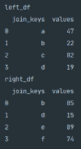
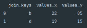
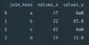
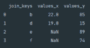
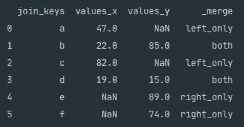

# 在 Python 中合并 Pandas DataFrames

> 原文：[`www.kdnuggets.com/2020/12/merging-pandas-dataframes-python.html`](https://www.kdnuggets.com/2020/12/merging-pandas-dataframes-python.html)

评论

**作者 [Dean McGrath](https://deanjmcgrath.com/), 渴望成为数据分析师**

图片由 [MILKOVÍ](https://unsplash.com/@milkovi?utm_source=medium&utm_medium=referral) 提供，来源于 [Unsplash](https://unsplash.com/?utm_source=medium&utm_medium=referral)

* * *

## 我们的三大课程推荐

 1\. [谷歌网络安全证书](https://www.kdnuggets.com/google-cybersecurity) - 快速进入网络安全职业生涯。

 2\. [谷歌数据分析专业证书](https://www.kdnuggets.com/google-data-analytics) - 提升你的数据分析技能

 3\. [谷歌 IT 支持专业证书](https://www.kdnuggets.com/google-itsupport) - 支持你所在组织的 IT

* * *

### 介绍

作为数据科学家，我们经常需要同时分析来自多个数据源的数据。要成功实现这一目标，我们需要能够高效地使用各种方法合并不同的数据源。今天我们将探讨使用 Pandas 内置的 `.merge()` 函数来通过几种不同的连接方法合并两个数据源。

### 入门

对于那些刚接触数据科学或尚未接触 Python Pandas 的人，我们建议首先阅读 [Pandas 系列 & DataFrame 解析](https://towardsdatascience.com/pandas-series-dataframe-explained-a178f9748d46) 或 [Python Pandas 迭代 DataFrame](https://towardsdatascience.com/python-pandas-iterating-a-dataframe-eb7ce7db62f8)。这两篇文章将为你提供安装说明和今天文章的背景知识。

### Pandas 合并

Pandas 内置的 `.merge()` 函数提供了一种强大的方法，通过数据库风格的连接来合并两个 DataFrames。

**语法**

上述 Python 代码片段显示了 Pandas `.merge()` 函数的语法。

### 参数

+   `right` — 这将是你要连接的 DataFrame。

+   `how` — 在这里，你可以指定你希望两个 DataFrame 如何连接。默认值是 `inner`，但是你可以传递 `left` 进行左外连接，`right` 进行右外连接，`outer` 进行完全外连接。

+   `on` — 如果两个 DataFrame 都包含一个共享的列或一组列，你可以将这些列传递给 `on` 作为合并的键。

+   `left_on` — 在这里，你可以指定一个列或标签列表，用于连接左侧 DataFrame。当你希望在两个 DataFrame 中连接的列名不同的时候，这个参数非常有用。

+   `right_on` — 条件与 `left_on` 相同，只是针对右侧 DataFrame。

+   `left_index` — 如果你希望使用索引来连接左侧 DataFrame，那么传入 `True`。

+   `right_index` — 如果你希望使用索引来连接右侧 DataFrame，那么传入 `True`。

+   `sort` — 如果你希望连接的键按字母顺序排序，可以传入 `True`。

+   `suffixes` — 如果两个 DataFrame 共享列标签名称，则可以指定应用于重叠部分的后缀类型。默认的是左侧使用 `_x`，右侧使用 `_y`。

+   `indicator` — 如果你希望标记行的来源，可以将此参数设置为 `True`。此标记将指示行的键是否仅出现在左侧 DataFrame、右侧 DataFrame，或两者都出现。

+   `validate` — 在这里，你可以检查 DataFrame 是如何连接的以及键之间的关系。你可以传入以下参数来检查：`1:1` 检查键是否在左侧和右侧 DataFrame 中唯一，`1:m` 检查合并的键是否仅在左侧 DataFrame 中唯一，`m:1` 检查合并的键是否仅在右侧 DataFrame 中唯一。

### 实际应用

接下来，我们将通过几个示例来演示如何自己使用 `merge` 函数。下面提供的代码片段将帮助你创建两个我们将在后续故事中使用的 DataFrame。

上面的 Python 代码片段创建了两个 DataFrame，你可以使用它们来继续以下示例。

上面的控制台输出显示了执行 Python 代码片段以创建两个 DataFrame 的结果。

### 内连接

内连接方法是 Pandas merge 的默认方法。当你传入 `how='inner'` 时，返回的 DataFrame 只会包含两个 DataFrame 中共享的列的值。

上面的 Python 代码片段演示了如何使用内连接来连接两个 DataFrame。

上面的图片显示了内连接两个 DataFrame 后的控制台输出。

从上面的控制台输出截图中，我们可以看到内连接对两个 DataFrame 的影响。由于值 `a`、`c`、`e` 和 `f` 在两个 DataFrame 中不共享，它们不会出现在控制台输出中。输出还演示了处理两个 DataFrame 之间共享列标签时默认的后缀应用。

### 左连接

Pandas 的左连接函数类似于 SQL 中的左外连接。返回的 DataFrame 将包含左侧 DataFrame 中的所有值，以及在合并过程中与右侧 DataFrame 中的连接键匹配的任何值。

上面的 Python 代码片段展示了使用左连接来合并两个 DataFrame 的语法。

上面的截图显示了使用左连接合并两个 DataFrame 的控制台输出。

如果右侧 DataFrame 中的值与合并列不匹配，则在返回的 DataFrame 中将插入 `NaN`，*不是数字*。

### 右连接

Pandas 右连接执行的功能类似于左连接，但连接方法应用于右侧 DataFrame。

上面的 Python 代码片段展示了使用 Pandas 右连接合并两个 DataFrame 的语法。

上面的截图显示了使用右连接合并两个 DataFrame 的结果。

如上所示，右侧 DataFrame 中不存在的任何键，在左侧 DataFrame 中将插入一个 `NaN` 值。

### 外连接

Pandas 外连接合并两个 DataFrame，并本质上反映了左外连接和右外连接的结果。外连接将返回左侧和右侧 DataFrame 的所有值。如果 Pandas 无法在合并的 DataFrame 中找到一个值，将使用 `NaN` 代替。

上面的 Python 代码片段展示了使用外连接连接两个 DataFrame 的语法。

上面的截图显示了使用外连接合并两个 DataFrame 的结果。

在使用外连接合并两个 DataFrame 时，有时了解新 DataFrame 中记录的来源是有用的信息。你可以通过将 `indicator=True` 作为参数传递给 `.merge()` 函数来查看记录的来源，这将创建一个标题为 `_merge` 的新列。

### 总结

要成为成功的数据科学家，你需要具备处理来自多个数据源的数据的技能，并且经常是同时进行的。我们常常需要结合数据源来丰富数据集或在当前数据中合并历史快照。Pandas 提供了一个强大的方法来通过内置的 `.merge()` 函数连接数据集。Pandas `.merge()` 函数提供了创建不同类型连接的灵活性，以实现所需的输出。

感谢你抽出时间阅读我们的故事——希望你觉得它有价值！

**个人简介：[Dean McGrath](https://deanjmcgrath.com/)** ([@DeanMcGrath8](https://twitter.com/DeanMcGrath8)) 是一名有志的数据分析师，并且是 Towards Data Science 的贡献者。

[原文](https://towardsdatascience.com/python-pandas-merging-dataframes-aebbf898a9ff)。经许可转载。

**相关内容：**

+   Pandas 升级版：使用 Dask 完成端到端的数据科学

+   每个复杂的 DataFrame 操作，直观解释与可视化

+   10 个被低估的 Python 技能

### 更多相关话题

+   [用 SQL 查询你的 Pandas DataFrames](https://www.kdnuggets.com/2021/10/query-pandas-dataframes-sql.html)

+   [在 Pandas DataFrame 中使用 apply() 方法](https://www.kdnuggets.com/2022/07/apply-method-pandas-dataframes.html)

+   [简化 Pandas DataFrames 合并](https://www.kdnuggets.com/2022/09/combining-pandas-dataframes-made-simple.html)

+   [如何合并 Pandas DataFrames](https://www.kdnuggets.com/2023/01/merge-pandas-dataframes.html)

+   [合并 Pandas DataFrame 的 3 种方法](https://www.kdnuggets.com/2023/03/3-ways-merge-pandas-dataframes.html)

+   [将 JSON 转换为 Pandas DataFrame：正确解析的方法](https://www.kdnuggets.com/converting-jsons-to-pandas-dataframes-parsing-them-the-right-way)
