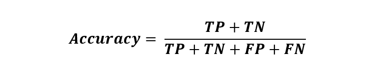
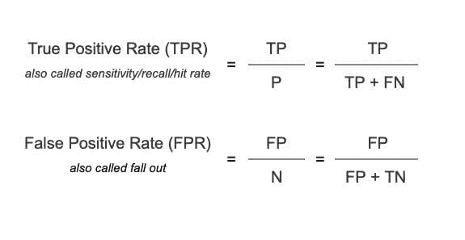
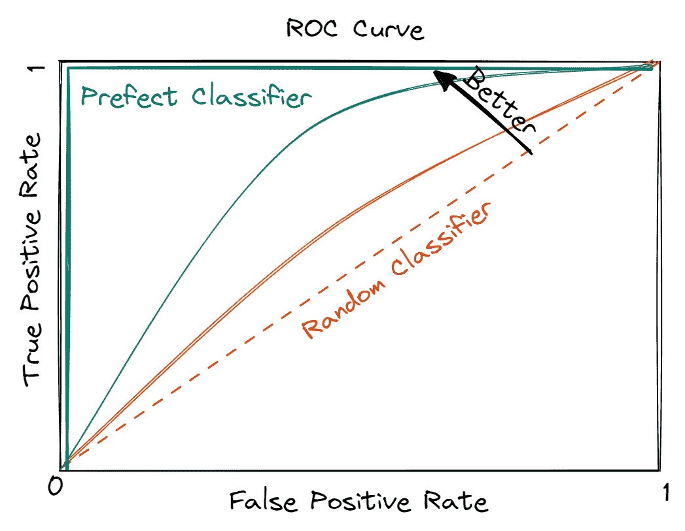

# 我该使用哪个指标？准确度与 AUC

> 原文：[`www.kdnuggets.com/2022/10/metric-accuracy-auc.html`](https://www.kdnuggets.com/2022/10/metric-accuracy-auc.html)

[来源](https://img.freepik.com/free-vector/multi-device-targeting-concept-illustration_114360-7305.jpg?w=2000&t=st=1662099419~exp=1662100019~hmac=91e26d7432f6cbd939540caaf21318207563271fa9ffed676e8025ecc06ac0b2)

准确度和 AUC（曲线下面积）是评估模型性能优劣的指标。两者都对根据你试图解决的业务问题来评估模型性能有所帮助。那么你应该在何时使用哪一个呢？简短的回答是 - 这要看情况！

* * *

## 我们的前三个课程推荐

 1\. [谷歌网络安全证书](https://www.kdnuggets.com/google-cybersecurity) - 快速进入网络安全职业生涯。

 2\. [谷歌数据分析专业证书](https://www.kdnuggets.com/google-data-analytics) - 提升你的数据分析技能

 3\. [谷歌 IT 支持专业证书](https://www.kdnuggets.com/google-itsupport) - 支持你的组织在 IT 方面

* * *

在这篇文章中，我们将首先描述这两个指标，然后详细了解每个指标，并理解何时使用它们。

# 什么是准确度？

准确度是最受欢迎的指标，用来确定模型做出正确预测的百分比。

它是通过将正确预测的数量与数据集中样本总数的比率来计算的。结果以百分比形式表示，例如，如果模型正确预测了数据集中 90%的项目，则准确度为 90%。

从数学上讲，它写作：

公式中的四个成分基于实际值和下述对应的模型预测：

+   真阳性（TP） - 模型正确识别为正类的实例数量。

+   真阴性（TN） - 模型正确识别为负类的实例数量。

+   假阳性（FP） - 模型错误识别为负类的实例数量。

+   假阴性（FN） - 模型错误识别为正类的实例数量。

这些指标通过对模型预测的概率得分应用适当的截止值来得出。关于每个术语及其与混淆矩阵的关系的详细解释在这篇文章中有所说明。

# 什么是 AUC？

AUC 代表“曲线下面积”，全称为“接收者操作特征曲线下的面积”。它捕捉 ROC（接收者操作特征）曲线下的面积，并比较不同阈值下真实正例率（TPR）与假正例率（FPR）之间的关系。

但在深入了解 AUC 之前，让我们首先了解这些新术语的含义。

## TPR 或真实正例率

这是所有正样本中被正确预测为正实例的比例。例如，如果模型的任务是识别欺诈交易，那么 TPR 被定义为所有欺诈交易中被正确预测的欺诈交易的比例。

## FPR 或假正例率

这是被错误预测为负例的负样本的百分比。继续以欺诈检测模型为例，FPR 被定义为所有合法交易中被错误预测为欺诈警报的比例。

从数学上讲，TPR 和 FPR 的表达式如下：

现在我们理解了 TPR 和 FPR 的定义，让我们了解它们如何与 AUC 指标相关。

编辑提供的图片

从上面的图片中可以看出，左上角，即高 TPs 和低 FPs，是理想状态。因此，紫色曲线代表了 AUC 为 1 的完美分类器，即该曲线下的矩形区域为 1。

但在现实应用中，构建这样的理想分类器实际上是不可实现的。因此，了解分类器的下界是重要的，红色对角线表示这一点。它被标注为随机分类器，AUC 为 0.5，即红色虚线下的三角形面积。这被称为随机分类器，因为其预测效果与随机抛硬币一样好。

总之，机器学习模型的表现介于随机分类器和完美分类器之间，这表明期望的 AUC 在 0.5（随机状态）和 1（完美状态）之间。

本质上，数据科学家旨在最大化 AUC，即曲线下面积更大。这表示模型在生成正确预测方面的好坏，即力求最高的 TPR，同时保持最低的 FPR。

# 何时使用准确率？

准确率用于平衡的数据集，即类别分布均等时。

现实生活中的一个例子是欺诈检测，它必须正确识别并区分欺诈交易（关注类别）与常规交易。通常，欺诈交易很少，即它们在训练数据集中出现的频率低于~1%。

在这种情况下，准确率会偏袒模型的表现，即使模型将每笔交易都识别为非欺诈性交易，也会宣称模型良好。这样的模型虽然准确率高，但未能预测任何欺诈交易，违背了构建模型的目的。

# 何时使用 AUC？

AUC 非常适合处理不平衡的数据集。例如，欺诈检测模型必须正确识别欺诈，即使这意味着将一些（少量的）非欺诈交易标记为欺诈。

在专注于正确识别目标类别（欺诈交易）即 TP 时，模型很可能会犯一些错误，即 FP（将非欺诈交易标记为欺诈）。因此，查看一个比较 TPR 和 FPR 的度量是重要的，这就是 AUC 的作用。

# 你应该选择哪个指标以及何时选择？

准确率和 AUC 都用于分类模型。然而，在决定使用哪一个时，有一些事项需要注意。

高准确率的模型表明预测错误很少。然而，这并没有考虑这些错误预测的商业成本。在这些业务问题中使用准确率度量忽略了诸如 TP 和 FP 的细节，并给模型预测带来了夸大的信心，这对业务目标有害。

在这种情况下，AUC 是首选指标，因为它在最佳选择的阈值下校准了敏感性和特异性之间的权衡。

此外，准确率衡量单个模型的表现，而 AUC 则比较两个模型，并评估同一模型在不同阈值下的表现。

# 总结

选择适当的指标对于获得期望的结果至关重要。准确率和 AUC 是两个常用的评估指标，用于客观地衡量模型性能。它们都有助于评估模型的表现，并将一个模型与另一个模型进行比较。文章解释了为什么准确率对平衡数据来说是足够的，但 AUC 适合衡量模型在不平衡数据集上的表现。

**[Vidhi Chugh](https://vidhi-chugh.medium.com/)**是一位获奖的 AI/ML 创新领袖和 AI 伦理学家。她在数据科学、产品和研究的交叉点上工作，以提供商业价值和见解。她提倡以数据为中心的科学，并在数据治理领域是一位领先专家，致力于构建值得信赖的 AI 解决方案。

### 更多相关话题

+   [分类指标讲解：逻辑回归与…](https://www.kdnuggets.com/2022/10/classification-metrics-walkthrough-logistic-regression-accuracy-precision-recall-roc.html)

+   [天高任鸟飞：了解 JetBlue 如何使用 Monte Carlo 和 Snowflake…](https://www.kdnuggets.com/2022/12/monte-carlo-jetblue-snowflake-build-trust-improve-model-accuracy.html)

+   [与分类准确性相关的关键问题](https://www.kdnuggets.com/2023/03/key-issues-associated-classification-accuracy.html)

+   [可能影响数据分析准确性的 3 个错误](https://www.kdnuggets.com/2023/03/3-mistakes-could-affecting-accuracy-data-analytics.html)

+   [超越准确性：使用 NLP 测试库评估和改进模型](https://www.kdnuggets.com/2023/04/john-snow-beyond-accuracy-nlp-test-library.html)

+   [理解分类指标：评估模型准确性的指南](https://www.kdnuggets.com/understanding-classification-metrics-your-guide-to-assessing-model-accuracy)
