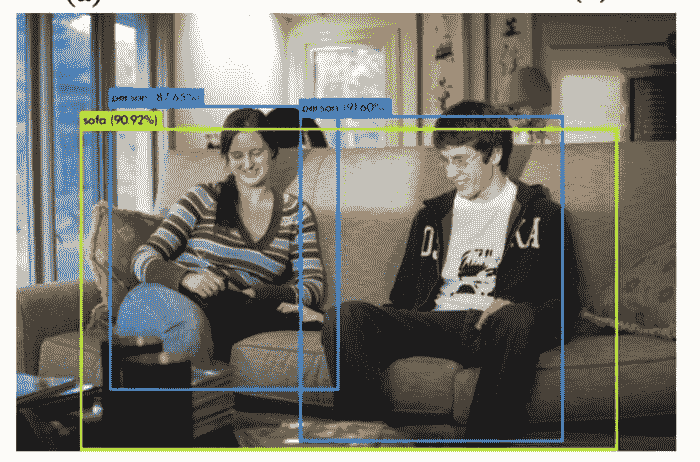
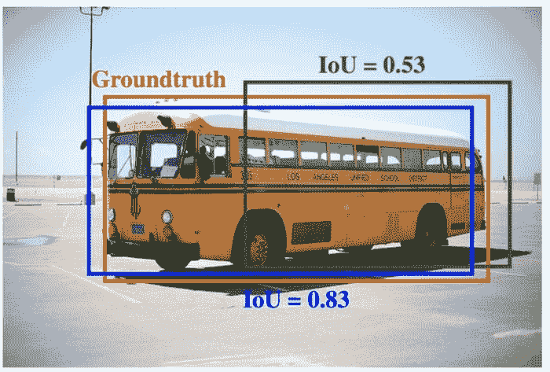
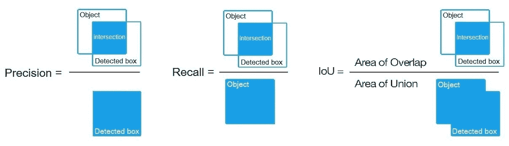
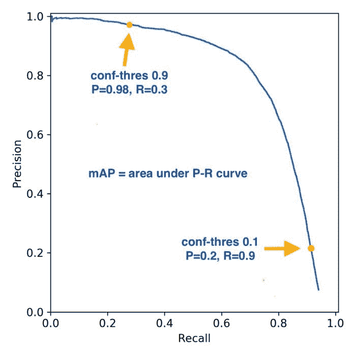
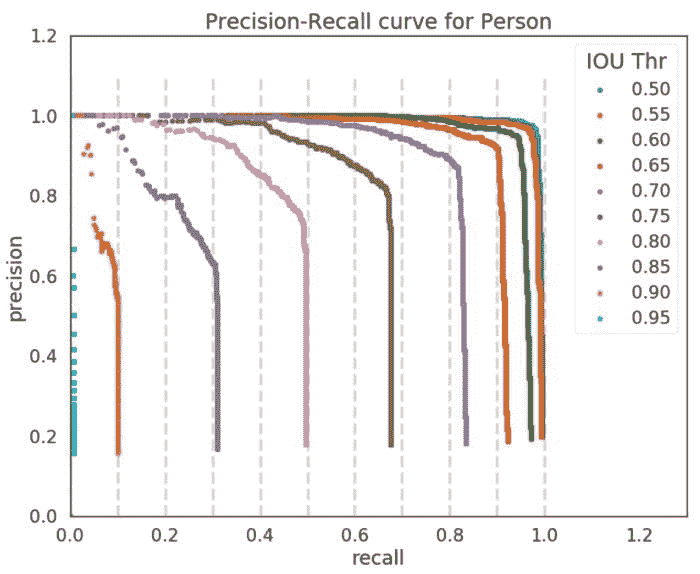

# 评估深度学习对象检测器的指标

> 原文：[`www.kdnuggets.com/2020/08/metrics-evaluate-deep-learning-object-detectors.html`](https://www.kdnuggets.com/2020/08/metrics-evaluate-deep-learning-object-detectors.html)

评论

**由 [Venkatesh Wadawadagi](https://www.linkedin.com/in/venkateshwadawadagi/), Sahaj Software Solutions**

已经采用了不同的方法来解决对准确对象检测模型日益增长的需求。最近，随着卷积神经网络（CNN）和 GPU 加速深度学习框架的普及，对象检测算法开始从新的角度进行开发。R-CNN、Fast R-CNN、Faster R-CNN、R-FCN、SSD 和 Yolo 等 CNN 显著提高了该领域的性能标准。

* * *

## 我们的前三名课程推荐

 1\. [谷歌网络安全证书](https://www.kdnuggets.com/google-cybersecurity) - 快速进入网络安全职业生涯。

 2\. [谷歌数据分析专业证书](https://www.kdnuggets.com/google-data-analytics) - 提升你的数据分析技能

 3\. [谷歌 IT 支持专业证书](https://www.kdnuggets.com/google-itsupport) - 支持你组织的 IT 需求

* * *

一旦你训练了第一个对象检测器，下一步就是了解其性能。确实，你可以看到模型找到了你提供的图片中的所有对象。很好！但你如何量化这一点？我们应该如何决定哪个模型更好？

由于分类任务仅评估对象在图像中出现的概率，对于分类器来说，从正确预测和错误预测中识别正确预测是一个直接的任务。然而，对象检测任务进一步通过与相应置信度得分关联的边界框来定位对象，以报告对象类别的边界框被检测到的确定程度。

检测器的结果通常由边界框列表、置信度水平和类别组成，如下图所示：

对象检测指标作为评估模型在对象检测任务中表现的衡量标准。它还使我们能够客观地比较多个检测系统或将它们与基准进行比较。在大多数竞赛中，平均精度（AP）及其衍生指标是用于评估检测结果并排名的指标。

### 理解各种指标：

**IoU:**

所有先进指标中的指导原则是所谓的交并比（IoU）重叠度量。它字面上定义为检测边界框与真实边界框的交集与并集的比值。

将预测边界框和真实标签之间的重叠面积除以它们的联合面积，得到交并比。

交并比（IoU）分数 > 0.5 通常被认为是“好”的预测。

IoU 指标确定了正确检测到的物体数量以及产生的假阳性数量（将稍后讨论）。

**真正例 [TP]**

检测数（IoU>0.5）

**假阳性 [FP]**

检测数（IoU<=0.5）或检测到多次

**假阴性 [FN]**

未检测到或检测到的物体数（IoU<=0.5）

**精确度**

精确度衡量你的预测准确性，即预测正确的百分比。

精确度 = 真正例 / (真正例 + 假阳性)

**召回率**

召回率衡量你找到所有正例的能力。

召回率 = 真正例 / (真正例 + 假阴性)

**F1 分数**

F1 分数是精确度和召回率的调和均值（HM）。

**AP**

平均精确度（AP）的通用定义是找到精确度-召回曲线下的面积。

**mAP**

物体检测的 mAP 是计算所有类的 AP 的平均值。mAP@0.5 表示在 IOU 阈值 0.5 处计算的 mAP。

**mAP 与其他指标**

mAP 是衡量神经网络灵敏度的良好指标。因此，较高的 mAP 表明模型在不同置信度阈值下的稳定性和一致性。精确度、召回率和 F1 分数是在给定置信度阈值下计算的。

如果“模型 A”的精确度、召回率和 F1 分数优于“模型 B”，但“模型 B”的 mAP 优于“模型 A”，这种情况表明“模型 B”在较高置信度阈值下的召回率很差，或在较低置信度阈值下的精确度很差。因此，“模型 A”在该置信度阈值下的较高精确度、召回率和 F1 分数表明，它在所有三个指标方面都优于“模型 B”。

### 哪个指标更重要？

通常为了分析表现更好的模型，建议使用验证集（用于调整超参数的数据集）和测试集（用于评估完全训练好的模型性能的数据集）。

**在验证集上**

+   使用 mAP 从所有训练权重中选择表现最好的模型（更稳定且一致的模型）。使用 mAP 来了解模型是否需要进一步训练/调整。

+   检查类级 AP 值以确保模型在各类中的稳定性和优良性。

+   根据用例/应用，如果你对假阴性完全宽容而对假阳性高度不容忍，则应使用精确度来训练/调整模型。

+   根据使用案例/应用，如果你对假阳性完全容忍且对假阴性高度不容忍，那么相应地训练/调整模型时使用召回率。

**在测试集上**

+   如果你对假阳性（FPs）和假阴性（FNs）都持中立态度，那么使用 F1 分数来评估表现最佳的模型。

+   如果你不接受假阳性（FPs），而对假阴性（FNs）不太关心，那么选择具有更高精准度的模型。

+   如果你不接受假阴性（FNs），而对假阳性（FPs）不太关心，那么选择具有更高召回率的模型。

+   一旦决定了要使用的指标，尝试对给定模型使用多个置信度阈值（例如 0.25、0.35 和 0.5），以了解哪个置信度阈值下所选指标对你更有利，并且了解可接受的权衡范围（例如，你希望精准度至少为 80% 并有一定的召回率）。一旦决定了置信度阈值，就可以在不同模型中使用它，以找出表现最佳的模型。

**参考文献**

+   [`arxiv.org/pdf/1711.00164.pdf`](https://arxiv.org/pdf/1711.00164.pdf)

+   [`www.researchgate.net/publication/343194514_A_Survey_on_Performance_Metrics_for_Object-Detection_Algorithms/link/5f1b5a5e45851515ef478268`](https://www.researchgate.net/publication/343194514_A_Survey_on_Performance_Metrics_for_Object-Detection_Algorithms/link/5f1b5a5e45851515ef478268/download)

+   [`github.com/ultralytics/yolov3/issues/898`](https://github.com/ultralytics/yolov3/issues/898)

+   [`www.pyimagesearch.com/2016/11/07/intersection-over-union-iou-for-object-detection/`](https://www.pyimagesearch.com/2016/11/07/intersection-over-union-iou-for-object-detection/)

**个人简介：[Venkatesh Wadawadagi](https://www.linkedin.com/in/venkateshwadawadagi/)** 是 [Sahaj Software Solutions](https://sahajsoft.com/) 的解决方案顾问。他帮助企业使用 AI 驱动的解决方案解决复杂问题。他专注于深度学习、计算机视觉、机器学习、自然语言处理（NLP）、嵌入式 AI、商业智能和数据分析。

**相关：**

+   机器学习中的模型评估指标

+   零售中的图像识别和目标检测

+   你应该知道的更多分类问题性能评估指标

### 相关主题

+   [评估你的机器学习模型的（更好）方法](https://www.kdnuggets.com/2022/01/much-better-approach-evaluate-machine-learning-model.html)

+   [评估 LLMs 的更好方法](https://www.kdnuggets.com/a-better-way-to-evaluate-llms)

+   [SQL 与对象关系映射（ORM）之间的区别是什么？](https://www.kdnuggets.com/2022/02/difference-sql-object-relational-mapping-orm.html)

+   [KDnuggets™ 新闻 22:n09, 3 月 2 日：讲述一个伟大的数据故事：A…](https://www.kdnuggets.com/2022/n09.html)

+   [探索无监督学习指标](https://www.kdnuggets.com/2023/04/exploring-unsupervised-learning-metrics.html)

+   [机器学习评估指标：理论与概述](https://www.kdnuggets.com/machine-learning-evaluation-metrics-theory-and-overview)
