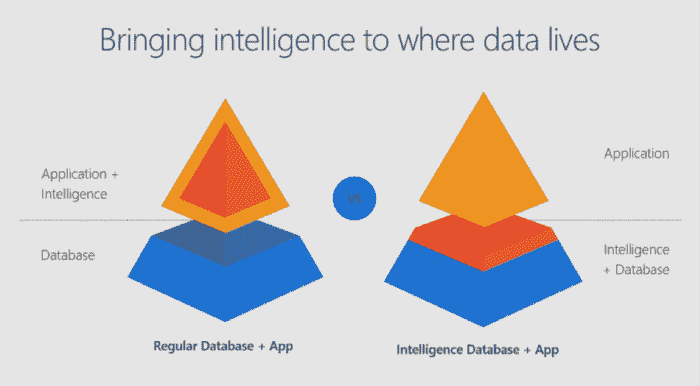

# 如何在 SQL Server 中执行 R 和 Python 使用机器学习服务

> 原文：[`www.kdnuggets.com/2018/06/microsoft-azure-machine-learning-r-python-sql-server.html`](https://www.kdnuggets.com/2018/06/microsoft-azure-machine-learning-r-python-sql-server.html)

 评论

**作者 [Kyle Weller](https://www.linkedin.com/in/ai-is-the-future/)，Microsoft Azure 机器学习**

你知道吗？你可以在 T-SQL 语句中编写 R 和 Python 代码。 [机器学习服务](https://aka.ms/sqlmloverview) 在 SQL Server 中消除了数据移动的需求。你无需通过网络传输大量和敏感的数据，或通过示例 csv 文件丢失准确性，你可以让 R/Python 代码在你的数据库中执行。轻松通过 SQL 存储过程部署你的 R/Python 代码，使其在你的 ETL 过程中或任何应用程序中可用。在数据库中训练和存储机器学习模型，将智能带到数据所在的位置。

你可以安装并运行任何最新的开源 R/Python 包，以在 SQL Server 上处理大量数据构建深度学习和 AI 应用程序。我们还提供了 Microsoft 的 [前沿](https://cloudblogs.microsoft.com/sqlserver/2016/10/11/1000000-predictions-per-second/) 高性能算法，包含在 [RevoScaleR](https://docs.microsoft.com/en-us/machine-learning-server/r-reference/revoscaler/revoscaler) 和 [RevoScalePy](https://docs.microsoft.com/en-us/sql/advanced-analytics/python/what-is-revoscalepy?view=sql-server-2017) APIs 中。使用这些与开源世界中的最新创新结合，能够为你的应用程序带来无与伦比的选择、性能和规模。

如果你对尝试 SQL Server 机器学习服务感到兴奋，请查看下面的动手教程。**如果你没有在 SQL Server 中安装机器学习服务，你首先需要按照我在这里发布的入门教程进行操作：**

### 使用教程

在本教程中，我将介绍如何在 T-SQL 语句中执行 R 和 Python 的基础知识。如果你更喜欢通过视频学习，我也在 YouTube 上发布了教程：

### 基础知识

打开 SQL Server Management Studio 并连接到你的服务器。打开一个新的查询窗口并粘贴以下基本示例：(*虽然我在这些示例中使用的是 Python，但你也可以用 R 完成所有操作*)

`EXEC sp_execute_external_script @language = N'Python', @script = N'print(3+4)'`

sp_execute_external_script 是一个特殊的系统存储过程，它使 R 和 Python 在 SQL Server 中的执行成为可能。这里有一个“language”参数，允许我们在 Python 和 R 之间进行选择。还有一个“script”参数，我们可以在其中粘贴 R 或 Python 代码。如果你没有看到输出打印 7，请返回并查看 [这篇文章](https://blogs.msdn.microsoft.com/mlserver/2018/05/18/getting-started-with-machine-learning-services-in-sql-server/) 中的设置步骤。

### 参数介绍

现在我们讨论了一个基本示例，让我们开始添加更多内容：

`EXEC sp_execute_external_script @language = N'Python', @script = N' OutputDataSet = InputDataSet; ', @input_data_1 = N'SELECT 1 AS Col1';`

机器学习服务提供了 SQL 和 R/Python 之间更自然的通信，通过一个接受任何 SQL 查询的输入数据参数。输入参数名为“input_data_1”。

你可以在 Python 代码中看到，定义了一些默认变量来在 Python 和 SQL 之间传递数据。默认变量名是“OutputDataSet”和“InputDataSet”。你可以像下面这个示例一样更改这些默认名称：

`EXEC sp_execute_external_script @language = N'Python', @script = N' MyOutput = MyInput; ', @input_data_1_name = N'MyInput', @input_data_1 = N'SELECT 1 AS foo', @output_data_1_name = N'MyOutput';`

当你执行这些示例时，你可能会注意到它们每个都返回一个带有“(No column name)”的结果？你可以通过在语句末尾添加 WITH RESULT SETS 子句来指定返回列的名称，该子句是列名和其数据类型的逗号分隔列表。

`EXEC sp_execute_external_script @language = N'Python', @script = N' MyOutput = MyInput; ', @input_data_1_name = N'MyInput', @input_data_1 = N' SELECT 1 AS foo, 2 AS bar ', @output_data_1_name = N'MyOutput' WITH RESULT SETS ((MyColName int, MyColName2 int));`

### 输入/输出数据类型

好的，我们来多讨论一下 SQL 和 Python 之间使用的输入/输出数据类型。你的输入 SQL SELECT 语句通过 [Python Pandas 包](https://pypi.org/project/pandas/) 将一个“Dataframe”传递给 Python。你从 Python 返回 SQL 的输出也需要是 Pandas Dataframe 对象。如果你需要将标量值转换为数据框，这里有一个示例：

`EXEC sp_execute_external_script @language = N'Python', @script = N' import pandas as pd c = 1/2 d = 1*2 s = pd.Series([c,d]) df = pd.DataFrame(s) OutputDataSet = df '`

变量 c 和 d 都是标量值，你可以将它们添加到 pandas Series 中，然后转换为 pandas 数据框。这一个示例稍微复杂一点，详细信息和示例请参考 [python pandas 包文档](https://pandas.pydata.org/pandas-docs/stable/generated/pandas.DataFrame.html)：

`EXEC sp_execute_external_script @language = N'Python', @script = N' import pandas as pd s = {"col1": [1, 2], "col2": [3, 4]} df = pd.DataFrame(s) OutputDataSet = df '`

你现在知道如何在 T-SQL 中执行 Python 的基础知识了！

你知道你也可以在你喜欢的 IDE（如 RStudio 和 Jupyter Notebooks）中编写 R 和 Python 代码，然后将这些代码的执行结果远程发送到 SQL Server 吗？查看这些文档链接以了解更多信息：[`aka.ms/R-RemoteSQLExecution https://aka.ms/PythonRemoteSQLExecution`](https://aka.ms/R-RemoteSQLExecution)

查看 [SQL Server 机器学习服务](https://aka.ms/SQLMLDocs) 文档页面获取更多文档、示例和解决方案。也可以查看这些 E2E [tutorials on github](https://aka.ms/SQLMLDocs)。

我们期待你的反馈！在下方留言提问或开始讨论！

**个人简介：** [Kyle Weller](https://www.linkedin.com/in/ai-is-the-future/) 是微软 Azure 机器学习团队的项目经理。曾在几家初创公司担任软件开发人员后，他加入了微软，并在 Office 和 Bing 中从事可扩展数据仪表板、平台和 API 解决方案的构建。他曾在 Cortana 数据与分析团队中主导测量策略、研究用户行为模式、标准化 KPI，并识别产品增长机会。他现在专注于 Azure 机器学习产品，致力于将智能带入数据存储的位置。这包括 SQL Server 的新机器学习服务，允许在 SQL 中执行 R + Python。

**相关：**

+   [比较机器学习即服务：亚马逊、微软 Azure、谷歌云 AI](https://www.kdnuggets.com/2018/01/mlaas-amazon-microsoft-azure-google-cloud-ai.html)

+   [选择评估机器学习模型的正确指标 — 第二部分](https://www.kdnuggets.com/2018/06/right-metric-evaluating-machine-learning-models-2.html)

+   [哪个数据库最适合分析师？](https://www.kdnuggets.com/2015/12/database-best-for-analyst.html)

* * *

## 我们的三大课程推荐

 1\. [Google 网络安全证书](https://www.kdnuggets.com/google-cybersecurity) - 快速开启网络安全职业生涯。

 2\. [Google 数据分析专业证书](https://www.kdnuggets.com/google-data-analytics) - 提升你的数据分析技能

 3\. [Google IT 支持专业证书](https://www.kdnuggets.com/google-itsupport) - 支持你的组织在 IT 领域

* * *

### 更多相关话题

+   [Kubernetes 中的高可用 SQL Server Docker 容器](https://www.kdnuggets.com/2022/04/high-availability-sql-server-docker-containers-kubernetes.html)

+   [机器学习模型解释性如何加速 AI 采纳之旅…](https://www.kdnuggets.com/2022/07/ml-model-explainability-accelerates-ai-adoption-journey-financial-services.html)

+   [25 本免费书籍，助你掌握 SQL、Python、数据科学、机器学习和自然语言处理](https://www.kdnuggets.com/25-free-books-to-master-sql-python-data-science-machine-learning-and-natural-language-processing)

+   [KDnuggets 新闻，9 月 21 日：7 个机器学习作品集项目](https://www.kdnuggets.com/2022/n37.html)

+   [数据分析师的 SQL 和 Python 面试问题](https://www.kdnuggets.com/2023/02/sql-python-interview-questions-data-analysts.html)

+   [掌握 SQL、Python、数据清理、数据整理和探索性数据分析的指南合集](https://www.kdnuggets.com/collection-of-guides-on-mastering-sql-python-data-cleaning-data-wrangling-and-exploratory-data-analysis)
