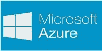
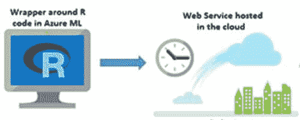
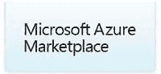
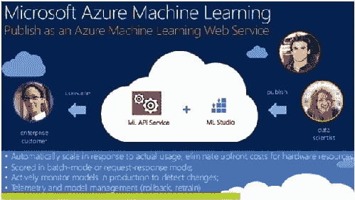

# 为什么 Azure ML 是机器学习的下一大亮点？

> 原文：[`www.kdnuggets.com/2014/11/microsoft-azure-machine-learning.html`](https://www.kdnuggets.com/2014/11/microsoft-azure-machine-learning.html)

 在 Hadoop 基础的 Azure HDInsight 和 Office 365 的 PowerBI 成功之后，微软通过公开预览版 Azure Machine Learning（也称为“Azure ML”）迈出了在大数据市场中取得领导地位的又一步。将预测分析引入公共云似乎是机器学习大规模消费化的下一个逻辑步骤。Azure ML 就是这样做的，同时大大简化了开发者的工作。该服务运行在 Azure 公共云上，这意味着用户无需购买任何硬件或软件，也不需要担心部署和维护。

通过一个名为 ML Studio 的集成开发环境，没有数据科学背景的人也可以通过拖放手势和简单的数据流图构建数据模型。这不仅最小化了编码，还通过 ML Studio 的实验样本库节省了大量时间。另一方面，有经验的数据科学家将会高兴地发现 Azure ML 强烈支持 R。你可以直接将现有的 R 代码拖放到 Azure ML 中，或使用 ML Studio 支持的 350 多个 R 包来开发自己的代码。  Azure ML 建立在多个微软产品和服务的机器学习能力之上。它共享了 Windows Phone 中新的个人助手 Cortana 的许多实时预测分析功能。Azure ML 还利用了来自 Xbox 和 Bing 的成熟解决方案。超越了 Nate Silver 备受赞誉的 FiveThirtyEight 博客，Bing Predicts 最近通过 [准确预测了超过 95% 的美国中期选举结果](https://blogs.bing.com/blog/2014/11/10/bing-gets-an-a-in-election-prediction-accuracy/) 让许多人感到惊讶。因此，值得一试 Azure ML，以看看其强大的基于云的预测分析能为你带来什么。

在一个月前的纽约 Strata+Hadoop 世界大会上，Azure ML 被拿来与 IBM 的 Watson 相比较。在他的主题演讲中，Joseph Sirosh，微软机器学习的 CVP，宣布了 [Azure Marketplace 的新机器学习功能](http://blogs.technet.com/b/machinelearning/archive/2014/10/16/web-services-and-marketplaces-create-a-new-data-science-economy.aspx)，这些功能在过去几年（自 2010 年 10 月推出以来）得到了显著发展。Azure Marketplace 提供了许多令人兴奋的使用 ML 的 API，包括 Bing 语音识别控制、Microsoft 翻译器、Bing 同义词 API 和 Bing 搜索 API。截至今天，Azure Marketplace 上已有 25 个以上的机器学习 API。

 该市场是数据科学家构建自定义网络服务、发布 API 并对其使用收费的便捷平台。Azure ML 用户可以搜索这些 API 并订阅它们。因此，除了其他分析市场，Azure 市场也是数据科学家将其专业知识和创造力货币化的另一个良好平台，这与开发者在 iOS 或 Android 应用商店中的操作非常相似。  为了推动仍然较新的 Azure ML 服务的采用，微软采取了一些措施来让更多人尝试。最近，微软高管在西雅图的 PASS 峰会上宣布了 Azure ML 的免费访问层（即现在您可以在不提供任何信用卡信息的情况下尝试 Azure ML）。这鼓励了 DBA、开发者、BI 专业人士和业余数据科学家尝试 Azure ML 以构建可集成到应用中的模型。此外，微软还启动了[微软 Azure 研究奖计划](http://research.microsoft.com/en-us/projects/azure/ml.aspx)，向资深研究人员和学生提供研究资助，以尝试 Azure ML。

这里有一个简短的视频，展示了 Azure ML 如何解决开发和部署预测分析项目中的常见挑战：

如果您有兴趣尝试 Azure ML，您可以在[机器学习中心](http://azure.microsoft.com/en-us/documentation/services/machine-learning/)找到大量资源以帮助您入门。

自 2014 年 6 月推出以来，微软 Azure 机器学习服务已经取得了长足的进步，而且微软显然正在投资于其长期成功。

**相关：**

+   访谈：Joseph Sirosh，微软谈 Azure ML 如何简化预测分析

+   访谈：Joseph Sirosh，微软谈 Azure ML 与新兴的数据科学经济

+   机器学习夏季学校 2015，悉尼，澳大利亚

* * *

## 我们的前三个课程推荐

 1\. [Google 网络安全证书](https://www.kdnuggets.com/google-cybersecurity) - 快速进入网络安全职业生涯。

 2\. [Google 数据分析专业证书](https://www.kdnuggets.com/google-data-analytics) - 提升您的数据分析能力

 3\. [Google IT 支持专业证书](https://www.kdnuggets.com/google-itsupport) - 支持您的组织在 IT 领域

* * *

### 更多相关内容

+   [通过 DataCamp 的新 Azure 认证提升技能](https://www.kdnuggets.com/level-up-with-datacamps-new-azure-certification)

+   [下一水平的人工智能编程：提示设计与构建人工智能产品](https://www.kdnuggets.com/2023/03/corise-prompt-design-building-ai-products.html)

+   [人工智能的未来：探索下一代生成模型](https://www.kdnuggets.com/2023/05/future-ai-exploring-next-generation-generative-models.html)

+   [RAPIDS cuDF 加速你的数据科学工作流程](https://www.kdnuggets.com/2023/04/rapids-cudf-speed-next-data-science-workflow.html)

+   [介绍 Falcon2：TII 的下一代语言模型](https://www.kdnuggets.com/introducing-falcon2-next-gen-language-model-by-tii)

+   [将你的数据科学职业提升到新水平](https://www.kdnuggets.com/2021/12/sas-advance-data-science-career-next-level.html)
