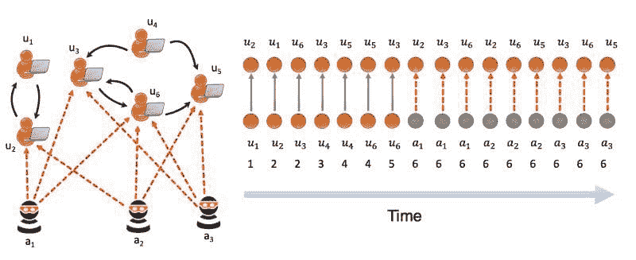

# 介绍 MIDAS：图中异常检测的新基线

> 原文：[`www.kdnuggets.com/2020/04/midas-new-baseline-anomaly-detection-graphs.html`](https://www.kdnuggets.com/2020/04/midas-new-baseline-anomaly-detection-graphs.html)

评论

在机器学习中，自动驾驶汽车、生成对抗网络（GAN）和面部识别等热门话题常常占据媒体焦点。然而，数据科学家们正在解决的另一个同样重要的问题是异常检测。从网络安全到金融欺诈，异常检测帮助保护企业、个人和在线社区。为改善异常检测，研究人员开发了一种名为 MIDAS 的新方法。

### 什么是 MIDAS？

在新加坡国立大学，博士候选人 [Siddharth Bhatia](https://www.comp.nus.edu.sg/~sbhatia/) 和他的团队开发了 MIDAS，这是一种新的异常检测方法，其速度和准确性超越了基线方法。

新加坡国立大学的 Siddharth Bhatia

MIDAS 代表基于微簇的边流异常检测器。顾名思义，MIDAS 检测图中的微簇异常或突然出现的可疑相似边群。MIDAS 的主要优势之一是能够实时检测这些异常，速度远超现有的最先进模型。

### 图中异常检测的实际应用案例

简而言之，异常检测是寻找与数据集中预期模式或异常值偏离的实践。这可以帮助我们发现并消除有害内容。Siddharth 说：“图中的异常检测是发现无数系统中可疑行为的关键问题。” “这些系统包括入侵检测、虚假评分和金融欺诈。”

这项技术可以帮助社交网络如 Twitter 和 Facebook 发现用于垃圾邮件和网络钓鱼的虚假账户。它甚至可以帮助调查人员识别在线性侵者。Siddharth 说：“使用 MIDAS，我们可以在动态（时间演变）图中找到异常的边和节点。” “在 Twitter 和 Facebook 中，推文和消息网络可以被视为时间演变图，我们可以通过在这些图中找到异常的边和节点来发现恶意消息和虚假账户。”

异常检测的其他常见应用包括：

+   垃圾邮件过滤器

+   信用卡欺诈检测

+   数据集预处理

+   网络安全

+   社交媒体内容审核

### MIDAS 超越了最先进的方法

Siddharth 说：“异常检测是一个研究较多的问题，大多数提出的方法集中在静态图上。 然而，许多现实世界的图具有动态特性，基于静态连接的方法可能会错过图的时间特征和异常。”

MIDAS 解决了实时检测异常的需求，以便尽快开始恢复，并减少恶意活动（如信用卡欺诈购买）的影响。

Siddharth 解释说：“此外，由于随着我们处理边流，顶点数量可能会增加，我们需要一个在图的大小上使用恒定内存的算法。 而且，许多应用中的欺诈或异常事件发生在微集群中或突然出现的类似边的组中，例如网络流量数据中的拒绝服务攻击和同步行为。”

Siddharth 说：“通过使用有原则的假设检验框架，MIDAS 提供了关于假阳性概率的理论界限，而早期的方法则没有提供。”

### Midas 是如何被测试的？

Siddharth 和他的同事展示了 MIDAS 在社交网络安全和入侵检测任务中的潜力。他们使用了以下数据集进行异常检测：

+   **Darpa 入侵检测**（450 万个 IP-IP 通信）

+   **Twitter 安全数据集**（2014 年与安全事件相关的 260 万条推文）

+   **Twitter 世界杯数据集**（2014 年足球世界杯期间的 170 万条推文）

为了比较 MIDAS 的性能，团队查看了以下基线：

+   **RHSS**

+   **SEDANSPOT**

然而，由于 RHSS 在 Darpa 数据集上的 AUC 测量 为 0.17，因此团队通过与 SEDANSPOT 进行比较来测量准确性、运行时间和现实世界的有效性。

### 结果

MIDAS 检测微集群异常的准确率提高了多达 48%，并且比当前基线方法快了多达 644 倍。

Siddharth 说：“我们的实验结果表明，MIDAS 在准确性（以 AUC 为标准）上超越了基线方法 42%-48%。此外，MIDAS 处理数据的速度比基线方法快 162−644 倍。”

### 改进 MIDAS：未来的工作

Siddharth 说：“我们将 MIDAS 扩展到了 M-Stream：快速流式多方面组异常检测。 在 M-Stream 中，我们在具有类别和数值属性的多方面数据上检测异常。”

Siddharth 和他的团队表示，M-Stream 在准确性和运行时间方面也超越了包括 Isolation Forest 和 Local Outlier Factor 等流行的 Sklearn 算法的多个基线。然而，他们的 M-Stream 工作目前正在审查中。

Siddharth 说：“考虑到 MIDAS 的性能，我们认为它将成为一种新的基线方法，并且对于异常检测非常有用。 此外，探索 MIDAS 如何在其他应用中做出贡献将是非常有趣的。”

如果你有兴趣了解更多关于 MIDAS 的内容，可以查看[Siddharth 的完整论文。](https://www.comp.nus.edu.sg/~sbhatia/assets/pdf/midas.pdf)你还可以在[Github](https://github.com/bhatiasiddharth/MIDAS)下载代码和数据集。

欲了解更多机器学习访谈、指南和新闻，请查看以下相关资源，并不要忘记[订阅我们的新闻通讯。](https://lionbridge.ai/ai-newsletter-subscription/)

**简介：[Limarc Ambalina](https://www.linkedin.com/in/limarc-ambalina-11604371/)** 是一位驻东京的作家，专注于人工智能、科技和流行文化。他曾为包括 Hacker Noon、日本今日、以及 Towards Data Science 在内的多个出版物撰稿。

[原文](https://lionbridge.ai/articles/introducing-midas-a-new-baseline-for-anomaly-detection-in-graphs/)。经授权转载。

**相关：**

+   图神经网络模型校准以获得可信预测

+   异常检测，AI 和机器学习的关键任务，解释

+   什么是本福德定律，它对数据科学为何重要？

* * *

## 我们的三大课程推荐

 1\. [谷歌网络安全证书](https://www.kdnuggets.com/google-cybersecurity) - 快速进入网络安全职业的快车道。

 2\. [谷歌数据分析专业证书](https://www.kdnuggets.com/google-data-analytics) - 提升你的数据分析能力

 3\. [谷歌 IT 支持专业证书](https://www.kdnuggets.com/google-itsupport) - 支持你的组织的 IT 需求

* * *

### 更多相关话题

+   [建立一个稳固的数据团队](https://www.kdnuggets.com/2021/12/build-solid-data-team.html)

+   [使用管道编写清晰的 Python 代码](https://www.kdnuggets.com/2021/12/write-clean-python-code-pipes.html)

+   [数据科学中异常检测技术的初学者指南](https://www.kdnuggets.com/2023/05/beginner-guide-anomaly-detection-techniques-data-science.html)

+   [BigQuery 中的异常检测：揭示隐藏的洞察并推动行动](https://www.kdnuggets.com/anomaly-detection-in-bigquery-uncover-hidden-insights-and-drive-action)

+   [停止学习数据科学以寻找目标，并以目标来…](https://www.kdnuggets.com/2021/12/stop-learning-data-science-find-purpose.html)

+   [一个 90 亿美元的人工智能失败案例分析](https://www.kdnuggets.com/2021/12/9b-ai-failure-examined.html)
